# 世界国家与首都记忆手册 · 详细图文版

版本：2026-10-03。193个联合国会员国＋圣座、巴勒斯坦国2个观察员国，共195个主条目；5个地区补充，400张地图。南极洲无主权国家。

分组按UN M49，美洲分为北美洲（含中美洲、加勒比）与南美洲。详见[来源与口径](sources.html)。配套文件夹可离线打开index.html。

# 亚洲

| 国家／地区 | English | 首都／城市 | English |
|---|---|---|---|
| 中国 | China | 北京 | Beijing |
| 日本 | Japan | 东京 | Tokyo |
| 韩国 | South Korea | 首尔 | Seoul |
| 朝鲜 | North Korea | 平壤 | Pyongyang |
| 蒙古 | Mongolia | 乌兰巴托 | Ulaanbaatar |
| 越南 | Vietnam | 河内 | Hanoi |
| 老挝 | Laos | 万象 | Vientiane |
| 柬埔寨 | Cambodia | 金边 | Phnom Penh |
| 泰国 | Thailand | 曼谷 | Bangkok |
| 缅甸 | Myanmar | 内比都 | Nay Pyi Taw |
| 马来西亚 | Malaysia | 吉隆坡 | Kuala Lumpur |
| 新加坡 | Singapore | 新加坡 | Singapore |
| 印度尼西亚 | Indonesia | 雅加达 → 努山塔拉（迁都过渡） | Jakarta → Nusantara (transition) |
| 菲律宾 | Philippines | 马尼拉 | Manila |
| 文莱 | Brunei | 斯里巴加湾市 | Bandar Seri Begawan |
| 东帝汶 | Timor-Leste | 帝力 | Dili |
| 阿富汗 | Afghanistan | 喀布尔 | Kabul |
| 巴基斯坦 | Pakistan | 伊斯兰堡 | Islamabad |
| 印度 | India | 新德里 | New Delhi |
| 尼泊尔 | Nepal | 加德满都 | Kathmandu |
| 不丹 | Bhutan | 廷布 | Thimphu |
| 孟加拉国 | Bangladesh | 达卡 | Dhaka |
| 斯里兰卡 | Sri Lanka | 斯里贾亚瓦德纳普拉科特 | Sri Jayawardenepura Kotte |
| 马尔代夫 | Maldives | 马累 | Malé |
| 伊朗 | Iran | 德黑兰 | Tehran |
| 哈萨克斯坦 | Kazakhstan | 阿斯塔纳 | Astana |
| 吉尔吉斯斯坦 | Kyrgyzstan | 比什凯克 | Bishkek |
| 塔吉克斯坦 | Tajikistan | 杜尚别 | Dushanbe |
| 土库曼斯坦 | Turkmenistan | 阿什哈巴德 | Ashgabat |
| 乌兹别克斯坦 | Uzbekistan | 塔什干 | Tashkent |
| 亚美尼亚 | Armenia | 埃里温 | Yerevan |
| 阿塞拜疆 | Azerbaijan | 巴库 | Baku |
| 格鲁吉亚 | Georgia | 第比利斯 | Tbilisi |
| 伊拉克 | Iraq | 巴格达 | Baghdad |
| 叙利亚 | Syria | 大马士革 | Damascus |
| 黎巴嫩 | Lebanon | 贝鲁特 | Beirut |
| 约旦 | Jordan | 安曼 | Amman |
| 以色列 | Israel | 耶路撒冷（地位有争议） | Jerusalem |
| 巴勒斯坦国 | Palestine | 东耶路撒冷（首都主张） | East Jerusalem |
| 沙特阿拉伯 | Saudi Arabia | 利雅得 | Riyadh |
| 也门 | Yemen | 萨那 | Sana'a |
| 阿曼 | Oman | 马斯喀特 | Muscat |
| 阿联酋 | United Arab Emirates | 阿布扎比 | Abu Dhabi |
| 卡塔尔 | Qatar | 多哈 | Doha |
| 巴林 | Bahrain | 麦纳麦 | Manama |
| 科威特 | Kuwait | 科威特城 | Kuwait City |
| 土耳其 | Turkey | 安卡拉 | Ankara |
| 塞浦路斯 | Cyprus | 尼科西亚 | Nicosia |

## 中国 — 北京

China · Beijing · 东亚

| 国家／地区地图 | 亚洲位置图 |
|:---:|:---:|
| 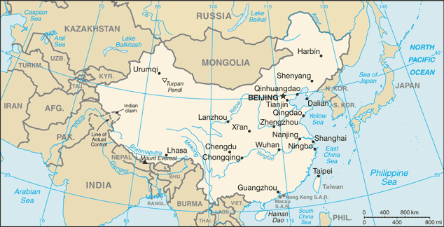 | 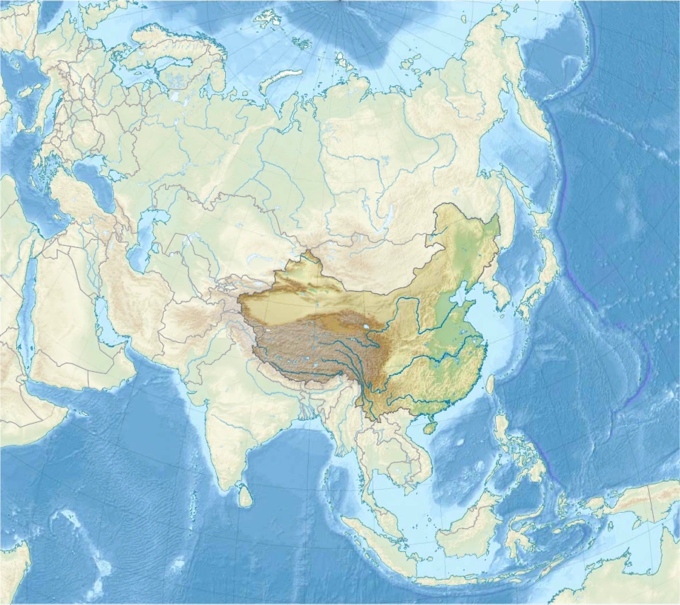 |

**认识国家／地区**：中国位于东亚大陆东部，西部高原与山地、东部平原和海岸形成鲜明差异。长江、黄河及多种气候区域塑造聚落与农业；学习周边国家时，中国也是重要的地图参照。

**认识首都／城市**：北京位于华北平原北缘，接近燕山与太行山方向，是长期的政治中心。故宫、中轴线及现代政府机构体现其首都历史；城市靠近渤海方向，但本身不是沿海港口。

> **记忆钩子**：中国北方京城，北京。

**容易混淆**：北京是国家首都；南京、上海有不同历史与经济角色。

**原亚洲手册的记忆故事**

- “北京 / 南京 / 东京”其实非常适合一起记：
- 北京 = Northern Capital
- 南京 = Southern Capital
- 东京 = Eastern Capital
- 明成祖时期，明朝政治中心逐渐北移，北京在 15 世纪成为帝国首都。

资料：[UNData 国家概况（统计快照）](https://data.un.org/legacy/en/iso/cn.html) · [国家／地区背景](https://en.wikipedia.org/wiki/China) · [首都／城市背景](https://en.wikipedia.org/wiki/Beijing)

地图：[File:China-CIA WFB Map.png；见原图来源页；Public domain](https://commons.wikimedia.org/wiki/File:China-CIA_WFB_Map.png) · [File:China in Asia (relief) (de-facto) (-mini map).svg；TUBS；CC BY-SA 3.0](https://commons.wikimedia.org/wiki/File:China_in_Asia_(relief)_(de-facto)_(-mini_map).svg)

---

## 日本 — 东京

Japan · Tokyo · 东亚

| 国家／地区地图 | 亚洲位置图 |
|:---:|:---:|
| 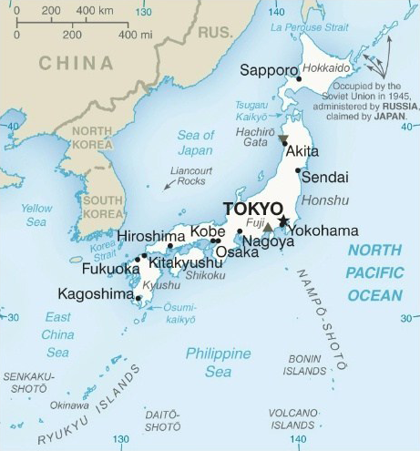 | 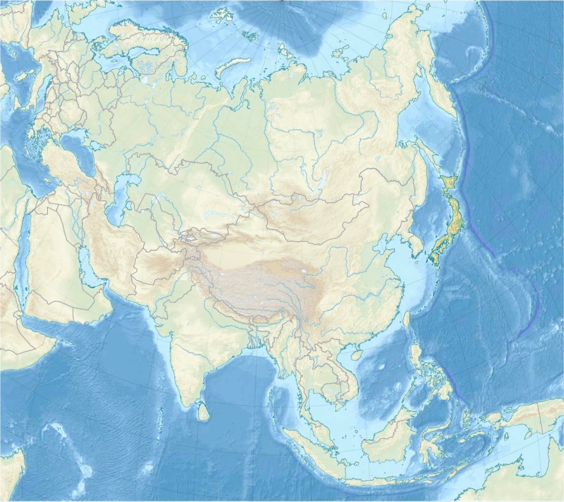 |

**认识国家／地区**：日本位于东亚太平洋西缘，主要由北海道、本州、四国和九州组成。山地多、平原较少，城市沿海集中；火山和地震活动与岛弧所处的板块边界有关。

**认识首都／城市**：东京位于本州东部东京湾一带，由旧称江户的城市发展而来。1868年前后皇室与中央政治重心转移至此，名称意为“东边的京城”；京都是历史古都，两者很适合成对记。

> **记忆钩子**：日本东边京城，东京。

**容易混淆**：京都是历史古都，东京是现首都。

**原亚洲手册的记忆故事**

- 东京过去叫 江户（Edo）。
- 1868 年明治维新后，江户改称东京。
- 所以“东京”这个名字本身就已经在告诉你：这是“东边的首都”。

资料：[UNData 国家概况（统计快照）](https://data.un.org/legacy/en/iso/jp.html) · [国家／地区背景](https://en.wikipedia.org/wiki/Japan) · [首都／城市背景](https://en.wikipedia.org/wiki/Tokyo)

地图：[File:Japan-CIA WFB Map.png；CIA；Public domain](https://commons.wikimedia.org/wiki/File:Japan-CIA_WFB_Map.png) · [File:Japan in Asia (relief) (de-facto) (-mini map).svg；TUBS；CC BY-SA 3.0](https://commons.wikimedia.org/wiki/File:Japan_in_Asia_(relief)_(de-facto)_(-mini_map).svg)

---

## 韩国 — 首尔

South Korea · Seoul · 东亚

| 国家／地区地图 | 亚洲位置图 |
|:---:|:---:|
| 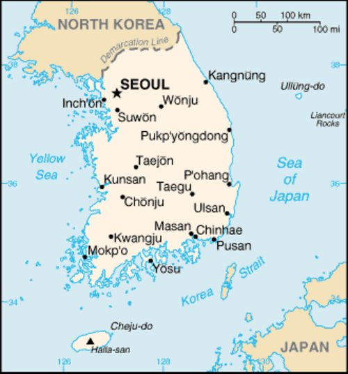 |  |

**认识国家／地区**：韩国位于朝鲜半岛南部，东、西和南侧临海，北部与朝鲜相邻。山地与河谷交错，西部及沿海人口较集中；国家位置要先从整个半岛中分出南半部。

**认识首都／城市**：首尔位于西北部汉江流域，历史与朝鲜王朝都城相连。它是政治与经济中心，部分政府部门位于世宗市；旧中文名称“汉城”常见于历史资料，应与现名首尔对应。

> **记忆钩子**：韩国先记“首”，首都是首尔。

**容易混淆**：汉城是旧中文名；世宗市有行政机构，但首尔仍为首都。

**原亚洲手册的记忆故事**

- 朝鲜王朝时期，这座城市长期叫 汉阳 / 汉城（Hanyang / Hanseong）。
- 现代名称 Seoul 与韩语中“首都、京城”的概念有关。
- 汉江穿过整个首尔，是城市空间结构的重要轴线。

资料：[UNData 国家概况（统计快照）](https://data.un.org/legacy/en/iso/kr.html) · [国家／地区背景](https://en.wikipedia.org/wiki/South_Korea) · [首都／城市背景](https://en.wikipedia.org/wiki/Seoul)

地图：[File:Korea, South-CIA WFB Map (2004).png；CIA；Public domain](https://commons.wikimedia.org/wiki/File:Korea,_South-CIA_WFB_Map_(2004).png) · [File:South Korea in Asia (relief) (-mini map).svg；TUBS；CC BY-SA 3.0](https://commons.wikimedia.org/wiki/File:South_Korea_in_Asia_(relief)_(-mini_map).svg)

---

## 朝鲜 — 平壤

North Korea · Pyongyang · 东亚

| 国家／地区地图 | 亚洲位置图 |
|:---:|:---:|
| 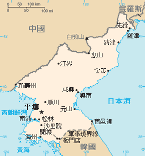 |  |

**认识国家／地区**：朝鲜位于朝鲜半岛北部，北侧邻接中国并与俄罗斯有短边界。境内山地较多，西部低地与河谷更适于聚落；和韩国的首都应按半岛南北位置成对记忆。

**认识首都／城市**：平壤位于西部大同江畔，靠近西海岸方向，是国家政治中心。城市具有较早的历史背景，现代规划广场和行政建筑辨识度高；记忆时将它放在北半岛西侧河谷。

> **记忆钩子**：朝鲜在北，西边河城平壤。

**容易混淆**：平壤—朝鲜；首尔—韩国。

**原亚洲手册的记忆故事**

- 平壤是一座非常古老的城市。
- 高句丽时期它就曾是重要政治中心。
- 中文名“平壤”很有辨识度，可以直接和“首尔”形成南北对照。

资料：[UNData 国家概况（统计快照）](https://data.un.org/legacy/en/iso/kp.html) · [国家／地区背景](https://en.wikipedia.org/wiki/North_Korea) · [首都／城市背景](https://en.wikipedia.org/wiki/Pyongyang)

地图：[File:North Korea map-CIA (zh).png；Users Tomchiukc , Ianm2000uk , Formulax on zh.wikipedia；Public domain](https://commons.wikimedia.org/wiki/File:North_Korea_map-CIA_(zh).png) · [File:North Korea in Asia (relief) (-mini map).svg；TUBS；CC BY-SA 3.0](https://commons.wikimedia.org/wiki/File:North_Korea_in_Asia_(relief)_(-mini_map).svg)

---

## 蒙古 — 乌兰巴托

Mongolia · Ulaanbaatar · 东亚

| 国家／地区地图 | 亚洲位置图 |
|:---:|:---:|
| 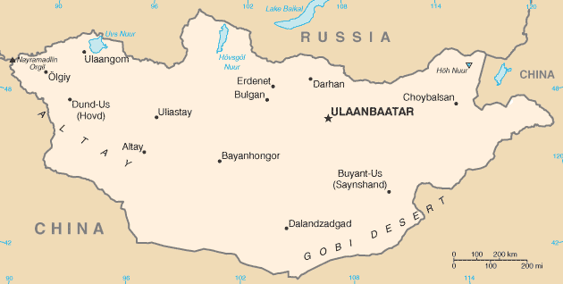 | 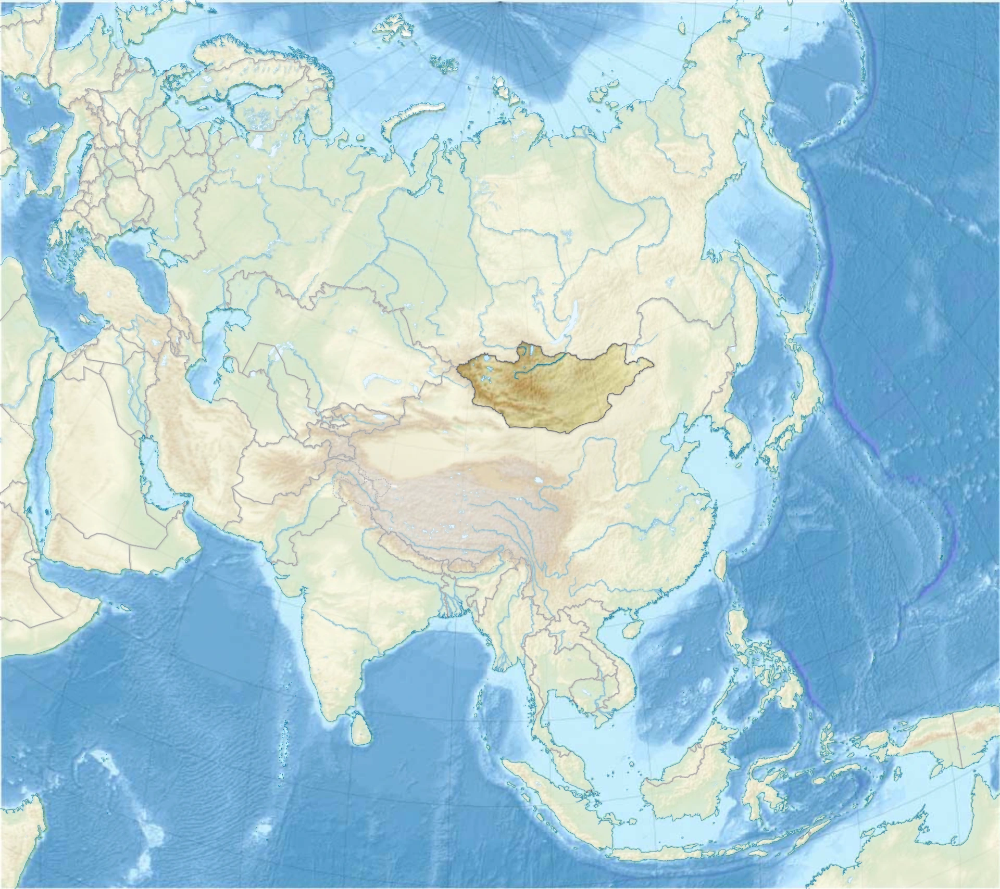 |

**认识国家／地区**：蒙古位于中国与俄罗斯之间，是东亚内陆国家。草原、戈壁与山地分布广泛，游牧传统与辽阔空间密切相关；不要把国家蒙古与中国内蒙古自治区混淆。

**认识首都／城市**：乌兰巴托位于中北部图拉河谷，名称常译为“红色英雄”。它从宗教中心发展成现代首都，集中政府、文化与交通功能；内陆高纬和较高海拔构成其寒冷气候背景。

> **记忆钩子**：蒙古草原上，红色英雄乌兰巴托。

**容易混淆**：蒙古是国家；内蒙古是中国自治区。

**原亚洲手册的记忆故事**

- Ulaanbaatar 的蒙古语含义大致是 “红色英雄”。
- 1924 年城市改为现在的名称。
- 早期这座城市甚至不是固定地点，而是一个多次迁移的宗教政治中心。

资料：[UNData 国家概况（统计快照）](https://data.un.org/legacy/en/iso/mn.html) · [国家／地区背景](https://en.wikipedia.org/wiki/Mongolia) · [首都／城市背景](https://en.wikipedia.org/wiki/Ulaanbaatar)

地图：[File:Mongolia-CIA WFB Map.png；CIA；Public domain](https://commons.wikimedia.org/wiki/File:Mongolia_CIA_map.png) · [File:Mongolia in Asia (relief) (-mini map).svg；TUBS；CC BY-SA 3.0](https://commons.wikimedia.org/wiki/File:Mongolia_in_Asia_(relief)_(-mini_map).svg)

---

## 越南 — 河内

Vietnam · Hanoi · 东南亚

| 国家／地区地图 | 亚洲位置图 |
|:---:|:---:|
| 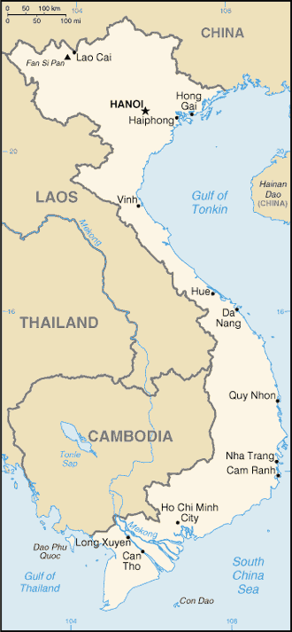 |  |

**认识国家／地区**：越南位于中南半岛东侧，沿海国土南北狭长，北部红河三角洲与南部湄公河三角洲形成两大人口和农业区域。山地与海岸相邻，是识别国土形状的线索。

**认识首都／城市**：河内位于北部红河三角洲，名称直接提示河流环境。它是政治与历史文化中心；南部胡志明市是重要商业都市，旧称西贡，不能因为规模或知名度而替代河内。

> **记忆钩子**：越南北方河流间，首都河内。

**容易混淆**：胡志明市是大都市，西贡是旧称，不是现首都。

**原亚洲手册的记忆故事**

- “河内”的字面意思就是 “河流之内”。
- 1010 年，李朝把都城迁到这里附近，称 升龙（Thăng Long）。
- 胡志明市更大、更商业化，但它不是首都。

资料：[UNData 国家概况（统计快照）](https://data.un.org/legacy/en/iso/vn.html) · [国家／地区背景](https://en.wikipedia.org/wiki/Vietnam) · [首都／城市背景](https://en.wikipedia.org/wiki/Hanoi)

地图：[File:Vietnam-CIA WFB Map.png；CIA；Public domain](https://commons.wikimedia.org/wiki/File:Vietnam-CIA_WFB_Map.png) · [File:Vietnam in Asia (relief) (-mini map).svg；TUBS；CC BY-SA 3.0](https://commons.wikimedia.org/wiki/File:Vietnam_in_Asia_(relief)_(-mini_map).svg)

---

## 老挝 — 万象

Laos · Vientiane · 东南亚

| 国家／地区地图 | 亚洲位置图 |
|:---:|:---:|
| 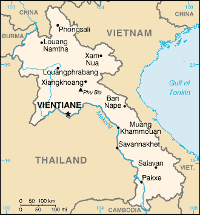 |  |

**认识国家／地区**：老挝位于中南半岛内陆，是东南亚主要国家中没有海岸的一例。山地广泛，湄公河沿西部构成部分边界；学习时用“内陆、河流、邻泰国”三条线索定位。

**认识首都／城市**：万象位于西部湄公河畔，与泰国隔河相望，是行政和交通中心。城市名称的中文音译容易联想到“万千景象”，而实际地理图像应是河岸首都；琅勃拉邦是历史名城。

> **记忆钩子**：老挝没有海，万象在湄公河边。

**容易混淆**：琅勃拉邦是古都名城，万象是现首都。

**原亚洲手册的记忆故事**

- 万象位于湄公河左岸。
- 从地理上看，它和泰国东北部距离非常近。
- 老挝没有海，所以记住“首都贴着湄公河”很有效。

资料：[UNData 国家概况（统计快照）](https://data.un.org/legacy/en/iso/la.html) · [国家／地区背景](https://en.wikipedia.org/wiki/Laos) · [首都／城市背景](https://en.wikipedia.org/wiki/Vientiane)

地图：[File:Laos-CIA WFB Map.png；CIA；Public domain](https://commons.wikimedia.org/wiki/File:Laos-CIA_WFB_Map.png) · [File:Laos in Asia (relief) (-mini map).svg；TUBS；CC BY-SA 3.0](https://commons.wikimedia.org/wiki/File:Laos_in_Asia_(relief)_(-mini_map).svg)

---

## 柬埔寨 — 金边

Cambodia · Phnom Penh · 东南亚

| 国家／地区地图 | 亚洲位置图 |
|:---:|:---:|
| 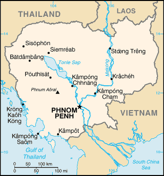 |  |

**认识国家／地区**：柬埔寨位于中南半岛南部，洞里萨湖与湄公河系统是自然地理核心。雨季水位变化影响农业与生活，吴哥文明提供重要历史背景；南部有面向泰国湾的海岸。

**认识首都／城市**：金边位于湄公河、洞里萨河与巴萨河交会地带，是政府与商业中心。河流交汇比“金色边缘”的字面联想更能解释城市位置；吴哥遗址附近的暹粒是旅游中心，首都则在东南部。

> **记忆钩子**：柬埔寨河流交会处，金边。

**容易混淆**：吴哥和暹粒很有名，但都不是现首都。

**原亚洲手册的记忆故事**

- 金边名字与当地的 “佩恩夫人（Lady Penh）”传说和一座小山有关。
- Phnom 在高棉语里有“山丘”的意思。
- 吴哥是古代高棉帝国核心区域，但现代首都是金边。

资料：[UNData 国家概况（统计快照）](https://data.un.org/legacy/en/iso/kh.html) · [国家／地区背景](https://en.wikipedia.org/wiki/Cambodia) · [首都／城市背景](https://en.wikipedia.org/wiki/Phnom_Penh)

地图：[File:Cambodia-CIA WFB Map.png；United States Central Intelligence Agency；Public domain](https://commons.wikimedia.org/wiki/File:Cambodia-CIA_WFB_Map.png) · [File:Cambodia in Asia (relief) (-mini map).svg；TUBS；CC BY-SA 3.0](https://commons.wikimedia.org/wiki/File:Cambodia_in_Asia_(relief)_(-mini_map).svg)

---

## 泰国 — 曼谷

Thailand · Bangkok · 东南亚

| 国家／地区地图 | 亚洲位置图 |
|:---:|:---:|
| 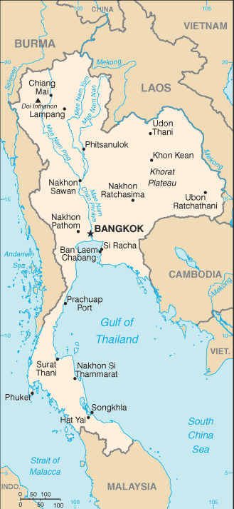 |  |

**认识国家／地区**：泰国位于中南半岛中部，国土向南沿半岛延伸。湄南河平原是重要人口与农业区，北部山地和南部海岸景观不同；地理上连接大陆东南亚与马来半岛。

**认识首都／城市**：曼谷位于湄南河下游、靠近泰国湾，1782年成为王朝首都。河道、寺庙与现代商业区构成鲜明城市图像；Bangkok是国际常用名，泰语城市名称及礼仪全名更长。

> **记忆钩子**：泰国湄南河下游，首都曼谷。

**容易混淆**：清迈是北部名城；曼谷的泰语名称另有形式。

**原亚洲手册的记忆故事**

- 泰国人日常更常称曼谷为 Krung Thep。
- 它有一个极长的传统正式名称，因此经常被拿来当“超长地名”的例子。
- 曼谷位于湄南河下游。

资料：[UNData 国家概况（统计快照）](https://data.un.org/legacy/en/iso/th.html) · [国家／地区背景](https://en.wikipedia.org/wiki/Thailand) · [首都／城市背景](https://en.wikipedia.org/wiki/Bangkok)

地图：[File:Thailand-CIA WFB Map.png；见原图来源页；Public domain](https://commons.wikimedia.org/wiki/File:Thailand-CIA_WFB_Map.png) · [File:Thailand in Asia (relief) (-mini map).svg；TUBS；CC BY-SA 3.0](https://commons.wikimedia.org/wiki/File:Thailand_in_Asia_(relief)_(-mini_map).svg)

---

## 缅甸 — 内比都

Myanmar · Nay Pyi Taw · 东南亚

| 国家／地区地图 | 亚洲位置图 |
|:---:|:---:|
| 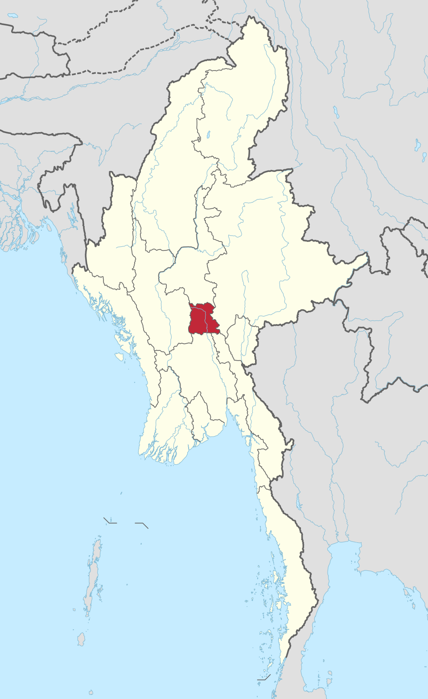 |  |

**认识国家／地区**：缅甸位于中南半岛西部，西侧面向孟加拉湾和安达曼海。伊洛瓦底江贯穿国土主要人口带，山地围绕中央低地；首都迁移使新旧地图特别容易出现差异。

**认识首都／城市**：内比都位于中部内陆，是2005年开始承担首都功能的规划城市。它与海岸附近的旧首都仰光在位置和形态上差异明显；记忆用“从海港向内陆迁都”，避免被仰光的知名度带偏。

> **记忆钩子**：缅甸迁都内陆，内比都。

**容易混淆**：仰光是旧首都与重要城市，内比都是现首都。

**原亚洲手册的记忆故事**

- 过去的首都是 仰光 Yangon。
- 2005 年政府机构开始迁往内比都，2006 年正式宣布其首都地位。
- Nay Pyi Taw 大意可理解为 “王都 / 国王的居所”。
- 城市以超宽道路和低密度布局著名。

资料：[UNData 国家概况（统计快照）](https://data.un.org/legacy/en/iso/mm.html) · [国家／地区背景](https://en.wikipedia.org/wiki/Myanmar) · [首都／城市背景](https://en.wikipedia.org/wiki/Naypyidaw)

地图：[File:Naypyidaw Union Territory in Myanmar 2010.svg；NordNordWest；CC BY-SA 3.0 de](https://commons.wikimedia.org/wiki/File:Naypyidaw_Union_Territory_in_Myanmar_2010.svg) · [File:Myanmar in Asia (relief) (-mini map).svg；TUBS；CC BY-SA 3.0](https://commons.wikimedia.org/wiki/File:Myanmar_in_Asia_(relief)_(-mini_map).svg)

---

## 马来西亚 — 吉隆坡

Malaysia · Kuala Lumpur · 东南亚

| 国家／地区地图 | 亚洲位置图 |
|:---:|:---:|
| 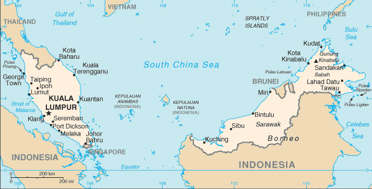 |  |

**认识国家／地区**：马来西亚由马来半岛南部和婆罗洲北部两片主要国土组成，中间隔着海域。热带森林、海岸城市与多元文化共同构成国家特点；地图不能只看半岛部分。

**认识首都／城市**：吉隆坡位于半岛西侧内陆，是国家首都和重要经济中心。布城是联邦行政中心，许多政府部门在那里办公；双子塔可帮助记城市形象，但首都与行政办公地点需明确区分。

> **记忆钩子**：马来西亚首都吉隆坡，行政中心布城。

**容易混淆**：东马和西马同属一国；布城不取代吉隆坡的首都地位。

**原亚洲手册的记忆故事**

- 吉隆坡是国家首都。
- 布城 Putrajaya 是联邦行政中心。
- Kuala Lumpur 的名字通常解释为 “泥泞的河流汇合处”。
- 双子塔让吉隆坡成为亚洲辨识度最高的城市之一。

资料：[UNData 国家概况（统计快照）](https://data.un.org/legacy/en/iso/my.html) · [国家／地区背景](https://en.wikipedia.org/wiki/Malaysia) · [首都／城市背景](https://en.wikipedia.org/wiki/Kuala_Lumpur)

地图：[File:Malaysia-CIA WFB Map.png；CIA；Public domain](https://commons.wikimedia.org/wiki/File:Malaysia-CIA_WFB_Map.png) · [File:Malaysia in Asia (relief) (-mini map).svg；TUBS；CC BY-SA 3.0](https://commons.wikimedia.org/wiki/File:Malaysia_in_Asia_(relief)_(-mini_map).svg)

---

## 新加坡 — 新加坡

Singapore · Singapore · 东南亚

| 国家／地区地图 | 亚洲位置图 |
|:---:|:---:|
| 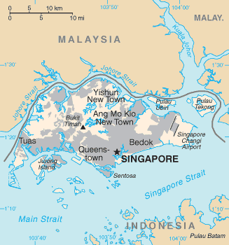 |  |

**认识国家／地区**：新加坡位于马来半岛南端，是由主岛和周边小岛组成的城市国家。海峡航运、港口和国际交通是理解其位置的核心；国土虽小，却位于重要海上通道旁。

**认识首都／城市**：新加坡的国家名与首都名相同，政府和城市生活集中于同一城市国家体系。市中心滨海区域、历史河岸和行政建筑形成主要识别点；它不是马来西亚的一座城市。

> **记忆钩子**：新加坡国家和首都同名。

**容易混淆**：城市国家也有周边岛屿，不等于单一城区。

**原亚洲手册的记忆故事**

- Singapore 来自梵语 Singapura，通常解释为“狮城”。
- 它是世界上少数典型的城市国家之一。
- 所以这题属于“送分题”。

资料：[UNData 国家概况（统计快照）](https://data.un.org/legacy/en/iso/sg.html) · [国家／地区背景](https://en.wikipedia.org/wiki/Singapore) · [首都／城市背景](https://en.wikipedia.org/wiki/Singapore)

地图：[File:Singapore-CIA WFB Map.png；National Foreign Assessment Center, Central Intelligence Agency .；Public domain](https://commons.wikimedia.org/wiki/File:CIA_World_Factbook_map_of_Singapore_(English).png) · [File:Singapore in Asia (relief) (-mini map).svg；TUBS；CC BY-SA 3.0](https://commons.wikimedia.org/wiki/File:Singapore_in_Asia_(relief)_(-mini_map).svg)

---

## 印度尼西亚 — 雅加达 → 努山塔拉（迁都过渡）

Indonesia · Jakarta → Nusantara (transition) · 东南亚

| 国家／地区地图 | 亚洲位置图 |
|:---:|:---:|
| 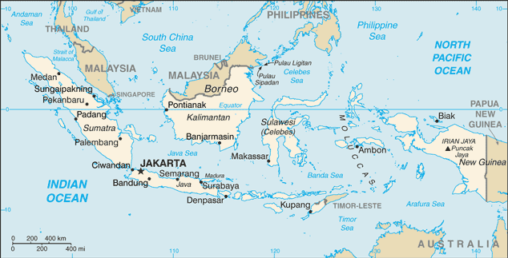 | 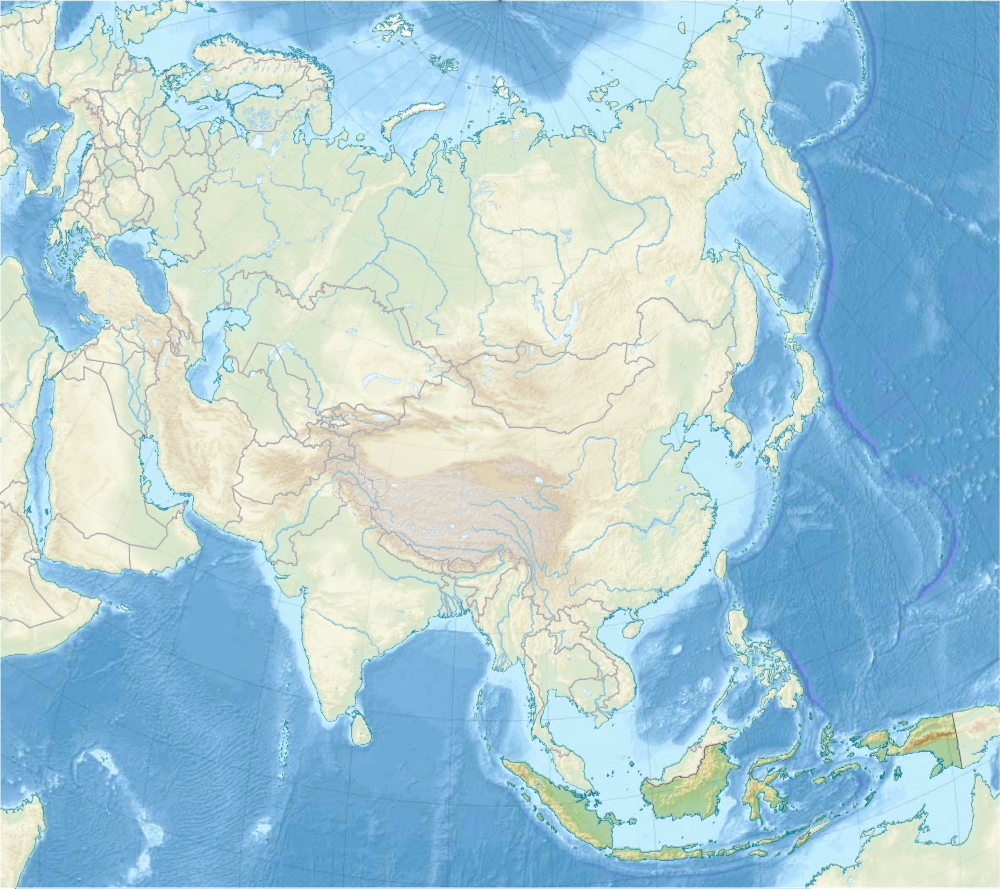 |

**认识国家／地区**：印度尼西亚横跨东南亚与邻近海域，由众多岛屿组成，爪哇、苏门答腊和加里曼丹等是地图定位线索。人口与行政重心长期集中在爪哇，岛际距离影响国家交通。

**认识首都／城市**：雅加达位于爪哇岛西北岸，是长期的政府与经济中心。新首都努山塔拉位于加里曼丹岛东部，正在推进迁都；官方2026年资料提出2028年政治首都目标，需结合后续法令和执行进度阅读。

> **记忆钩子**：爪哇雅加达，向加里曼丹努山塔拉过渡。

**容易混淆**：迁都正在推进，规划目标与正式生效日期要分开。

**原亚洲手册的记忆故事**

- 雅加达殖民时期曾长期叫 Batavia（巴达维亚）。
- 印尼正在婆罗洲加里曼丹建设新首都 Nusantara（努山塔拉）。
- 但截至 2026 年，印尼宪法法院相关判决与现行法律仍确认：在总统正式发布迁都决定前，雅加达继续保持首都地位。
- 印尼政府 2025 年规划目标是让努山塔拉在 2028 年成为政治首都。

资料：[UNData 国家概况（统计快照）](https://data.un.org/legacy/en/iso/id.html) · [国家／地区背景](https://en.wikipedia.org/wiki/Indonesia) · [首都／城市背景](https://en.wikipedia.org/wiki/Jakarta) · [努山塔拉管理局：2026年建设与2028年政治首都目标](https://www.ikn.go.id/storage/press-release/2026/20260106-siaran-pers-dipa-apel-perdana-2026%2C-otorita-ikn-tegaskan-transformasi-asn-menuju-ibu-kota-politik-2028.pdf) · [努山塔拉管理局：迁都背景](https://ikn.go.id/en/tentang)

地图：[File:Indonesia-CIA WFB Map.png；CIA World Factbook；Public domain](https://commons.wikimedia.org/wiki/File:Indonesia-CIA_WFB_Map.png) · [File:Indonesia in Asia (relief) (-mini map).svg；TUBS；CC BY-SA 3.0](https://commons.wikimedia.org/wiki/File:Indonesia_in_Asia_(relief)_(-mini_map).svg)

---

## 菲律宾 — 马尼拉

Philippines · Manila · 东南亚

| 国家／地区地图 | 亚洲位置图 |
|:---:|:---:|
| 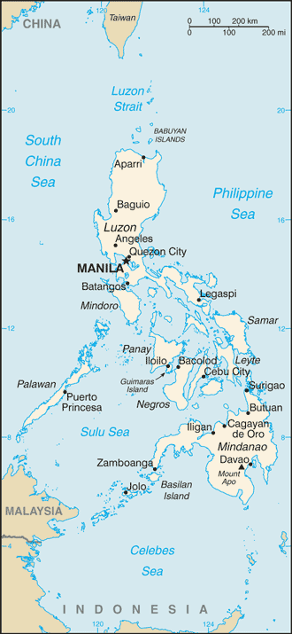 |  |

**认识国家／地区**：菲律宾位于东南亚西太平洋，由吕宋、米沙鄢和棉兰老等岛群组成。山地、火山与海岸平原并存，海洋交通联系分散岛屿；西班牙与美国时期留下文化和制度影响。

**认识首都／城市**：马尼拉位于吕宋岛西部、马尼拉湾岸，是国家首都。马尼拉市与更大范围的马尼拉都会区不是同一行政层级，奎松市也在都会区内；学习时同时记“吕宋西岸、湾岸首都”。

> **记忆钩子**：菲律宾吕宋西岸，马尼拉湾找马尼拉。

**容易混淆**：马尼拉市与大马尼拉都会区范围不同；奎松市曾为首都。

**原亚洲手册的记忆故事**

- 西班牙殖民时期修建的 Intramuros（王城）至今仍是马尼拉的重要历史区域。
- 马尼拉大都会是一个巨型都市区，但“首都”仍然是马尼拉市。

资料：[UNData 国家概况（统计快照）](https://data.un.org/legacy/en/iso/ph.html) · [国家／地区背景](https://en.wikipedia.org/wiki/Philippines) · [首都／城市背景](https://en.wikipedia.org/wiki/Manila)

地图：[File:Philippines-CIA WFB Map.png；见原图来源页；Public domain](https://commons.wikimedia.org/wiki/File:Philippines-CIA_WFB_Map.png) · [File:Philippines in Asia (relief) (-mini map).svg；TUBS；CC BY-SA 3.0](https://commons.wikimedia.org/wiki/File:Philippines_in_Asia_(relief)_(-mini_map).svg)

---

## 文莱 — 斯里巴加湾市

Brunei · Bandar Seri Begawan · 东南亚

| 国家／地区地图 | 亚洲位置图 |
|:---:|:---:|
| 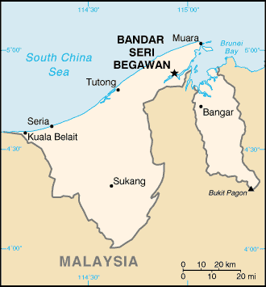 |  |

**认识国家／地区**：文莱位于婆罗洲北岸，主体国土被马来西亚的林梦地区分隔成两部分。面积较小，石油和天然气影响经济，王室与伊斯兰文化背景鲜明；不是独立的一整座岛。

**认识首都／城市**：斯里巴加湾市位于较大西部国土内、文莱河沿岸，是王室与行政中心。水上村落和大型清真寺构成城市记忆点；长名称可分成“斯里—巴加湾”，再配河岸位置。

> **记忆钩子**：文莱河边的王城，斯里巴加湾市。

**容易混淆**：文莱在婆罗洲北岸，首都在其西部主体国土。

**原亚洲手册的记忆故事**

- Bandar 大致是“城市/港口”。
- 1970 年，首都改名为 Bandar Seri Begawan，以纪念苏丹奥马尔·阿里·赛福鼎三世。
- 城中最著名的地标之一就是奥马尔·阿里·赛福鼎清真寺。

资料：[UNData 国家概况（统计快照）](https://data.un.org/legacy/en/iso/bn.html) · [国家／地区背景](https://en.wikipedia.org/wiki/Brunei) · [首都／城市背景](https://en.wikipedia.org/wiki/Bandar_Seri_Begawan)

地图：[File:Brunei-CIA WFB Map.png；CIA；Public domain](https://commons.wikimedia.org/wiki/File:Brunei-CIA_WFB_Map.png) · [File:Brunei in Asia (relief) (-mini map).svg；TUBS；CC BY-SA 3.0](https://commons.wikimedia.org/wiki/File:Brunei_in_Asia_(relief)_(-mini_map).svg)

---

## 东帝汶 — 帝力

Timor-Leste · Dili · 东南亚

| 国家／地区地图 | 亚洲位置图 |
|:---:|:---:|
| 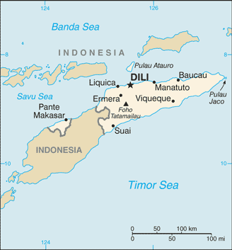 |  |

**认识国家／地区**：东帝汶位于东南亚帝汶岛东半部，还包括欧库西飞地与附近岛屿。西半岛主要属于印度尼西亚，海峡与山地影响交通；现代独立历史与葡萄牙语背景较鲜明。

**认识首都／城市**：帝力位于帝汶岛北岸，是政府与主要港口中心。它经历葡萄牙及后续历史阶段后成为独立国家首都；名称短，可以用“东帝汶北岸、帝字开头的帝力”建立直接联想。

> **记忆钩子**：东帝汶，北岸帝力。

**容易混淆**：整个帝汶岛不是都属于东帝汶；另有欧库西飞地。

**原亚洲手册的记忆故事**

- 东帝汶在 2002 年正式恢复独立。
- 葡萄牙殖民历史使葡萄牙语至今仍是官方语言之一。
- 帝力位于帝汶岛北岸。

资料：[UNData 国家概况（统计快照）](https://data.un.org/legacy/en/iso/tl.html) · [国家／地区背景](https://en.wikipedia.org/wiki/Timor-Leste) · [首都／城市背景](https://en.wikipedia.org/wiki/Dili)

地图：[File:Timor-Leste-CIA WFB Map.png；Directorate of Intelligence；Public domain](https://commons.wikimedia.org/wiki/File:Timor-Leste-CIA_WFB_Map.png) · [File:East Timor in Asia (relief) (-mini map).svg；TUBS；CC BY-SA 3.0](https://commons.wikimedia.org/wiki/File:East_Timor_in_Asia_(relief)_(-mini_map).svg)

---

## 阿富汗 — 喀布尔

Afghanistan · Kabul · 南亚

| 国家／地区地图 | 亚洲位置图 |
|:---:|:---:|
| 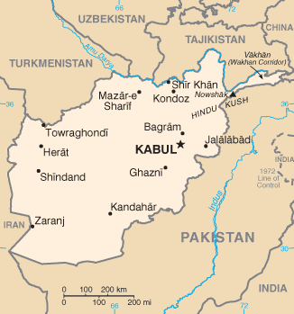 | 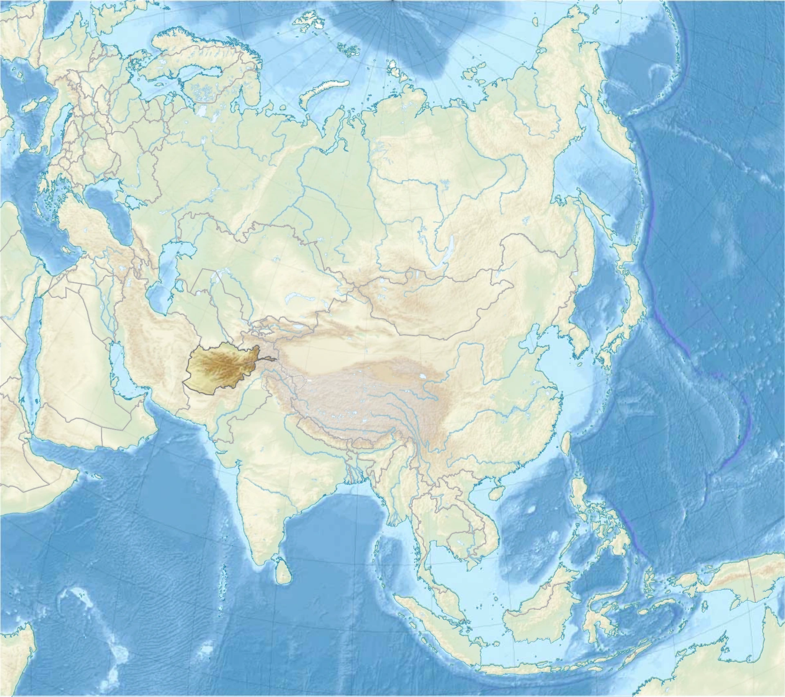 |

**认识国家／地区**：阿富汗位于南亚分组的内陆地区，兴都库什山脉贯穿国土。山口与河谷曾连接中亚、伊朗和南亚，地形显著影响交通；在本手册采用UN M49归入南亚。

**认识首都／城市**：喀布尔位于东部高海拔河谷，是长期的政治与交通中心。城市靠近穿越山地的通道，河流与山坡共同塑造城区；学习时把首都放在东部谷地，而非广阔西部干旱地区。

> **记忆钩子**：阿富汗山谷首都，喀布尔。

**容易混淆**：文化区域分类可能不同，本版南亚分组依UN M49。

**原亚洲手册的记忆故事**

- 阿富汗长期处于古代丝绸之路及东西交通网络交汇地带。
- 喀布尔周边被兴都库什山系环绕。

资料：[UNData 国家概况（统计快照）](https://data.un.org/legacy/en/iso/af.html) · [国家／地区背景](https://en.wikipedia.org/wiki/Afghanistan) · [首都／城市背景](https://en.wikipedia.org/wiki/Kabul)

地图：[File:Afghanistan-CIA WFB Map.png；Original uploader was Zhaladshar at en.wikisource；Public domain](https://commons.wikimedia.org/wiki/File:Afghanistan-CIA_WFB_Map.png) · [File:Afghanistan in Asia (relief) (-mini map).svg；TUBS；CC BY-SA 3.0](https://commons.wikimedia.org/wiki/File:Afghanistan_in_Asia_(relief)_(-mini_map).svg)

---

## 巴基斯坦 — 伊斯兰堡

Pakistan · Islamabad · 南亚

| 国家／地区地图 | 亚洲位置图 |
|:---:|:---:|
| 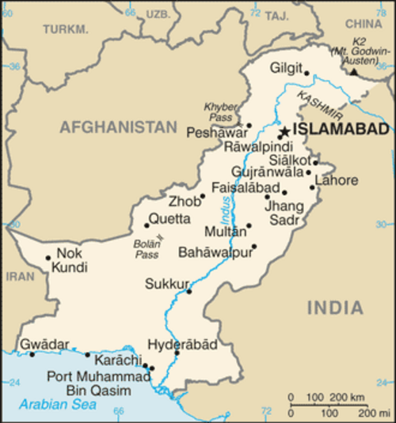 | 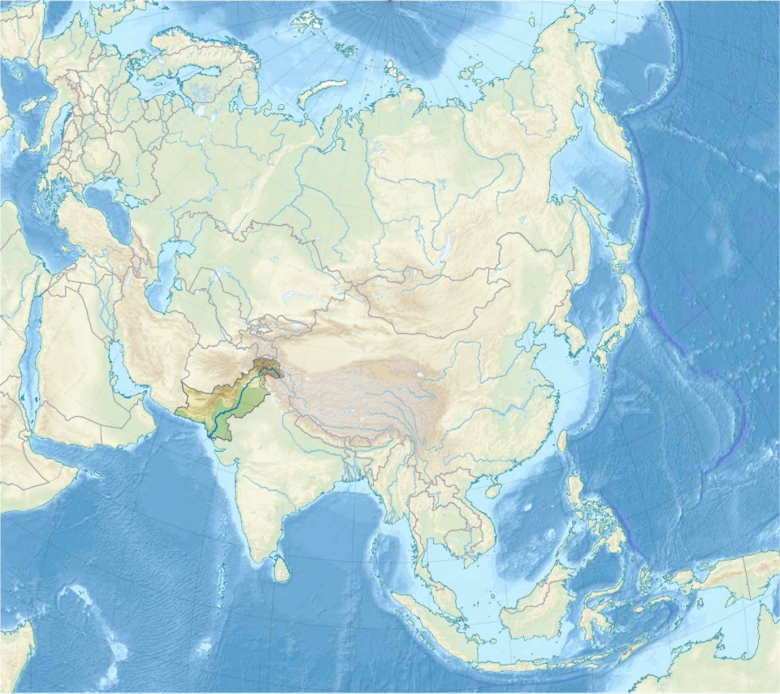 |

**认识国家／地区**：巴基斯坦位于南亚西北部，南临阿拉伯海，印度河流域贯穿主要人口区域。北部高山与南部平原差异显著，城市位置常与河谷和区域交通联系。

**认识首都／城市**：伊斯兰堡位于东北部、马尔加拉山麓，是20世纪规划建设的新首都，毗邻拉瓦尔品第。旧首都卡拉奇在南部海岸；用“海港旧都、山麓新都”对照，最容易理解迁都。

> **记忆钩子**：巴基斯坦山麓建新都，伊斯兰堡。

**容易混淆**：卡拉奇是旧首都与海港；拉瓦尔品第是邻近城市。

**原亚洲手册的记忆故事**

- 巴基斯坦独立后最初的首都是 卡拉奇。
- 后来修建了规划城市 伊斯兰堡作为新首都。
- “Islamabad”可理解为“伊斯兰之城”。

资料：[UNData 国家概况（统计快照）](https://data.un.org/legacy/en/iso/pk.html) · [国家／地区背景](https://en.wikipedia.org/wiki/Pakistan) · [首都／城市背景](https://en.wikipedia.org/wiki/Islamabad)

地图：[File:Pakistan-CIA WFB Map.png；见原图来源页；Public domain](https://commons.wikimedia.org/wiki/File:Pakistan-CIA_WFB_Map.png) · [File:Pakistan in Asia (relief) (de-facto) (-mini map).svg；TUBS；CC BY-SA 3.0](https://commons.wikimedia.org/wiki/File:Pakistan_in_Asia_(relief)_(de-facto)_(-mini_map).svg)

---

## 印度 — 新德里

India · New Delhi · 南亚

| 国家／地区地图 | 亚洲位置图 |
|:---:|:---:|
| 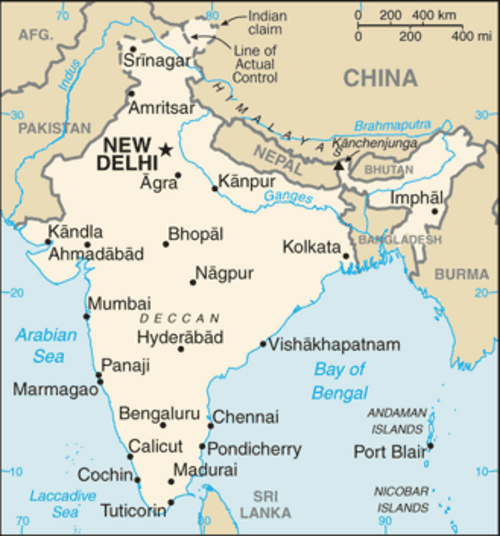 | 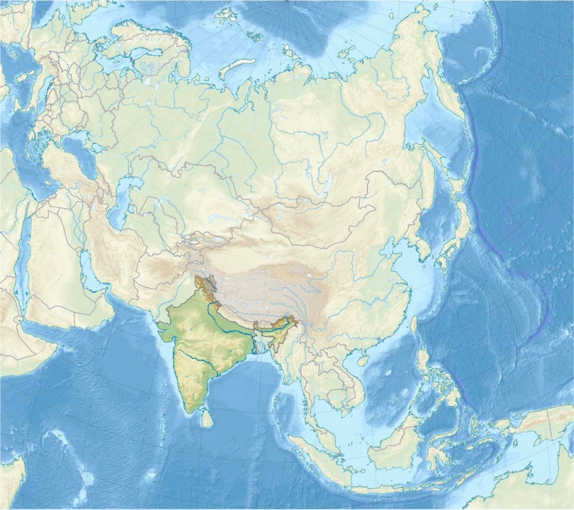 |

**认识国家／地区**：印度位于南亚，北部喜马拉雅山地、中部平原与南部半岛形成多样地理。恒河流域和沿海城市人口集中，语言与文化差异丰富；首都应与大型商业城市分开学习。

**认识首都／城市**：新德里位于北部德里城市区域内，是国家政府所在地，1931年正式启用为首都。新德里与更广义的德里范围不同，规划行政街区与旧德里历史城区形成对照；孟买不是首都。

> **记忆钩子**：印度北部德里地区，首都新德里。

**容易混淆**：新德里是德里的一部分，两名称范围不能完全等同。

**原亚洲手册的记忆故事**

- 1911 年，英属印度宣布将首都从加尔各答迁到德里。
- 新德里随后按规划建设，主要设计者包括 Edwin Lutyens 和 Herbert Baker。
- 今天“德里”是更大的国家首都辖区，而“新德里”是其中的国家政治核心。

资料：[UNData 国家概况（统计快照）](https://data.un.org/legacy/en/iso/in.html) · [国家／地区背景](https://en.wikipedia.org/wiki/India) · [首都／城市背景](https://en.wikipedia.org/wiki/New_Delhi)

地图：[File:India-CIA WFB Map.png；见原图来源页；Public domain](https://commons.wikimedia.org/wiki/File:India-CIA_WFB_Map.png) · [File:India in Asia (relief) (de-facto) (-mini map).svg；TUBS；CC BY-SA 3.0](https://commons.wikimedia.org/wiki/File:India_in_Asia_(relief)_(de-facto)_(-mini_map).svg)

---

## 尼泊尔 — 加德满都

Nepal · Kathmandu · 南亚

| 国家／地区地图 | 亚洲位置图 |
|:---:|:---:|
| 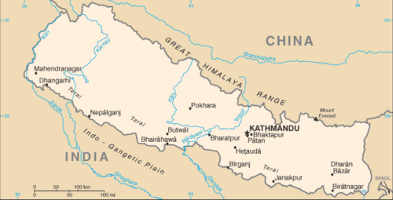 |  |

**认识国家／地区**：尼泊尔位于中国与印度之间，是喜马拉雅山地国家。北部高山与南部特莱平原高差显著，山谷承担主要城市和交通功能；不临海，位置可通过喜马拉雅中段识别。

**认识首都／城市**：加德满都位于中部盆地，是行政与历史文化中心。盆地内还有帕坦、巴克塔普尔等古城，宫廷广场和宗教建筑体现地方传统；首都不在最高山峰上，而在适合聚落的山间谷地。

> **记忆钩子**：尼泊尔高山之间，谷地加德满都。

**容易混淆**：珠穆朗玛峰是地标，首都是盆地城市。

**原亚洲手册的记忆故事**

- 加德满都谷地长期是尼泊尔文明核心。
- 这里保存大量寺庙、宫殿与传统城市广场。

资料：[UNData 国家概况（统计快照）](https://data.un.org/legacy/en/iso/np.html) · [国家／地区背景](https://en.wikipedia.org/wiki/Nepal) · [首都／城市背景](https://en.wikipedia.org/wiki/Kathmandu)

地图：[File:Nepal-CIA WFB Map.png；CIA；Public domain](https://commons.wikimedia.org/wiki/File:Nepal-CIA_WFB_Map.png) · [File:Nepal in Asia (relief) (-mini map).svg；TUBS；CC BY-SA 3.0](https://commons.wikimedia.org/wiki/File:Nepal_in_Asia_(relief)_(-mini_map).svg)

---

## 不丹 — 廷布

Bhutan · Thimphu · 南亚

| 国家／地区地图 | 亚洲位置图 |
|:---:|:---:|
| 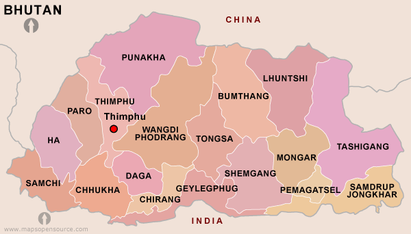 |  |

**认识国家／地区**：不丹位于喜马拉雅东段，夹在中国与印度之间，国土以山地和河谷为主。佛教文化与宗堡建筑鲜明；学习时将它放在尼泊尔以东方向，避免混为同一山国。

**认识首都／城市**：廷布位于西部内陆河谷，是政府与王室的重要中心。扎西确宗和现代行政街区构成城市识别点，河谷地形解释聚落展开方向；帕罗承担航空门户功能，但不是国家首都。

> **记忆钩子**：不丹西部河谷，首都廷布。

**容易混淆**：帕罗机场有名，首都是廷布。

**原亚洲手册的记忆故事**

- 廷布是世界上海拔较高的国家首都之一。
- 不丹政府与国王办公的重要建筑 扎西却宗（Tashichho Dzong）就在廷布。

资料：[UNData 国家概况（统计快照）](https://data.un.org/legacy/en/iso/bt.html) · [国家／地区背景](https://en.wikipedia.org/wiki/Bhutan) · [首都／城市背景](https://en.wikipedia.org/wiki/Thimphu)

地图：[File:Bhutan-map.gif；MapsOpenSource；CC BY 3.0](https://commons.wikimedia.org/wiki/File:Bhutan-map.gif) · [File:Bhutan in Asia (relief) (-mini map).svg；TUBS；CC BY-SA 3.0](https://commons.wikimedia.org/wiki/File:Bhutan_in_Asia_(relief)_(-mini_map).svg)

---

## 孟加拉国 — 达卡

Bangladesh · Dhaka · 南亚

| 国家／地区地图 | 亚洲位置图 |
|:---:|:---:|
| 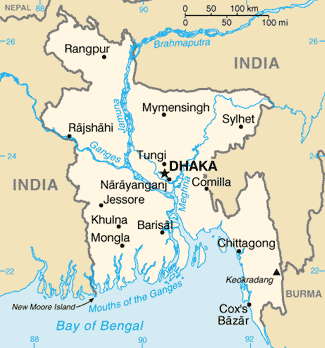 |  |

**认识国家／地区**：孟加拉国位于南亚，主要处于恒河、布拉马普特拉河与梅格纳河形成的三角洲地区。南临孟加拉湾，河流、洪泛平原和季风影响农业与城市生活。

**认识首都／城市**：达卡位于中部布里甘加河附近，是政治与商业中心。城市历史与贸易、手工业和近现代国家形成有关；名称短，但要把它与密集河网和三角洲国家联系，才能牢固定位。

> **记忆钩子**：孟加拉国河网密，中心城市达卡。

**容易混淆**：吉大港是重要海港，不是首都。

**原亚洲手册的记忆故事**

- 达卡历史上以精细的 孟加拉薄纱 muslin闻名。
- 这座城市今天是全球人口最密集的大都市之一。

资料：[UNData 国家概况（统计快照）](https://data.un.org/legacy/en/iso/bd.html) · [国家／地区背景](https://en.wikipedia.org/wiki/Bangladesh) · [首都／城市背景](https://en.wikipedia.org/wiki/Dhaka)

地图：[File:Bangladesh-CIA WFB Map.png；United States Central Intelligence Agency；Public domain](https://commons.wikimedia.org/wiki/File:Bg-map.png) · [File:Bangladesh in Asia (relief) (-mini map).svg；TUBS；CC BY-SA 3.0](https://commons.wikimedia.org/wiki/File:Bangladesh_in_Asia_(relief)_(-mini_map).svg)

---

## 斯里兰卡 — 斯里贾亚瓦德纳普拉科特

Sri Lanka · Sri Jayawardenepura Kotte · 南亚

| 国家／地区地图 | 亚洲位置图 |
|:---:|:---:|
| 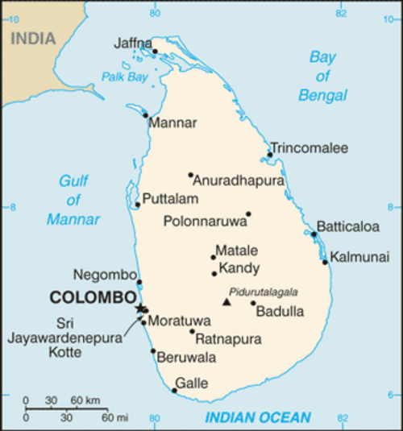 |  |

**认识国家／地区**：斯里兰卡位于印度南侧印度洋，是一座以主岛为主体的国家。中央高地与沿海平原构成主要地形，茶业与海上交流体现其经济和历史；旧称锡兰常见于旧资料。

**认识首都／城市**：斯里贾亚瓦德纳普拉科特位于科伦坡附近，是行政首都和议会所在地。科伦坡保留重要商业与政府功能，资料常简化写作科伦坡；学习时可先用“科特”简称定位，再记完整名称。

> **记忆钩子**：斯里兰卡正式首都记“科特”，商业中心科伦坡。

**容易混淆**：科特与科伦坡功能相关但名称不同，不能只背旧简表。

**原亚洲手册的记忆故事**

- 很多人会回答 科伦坡 Colombo。
- 但斯里兰卡政府资料将 Sri Jayawardenepura Kotte列为行政首都；科伦坡是商业首都和最大城市。
- 这座城市简称 Kotte（科特）会容易很多。
- 1980 年代，议会迁入科特的新议会大楼。

资料：[UNData 国家概况（统计快照）](https://data.un.org/legacy/en/iso/lk.html) · [国家／地区背景](https://en.wikipedia.org/wiki/Sri_Lanka) · [首都／城市背景](https://en.wikipedia.org/wiki/Sri_Jayawardenepura_Kotte) · [科特市政府：行政首都与科伦坡的关系](https://www.kotte.mc.gov.lk/index.php?Itemid=175&id=25&lang=en&option=com_content&view=article)

地图：[File:Sri Lanka-CIA WFB Map.png；CIA；Public domain](https://commons.wikimedia.org/wiki/File:Sri_Lanka-CIA_WFB_Map.png) · [File:Sri Lanka in Asia (relief) (-mini map).svg；TUBS；CC BY-SA 3.0](https://commons.wikimedia.org/wiki/File:Sri_Lanka_in_Asia_(relief)_(-mini_map).svg)

---

## 马尔代夫 — 马累

Maldives · Malé · 南亚

| 国家／地区地图 | 亚洲位置图 |
|:---:|:---:|
| 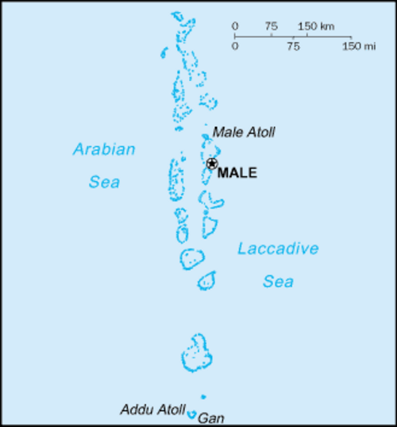 |  |

**认识国家／地区**：马尔代夫位于印度西南侧印度洋，由多组低平珊瑚环礁组成。陆地分散，岛屿与潟湖形成鲜明图像，海洋交通和旅游是重要联系；不要把度假岛名称当首都。

**认识首都／城市**：马累位于中部偏北的环礁区域，政府和城市活动集中在较小岛屿上，并与周边岛屿形成相连区域。它与马尔代夫读音相近，密集城市岛与分散度假岛的差异很适合记忆。

> **记忆钩子**：马尔代夫，首都马累。

**容易混淆**：马累是行政城市，不是泛指全部度假环礁。

**原亚洲手册的记忆故事**

- 马尔代夫由大量珊瑚岛组成。
- 首都马累所在岛面积很小，却高度城市化。
- 国际机场主要位于旁边的 Hulhulé 岛。

资料：[UNData 国家概况（统计快照）](https://data.un.org/legacy/en/iso/mv.html) · [国家／地区背景](https://en.wikipedia.org/wiki/Maldives) · [首都／城市背景](https://en.wikipedia.org/wiki/Mal%C3%A9)

地图：[File:Maldives-CIA WFB Map.png；CIA；Public domain](https://commons.wikimedia.org/wiki/File:Maldives-CIA_WFB_Map.png) · [File:Maldives in Asia (relief) (-mini map).svg；TUBS；CC BY-SA 3.0](https://commons.wikimedia.org/wiki/File:Maldives_in_Asia_(relief)_(-mini_map).svg)

---

## 伊朗 — 德黑兰

Iran · Tehran · 南亚

| 国家／地区地图 | 亚洲位置图 |
|:---:|:---:|
| 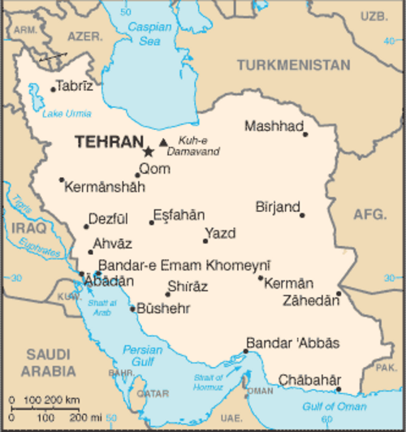 | 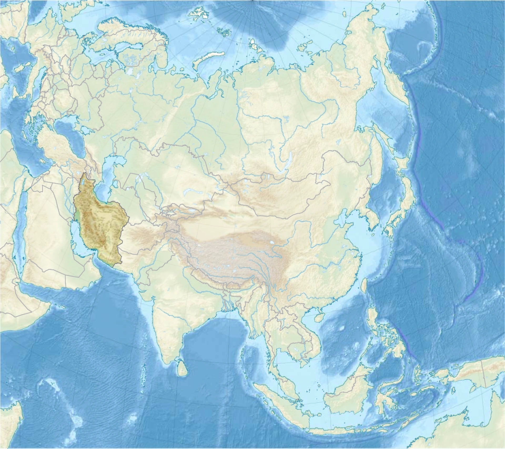 |

**认识国家／地区**：伊朗位于西亚与南亚相接地区，本版按UN M49归南亚。境内高原、山脉与干旱盆地广泛，北邻里海、南临波斯湾和阿曼湾；波斯文化传统提供历史背景。

**认识首都／城市**：德黑兰位于北部厄尔布尔士山脉南麓，18世纪末成为王朝首都。它是国家行政与经济中心，城市从山麓向南延展；古都伊斯法罕很有名，但不是现代首都。

> **记忆钩子**：伊朗北部山麓，德黑兰。

**容易混淆**：分组依UN M49；伊斯法罕是历史古都。

**原亚洲手册的记忆故事**

- 德黑兰直到 18 世纪末卡扎尔王朝时期才成为国家首都。
- 城市北侧就是厄尔布尔士山脉，天气好时城市背景可直接看到雪山。

资料：[UNData 国家概况（统计快照）](https://data.un.org/legacy/en/iso/ir.html) · [国家／地区背景](https://en.wikipedia.org/wiki/Iran) · [首都／城市背景](https://en.wikipedia.org/wiki/Tehran)

地图：[File:Iran-CIA WFB Map.png；CIA；Public domain](https://commons.wikimedia.org/wiki/File:Iran-CIA_WFB_Map.png) · [File:Iran in Asia (relief) (-mini map).svg；TUBS；CC BY-SA 3.0](https://commons.wikimedia.org/wiki/File:Iran_in_Asia_(relief)_(-mini_map).svg)

---

## 哈萨克斯坦 — 阿斯塔纳

Kazakhstan · Astana · 中亚

| 国家／地区地图 | 亚洲位置图 |
|:---:|:---:|
| 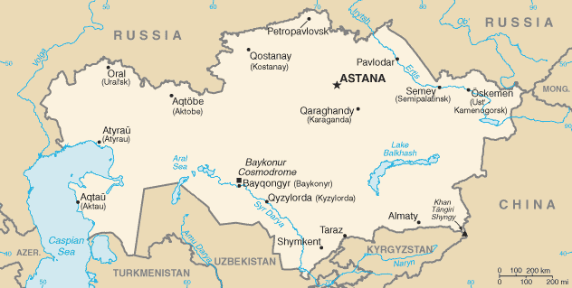 | 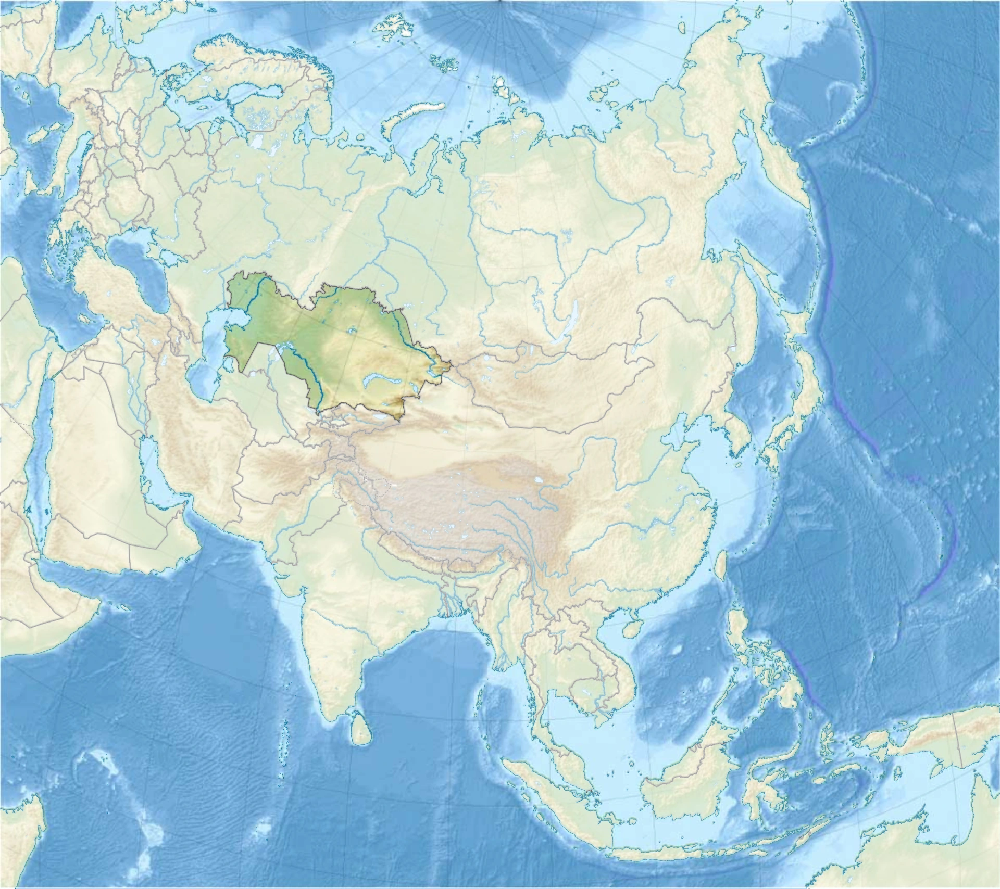 |

**认识国家／地区**：哈萨克斯坦位于中亚，国土辽阔，北部草原与南部山地、干旱地区不同，西侧临里海。部分国土位于乌拉尔河以西，但本版整体按UN M49归中亚。

**认识首都／城市**：阿斯塔纳位于北部伊希姆河畔，1997年取代阿拉木图成为首都。城市经过规划扩展，曾在2019年至2022年使用努尔苏丹名称；把迁都和改名顺序分开，便能看懂不同年代资料。

> **记忆钩子**：哈萨克斯坦北部新都，阿斯塔纳。

**容易混淆**：阿拉木图是旧首都；努尔苏丹是阿斯塔纳曾用名。

**原亚洲手册的记忆故事**

- Astana 在哈萨克语中本身就有 “首都”的含义。
- 这座城市曾先后叫 Akmola、Astana、Nur-Sultan，2022 年又改回 Astana。
- 所以这是一个“名字反复横跳”的首都。

资料：[UNData 国家概况（统计快照）](https://data.un.org/legacy/en/iso/kz.html) · [国家／地区背景](https://en.wikipedia.org/wiki/Kazakhstan) · [首都／城市背景](https://en.wikipedia.org/wiki/Astana)

地图：[File:Kazakhstan-CIA WFB Map.png；见原图来源页；Public domain](https://commons.wikimedia.org/wiki/File:Kazakhstan-CIA_WFB_Map.png) · [File:Kazakhstan in Asia (relief) (-mini map).svg；TUBS；CC BY-SA 3.0](https://commons.wikimedia.org/wiki/File:Kazakhstan_in_Asia_(relief)_(-mini_map).svg)

---

## 吉尔吉斯斯坦 — 比什凯克

Kyrgyzstan · Bishkek · 中亚

| 国家／地区地图 | 亚洲位置图 |
|:---:|:---:|
| 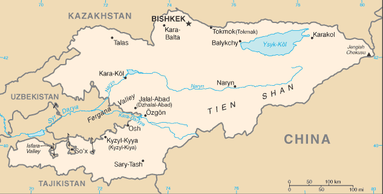 |  |

**认识国家／地区**：吉尔吉斯斯坦位于中亚内陆，天山山地广泛，伊塞克湖是醒目的自然地标。北部河谷更适宜城市和交通，南北山地阻隔影响区域联系。

**认识首都／城市**：比什凯克位于北部楚河谷地、靠近哈萨克斯坦，是行政与经济中心。苏联时期曾称伏龙芝，1991年改用现名；记忆可把首都放在“天山北侧的开放河谷”。

> **记忆钩子**：吉尔吉斯北部谷地，比什凯克。

**容易混淆**：伏龙芝是旧称；不是哈萨克斯坦的阿斯塔纳。

**原亚洲手册的记忆故事**

- 苏联时期，这座城市曾叫 Frunze（伏龙芝）。
- 1991 年吉尔吉斯斯坦独立前后恢复为 Bishkek。

资料：[UNData 国家概况（统计快照）](https://data.un.org/legacy/en/iso/kg.html) · [国家／地区背景](https://en.wikipedia.org/wiki/Kyrgyzstan) · [首都／城市背景](https://en.wikipedia.org/wiki/Bishkek)

地图：[File:Kyrgyzstan-CIA WFB Map.png；见原图来源页；Public domain](https://commons.wikimedia.org/wiki/File:Kyrgyzstan-CIA_WFB_Map.png) · [File:Kyrgyzstan in Asia (relief) (-mini map).svg；TUBS；CC BY-SA 3.0](https://commons.wikimedia.org/wiki/File:Kyrgyzstan_in_Asia_(relief)_(-mini_map).svg)

---

## 塔吉克斯坦 — 杜尚别

Tajikistan · Dushanbe · 中亚

| 国家／地区地图 | 亚洲位置图 |
|:---:|:---:|
| 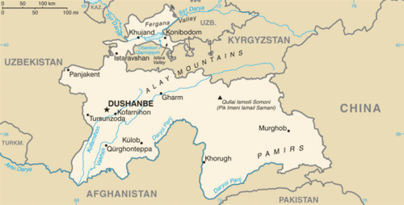 |  |

**认识国家／地区**：塔吉克斯坦位于中亚东南部，是山地占主要部分的内陆国家。帕米尔高原与河谷构成交通和聚落骨架，南邻阿富汗；塔吉克语与波斯语背景有关。

**认识首都／城市**：杜尚别位于西部河谷，名称在塔吉克语中有“星期一”之意，与市场聚落历史相关。它从小型聚落发展成行政中心；可用“周一开集市，集市成首都”把词义和城市史连接。

> **记忆钩子**：塔吉克星期一赶集，杜尚别。

**容易混淆**：杜尚别—塔吉克斯坦；塔什干—乌兹别克斯坦。

资料：[UNData 国家概况（统计快照）](https://data.un.org/legacy/en/iso/tj.html) · [国家／地区背景](https://en.wikipedia.org/wiki/Tajikistan) · [首都／城市背景](https://en.wikipedia.org/wiki/Dushanbe)

地图：[File:Tajikistan-CIA WFB Map.png；见原图来源页；Public domain](https://commons.wikimedia.org/wiki/File:Tajikistan-CIA_WFB_Map.png) · [File:Tajikistan in Asia (relief) (-mini map).svg；TUBS；CC BY-SA 3.0](https://commons.wikimedia.org/wiki/File:Tajikistan_in_Asia_(relief)_(-mini_map).svg)

---

## 土库曼斯坦 — 阿什哈巴德

Turkmenistan · Ashgabat · 中亚

| 国家／地区地图 | 亚洲位置图 |
|:---:|:---:|
| 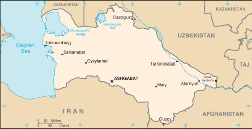 | 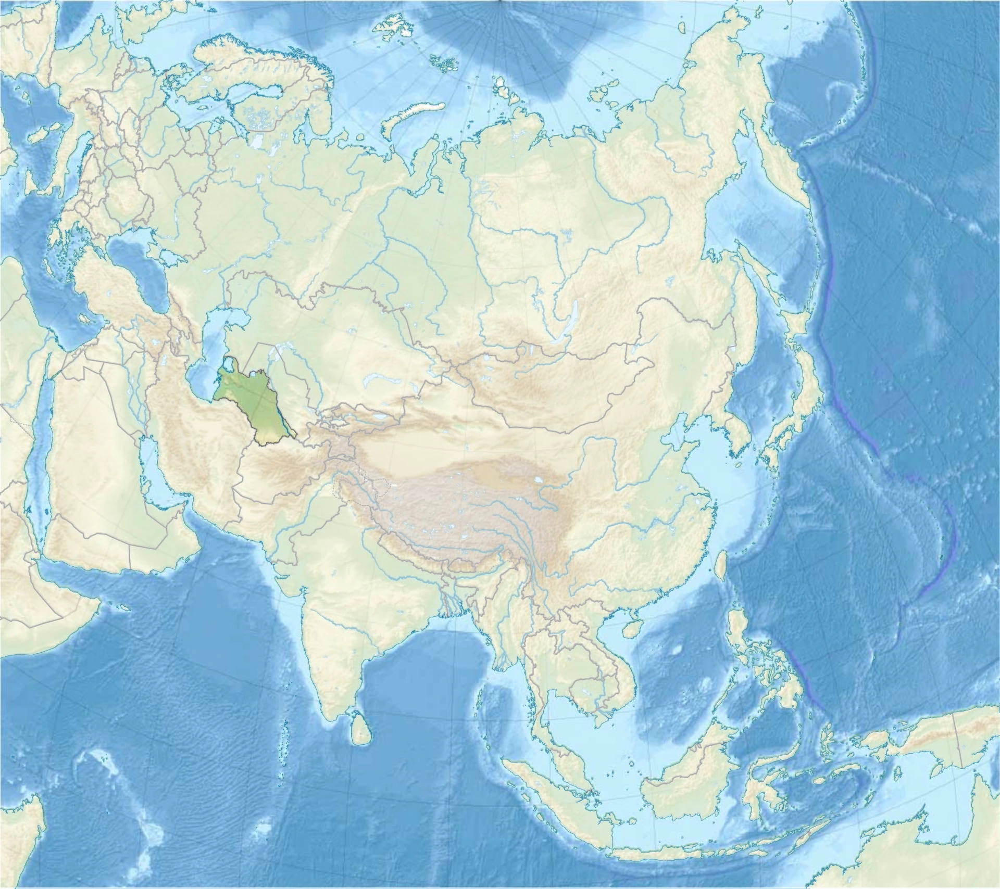 |

**认识国家／地区**：土库曼斯坦位于中亚西南部，西临里海，大片国土为卡拉库姆沙漠。南侧接近科佩特山地，绿洲与天然气资源影响聚落和经济布局；国家形象不只有沙漠景点。

**认识首都／城市**：阿什哈巴德位于南部科佩特山北麓，靠近伊朗边境，是行政中心。现代白色大理石建筑使城市辨识度很高；首都位置在沙漠与山麓相接处，并不靠里海。

> **记忆钩子**：土库曼南部山麓，阿什哈巴德。

**容易混淆**：达尔瓦扎气坑是景点，阿什哈巴德才是首都。

**原亚洲手册的记忆故事**

- 阿什哈巴德在 1948 年遭遇毁灭性大地震，之后大规模重建。
- 今天城市以大量白色大理石建筑闻名。

资料：[UNData 国家概况（统计快照）](https://data.un.org/legacy/en/iso/tm.html) · [国家／地区背景](https://en.wikipedia.org/wiki/Turkmenistan) · [首都／城市背景](https://en.wikipedia.org/wiki/Ashgabat)

地图：[File:Turkmenistan-CIA WFB Map.png；Central Intelligence Agency；Public domain](https://commons.wikimedia.org/wiki/File:Turkmenistan-CIA_WFB_Map.png) · [File:Turkmenistan in Asia (relief) (-mini map).svg；TUBS；CC BY-SA 3.0](https://commons.wikimedia.org/wiki/File:Turkmenistan_in_Asia_(relief)_(-mini_map).svg)

---

## 乌兹别克斯坦 — 塔什干

Uzbekistan · Tashkent · 中亚

| 国家／地区地图 | 亚洲位置图 |
|:---:|:---:|
| 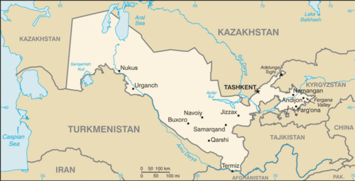 |  |

**认识国家／地区**：乌兹别克斯坦位于中亚内陆，与多个邻国相接且无出海通道。绿洲农业、丝路城市与河流灌溉共同塑造历史地理；撒马尔罕、布哈拉是著名古城。

**认识首都／城市**：塔什干位于东北部、天山西侧附近的绿洲地带，是行政与交通中心。名称常译为“石城”，古代商路与现代城市建设叠加；首都不同于更常出现在丝路旅行中的撒马尔罕。

> **记忆钩子**：乌兹别克的石城，塔什干。

**容易混淆**：撒马尔罕、布哈拉是古城，现首都是塔什干。

**原亚洲手册的记忆故事**

- 乌兹别克斯坦最著名的丝路古城可能是撒马尔罕和布哈拉。
- 但首都是 塔什干。
- 1966 年的大地震之后，塔什干经历了大规模重建。

资料：[UNData 国家概况（统计快照）](https://data.un.org/legacy/en/iso/uz.html) · [国家／地区背景](https://en.wikipedia.org/wiki/Uzbekistan) · [首都／城市背景](https://en.wikipedia.org/wiki/Tashkent)

地图：[File:Uzbekistan-CIA WFB Map.png；见原图来源页；Public domain](https://commons.wikimedia.org/wiki/File:Uzbekistan-CIA_WFB_Map.png) · [File:Uzbekistan in Asia (relief) (-mini map).svg；TUBS；CC BY-SA 3.0](https://commons.wikimedia.org/wiki/File:Uzbekistan_in_Asia_(relief)_(-mini_map).svg)

---

## 亚美尼亚 — 埃里温

Armenia · Yerevan · 西亚

| 国家／地区地图 | 亚洲位置图 |
|:---:|:---:|
| 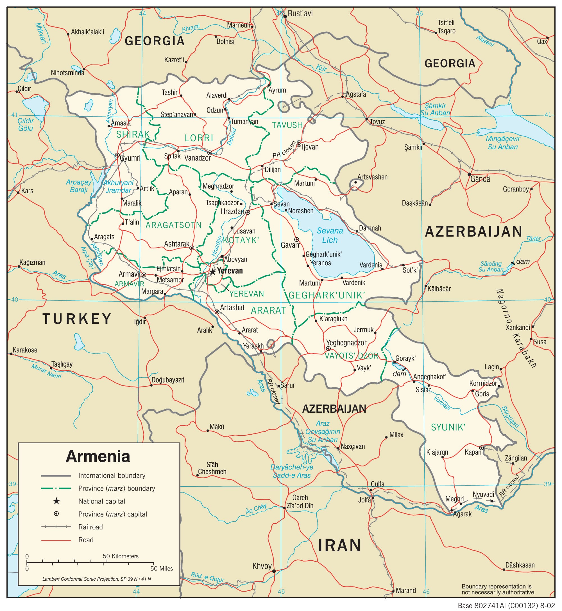 |  |

**认识国家／地区**：亚美尼亚位于南高加索内陆，山地和高原广泛，塞凡湖是重要自然地标。古老基督教传统与地区历史紧密相关；本版按UN M49归西亚，与欧洲文化联系另说明。

**认识首都／城市**：埃里温位于西部阿拉拉特平原边缘、赫拉兹丹河沿岸，是行政与文化中心。城市使用粉红色凝灰岩建筑的印象鲜明，附近古代城堡遗址提示悠久历史；位置接近西部边界。

> **记忆钩子**：亚美尼亚粉红石城，埃里温。

**容易混淆**：南高加索本版归西亚；不要把埃里温与第比利斯混淆。

**原亚洲手册的记忆故事**

- 埃里温的历史与古代 Erebuni Fortress密切相关。
- Erebuni 要塞建于公元前 782 年，是研究城市起源的重要节点。

资料：[UNData 国家概况（统计快照）](https://data.un.org/legacy/en/iso/am.html) · [国家／地区背景](https://en.wikipedia.org/wiki/Armenia) · [首都／城市背景](https://en.wikipedia.org/wiki/Yerevan)

地图：[Armenia Transportation (2002)；United States Central Intelligence Agency；Public domain](https://www.cia.gov/resources/map/armenia/) · [File:Armenia in Asia (relief) (-mini map).svg；TUBS；CC BY-SA 3.0](https://commons.wikimedia.org/wiki/File:Armenia_in_Asia_(relief)_(-mini_map).svg)

---

## 阿塞拜疆 — 巴库

Azerbaijan · Baku · 西亚

| 国家／地区地图 | 亚洲位置图 |
|:---:|:---:|
| 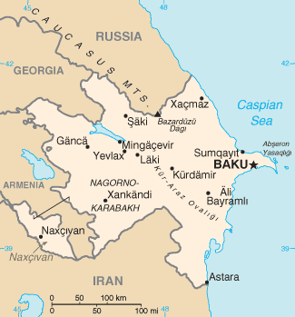 |  |

**认识国家／地区**：阿塞拜疆位于南高加索东侧，东临里海，另有纳希切万飞地。山地、沿海低地与石油资源共同构成地理印象；里海虽称“海”，并非通向大洋的普通海岸。

**认识首都／城市**：巴库位于里海西岸阿布歇隆半岛，是行政、港口与能源产业中心。老城与现代建筑并存，风与石油是常见城市联想；把“阿塞拜疆东岸半岛城市”作为地图定位线索。

> **记忆钩子**：阿塞拜疆里海岸，石油城巴库。

**容易混淆**：里海是内陆水体；纳希切万不是首都所在地。

**原亚洲手册的记忆故事**

- 巴库位于里海西岸。
- 城市海拔低于海平面，是世界上海拔最低的国家首都之一。
- 阿塞拜疆与石油工业历史关系极深，19 世纪末巴库就是世界重要石油城市。

资料：[UNData 国家概况（统计快照）](https://data.un.org/legacy/en/iso/az.html) · [国家／地区背景](https://en.wikipedia.org/wiki/Azerbaijan) · [首都／城市背景](https://en.wikipedia.org/wiki/Baku)

地图：[File:Azerbaijan-CIA WFB Map.png；United States Central Intelligence Agency；Public domain](https://commons.wikimedia.org/wiki/File:Aj-map.png) · [File:Azerbaijan in Asia (relief) (-mini map).svg；TUBS；CC BY-SA 3.0](https://commons.wikimedia.org/wiki/File:Azerbaijan_in_Asia_(relief)_(-mini_map).svg)

---

## 格鲁吉亚 — 第比利斯

Georgia · Tbilisi · 西亚

| 国家／地区地图 | 亚洲位置图 |
|:---:|:---:|
| 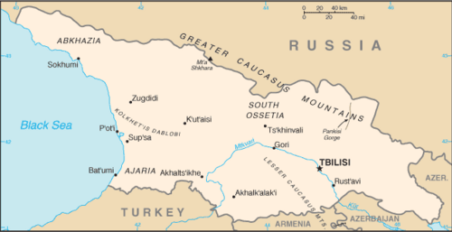 | 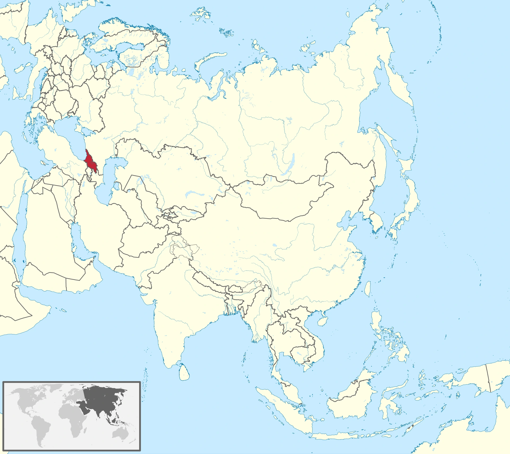 |

**认识国家／地区**：格鲁吉亚位于南高加索，西临黑海，北侧大高加索山脉与南部山地相对。河谷通道连接东西，历史与文化具有多重区域联系；本版按UN M49归西亚。

**认识首都／城市**：第比利斯位于东部库拉河谷，是政治与文化中心，名称与温泉背景有关。老城依山沿河展开，欧洲与西亚通道的联系鲜明；巴统在黑海岸，是港口城市而非首都。

> **记忆钩子**：格鲁吉亚温泉河城，第比利斯。

**容易混淆**：巴统是黑海港城；争议地区边界见图源。

**原亚洲手册的记忆故事**

- “Tbilisi”与格鲁吉亚语中的“温暖”有关。
- 当地著名建城传说也和 温泉有关。
- 今天老城区仍能看到硫磺浴场。

资料：[UNData 国家概况（统计快照）](https://data.un.org/legacy/en/iso/ge.html) · [国家／地区背景](https://en.wikipedia.org/wiki/Georgia) · [首都／城市背景](https://en.wikipedia.org/wiki/Tbilisi)

地图：[File:Georgia-CIA WFB Map.png；见原图来源页；Public domain](https://commons.wikimedia.org/wiki/File:Georgia-CIA_WFB_Map.png) · [File:Georgia in Asia.svg；TUBS；CC BY-SA 3.0](https://commons.wikimedia.org/wiki/File:Georgia_in_Asia.svg)

---

## 伊拉克 — 巴格达

Iraq · Baghdad · 西亚

| 国家／地区地图 | 亚洲位置图 |
|:---:|:---:|
| 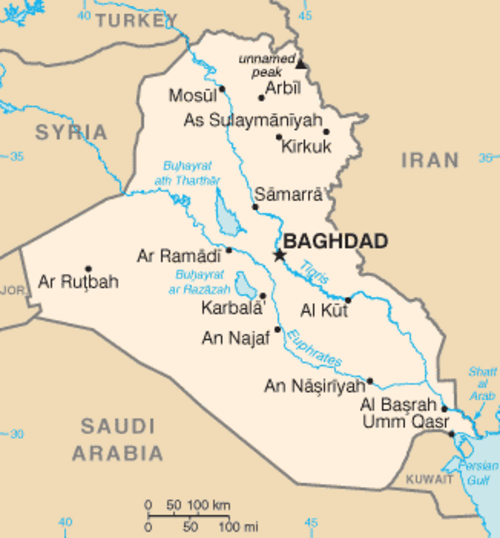 |  |

**认识国家／地区**：伊拉克位于西亚，底格里斯河与幼发拉底河贯穿主要平原，东南有短海岸通向波斯湾。两河流域的古代文明提供重要历史背景；北部山地与南部平原不同。

**认识首都／城市**：巴格达位于中部底格里斯河畔，8世纪阿拔斯王朝建立都城后发展为重要学术与贸易中心。河流穿过现代城区，行政功能延续；“两河国家、其中一河上的首都”可帮助准确定位。

> **记忆钩子**：伊拉克两河文明，底格里斯河边巴格达。

**容易混淆**：巴格达在底格里斯河畔，不是幼发拉底河畔。

**原亚洲手册的记忆故事**

- 巴格达于公元 762 年由阿拔斯王朝哈里发曼苏尔建立为新都。
- 早期城市核心以著名的 “圆城”布局闻名。
- 中世纪巴格达曾是伊斯兰世界最重要的知识中心之一。

资料：[UNData 国家概况（统计快照）](https://data.un.org/legacy/en/iso/iq.html) · [国家／地区背景](https://en.wikipedia.org/wiki/Iraq) · [首都／城市背景](https://en.wikipedia.org/wiki/Baghdad)

地图：[File:Iraq-CIA WFB Map.png；CIA；Public domain](https://commons.wikimedia.org/wiki/File:Iraq-CIA_WFB_Map.png) · [File:Iraq in Asia (relief) (-mini map).svg；TUBS；CC BY-SA 3.0](https://commons.wikimedia.org/wiki/File:Iraq_in_Asia_(relief)_(-mini_map).svg)

---

## 叙利亚 — 大马士革

Syria · Damascus · 西亚

| 国家／地区地图 | 亚洲位置图 |
|:---:|:---:|
| 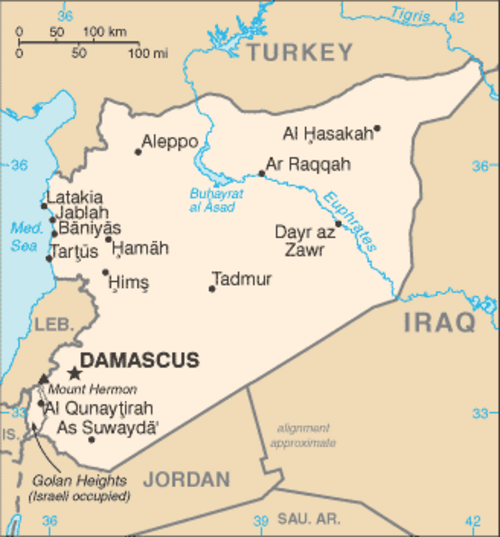 |  |

**认识国家／地区**：叙利亚位于西亚，西临地中海，内陆向东逐渐过渡到较干地区。历史商路与多层古代文明遗存丰富；首都与北部商业城市的位置需要区分。

**认识首都／城市**：大马士革位于西南部、巴拉达河绿洲一带，是历史悠久的城市和首都。老城街巷、宗教建筑与绿洲农业相连；名称较长，可用“大马—士革”分段，再记西南山麓绿洲。

> **记忆钩子**：叙利亚西南绿洲，大马士革。

**容易混淆**：阿勒颇是重要历史城市，首都是大马士革。

**原亚洲手册的记忆故事**

- 大马士革通常被认为是世界上持续有人居住时间最长的城市之一。
- 倭马亚清真寺是这座城市最重要的历史建筑之一。

资料：[UNData 国家概况（统计快照）](https://data.un.org/legacy/en/iso/sy.html) · [国家／地区背景](https://en.wikipedia.org/wiki/Syria) · [首都／城市背景](https://en.wikipedia.org/wiki/Damascus)

地图：[File:Syria-CIA WFB Map.png；CIA；Public domain](https://commons.wikimedia.org/wiki/File:Syria-CIA_WFB_Map.png) · [File:Syria in Asia (relief) (claimed) (-mini map).svg；TUBS；CC BY-SA 3.0](https://commons.wikimedia.org/wiki/File:Syria_in_Asia_(relief)_(claimed)_(-mini_map).svg)

---

## 黎巴嫩 — 贝鲁特

Lebanon · Beirut · 西亚

| 国家／地区地图 | 亚洲位置图 |
|:---:|:---:|
| 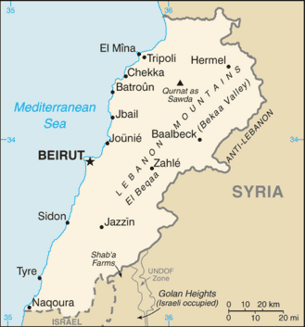 |  |

**认识国家／地区**：黎巴嫩位于地中海东岸，国土狭长，山脉与海岸平原相邻。与叙利亚、以色列相接，古代海上贸易和多种宗教文化影响地方历史；国名可与雪松形象联系。

**认识首都／城市**：贝鲁特位于中部海岸、向地中海伸出的半岛上，是行政、港口和文化中心。古代港市与现代城市叠加，海岸位置鲜明；记忆用“雪松国家的地中海首都”形成完整画面。

> **记忆钩子**：黎巴嫩雪松旁，海岸贝鲁特。

**容易混淆**：的黎波里是黎巴嫩北部城市，但不是其首都。

**原亚洲手册的记忆故事**

- 贝鲁特位于地中海东岸。
- 这里自古就是重要港口和商业中心。
- 城市经历过多次毁坏与重建，因此历史层非常复杂。

资料：[UNData 国家概况（统计快照）](https://data.un.org/legacy/en/iso/lb.html) · [国家／地区背景](https://en.wikipedia.org/wiki/Lebanon) · [首都／城市背景](https://en.wikipedia.org/wiki/Beirut)

地图：[File:Lebanon-CIA WFB Map.png；见原图来源页；Public domain](https://commons.wikimedia.org/wiki/File:Lebanon-CIA_WFB_Map.png) · [File:Lebanon in Asia (relief) (-mini map).svg；TUBS；CC BY-SA 3.0](https://commons.wikimedia.org/wiki/File:Lebanon_in_Asia_(relief)_(-mini_map).svg)

---

## 约旦 — 安曼

Jordan · Amman · 西亚

| 国家／地区地图 | 亚洲位置图 |
|:---:|:---:|
| 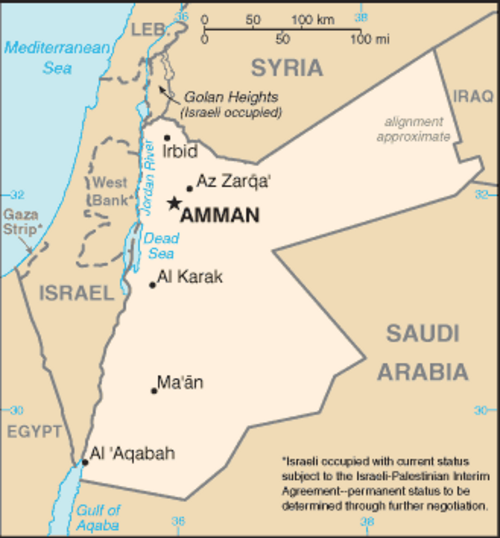 | 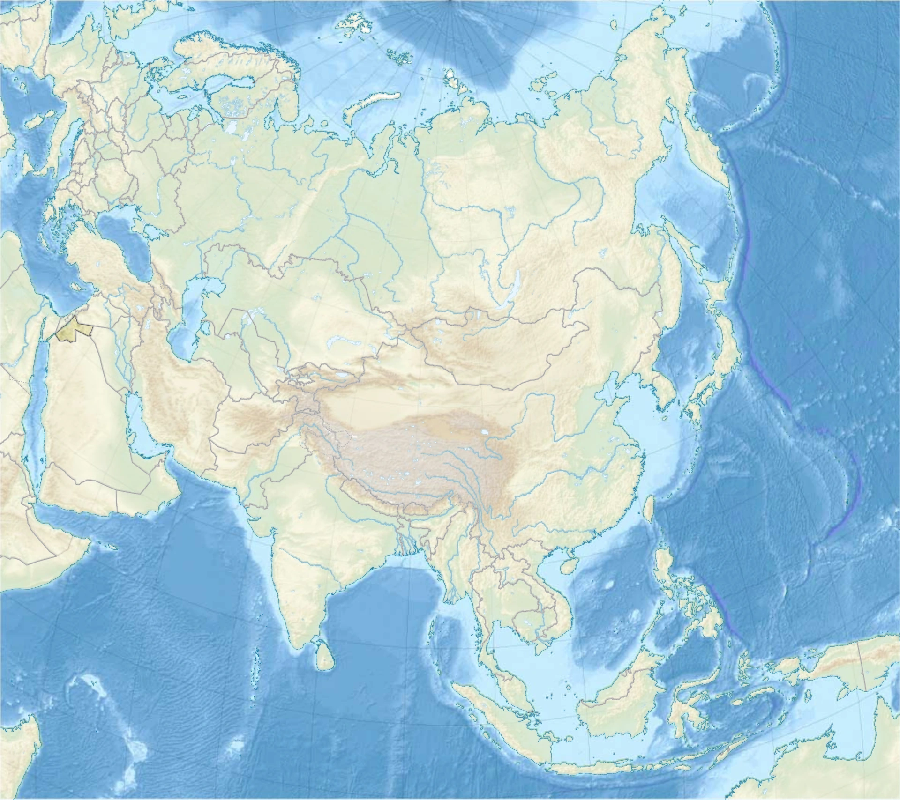 |

**认识国家／地区**：约旦位于西亚内陆为主的地区，西侧接近约旦河与死海，南部通过亚喀巴湾获得短海岸。高地与东部沙漠差异明显，佩特拉遗址提供鲜明历史线索。

**认识首都／城市**：安曼位于西北部丘陵地带，是政府与商业中心，现代城区跨越多座山丘。古代遗址与现代行政街区并存；佩特拉是历史遗址，亚喀巴是海港，均不能代替安曼。

> **记忆钩子**：约旦西北丘陵，首都安曼。

**容易混淆**：佩特拉和亚喀巴很有名，但首都是安曼。

**原亚洲手册的记忆故事**

- 古典时代，这座城市曾叫 Philadelphia。
- 安曼城堡山和罗马剧场仍保存着大量古代遗迹。
- 城市最初在山丘间发展，因此老城区高低起伏明显。

资料：[UNData 国家概况（统计快照）](https://data.un.org/legacy/en/iso/jo.html) · [国家／地区背景](https://en.wikipedia.org/wiki/Jordan) · [首都／城市背景](https://en.wikipedia.org/wiki/Amman)

地图：[File:Jordan-CIA WFB Map.png；CIA；Public domain](https://commons.wikimedia.org/wiki/File:Jordan-CIA_WFB_Map.png) · [File:Jordan in Asia (relief) (-mini map).svg；TUBS；CC BY-SA 3.0](https://commons.wikimedia.org/wiki/File:Jordan_in_Asia_(relief)_(-mini_map).svg)

---

## 以色列 — 耶路撒冷（地位有争议）

Israel · Jerusalem · 西亚

| 国家／地区地图 | 亚洲位置图 |
|:---:|:---:|
| 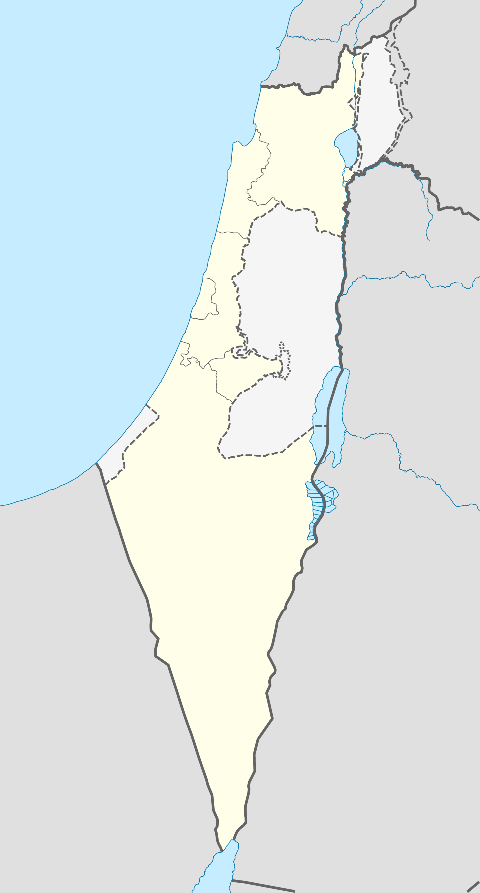 |  |

**认识国家／地区**：以色列位于地中海东岸，海岸平原、中央高地与南部内盖夫地区差异明显。涉及耶路撒冷及巴勒斯坦领土的地位问题，应结合联合国与相关各方的不同表述阅读。

**认识首都／城市**：以色列将耶路撒冷作为首都及主要政府机构所在地，联合国资料对此标注由以方提供，并保留其对城市地位的立场。城市具有多种宗教传统，学习首都时必须同时记住国际地位争议。

> **记忆钩子**：以色列—耶路撒冷，名称后记“地位有争议”。

**容易混淆**：特拉维夫是重要城市；耶路撒冷地位并非国际一致认定。

**原亚洲手册的记忆故事**

- 以色列将耶路撒冷作为首都和主要国家机构所在地。
- 耶路撒冷对犹太教、基督教和伊斯兰教都具有重大宗教意义。
- 但耶路撒冷的国际法律与外交地位长期存在争议，因此不同资料的表述会带有说明。

资料：[UNData 国家概况（统计快照）](https://data.un.org/legacy/en/iso/il.html) · [国家／地区背景](https://en.wikipedia.org/wiki/Israel) · [首都／城市背景](https://en.wikipedia.org/wiki/Jerusalem)

地图：[File:Israel location map.svg；NordNordWest；CC BY-SA 3.0](https://commons.wikimedia.org/wiki/File:Israel_location_map.svg) · [File:Israel in Asia (relief) (wo occupied territory) (-mini map).svg；TUBS；CC BY-SA 3.0](https://commons.wikimedia.org/wiki/File:Israel_in_Asia_(relief)_(wo_occupied_territory)_(-mini_map).svg)

---

## 巴勒斯坦国 — 东耶路撒冷（首都主张）

Palestine · East Jerusalem · 西亚

| 国家／地区地图 | 亚洲位置图 |
|:---:|:---:|
| 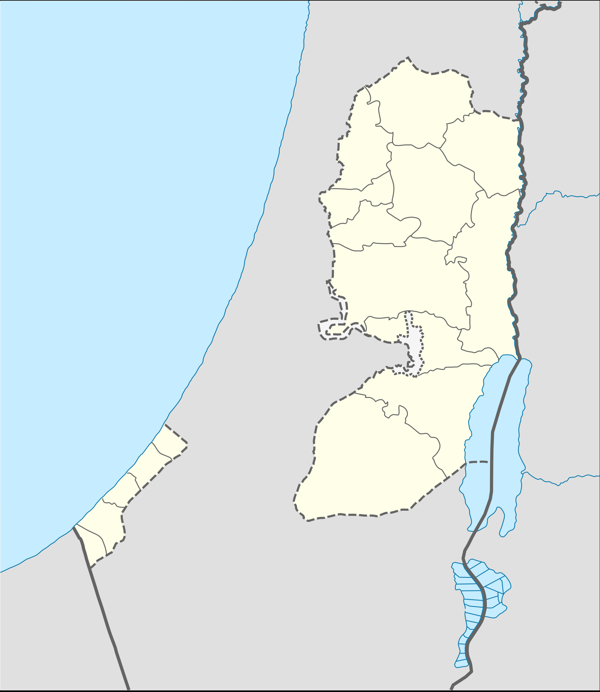 |  |

**认识国家／地区**：巴勒斯坦国是联合国非会员观察员国，涉及约旦河西岸与加沙地带。地域分离和政治地位背景影响行政运作；主表收录依据观察员国地位，不表示各国立场完全相同。

**认识首都／城市**：巴勒斯坦国主张东耶路撒冷为首都，联合国资料使用该称谓并附地位说明。拉姆安拉承担巴勒斯坦行政机构的重要职能；“首都主张”与“实际行政活动地点”须分开理解。

> **记忆钩子**：巴勒斯坦主张东耶路撒冷，行政联系拉姆安拉。

**容易混淆**：不能把东耶路撒冷主张与实际办公地点简单合并。

资料：[UNData 国家概况（统计快照）](https://data.un.org/legacy/en/iso/ps.html) · [国家／地区背景](https://en.wikipedia.org/wiki/Palestine) · [首都／城市背景](https://en.wikipedia.org/wiki/East_Jerusalem) · [联合国：非会员观察员国](https://www.un.org/en/about-us/non-member-states)

地图：[File:Palestine location map.svg；NordNordWest；CC BY-SA 3.0](https://commons.wikimedia.org/wiki/File:West_Bank_and_Gaza_Strip_location_map.svg) · [File:Palestine in Asia (relief) (-mini map).svg；TUBS；CC BY-SA 3.0](https://commons.wikimedia.org/wiki/File:Palestine_in_Asia_(relief)_(-mini_map).svg)

---

## 沙特阿拉伯 — 利雅得

Saudi Arabia · Riyadh · 西亚

| 国家／地区地图 | 亚洲位置图 |
|:---:|:---:|
| 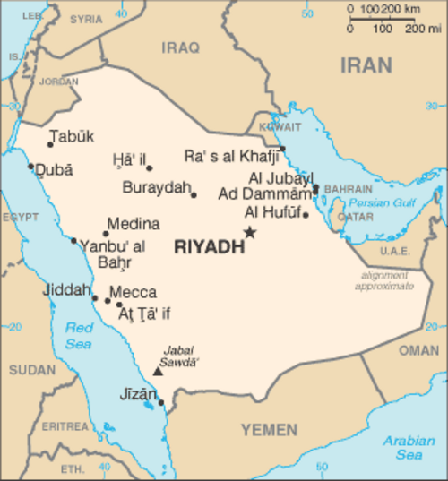 | 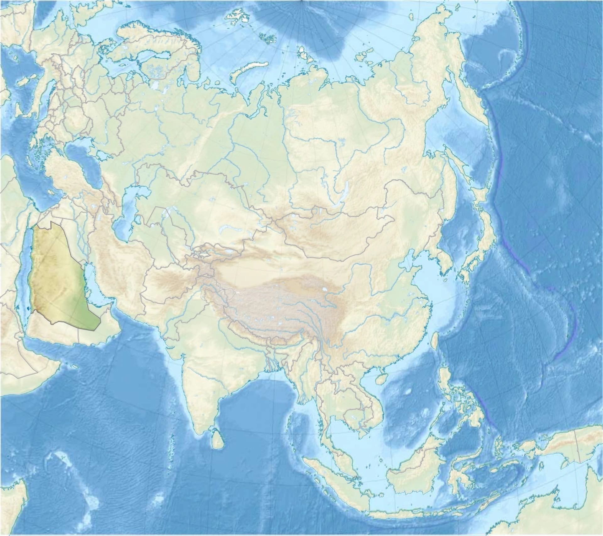 |

**认识国家／地区**：沙特阿拉伯占据阿拉伯半岛大部分国土，西临红海、东临波斯湾，内陆沙漠广泛。伊斯兰圣地、石油资源与绿洲聚落构成重要国家印象。

**认识首都／城市**：利雅得位于半岛中部内陆的内志地区，名称与花园、绿洲背景有关。它是王室与政府中心；麦加、麦地那是宗教圣城，吉达是红海港城，均不能作为国家首都答案。

> **记忆钩子**：沙特内陆绿洲，首都利雅得。

**容易混淆**：麦加、麦地那是圣城，不是政治首都。

**原亚洲手册的记忆故事**

- Riyadh 来自阿拉伯语中与“花园、绿地”有关的词根。
- 这听起来和沙漠国家反差很大，因此很好记。
- 利雅得位于阿拉伯半岛内陆。

资料：[UNData 国家概况（统计快照）](https://data.un.org/legacy/en/iso/sa.html) · [国家／地区背景](https://en.wikipedia.org/wiki/Saudi_Arabia) · [首都／城市背景](https://en.wikipedia.org/wiki/Riyadh)

地图：[File:Saudi Arabia-CIA WFB Map.png；CIA；Public domain](https://commons.wikimedia.org/wiki/File:Saudi_Arabia-CIA_WFB_Map.png) · [File:Saudi Arabia in Asia (relief) (-mini map).svg；TUBS；CC BY-SA 3.0](https://commons.wikimedia.org/wiki/File:Saudi_Arabia_in_Asia_(relief)_(-mini_map).svg)

---

## 也门 — 萨那

Yemen · Sana'a · 西亚

| 国家／地区地图 | 亚洲位置图 |
|:---:|:---:|
| 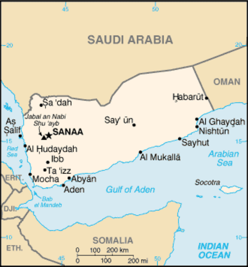 | 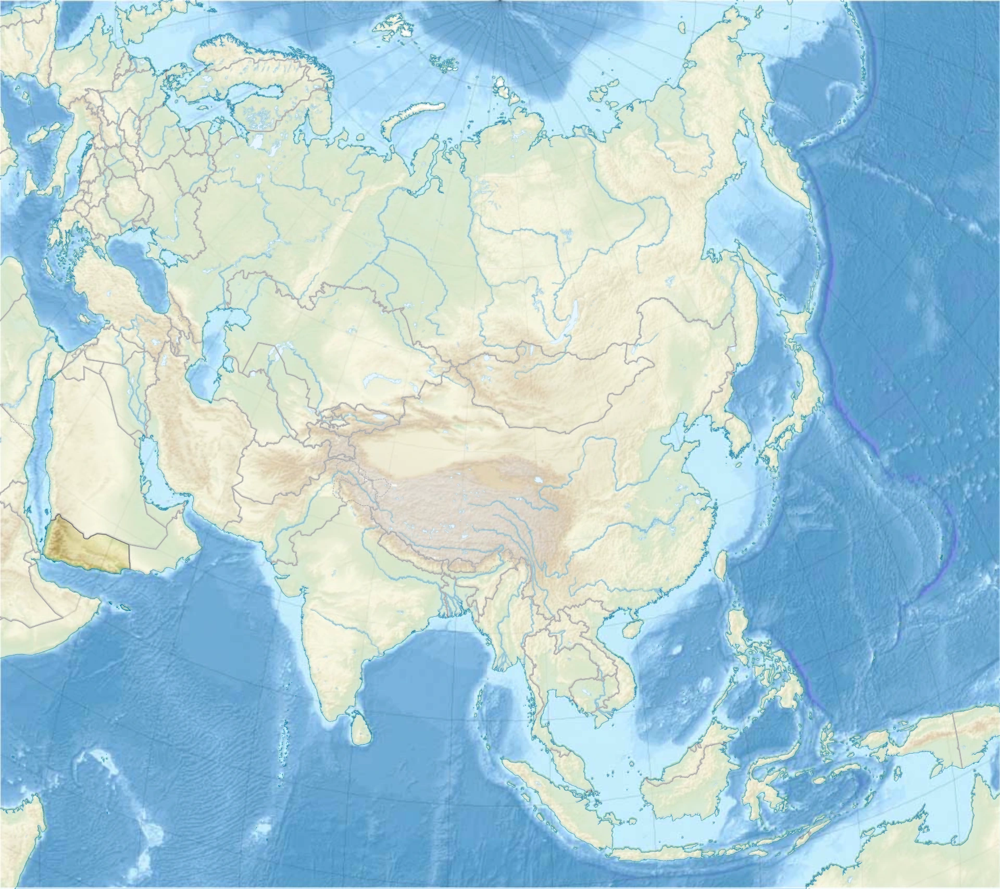 |

**认识国家／地区**：也门位于阿拉伯半岛西南端，面向红海与亚丁湾，内陆高地与沿海低地差异明显。传统梯田和古城体现高地文化；持续冲突使政府活动地点与法定首都需区分。

**认识首都／城市**：萨那位于内陆高地，传统塔楼住宅和老城街巷辨识度很高，是通常列示的国家首都。亚丁是南部港口并承担部分政府活动；本版同时提示冲突背景，避免把临时驻地当成无争议迁都。

> **记忆钩子**：也门高地古城萨那，南部港口亚丁。

**容易混淆**：萨那为首都常用列示；亚丁的政府角色另说明。

**原亚洲手册的记忆故事**

- 萨那老城拥有极具辨识度的多层塔楼式传统民居。
- 老城被列入联合国教科文组织世界遗产名录。
- 由于也门长期冲突，政府实际驻地与行政运作较复杂；背诵国家首都时仍通常答 萨那。

资料：[UNData 国家概况（统计快照）](https://data.un.org/legacy/en/iso/ye.html) · [国家／地区背景](https://en.wikipedia.org/wiki/Yemen) · [首都／城市背景](https://en.wikipedia.org/wiki/Sanaa)

地图：[File:Yemen-CIA WFB Map.png；CIA；Public domain](https://commons.wikimedia.org/wiki/File:Yemen-CIA_WFB_Map.png) · [File:Yemen in Asia (relief) (-mini map).svg；TUBS；CC BY-SA 3.0](https://commons.wikimedia.org/wiki/File:Yemen_in_Asia_(relief)_(-mini_map).svg)

---

## 阿曼 — 马斯喀特

Oman · Muscat · 西亚

| 国家／地区地图 | 亚洲位置图 |
|:---:|:---:|
| 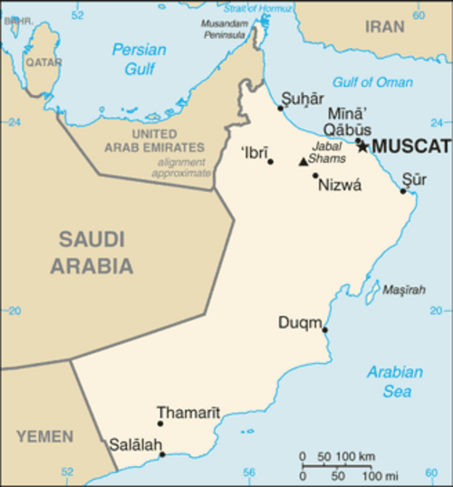 |  |

**认识国家／地区**：阿曼位于阿拉伯半岛东南端，面向阿曼湾和阿拉伯海，另有穆桑达姆等分离地区。沿海贸易传统、山地与内陆沙漠共同构成国家地理。

**认识首都／城市**：马斯喀特位于东北部海岸，山地与港湾紧邻，是王室与政府中心。历史上通过海运连接印度洋各地；把“阿曼东北海岸的山间港城”作为形象，能与阿联酋内陆或海岸城市分开。

> **记忆钩子**：阿曼湾边山间港城，马斯喀特。

**容易混淆**：穆桑达姆是分离地区，首都在主体国土东北岸。

**原亚洲手册的记忆故事**

- 马斯喀特是印度洋—波斯湾航路上的重要港口。
- 葡萄牙势力曾在 16—17 世纪控制这里的重要港口和堡垒。
- 今天仍可看到沿海山地、港湾与堡垒组合的独特城市景观。

资料：[UNData 国家概况（统计快照）](https://data.un.org/legacy/en/iso/om.html) · [国家／地区背景](https://en.wikipedia.org/wiki/Oman) · [首都／城市背景](https://en.wikipedia.org/wiki/Muscat)

地图：[File:Oman-CIA WFB Map.png；见原图来源页；Public domain](https://commons.wikimedia.org/wiki/File:Oman-CIA_WFB_Map.png) · [File:Oman in Asia (relief) (-mini map).svg；TUBS；CC BY-SA 3.0](https://commons.wikimedia.org/wiki/File:Oman_in_Asia_(relief)_(-mini_map).svg)

---

## 阿联酋 — 阿布扎比

United Arab Emirates · Abu Dhabi · 西亚

| 国家／地区地图 | 亚洲位置图 |
|:---:|:---:|
| 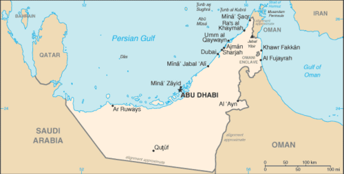 |  |

**认识国家／地区**：阿联酋位于阿拉伯半岛东部，由七个酋长国组成，大部分海岸面向波斯湾。沙漠、海港与现代城市并存，联邦国家的首都与各酋长国中心应分别理解。

**认识首都／城市**：阿布扎比位于西侧沿海岛屿及周边区域，是联邦首都，也是同名酋长国中心。迪拜是更常见于旅游和商业报道的城市；将“联邦政府阿布扎比、商业联想迪拜”成对记最有效。

> **记忆钩子**：阿联酋联邦首都阿布扎比，迪拜是另一城。

**容易混淆**：迪拜不是国家首都；七个酋长国共同组成联邦。

**原亚洲手册的记忆故事**

- 阿布扎比既是阿联酋首都，也是阿布扎比酋长国首府。
- Dubai 更有国际知名度，但国家政治首都是 Abu Dhabi。

资料：[UNData 国家概况（统计快照）](https://data.un.org/legacy/en/iso/ae.html) · [国家／地区背景](https://en.wikipedia.org/wiki/United_Arab_Emirates) · [首都／城市背景](https://en.wikipedia.org/wiki/Abu_Dhabi)

地图：[File:United Arab Emirates-CIA WFB Map.png；CIA；Public domain](https://commons.wikimedia.org/wiki/File:United_Arab_Emirates-CIA_WFB_Map.png) · [File:United Arab Emirates in Asia (relief) (-mini map).svg；TUBS；CC BY-SA 3.0](https://commons.wikimedia.org/wiki/File:United_Arab_Emirates_in_Asia_(relief)_(-mini_map).svg)

---

## 卡塔尔 — 多哈

Qatar · Doha · 西亚

| 国家／地区地图 | 亚洲位置图 |
|:---:|:---:|
| 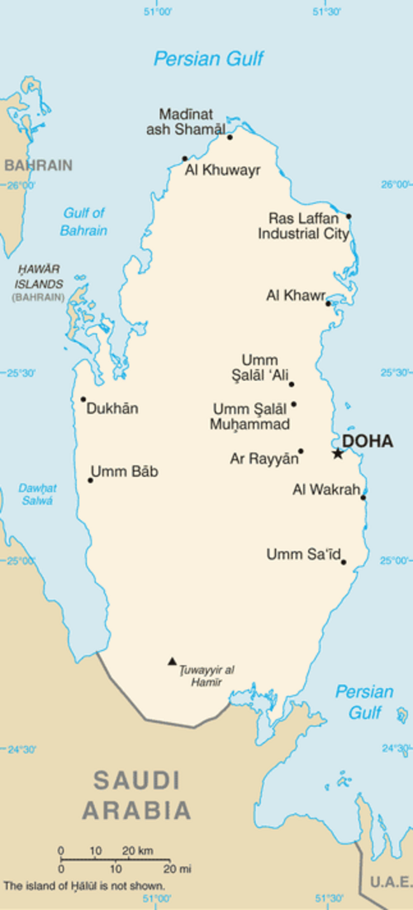 |  |

**认识国家／地区**：卡塔尔位于伸入波斯湾的小半岛上，陆地与沙特阿拉伯相接。国土干旱，城市集中在沿海，天然气资源与国际航运联系影响经济布局。

**认识首都／城市**：多哈位于半岛东岸海湾，是行政与商业中心。海滨道路、港湾与现代城区形成城市图像；名字短，可用“卡塔尔小半岛、东边一个多哈湾城”固定国家与首都配对。

> **记忆钩子**：卡塔尔小半岛，东岸多哈。

**容易混淆**：不要把卡塔尔和同为海湾国家的巴林混淆。

**原亚洲手册的记忆故事**

- 多哈位于波斯湾沿岸。
- 在石油天然气繁荣之前，当地经济与珍珠采集、海上贸易关系密切。
- 2022 年世界杯大量比赛场馆位于多哈都会区。

资料：[UNData 国家概况（统计快照）](https://data.un.org/legacy/en/iso/qa.html) · [国家／地区背景](https://en.wikipedia.org/wiki/Qatar) · [首都／城市背景](https://en.wikipedia.org/wiki/Doha)

地图：[File:Qatar-CIA WFB Map.png；见原图来源页；Public domain](https://commons.wikimedia.org/wiki/File:Qatar-CIA_WFB_Map.png) · [File:Qatar in Asia (relief) (-mini map).svg；TUBS；CC BY-SA 3.0](https://commons.wikimedia.org/wiki/File:Qatar_in_Asia_(relief)_(-mini_map).svg)

---

## 巴林 — 麦纳麦

Bahrain · Manama · 西亚

| 国家／地区地图 | 亚洲位置图 |
|:---:|:---:|
| 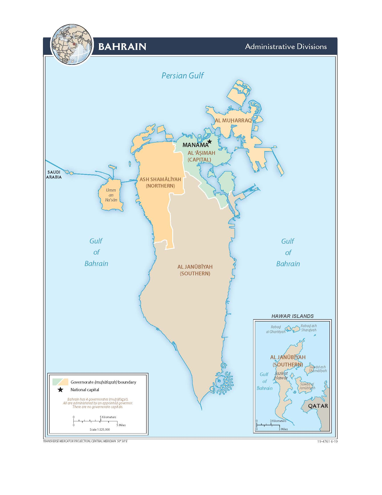 |  |

**认识国家／地区**：巴林是波斯湾中的群岛国家，位于沙特阿拉伯东侧，通过跨海通道与其联系。主岛及周边岛屿构成国土，珍珠贸易、石油与金融背景都有历史作用。

**认识首都／城市**：麦纳麦位于主岛北端附近，是行政和商业中心。港口历史、传统市场与现代高层建筑并存；岛国首都集中在北部城市带，能与卡塔尔东岸的多哈形成地图对照。

> **记忆钩子**：巴林主岛北部，首都麦纳麦。

**容易混淆**：巴林是群岛，卡塔尔是半岛；两者首都不同。

**原亚洲手册的记忆故事**

- 巴林是波斯湾岛国。
- 麦纳麦位于巴林主岛东北部，是国家金融与商业中心。
- 名字很特别，适合直接成对背。

资料：[UNData 国家概况（统计快照）](https://data.un.org/legacy/en/iso/bh.html) · [国家／地区背景](https://en.wikipedia.org/wiki/Bahrain) · [首都／城市背景](https://en.wikipedia.org/wiki/Manama)

地图：[Bahrain Administrative (2020)；United States Central Intelligence Agency；Public domain](https://www.cia.gov/resources/map/bahrain/) · [File:Bahrain in Asia (relief) (-mini map).svg；TUBS；CC BY-SA 3.0](https://commons.wikimedia.org/wiki/File:Bahrain_in_Asia_(relief)_(-mini_map).svg)

---

## 科威特 — 科威特城

Kuwait · Kuwait City · 西亚

| 国家／地区地图 | 亚洲位置图 |
|:---:|:---:|
| 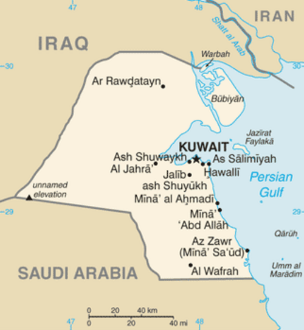 |  |

**认识国家／地区**：科威特位于波斯湾西北端，北邻伊拉克、南邻沙特阿拉伯。国土较小且干旱，沿海城市与石油资源关系密切；位置可用“海湾最北端附近”快速记忆。

**认识首都／城市**：科威特城位于科威特湾南岸，是政府与主要城市中心。城市名直接来自国家名，海港历史与现代行政建筑相连；记忆时国家加“城”，再把它定位在海湾沿岸即可。

> **记忆钩子**：科威特加“城”，科威特城。

**容易混淆**：国家与城市同名体系，首都写科威特城更清楚。

**原亚洲手册的记忆故事**

- 城市位于科威特湾南岸。
- “国家名 + City”就是首都名。

资料：[UNData 国家概况（统计快照）](https://data.un.org/legacy/en/iso/kw.html) · [国家／地区背景](https://en.wikipedia.org/wiki/Kuwait) · [首都／城市背景](https://en.wikipedia.org/wiki/Kuwait_City)

地图：[File:Kuwait-CIA WFB Map.png；见原图来源页；Public domain](https://commons.wikimedia.org/wiki/File:Kuwait-CIA_WFB_Map.png) · [File:Kuwait in Asia (relief) (-mini map).svg；TUBS；CC BY-SA 3.0](https://commons.wikimedia.org/wiki/File:Kuwait_in_Asia_(relief)_(-mini_map).svg)

---

## 土耳其 — 安卡拉

Turkey · Ankara · 西亚

| 国家／地区地图 | 亚洲位置图 |
|:---:|:---:|
| 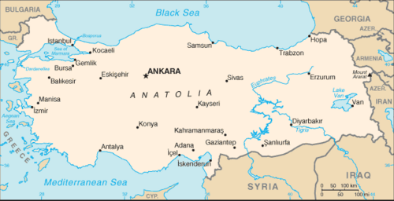 | 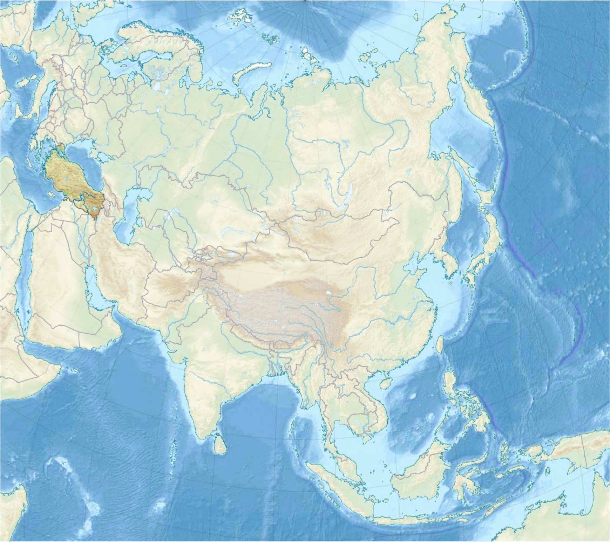 |

**认识国家／地区**：土耳其横跨欧洲与亚洲，主体位于安纳托利亚半岛，小部分在欧洲东南。黑海、爱琴海及地中海围绕国土，海峡连接区域；本版按UN M49归西亚。

**认识首都／城市**：安卡拉位于安纳托利亚内陆，1923年成为共和国首都。它承担政府和行政功能，伊斯坦布尔则是跨海峡的历史与商业都市；“共和国向内陆定都”是理解两城差别的核心。

> **记忆钩子**：土耳其内陆共和国首都，安卡拉。

**容易混淆**：伊斯坦布尔是历史都城和大都市，不是现首都。

**原亚洲手册的记忆故事**

- 奥斯曼帝国时代的政治中心长期是君士坦丁堡/伊斯坦布尔。
- 土耳其共和国成立后，1923 年将 安卡拉定为首都。
- 安卡拉位于安纳托利亚内陆，更接近土耳其地理中心。

资料：[UNData 国家概况（统计快照）](https://data.un.org/legacy/en/iso/tr.html) · [国家／地区背景](https://en.wikipedia.org/wiki/Turkey) · [首都／城市背景](https://en.wikipedia.org/wiki/Ankara)

地图：[File:Turkey-CIA WFB Map.png；unknown cartographer；Public domain](https://commons.wikimedia.org/wiki/File:Turkey-CIA_WFB_Map.png) · [File:Turkey in Asia (relief) (-mini map).svg；TUBS；CC BY-SA 3.0](https://commons.wikimedia.org/wiki/File:Turkey_in_Asia_(relief)_(-mini_map).svg)

---

## 塞浦路斯 — 尼科西亚

Cyprus · Nicosia · 西亚

| 国家／地区地图 | 亚洲位置图 |
|:---:|:---:|
| 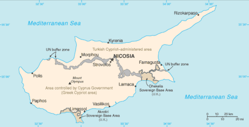 |  |

**认识国家／地区**：塞浦路斯位于地中海东部，南望埃及、北望土耳其方向。岛屿山地与平原交错，历史具有多重文化联系；国家与岛内分治背景需要分开说明，本版按UN M49归西亚。

**认识首都／城市**：尼科西亚位于岛中部内陆，是塞浦路斯共和国首都，城市仍有分隔背景。它不同于沿海的利马索尔、拉纳卡等港口城市；“地中海岛国、内陆首都”是很好的反直觉记忆。

> **记忆钩子**：塞浦路斯海岛中央，内陆尼科西亚。

**容易混淆**：城市分隔背景及岛内争议，不能用简单统一城区理解。

**原亚洲手册的记忆故事**

- 尼科西亚位于塞浦路斯岛中央，而不是海岸。
- 老城保存着威尼斯时代修筑的星形城墙。
- 城市的现代政治分隔也使它在欧洲—西亚地理讨论中经常出现。

资料：[UNData 国家概况（统计快照）](https://data.un.org/legacy/en/iso/cy.html) · [国家／地区背景](https://en.wikipedia.org/wiki/Cyprus) · [首都／城市背景](https://en.wikipedia.org/wiki/Nicosia)

地图：[File:Cyprus-CIA WFB Map.png；United States Central Intelligence Agency；Public domain](https://commons.wikimedia.org/wiki/File:Cyprus-CIA_WFB_Map.png) · [File:Cyprus in Asia (relief) (claimed) (-mini map).svg；TUBS；CC BY-SA 3.0](https://commons.wikimedia.org/wiki/File:Cyprus_in_Asia_(relief)_(claimed)_(-mini_map).svg)

---

# 欧洲

| 国家／地区 | English | 首都／城市 | English |
|---|---|---|---|
| 英国 | United Kingdom | 伦敦 | London |
| 爱尔兰 | Ireland | 都柏林 | Dublin |
| 冰岛 | Iceland | 雷克雅未克 | Reykjavík |
| 挪威 | Norway | 奥斯陆 | Oslo |
| 瑞典 | Sweden | 斯德哥尔摩 | Stockholm |
| 芬兰 | Finland | 赫尔辛基 | Helsinki |
| 丹麦 | Denmark | 哥本哈根 | Copenhagen |
| 爱沙尼亚 | Estonia | 塔林 | Tallinn |
| 拉脱维亚 | Latvia | 里加 | Riga |
| 立陶宛 | Lithuania | 维尔纽斯 | Vilnius |
| 法国 | France | 巴黎 | Paris |
| 德国 | Germany | 柏林 | Berlin |
| 荷兰 | Netherlands | 阿姆斯特丹 | Amsterdam |
| 比利时 | Belgium | 布鲁塞尔 | Brussels |
| 卢森堡 | Luxembourg | 卢森堡市 | Luxembourg City |
| 瑞士 | Switzerland | 伯尔尼 | Bern |
| 奥地利 | Austria | 维也纳 | Vienna |
| 列支敦士登 | Liechtenstein | 瓦杜兹 | Vaduz |
| 摩纳哥 | Monaco | 摩纳哥 | Monaco |
| 西班牙 | Spain | 马德里 | Madrid |
| 葡萄牙 | Portugal | 里斯本 | Lisbon |
| 安道尔 | Andorra | 安道尔城 | Andorra la Vella |
| 意大利 | Italy | 罗马 | Rome |
| 梵蒂冈（圣座） | Vatican City | 梵蒂冈城 | Vatican City |
| 圣马力诺 | San Marino | 圣马力诺市 | City of San Marino |
| 马耳他 | Malta | 瓦莱塔 | Valletta |
| 希腊 | Greece | 雅典 | Athens |
| 阿尔巴尼亚 | Albania | 地拉那 | Tirana |
| 北马其顿 | North Macedonia | 斯科普里 | Skopje |
| 塞尔维亚 | Serbia | 贝尔格莱德 | Belgrade |
| 黑山 | Montenegro | 波德戈里察 | Podgorica |
| 波斯尼亚和黑塞哥维那 | Bosnia and Herzegovina | 萨拉热窝 | Sarajevo |
| 克罗地亚 | Croatia | 萨格勒布 | Zagreb |
| 斯洛文尼亚 | Slovenia | 卢布尔雅那 | Ljubljana |
| 波兰 | Poland | 华沙 | Warsaw |
| 捷克 | Czech Republic | 布拉格 | Prague |
| 斯洛伐克 | Slovakia | 布拉迪斯拉发 | Bratislava |
| 匈牙利 | Hungary | 布达佩斯 | Budapest |
| 罗马尼亚 | Romania | 布加勒斯特 | Bucharest |
| 保加利亚 | Bulgaria | 索非亚 | Sofia |
| 摩尔多瓦 | Moldova | 基希讷乌 | Chișinău |
| 乌克兰 | Ukraine | 基辅 | Kyiv |
| 白俄罗斯 | Belarus | 明斯克 | Minsk |
| 俄罗斯 | Russia | 莫斯科 | Moscow |

## 英国 — 伦敦

United Kingdom · London · 北欧

| 国家／地区地图 | 欧洲位置图 |
|:---:|:---:|
| 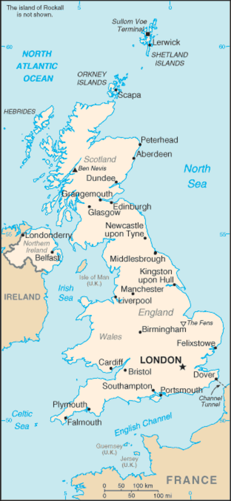 | 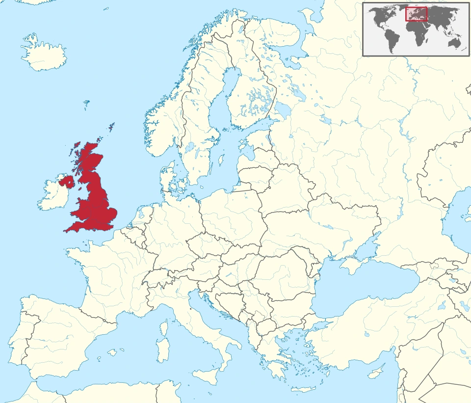 |

**认识国家／地区**：英国位于欧洲西北部，主体由大不列颠岛和爱尔兰岛东北部组成，英吉利海峡将其与法国隔开。英格兰、苏格兰、威尔士和北爱尔兰共同构成联合王国；伦敦同时是英国首都与英格兰的重要中心。

**认识首都／城市**：伦敦位于英格兰东南部，泰晤士河穿城而过。历史核心包括伦敦城与威斯敏斯特，前者与商业金融发展相关，后者集中议会和国家政治机构。把海峡、泰晤士河和议会大厦连在一起，比只背一个城市名更容易形成画面。

> **记忆钩子**：英国在海峡彼岸，泰晤士河畔找伦敦。

**容易混淆**：爱丁堡是苏格兰首府；英国国家首都仍是伦敦。

资料：[UNData 国家概况（统计快照）](https://data.un.org/legacy/en/iso/gb.html) · [国家／地区背景](https://en.wikipedia.org/wiki/United_Kingdom) · [首都／城市背景](https://en.wikipedia.org/wiki/London)

地图：[File:United Kingdom-CIA WFB Map.png；CIA；Public domain](https://commons.wikimedia.org/wiki/File:United_Kingdom-CIA_WFB_Map.png) · [File:United Kingdom in Europe.svg；TUBS；CC BY-SA 3.0](https://commons.wikimedia.org/wiki/File:United_Kingdom_in_Europe.svg)

---

## 爱尔兰 — 都柏林

Ireland · Dublin · 北欧

| 国家／地区地图 | 欧洲位置图 |
|:---:|:---:|
| 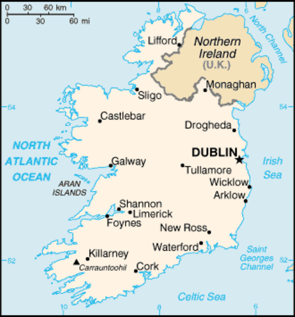 | 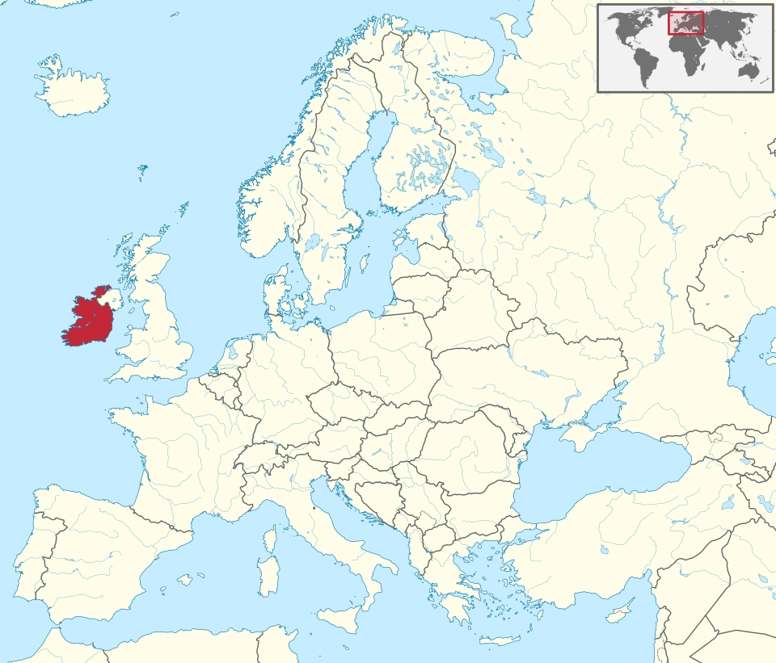 |

**认识国家／地区**：爱尔兰位于大西洋边缘的爱尔兰岛上，占岛屿大部分面积，东北部的北爱尔兰属于英国。它不是大不列颠岛的一部分。学习时先把两个岛分开，再理解爱尔兰海两岸的国家与城市关系。

**认识首都／城市**：都柏林位于爱尔兰岛东岸，面向爱尔兰海，利菲河穿过市中心。这里兼有港口、行政与文化功能，乔治时期建筑和文学传统构成鲜明城市印象。国家占据爱尔兰岛大部分，首都却在面向英国的东岸。

> **记忆钩子**：爱尔兰岛东岸，利菲河边是都柏林。

**容易混淆**：北爱尔兰的首府贝尔法斯特不属于爱尔兰共和国。

资料：[UNData 国家概况（统计快照）](https://data.un.org/legacy/en/iso/ie.html) · [国家／地区背景](https://en.wikipedia.org/wiki/Ireland) · [首都／城市背景](https://en.wikipedia.org/wiki/Dublin)

地图：[File:Ireland-CIA WFB Map.png；CIA；Public domain](https://commons.wikimedia.org/wiki/File:Ireland-CIA_WFB_Map.png) · [File:Ireland in Europe.svg；TUBS；CC BY-SA 3.0](https://commons.wikimedia.org/wiki/File:Ireland_in_Europe.svg)

---

## 冰岛 — 雷克雅未克

Iceland · Reykjavík · 北欧

| 国家／地区地图 | 欧洲位置图 |
|:---:|:---:|
| 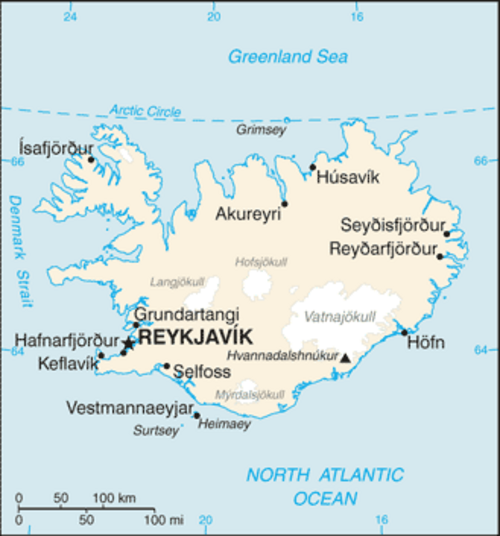 | 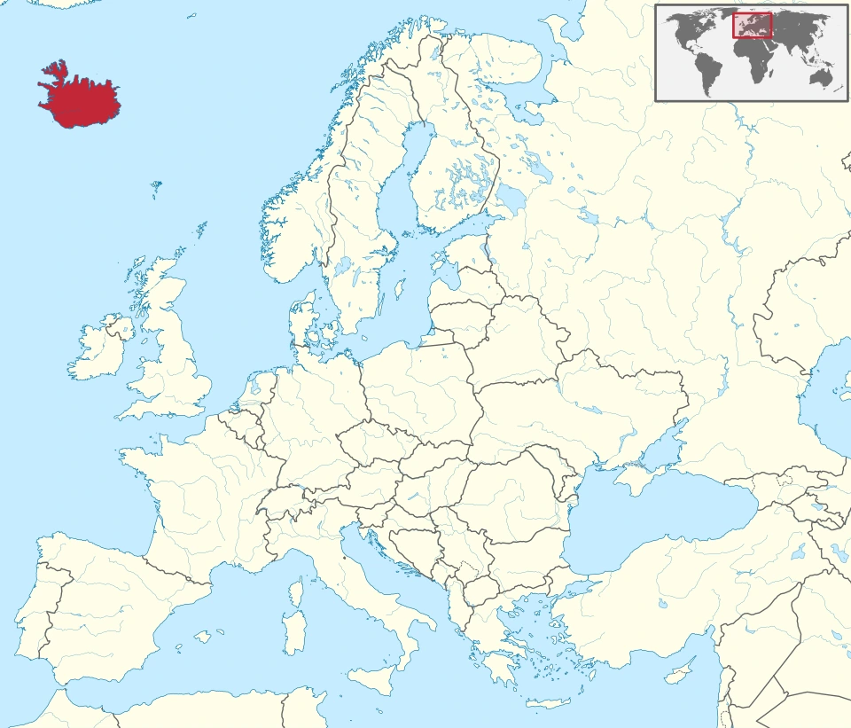 |

**认识国家／地区**：冰岛位于北大西洋，靠近北极圈，是火山、冰川与地热活动共同塑造的岛国。它处在北美板块与欧亚板块交界附近，地理景观非常适合用“冰与火”记忆，而不是把它误放在斯堪的纳维亚半岛上。

**认识首都／城市**：雷克雅未克位于冰岛西南部海岸，国家主要人口与行政机构集中在附近。城市名称通常译作“烟湾”，与早期移民观察到的地热蒸汽有关。先记住西南海湾，再把很长的中文名称拆成雷克／雅未克。

> **记忆钩子**：冰与火的岛，西南“烟湾”雷克雅未克。

**容易混淆**：冰岛属于欧洲学习组，不要与北美的格陵兰混为一谈。

资料：[UNData 国家概况（统计快照）](https://data.un.org/legacy/en/iso/is.html) · [国家／地区背景](https://en.wikipedia.org/wiki/Iceland) · [首都／城市背景](https://en.wikipedia.org/wiki/Reykjav%C3%ADk)

地图：[File:Iceland-CIA WFB Map.png；unknown cartographer；Public domain](https://commons.wikimedia.org/wiki/File:Iceland-CIA_WFB_Map.png) · [File:Iceland in Europe.svg；TUBS；CC BY-SA 3.0](https://commons.wikimedia.org/wiki/File:Iceland_in_Europe.svg)

---

## 挪威 — 奥斯陆

Norway · Oslo · 北欧

| 国家／地区地图 | 欧洲位置图 |
|:---:|:---:|
| 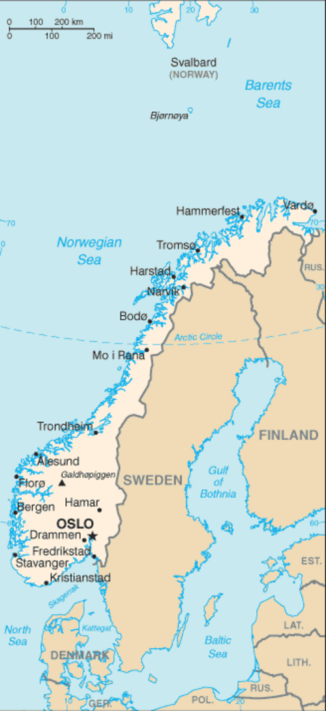 | 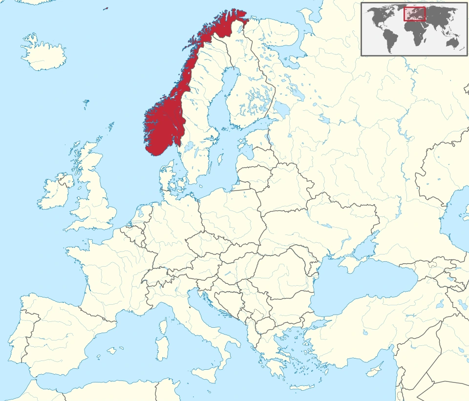 |

**认识国家／地区**：挪威占据斯堪的纳维亚半岛西侧，拥有面向北大西洋的漫长海岸和众多峡湾。内陆山地使城市与交通多沿海岸和谷地发展。它与瑞典相邻，但海岸形态和国家首都位置各有明显特点。

**认识首都／城市**：奥斯陆位于挪威东南端、奥斯陆峡湾北端，靠近瑞典方向，并不在最著名的西部峡湾深处。城市历史上曾使用克里斯蒂安尼亚等名称，1925 年恢复奥斯陆。记住首都偏东南，可避免只凭峡湾旅游印象定位。

> **记忆钩子**：挪威看西岸峡湾，首都找东南奥斯陆。

**容易混淆**：卑尔根是重要西岸城市，国家首都是奥斯陆。

资料：[UNData 国家概况（统计快照）](https://data.un.org/legacy/en/iso/no.html) · [国家／地区背景](https://en.wikipedia.org/wiki/Norway) · [首都／城市背景](https://en.wikipedia.org/wiki/Oslo)

地图：[File:Norway-CIA WFB Map.png；unknown cartographer；Public domain](https://commons.wikimedia.org/wiki/File:Norway-CIA_WFB_Map.png) · [File:Norway in Europe.svg；TUBS；CC BY-SA 3.0](https://commons.wikimedia.org/wiki/File:Norway_in_Europe.svg)

---

## 瑞典 — 斯德哥尔摩

Sweden · Stockholm · 北欧

| 国家／地区地图 | 欧洲位置图 |
|:---:|:---:|
| 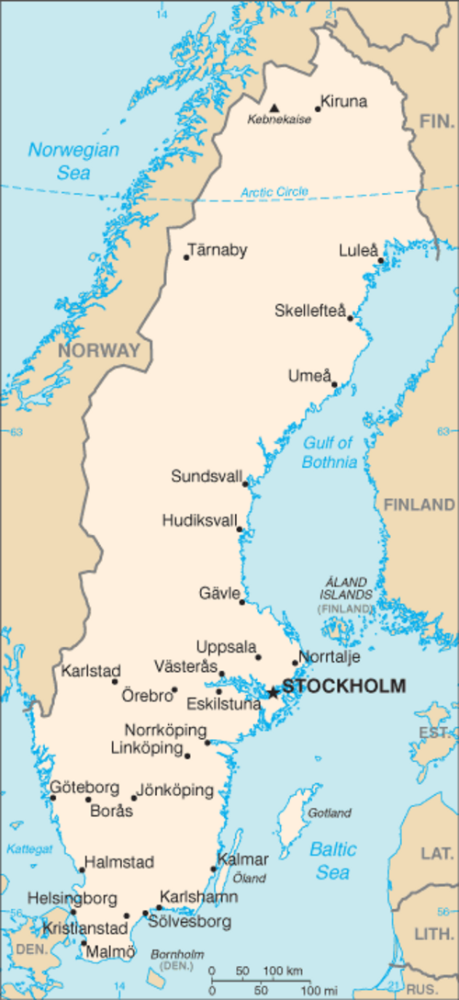 | 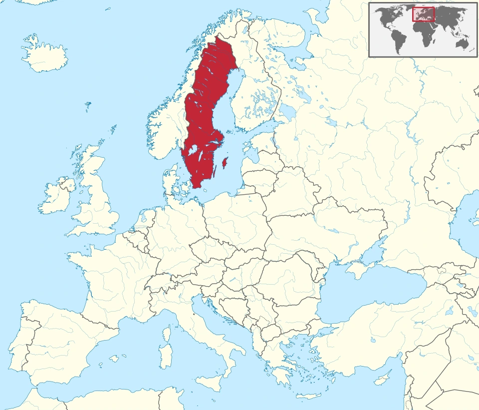 |

**认识国家／地区**：瑞典位于斯堪的纳维亚半岛东侧，西邻挪威，东临波罗的海与波的尼亚湾。森林、湖泊和从南到北拉长的国土轮廓构成主要地理印象。与挪威一起学时，先分清半岛东西两侧。

**认识首都／城市**：斯德哥尔摩位于瑞典东部，由多个岛屿及相邻陆地组成，靠近梅拉伦湖通向波罗的海的水道。老城、王宫和议会使这里兼具历史与政治中心功能。用“东岸、岛城、波罗的海”三个线索记忆最直观。

> **记忆钩子**：瑞典半岛东侧，岛城斯德哥尔摩。

**容易混淆**：斯德哥尔摩与挪威的奥斯陆要成对区分。

资料：[UNData 国家概况（统计快照）](https://data.un.org/legacy/en/iso/se.html) · [国家／地区背景](https://en.wikipedia.org/wiki/Sweden) · [首都／城市背景](https://en.wikipedia.org/wiki/Stockholm)

地图：[File:Sweden-CIA WFB Map.png；CIA；Public domain](https://commons.wikimedia.org/wiki/File:Sweden-CIA_WFB_Map.png) · [File:Sweden in Europe.svg；TUBS；CC BY-SA 3.0](https://commons.wikimedia.org/wiki/File:Sweden_in_Europe.svg)

---

## 芬兰 — 赫尔辛基

Finland · Helsinki · 北欧

| 国家／地区地图 | 欧洲位置图 |
|:---:|:---:|
| 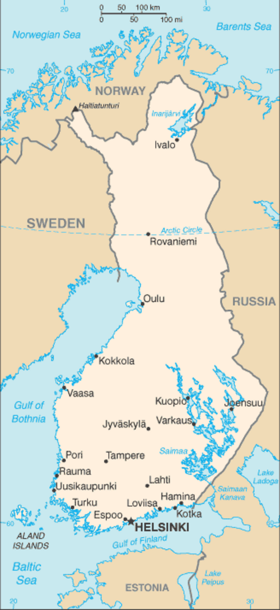 | 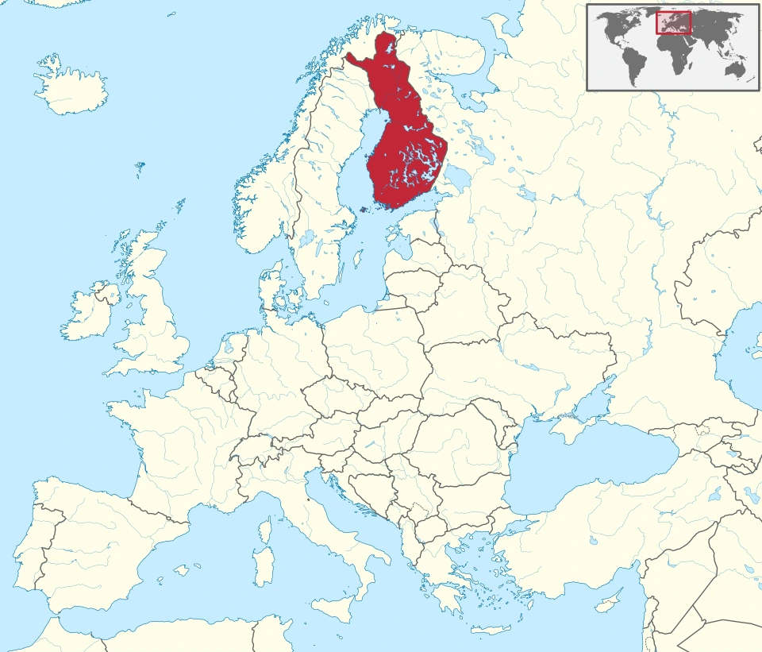 |

**认识国家／地区**：芬兰位于北欧，西邻瑞典、东邻俄罗斯，南临芬兰湾。湖泊与森林遍布国土，“千湖之国”是常见的地理记忆标签。芬兰与斯堪的纳维亚国家常一起讨论，但其地理主体在波的尼亚湾以东。

**认识首都／城市**：赫尔辛基在芬兰南岸，面向芬兰湾；海湾对岸附近是爱沙尼亚首都塔林。1812 年，行政中心由图尔库迁至赫尔辛基，随后形成新古典主义城市核心。把赫尔辛基与塔林隔海相望的位置一起背，很适合地图回忆。

> **记忆钩子**：芬兰南岸赫尔辛基，海湾对面是塔林。

**容易混淆**：图尔库是历史名城，现首都为赫尔辛基。

资料：[UNData 国家概况（统计快照）](https://data.un.org/legacy/en/iso/fi.html) · [国家／地区背景](https://en.wikipedia.org/wiki/Finland) · [首都／城市背景](https://en.wikipedia.org/wiki/Helsinki)

地图：[File:Finland-CIA WFB Map.png；unknown cartographer；Public domain](https://commons.wikimedia.org/wiki/File:Finland-CIA_WFB_Map.png) · [File:Finland in Europe.svg；TUBS；CC BY-SA 3.0](https://commons.wikimedia.org/wiki/File:Finland_in_Europe.svg)

---

## 丹麦 — 哥本哈根

Denmark · Copenhagen · 北欧

| 国家／地区地图 | 欧洲位置图 |
|:---:|:---:|
| 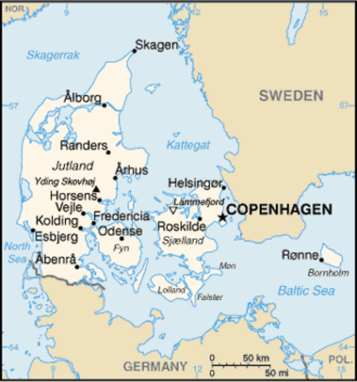 | 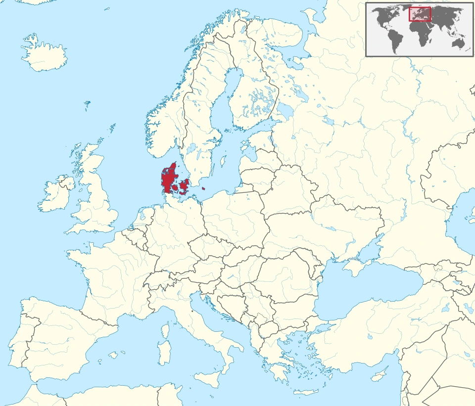 |

**认识国家／地区**：丹麦主体由日德兰半岛和多座岛屿组成，位于德国以北、挪威和瑞典以南。海峡与桥梁在国家空间结构中很重要。丹麦王国还包括格陵兰和法罗群岛，欧洲学习图通常突出的是丹麦本土。

**认识首都／城市**：哥本哈根主要位于西兰岛东侧，并延伸至阿迈厄岛，隔厄勒海峡与瑞典相望。城市从港口发展为王国政治中心，名字也与商业港口的含义有关。首都在东部岛上，而不是在日德兰半岛上，是最值得记住的定位点。

> **记忆钩子**：丹麦的东部岛港：哥本哈根。

**容易混淆**：格陵兰不是本手册单列的主表国家；它属于丹麦王国的组成部分。

资料：[UNData 国家概况（统计快照）](https://data.un.org/legacy/en/iso/dk.html) · [国家／地区背景](https://en.wikipedia.org/wiki/Denmark) · [首都／城市背景](https://en.wikipedia.org/wiki/Copenhagen)

地图：[File:Denmark-CIA WFB Map.png；CIA；Public domain](https://commons.wikimedia.org/wiki/File:Denmark-CIA_WFB_Map.png) · [File:Denmark in Europe.svg；TUBS；CC BY-SA 3.0](https://commons.wikimedia.org/wiki/File:Denmark_in_Europe.svg)

---

## 爱沙尼亚 — 塔林

Estonia · Tallinn · 北欧

| 国家／地区地图 | 欧洲位置图 |
|:---:|:---:|
| 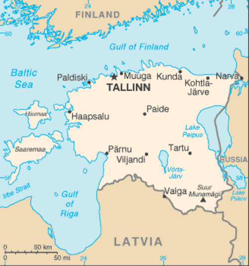 | 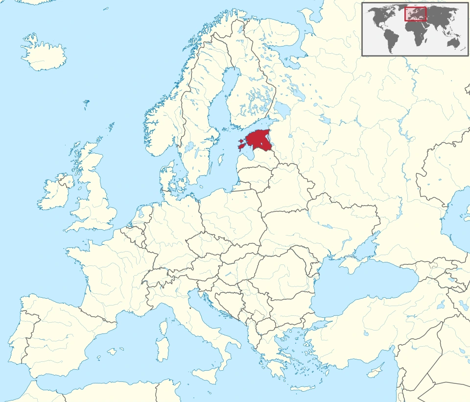 |

**认识国家／地区**：爱沙尼亚是波罗的海三国中最北的一国，南邻拉脱维亚，东邻俄罗斯，北临芬兰湾。国土包括大陆部分与西侧多座岛屿。学习时沿波罗的海东岸从北往南排列三国，能减少国名和首都的错配。

**认识首都／城市**：塔林位于爱沙尼亚北岸，面向芬兰湾，与芬兰的赫尔辛基隔海相望。保存较完整的中世纪老城与汉萨贸易历史密切相关。首都同时连接国家行政与海上交通，因此“北岸古城、隔海芬兰”是很稳定的记忆组合。

> **记忆钩子**：波罗的海最北国，北岸古城塔林。

**容易混淆**：北到南：爱沙尼亚—塔林，拉脱维亚—里加，立陶宛—维尔纽斯。

资料：[UNData 国家概况（统计快照）](https://data.un.org/legacy/en/iso/ee.html) · [国家／地区背景](https://en.wikipedia.org/wiki/Estonia) · [首都／城市背景](https://en.wikipedia.org/wiki/Tallinn)

地图：[File:Estonia-CIA WFB Map.png；见原图来源页；Public domain](https://commons.wikimedia.org/wiki/File:Estonia-CIA_WFB_Map.png) · [File:Estonia in Europe.svg；TUBS；CC BY-SA 3.0](https://commons.wikimedia.org/wiki/File:Estonia_in_Europe.svg)

---

## 拉脱维亚 — 里加

Latvia · Riga · 北欧

| 国家／地区地图 | 欧洲位置图 |
|:---:|:---:|
| 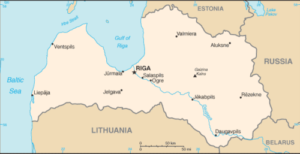 | 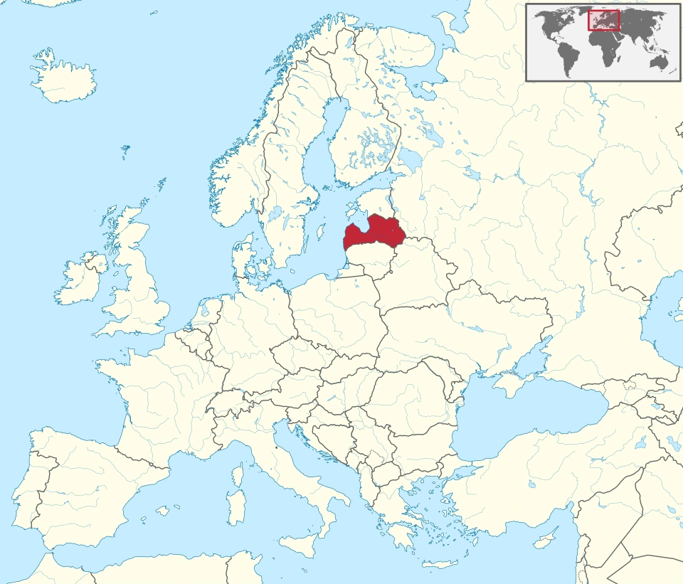 |

**认识国家／地区**：拉脱维亚位于爱沙尼亚与立陶宛之间，是波罗的海三国的中间一国。西临波罗的海，北部有里加湾，内陆平原、森林和河流共同构成地理底色。把国家位置理解成“三国中段”，比单独记名字更可靠。

**认识首都／城市**：里加位于道加瓦河下游、里加湾南端，是连接河运与海运的历史港口。它的老城和新艺术风格建筑都很有辨识度，也长期承担行政和文化中心功能。国家在三国中间，首都名字却最短：里加。

> **记忆钩子**：三国中间拉脱维亚，里加湾边记里加。

**容易混淆**：里加不是立陶宛的首都。

资料：[UNData 国家概况（统计快照）](https://data.un.org/legacy/en/iso/lv.html) · [国家／地区背景](https://en.wikipedia.org/wiki/Latvia) · [首都／城市背景](https://en.wikipedia.org/wiki/Riga)

地图：[File:Latvia-CIA WFB Map.png；见原图来源页；Public domain](https://commons.wikimedia.org/wiki/File:Latvia-CIA_WFB_Map.png) · [File:Latvia in Europe.svg；TUBS；CC BY-SA 3.0](https://commons.wikimedia.org/wiki/File:Latvia_in_Europe.svg)

---

## 立陶宛 — 维尔纽斯

Lithuania · Vilnius · 北欧

| 国家／地区地图 | 欧洲位置图 |
|:---:|:---:|
| 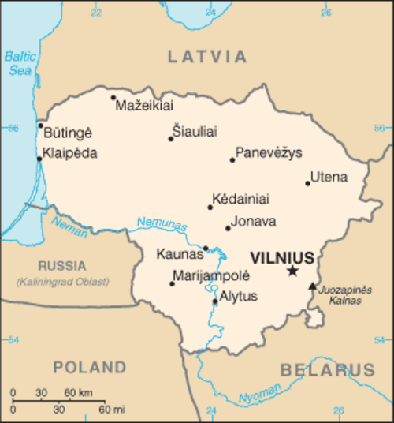 | 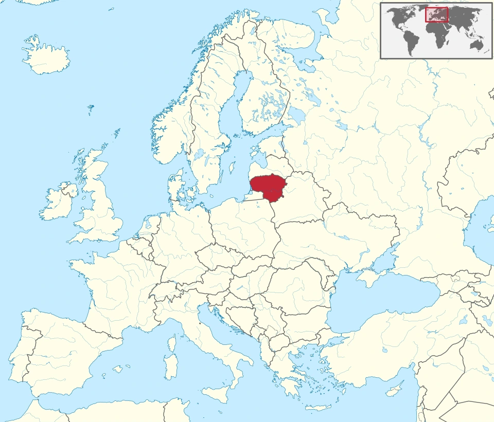 |

**认识国家／地区**：立陶宛是波罗的海三国中最南的一国，邻拉脱维亚、白俄罗斯、波兰和俄罗斯的加里宁格勒地区。它有波罗的海岸线，但国家政治中心位于内陆。历史上立陶宛大公国的影响范围远超过今日国土。

**认识首都／城市**：维尔纽斯位于立陶宛东南部，靠近白俄罗斯方向，是内陆首都。老城中的教堂与巴洛克建筑体现了城市长期作为区域政治、宗教和文化中心的历史。看地图时，不要因三国都临海就把三个首都都放在海岸。

> **记忆钩子**：波罗的海南端国，东南内陆维尔纽斯。

**容易混淆**：立陶宛首都在内陆，里加和塔林则更直接面向海湾。

资料：[UNData 国家概况（统计快照）](https://data.un.org/legacy/en/iso/lt.html) · [国家／地区背景](https://en.wikipedia.org/wiki/Lithuania) · [首都／城市背景](https://en.wikipedia.org/wiki/Vilnius)

地图：[File:Lithuania-CIA WFB Map.png；见原图来源页；Public domain](https://commons.wikimedia.org/wiki/File:Lithuania-CIA_WFB_Map.png) · [File:Lithuania in Europe.svg；TUBS；CC BY-SA 3.0](https://commons.wikimedia.org/wiki/File:Lithuania_in_Europe.svg)

---

## 法国 — 巴黎

France · Paris · 西欧

| 国家／地区地图 | 欧洲位置图 |
|:---:|:---:|
| 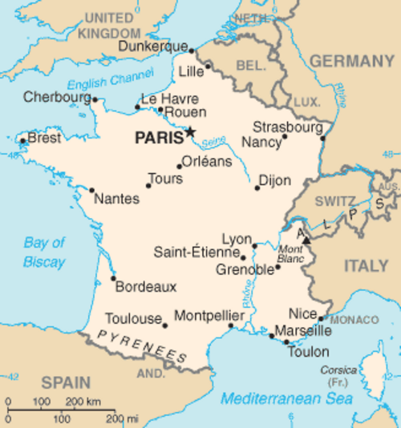 | 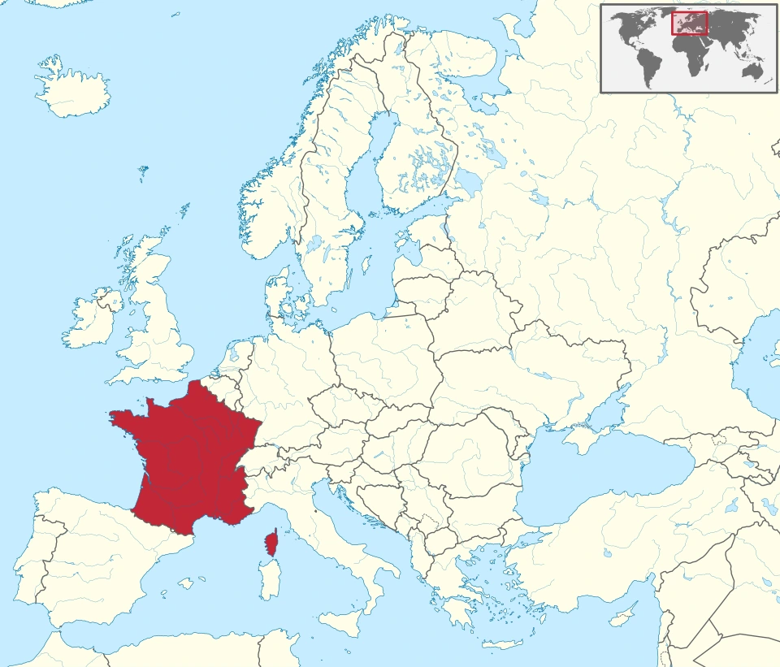 |

**认识国家／地区**：法国的欧洲本土位于西欧，西临大西洋，南临地中海，东侧连接阿尔卑斯山地区，常被形容为“六边形”。法国还有海外地区与领地，因此世界地图上的法国范围不只在欧洲；洲内学习图多突出本土。

**认识首都／城市**：巴黎位于法国本土中北部、塞纳河畔。它长期集中国家行政、文化和教育机构，卢浮宫、巴黎圣母院和埃菲尔铁塔提供了鲜明的视觉线索。背诵时可先定位塞纳河，再把城市地标与首都身份联系起来。

> **记忆钩子**：法国六边形，中北部塞纳河畔是巴黎。

**容易混淆**：里昂、马赛都是重要城市，首都始终答巴黎。

资料：[UNData 国家概况（统计快照）](https://data.un.org/legacy/en/iso/fr.html) · [国家／地区背景](https://en.wikipedia.org/wiki/France) · [首都／城市背景](https://en.wikipedia.org/wiki/Paris)

地图：[File:France-CIA WFB Map.png；CIA；Public domain](https://commons.wikimedia.org/wiki/File:France-CIA_WFB_Map.png) · [File:France in Europe.svg；TUBS；CC BY-SA 3.0](https://commons.wikimedia.org/wiki/File:France_in_Europe.svg)

---

## 德国 — 柏林

Germany · Berlin · 西欧

| 国家／地区地图 | 欧洲位置图 |
|:---:|:---:|
| 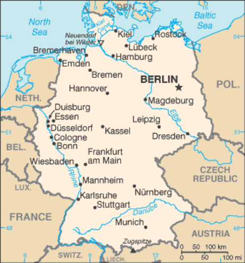 | 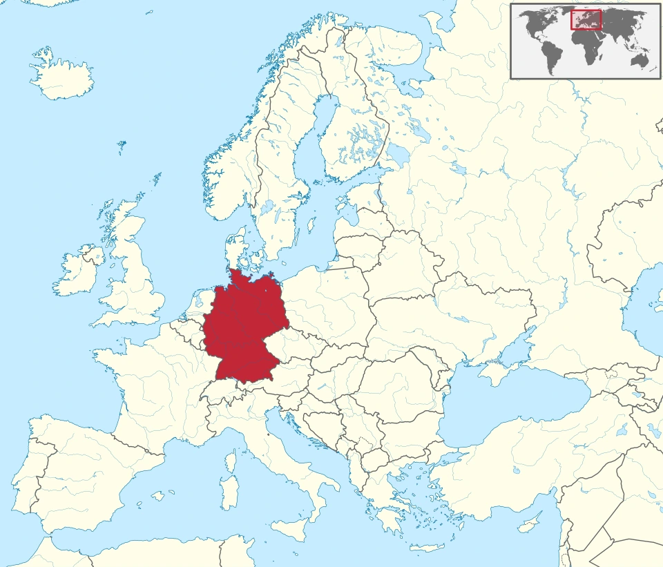 |

**认识国家／地区**：德国位于欧洲中部，北临北海与波罗的海，南接阿尔卑斯山北缘，邻国众多。联邦结构使许多州和城市各有行政、工业或金融功能，不能用某一行业最有名的城市代替国家首都。

**认识首都／城市**：柏林位于德国东北部，施普雷河流经城市。冷战时期城市分隔的历史和德国统一后的政治中心迁移密切相关；波恩仍保留部分联邦机构。学习柏林时，勃兰登堡门与柏林墙遗迹是很有效的历史画面。

> **记忆钩子**：德国东北柏林，统一历史连起首都。

**容易混淆**：法兰克福是金融中心；波恩曾是联邦德国首都，现国家首都是柏林。

资料：[UNData 国家概况（统计快照）](https://data.un.org/legacy/en/iso/de.html) · [国家／地区背景](https://en.wikipedia.org/wiki/Germany) · [首都／城市背景](https://en.wikipedia.org/wiki/Berlin)

地图：[File:Germany-CIA WFB Map.png；CIA；Public domain](https://commons.wikimedia.org/wiki/File:Germany-CIA_WFB_Map.png) · [File:Germany in Europe.svg；TUBS；CC BY-SA 3.0](https://commons.wikimedia.org/wiki/File:Germany_in_Europe.svg)

---

## 荷兰 — 阿姆斯特丹

Netherlands · Amsterdam · 西欧

| 国家／地区地图 | 欧洲位置图 |
|:---:|:---:|
| 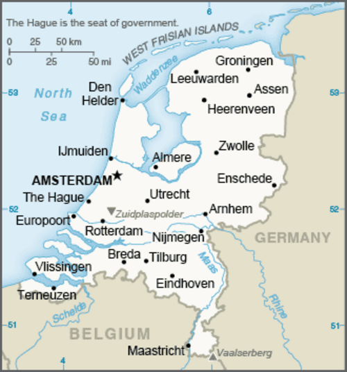 | 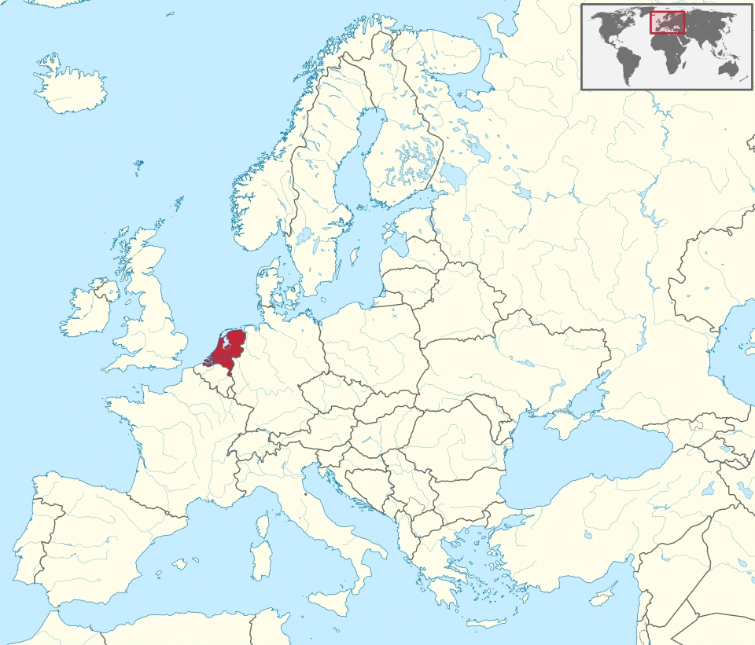 |

**认识国家／地区**：荷兰位于西欧北海沿岸，与德国、比利时接壤，莱茵河等河流在这里形成三角洲。低地、堤坝和围海造田是国家地理的重要线索。港口城市和政治机构分布在不同地点，是首都题中常见的分工型陷阱。

**认识首都／城市**：阿姆斯特丹位于荷兰西部，以运河网络和历史港口闻名，是国家首都。政府、议会和许多外交机构则位于海牙。这里应当把“首都阿姆斯特丹”和“政府所在地海牙”成对记忆，而不是任选一座城市作答。

> **记忆钩子**：荷兰首都看运河：阿姆斯特丹；政府在海牙。

**容易混淆**：阿姆斯特丹为首都，海牙为政府所在地，鹿特丹为重要港口。

资料：[UNData 国家概况（统计快照）](https://data.un.org/legacy/en/iso/nl.html) · [国家／地区背景](https://en.wikipedia.org/wiki/Netherlands) · [首都／城市背景](https://en.wikipedia.org/wiki/Amsterdam) · [荷兰政府：阿姆斯特丹与海牙](https://www.government.nl/binaries/government/documenten/publications/2017/04/21/culture-at-a-first-glance/CIB2015_ENG_publicatie_v8_DEF.pdf)

地图：[File:Netherlands-CIA WFB Map.png；CIA；Public domain](https://commons.wikimedia.org/wiki/File:Netherlands-CIA_WFB_Map.png) · [File:Netherlands in Europe.svg；TUBS；CC BY-SA 3.0](https://commons.wikimedia.org/wiki/File:Netherlands_in_Europe.svg)

---

## 比利时 — 布鲁塞尔

Belgium · Brussels · 西欧

| 国家／地区地图 | 欧洲位置图 |
|:---:|:---:|
| 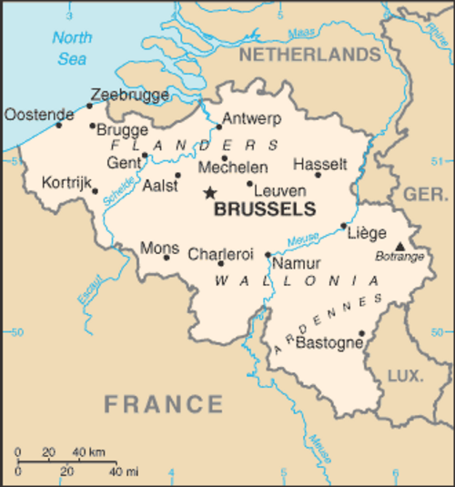 | 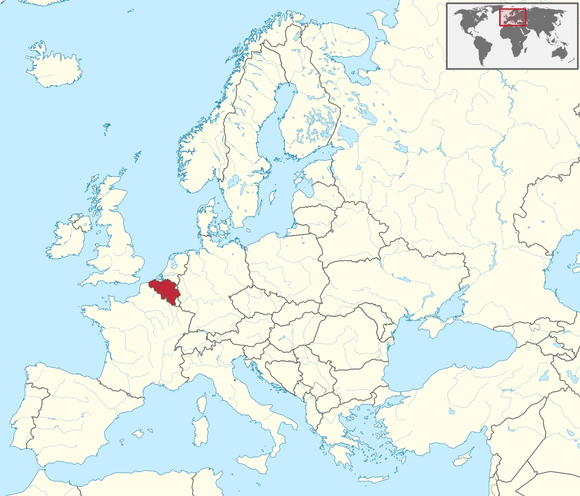 |

**认识国家／地区**：比利时位于西欧，处在法国、德国、荷兰和卢森堡之间，拥有北海岸线。国家内部有荷兰语、法语等不同语言社群，布鲁塞尔也有特殊的行政地位。先理解其欧洲交通交汇位置，便能理解首都的国际功能。

**认识首都／城市**：布鲁塞尔位于比利时中部，是国家政治中心，也是欧洲联盟多项主要机构和北约总部所在地。大广场和周边历史建筑体现了城市的商业发展传统。它可称为重要欧洲政治中心，但欧盟机构并不全在同一座城市。

> **记忆钩子**：比利时在西欧交汇处，布鲁塞尔连着国家与欧洲机构。

**容易混淆**：欧盟议会还有斯特拉斯堡等工作地点，不能简单写“所有欧盟机构都在布鲁塞尔”。

资料：[UNData 国家概况（统计快照）](https://data.un.org/legacy/en/iso/be.html) · [国家／地区背景](https://en.wikipedia.org/wiki/Belgium) · [首都／城市背景](https://en.wikipedia.org/wiki/Brussels)

地图：[File:Belgium-CIA WFB Map.png；United States Central Intelligence Agency；Public domain](https://commons.wikimedia.org/wiki/File:Belgium-CIA_WFB_Map.png) · [File:Belgium in Europe.svg；TUBS；CC BY-SA 3.0](https://commons.wikimedia.org/wiki/File:Belgium_in_Europe.svg)

---

## 卢森堡 — 卢森堡市

Luxembourg · Luxembourg City · 西欧

| 国家／地区地图 | 欧洲位置图 |
|:---:|:---:|
| 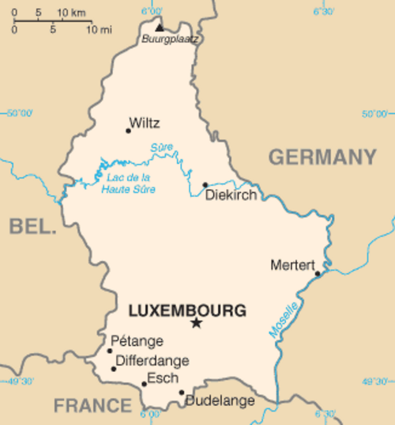 |  |

**认识国家／地区**：卢森堡是位于比利时、法国和德国之间的小型内陆国家。这里是国家名与首都名非常接近的一组，学习时应明确说“卢森堡市”，避免把整个国家和城市面积混在一起。国土虽小，欧洲事务与金融服务辨识度很高。

**认识首都／城市**：卢森堡市位于国家南部，历史城区与要塞遗迹分布在高地和河谷之间，阿尔泽特河、佩特吕斯河塑造了城市地形。城市既是国家行政中心，也承载部分欧洲机构。记住“峡谷上方的要塞城市”，比只背同名更有画面。

> **记忆钩子**：卢森堡国家，首都就是卢森堡市。

**容易混淆**：国家卢森堡与首都卢森堡市是两个层级。

资料：[UNData 国家概况（统计快照）](https://data.un.org/legacy/en/iso/lu.html) · [国家／地区背景](https://en.wikipedia.org/wiki/Luxembourg) · [首都／城市背景](https://en.wikipedia.org/wiki/Luxembourg_City)

地图：[File:Luxembourg-CIA WFB Map.png；CIA；Public domain](https://commons.wikimedia.org/wiki/File:Luxembourg-CIA_WFB_Map.png) · [File:Luxembourg in Europe.svg；TUBS；CC BY-SA 3.0](https://commons.wikimedia.org/wiki/File:Luxembourg_in_Europe.svg)

---

## 瑞士 — 伯尔尼

Switzerland · Bern · 西欧

| 国家／地区地图 | 欧洲位置图 |
|:---:|:---:|
| 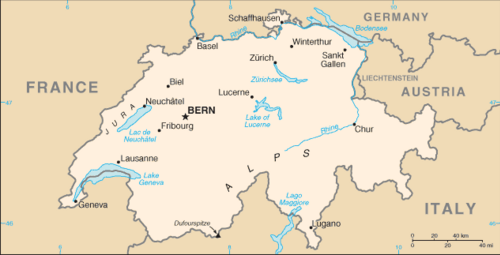 | 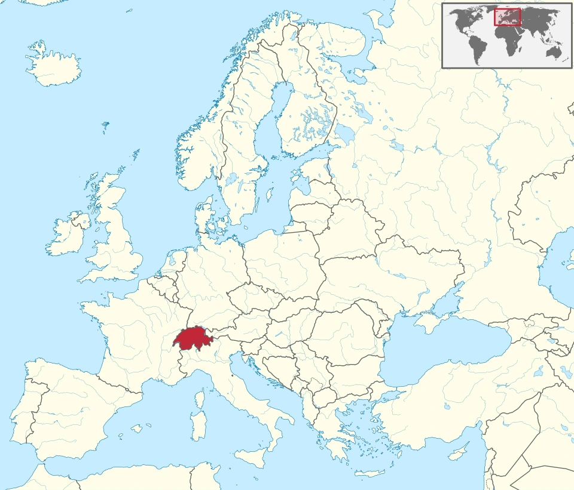 |

**认识国家／地区**：瑞士位于欧洲中部，是阿尔卑斯山地区的内陆国家，与法国、德国、意大利、奥地利和列支敦士登接壤。湖泊、山地和多种语言共同构成国家特色。日内瓦与苏黎世国际知名度很高，却都不是联邦政府所在地。

**认识首都／城市**：伯尔尼位于瑞士中西部，老城依阿勒河弯曲的河道发展。瑞士官方称其为“联邦城”，它是政府和议会所在地，实际发挥首都功能。严谨回答应记住这一用语差别，而不把伯尔尼说成有正式法定首都称号的城市。

> **记忆钩子**：瑞士联邦城在阿勒河边：伯尔尼。

**容易混淆**：伯尔尼为实际首都／联邦城；日内瓦和苏黎世不是国家首都。

资料：[UNData 国家概况（统计快照）](https://data.un.org/legacy/en/iso/ch.html) · [国家／地区背景](https://en.wikipedia.org/wiki/Switzerland) · [首都／城市背景](https://en.wikipedia.org/wiki/Bern) · [瑞士官方：联邦城与政治制度](https://www.aboutswitzerland.eda.admin.ch/en/political-system)

地图：[File:Switzerland-CIA WFB Map.png；CIA；Public domain](https://commons.wikimedia.org/wiki/File:Switzerland-CIA_WFB_Map.png) · [File:Switzerland in Europe.svg；TUBS；CC BY-SA 3.0](https://commons.wikimedia.org/wiki/File:Switzerland_in_Europe.svg)

---

## 奥地利 — 维也纳

Austria · Vienna · 西欧

| 国家／地区地图 | 欧洲位置图 |
|:---:|:---:|
| 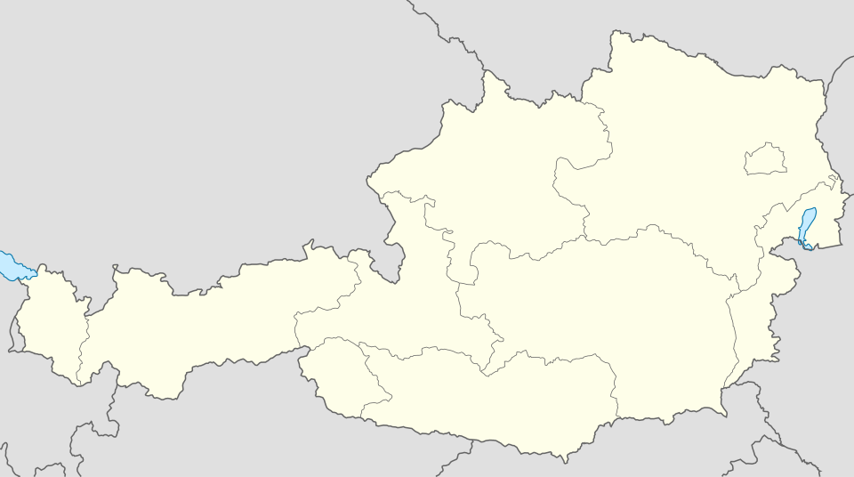 | 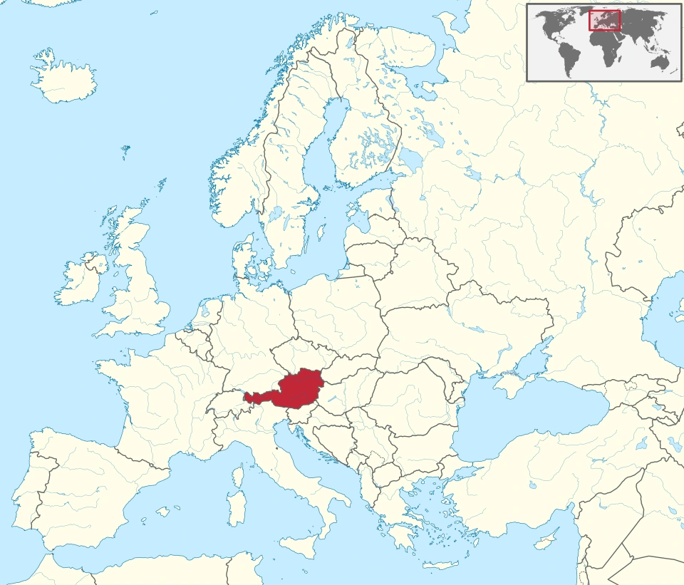 |

**认识国家／地区**：奥地利位于欧洲中部，是以阿尔卑斯山地为主要地理特征的内陆国家。国土西部狭长、东部相对开阔，多瑙河连接东部平原与中欧交通网络。与澳大利亚名称相近，是中文和英文题库里的常见混淆点。

**认识首都／城市**：维也纳位于奥地利东北部、多瑙河附近。它曾是哈布斯堡王朝的重要政治中心，宫殿、歌剧院和古典音乐传统留下鲜明城市印象。首都偏东北而非高山腹地，这一点与国家山地印象形成有用的对照。

> **记忆钩子**：奥地利听古典音乐，东北维也纳。

**容易混淆**：Austria 是奥地利，Australia 是澳大利亚；两国首都分别为维也纳与堪培拉。

资料：[UNData 国家概况（统计快照）](https://data.un.org/legacy/en/iso/at.html) · [国家／地区背景](https://en.wikipedia.org/wiki/Austria) · [首都／城市背景](https://en.wikipedia.org/wiki/Vienna)

地图：[File:Austria location map.svg；Lencer；CC BY-SA 3.0](https://commons.wikimedia.org/wiki/File:Austria_location_map.svg) · [File:Austria in Europe.svg；TUBS；CC BY-SA 3.0](https://commons.wikimedia.org/wiki/File:Austria_in_Europe.svg)

---

## 列支敦士登 — 瓦杜兹

Liechtenstein · Vaduz · 西欧

| 国家／地区地图 | 欧洲位置图 |
|:---:|:---:|
| 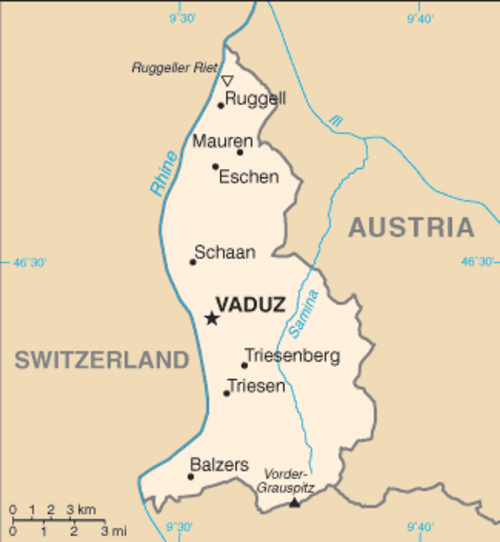 |  |

**认识国家／地区**：列支敦士登位于瑞士与奥地利之间，是阿尔卑斯山区的小型内陆国家。它与乌兹别克斯坦同为“双重内陆国”：相邻国家也都不直接临海。用莱茵河谷中的小国轮廓定位，比死背长国名更容易。

**认识首都／城市**：瓦杜兹位于国家西侧、莱茵河谷附近，是政府所在地。俯瞰城区的瓦杜兹城堡与王室联系紧密，城堡和河谷构成清晰的记忆画面。城市规模不大，首都身份并不意味着它必须拥有大都会体量。

> **记忆钩子**：瑞奥之间的小国，城堡下的瓦杜兹。

**容易混淆**：不要因为与瑞士联系紧密就把伯尔尼当作列支敦士登首都。

资料：[UNData 国家概况（统计快照）](https://data.un.org/legacy/en/iso/li.html) · [国家／地区背景](https://en.wikipedia.org/wiki/Liechtenstein) · [首都／城市背景](https://en.wikipedia.org/wiki/Vaduz)

地图：[File:Liechtenstein-CIA WFB Map.png；见原图来源页；Public domain](https://commons.wikimedia.org/wiki/File:Liechtenstein-CIA_WFB_Map.png) · [File:Liechtenstein in Europe.svg；TUBS；CC BY-SA 3.0](https://commons.wikimedia.org/wiki/File:Liechtenstein_in_Europe.svg)

---

## 摩纳哥 — 摩纳哥

Monaco · Monaco · 西欧

| 国家／地区地图 | 欧洲位置图 |
|:---:|:---:|
| 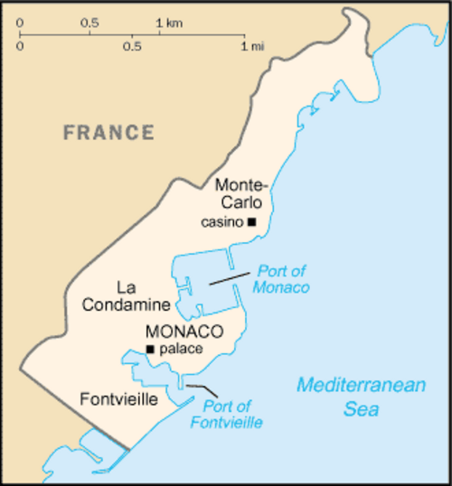 | 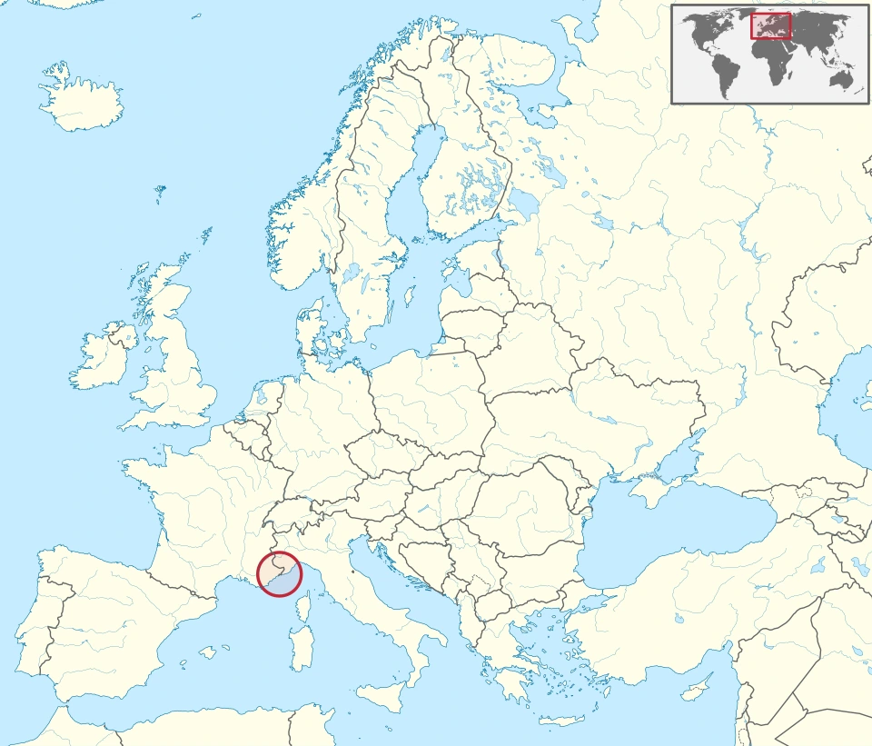 |

**认识国家／地区**：摩纳哥位于地中海北岸，陆地被法国包围，是极小的城市国家。王室、港湾、赛车和蒙特卡洛赌场常出现在国家印象中。它应与摩洛哥区分：一个在欧洲地中海岸，一个在非洲西北部。

**认识首都／城市**：首都通常记为摩纳哥；对城市国家而言，国家和主要城市空间高度重合。摩纳哥城是历史城区，蒙特卡洛则是另一个著名城区。国家行政与王宫的联系应和旅游地区名称分开理解。

> **记忆钩子**：摩纳哥城市国家，首都也记摩纳哥。

**容易混淆**：蒙特卡洛是著名城区，不是本手册的国家首都答案；摩洛哥首都是拉巴特。

资料：[UNData 国家概况（统计快照）](https://data.un.org/legacy/en/iso/mc.html) · [国家／地区背景](https://en.wikipedia.org/wiki/Monaco) · [首都／城市背景](https://en.wikipedia.org/wiki/Monaco)

地图：[File:Monaco-CIA WFB Map.png；CIA；Public domain](https://commons.wikimedia.org/wiki/File:Monaco-CIA_WFB_Map.png) · [File:Monaco in Europe.svg；TUBS；CC BY-SA 3.0](https://commons.wikimedia.org/wiki/File:Monaco_in_Europe.svg)

---

## 西班牙 — 马德里

Spain · Madrid · 南欧

| 国家／地区地图 | 欧洲位置图 |
|:---:|:---:|
| 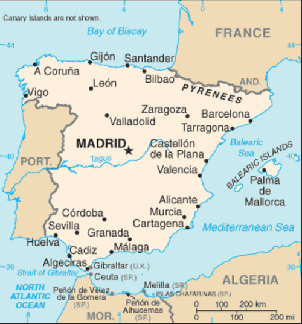 | 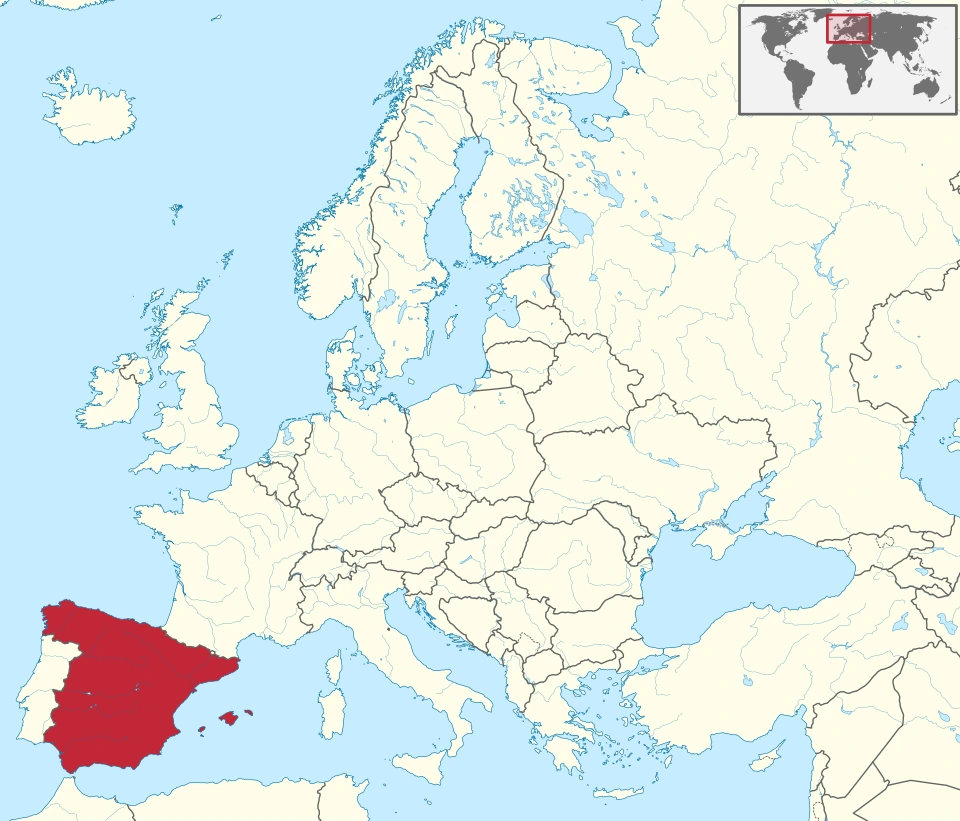 |

**认识国家／地区**：西班牙主体占据伊比利亚半岛大部分，与葡萄牙共同面向大西洋，并在东南侧临地中海。中央高原使国家内陆与沿海城市呈现不同景观。加那利群岛等部分领土也提醒我们，国家地图不只是一块欧洲大陆轮廓。

**认识首都／城市**：马德里位于伊比利亚半岛中部高原。1561 年，腓力二世将宫廷迁至这里，使其政治中心地位得到巩固。与沿海商业名城巴塞罗那对照学习，能更清楚地理解“内陆首都”和“旅游大城”的区别。

> **记忆钩子**：西班牙半岛中心，内陆马德里。

**容易混淆**：巴塞罗那是加泰罗尼亚重要城市，国家首都为马德里。

资料：[UNData 国家概况（统计快照）](https://data.un.org/legacy/en/iso/es.html) · [国家／地区背景](https://en.wikipedia.org/wiki/Spain) · [首都／城市背景](https://en.wikipedia.org/wiki/Madrid)

地图：[File:Spain-CIA WFB Map.png；见原图来源页；Public domain](https://commons.wikimedia.org/wiki/File:Spain-CIA_WFB_Map.png) · [File:Spain in Europe.svg；TUBS；CC BY-SA 3.0](https://commons.wikimedia.org/wiki/File:Spain_in_Europe.svg)

---

## 葡萄牙 — 里斯本

Portugal · Lisbon · 南欧

| 国家／地区地图 | 欧洲位置图 |
|:---:|:---:|
| 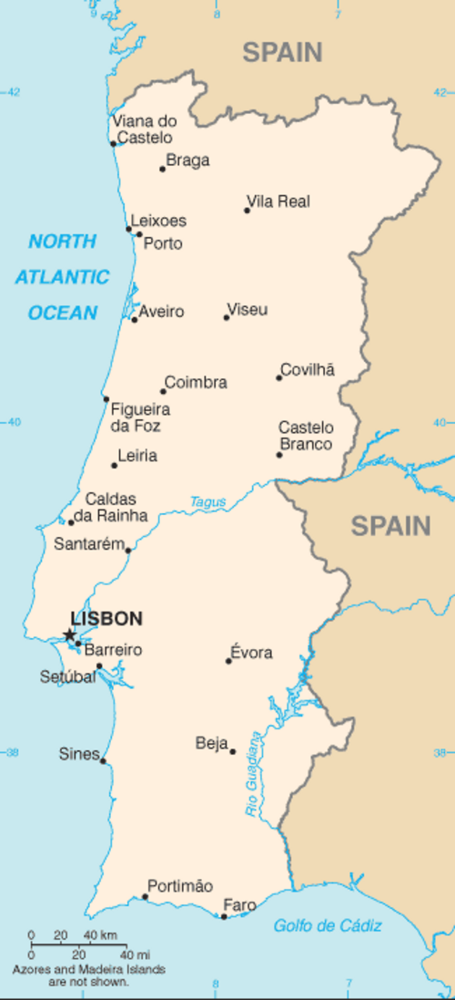 | 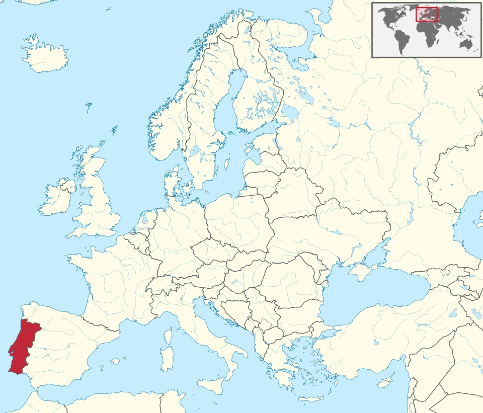 |

**认识国家／地区**：葡萄牙位于伊比利亚半岛西侧，陆上与西班牙相邻，西面和南面临大西洋。海上航路与国家历史联系紧密；亚速尔群岛和马德拉群岛也属于葡萄牙。先记“半岛西边的大西洋国家”，首都方位就容易判断。

**认识首都／城市**：里斯本位于葡萄牙西部、特茹河河口附近，是港口与政治中心结合的城市。1755 年大地震后部分城区按新的规划重建，今天的广场与街道仍体现这一历史。河口、大西洋和航海传统共同组成首都的记忆场景。

> **记忆钩子**：葡萄牙向大西洋，特茹河口里斯本。

**容易混淆**：波尔图是著名北部城市，首都在更南面的里斯本。

资料：[UNData 国家概况（统计快照）](https://data.un.org/legacy/en/iso/pt.html) · [国家／地区背景](https://en.wikipedia.org/wiki/Portugal) · [首都／城市背景](https://en.wikipedia.org/wiki/Lisbon)

地图：[File:Portugal-CIA WFB Map.png；见原图来源页；Public domain](https://commons.wikimedia.org/wiki/File:Portugal-CIA_WFB_Map.png) · [File:Portugal in Europe.svg；TUBS；CC BY-SA 3.0](https://commons.wikimedia.org/wiki/File:Portugal_in_Europe.svg)

---

## 安道尔 — 安道尔城

Andorra · Andorra la Vella · 南欧

| 国家／地区地图 | 欧洲位置图 |
|:---:|:---:|
| 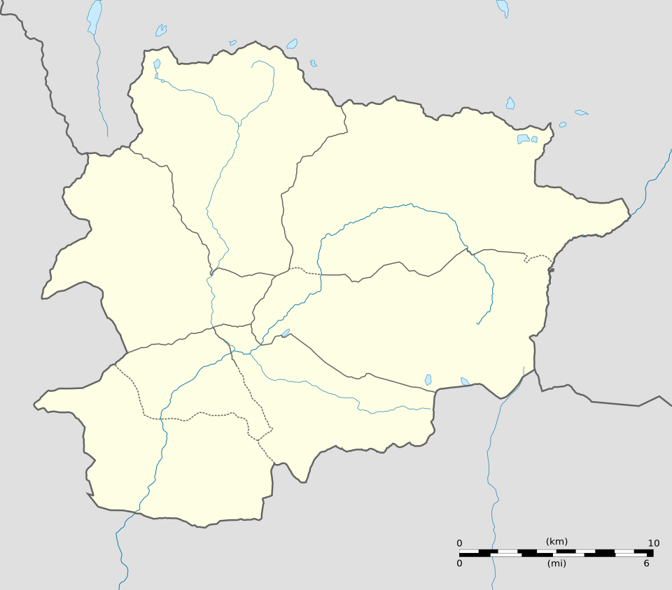 | 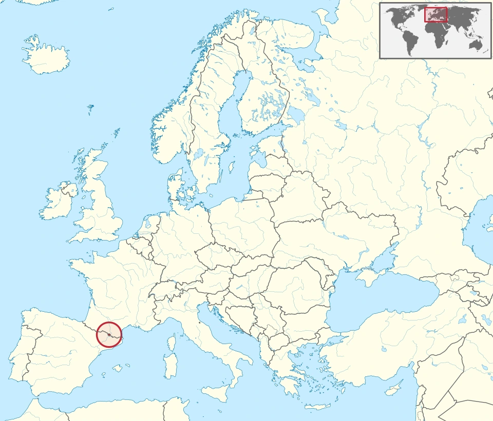 |

**认识国家／地区**：安道尔位于法国与西班牙之间的比利牛斯山脉，是内陆山地微型国家。狭窄谷地、山坡聚落与滑雪旅游构成典型地理印象。它不是西班牙或法国的一座城市，学习时要把微型国家的国家层级辨认清楚。

**认识首都／城市**：安道尔城位于国家西南部的山谷中，是行政与商业中心。英文 Andorra la Vella 中的后半部分有“旧”的含义，可帮助区分国家与首都名称。与同名首都组一起背，再加上比利牛斯山谷的画面，记忆会更稳。

> **记忆钩子**：比利牛斯山中的安道尔，首都安道尔城。

**容易混淆**：国家名 Andorra 与首都 Andorra la Vella 不是完全相同的英文写法。

资料：[UNData 国家概况（统计快照）](https://data.un.org/legacy/en/iso/ad.html) · [国家／地区背景](https://en.wikipedia.org/wiki/Andorra) · [首都／城市背景](https://en.wikipedia.org/wiki/Andorra_la_Vella)

地图：[File:Andorra location map.svg；Eric Gaba ( Sting - fr:Sting )；CC BY-SA 3.0](https://commons.wikimedia.org/wiki/File:Andorra_location_map.svg) · [File:Andorra in Europe.svg；TUBS；CC BY-SA 3.0](https://commons.wikimedia.org/wiki/File:Andorra_in_Europe.svg)

---

## 意大利 — 罗马

Italy · Rome · 南欧

| 国家／地区地图 | 欧洲位置图 |
|:---:|:---:|
| 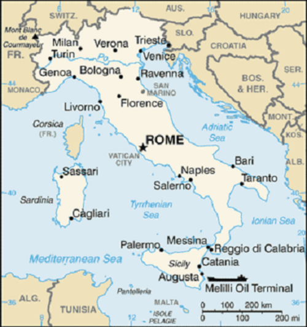 | 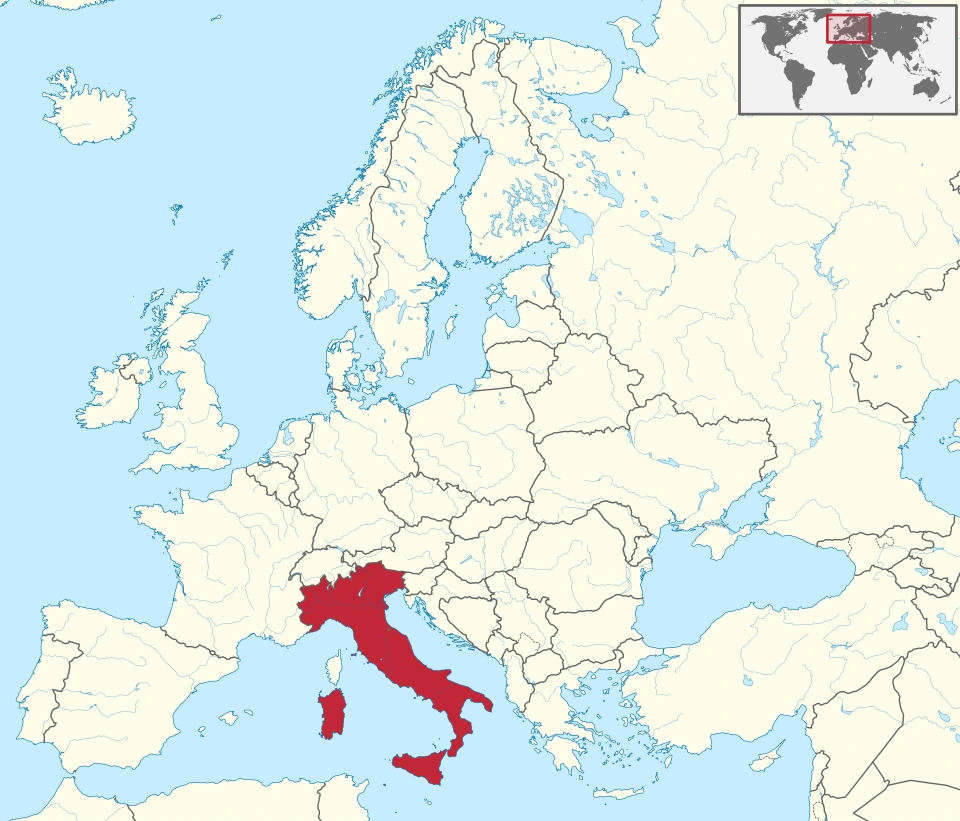 |

**认识国家／地区**：意大利位于欧洲南部，主体是伸入地中海的亚平宁半岛，常用“靴子形”轮廓来辨认；西西里岛和撒丁岛也属于国家。阿尔卑斯山在北部，半岛纵贯南北，历史名城众多但只有一个国家首都。

**认识首都／城市**：罗马位于意大利中西部、台伯河畔，是古罗马文明与现代国家行政相叠加的城市。斗兽场、古罗马广场等遗迹使首都背景非常鲜明；梵蒂冈城则是位于罗马城市内部的独立国家实体。

> **记忆钩子**：靴子形意大利，台伯河畔罗马。

**容易混淆**：米兰不是首都；梵蒂冈也不等于整个罗马。

资料：[UNData 国家概况（统计快照）](https://data.un.org/legacy/en/iso/it.html) · [国家／地区背景](https://en.wikipedia.org/wiki/Italy) · [首都／城市背景](https://en.wikipedia.org/wiki/Rome)

地图：[File:Italy-CIA WFB Map.png；见原图来源页；Public domain](https://commons.wikimedia.org/wiki/File:Italy-CIA_WFB_Map.png) · [File:Italy in Europe.svg；TUBS；CC BY-SA 3.0](https://commons.wikimedia.org/wiki/File:Italy_in_Europe.svg)

---

## 梵蒂冈（圣座） — 梵蒂冈城

Vatican City · Vatican City · 南欧

| 国家／地区地图 | 欧洲位置图 |
|:---:|:---:|
| 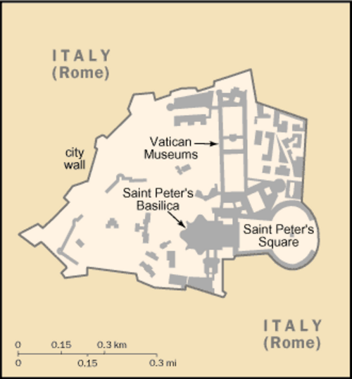 | 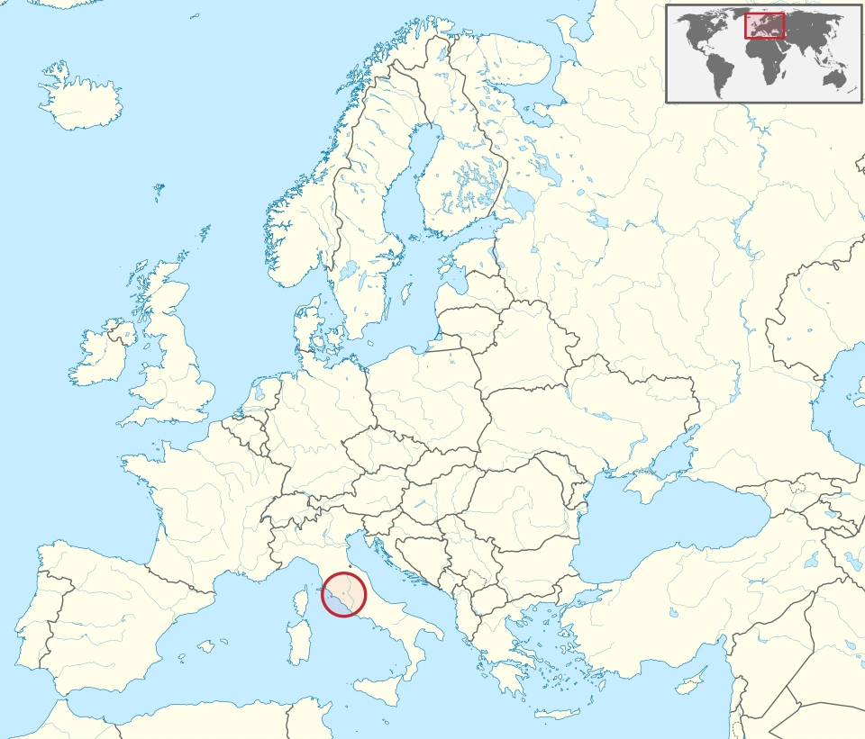 |

**认识国家／地区**：圣座是联合国非会员观察员国，梵蒂冈城国则是其所在的领土国家，二者在国际身份上有区别。梵蒂冈位于意大利罗马市内，是规模很小的城市国家，宗教与外交活动构成主要背景。

**认识首都／城市**：学习首都通常答梵蒂冈城，国家与城市空间重合。圣彼得大教堂、圣彼得广场和宗座宫构成主要地理画面。它虽然被罗马包围，仍应与意大利—罗马作为两组不同的国家／实体与首都关系记忆。

> **记忆钩子**：罗马城中另有梵蒂冈，首都同名记梵蒂冈城。

**容易混淆**：本手册以圣座的联合国观察员国地位纳入主表，不把梵蒂冈当作意大利行政区。

资料：[UNData 国家概况（统计快照）](https://data.un.org/legacy/en/iso/va.html) · [国家／地区背景](https://en.wikipedia.org/wiki/Vatican_City) · [首都／城市背景](https://en.wikipedia.org/wiki/Vatican_City) · [联合国：非会员观察员国](https://www.un.org/en/about-us/non-member-states)

地图：[File:Holy See (Vatican City)-CIA WFB Map.png；CIA；Public domain](https://commons.wikimedia.org/wiki/File:Holy_See_(Vatican_City)-CIA_WFB_Map.png) · [File:Vatican City in Europe.svg；TUBS；CC BY-SA 3.0](https://commons.wikimedia.org/wiki/File:Vatican_City_in_Europe.svg)

---

## 圣马力诺 — 圣马力诺市

San Marino · City of San Marino · 南欧

| 国家／地区地图 | 欧洲位置图 |
|:---:|:---:|
| 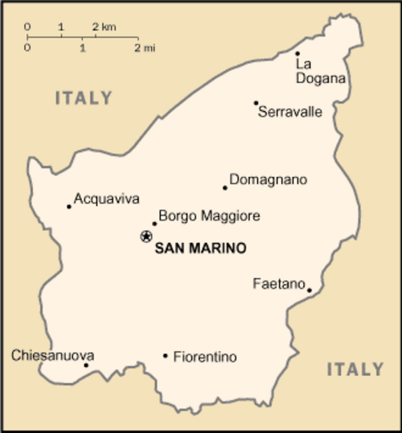 | 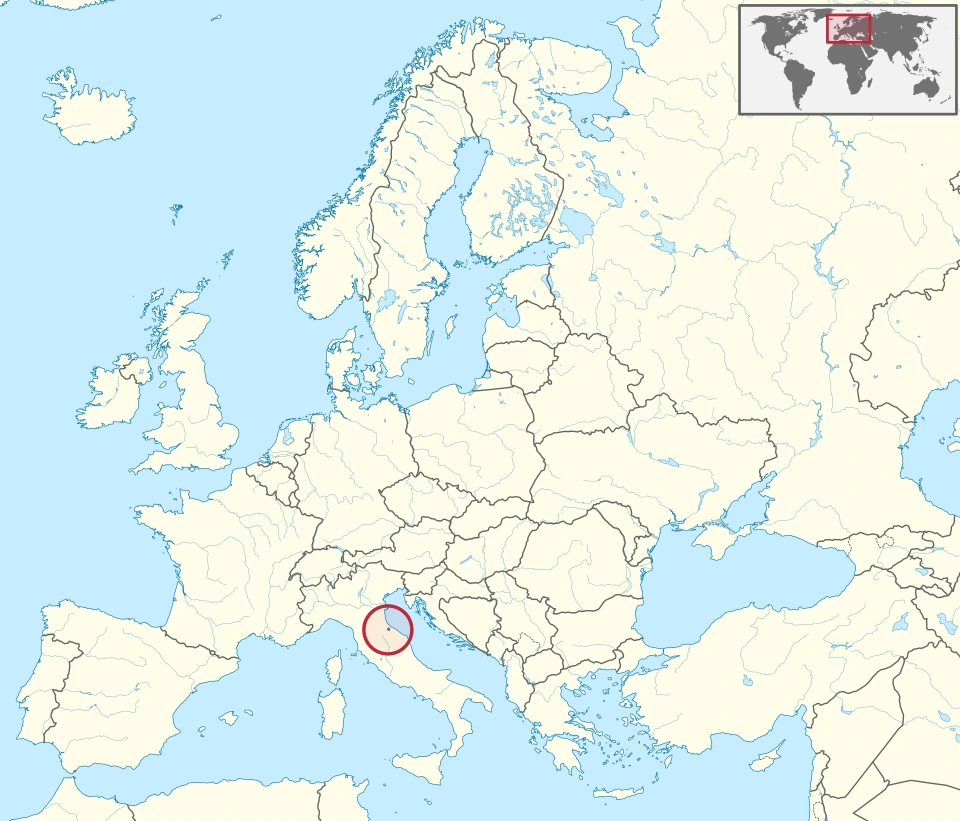 |

**认识国家／地区**：圣马力诺是完全被意大利包围的内陆微型国家，位于亚平宁山脉东北侧附近。它与梵蒂冈同样是意大利境内的独立国家，却不在罗马市内。蒂塔诺山及山顶堡垒是辨识国家位置的重要视觉线索。

**认识首都／城市**：圣马力诺市位于蒂塔诺山上，是国家首都，三座堡垒构成城市最鲜明的轮廓。国家与首都同名但层级不同，人口和面积资料也不能直接互换。用“山顶首都”与“罗马城中梵蒂冈”对比，最容易记住两国区别。

> **记忆钩子**：意大利包围的山顶国家，首都圣马力诺市。

**容易混淆**：圣马力诺与梵蒂冈是两个不同的国家／实体。

资料：[UNData 国家概况（统计快照）](https://data.un.org/legacy/en/iso/sm.html) · [国家／地区背景](https://en.wikipedia.org/wiki/San_Marino) · [首都／城市背景](https://en.wikipedia.org/wiki/City_of_San_Marino)

地图：[File:San Marino-CIA WFB Map.png；CIA；Public domain](https://commons.wikimedia.org/wiki/File:San_Marino-CIA_WFB_Map.png) · [File:San Marino in Europe.svg；TUBS；CC BY-SA 3.0](https://commons.wikimedia.org/wiki/File:San_Marino_in_Europe.svg)

---

## 马耳他 — 瓦莱塔

Malta · Valletta · 南欧

| 国家／地区地图 | 欧洲位置图 |
|:---:|:---:|
| 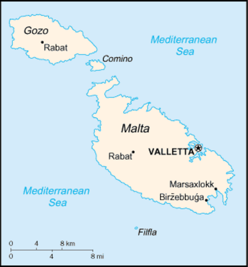 | 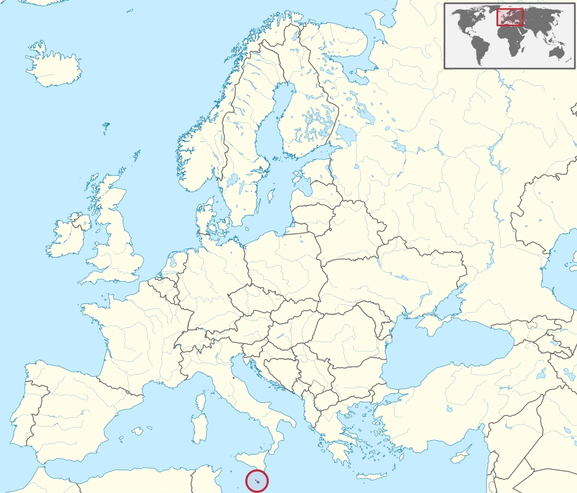 |

**认识国家／地区**：马耳他是地中海中部的岛国，位于西西里岛以南、北非海岸以北，主要包括马耳他岛和戈佐岛等。它在海上通道中的位置，使骑士团、港口和防御工事在国家历史中格外突出。

**认识首都／城市**：瓦莱塔位于马耳他岛东北岸的半岛上，邻近天然港湾。城市由圣约翰骑士团在 16 世纪建设，其规则街网、城墙与要塞强化了“堡垒首都”的印象。国土虽小，首都与其他聚落仍应准确区分。

> **记忆钩子**：西西里南方马耳他，骑士堡垒瓦莱塔。

**容易混淆**：姆迪纳是历史古城，现代首都为瓦莱塔。

资料：[UNData 国家概况（统计快照）](https://data.un.org/legacy/en/iso/mt.html) · [国家／地区背景](https://en.wikipedia.org/wiki/Malta) · [首都／城市背景](https://en.wikipedia.org/wiki/Valletta)

地图：[File:Malta-CIA WFB Map.png；CIA；Public domain](https://commons.wikimedia.org/wiki/File:Malta-CIA_WFB_Map.png) · [File:Malta in Europe.svg；TUBS；CC BY-SA 3.0](https://commons.wikimedia.org/wiki/File:Malta_in_Europe.svg)

---

## 希腊 — 雅典

Greece · Athens · 南欧

| 国家／地区地图 | 欧洲位置图 |
|:---:|:---:|
| 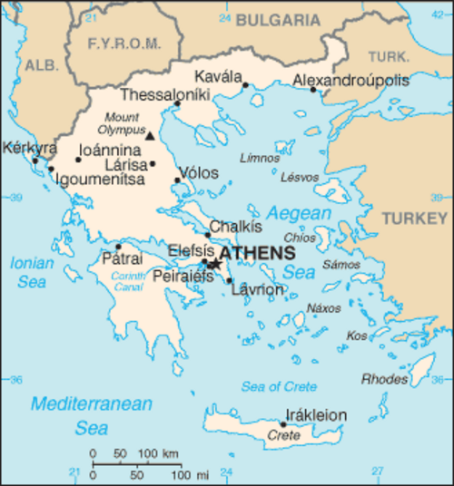 | 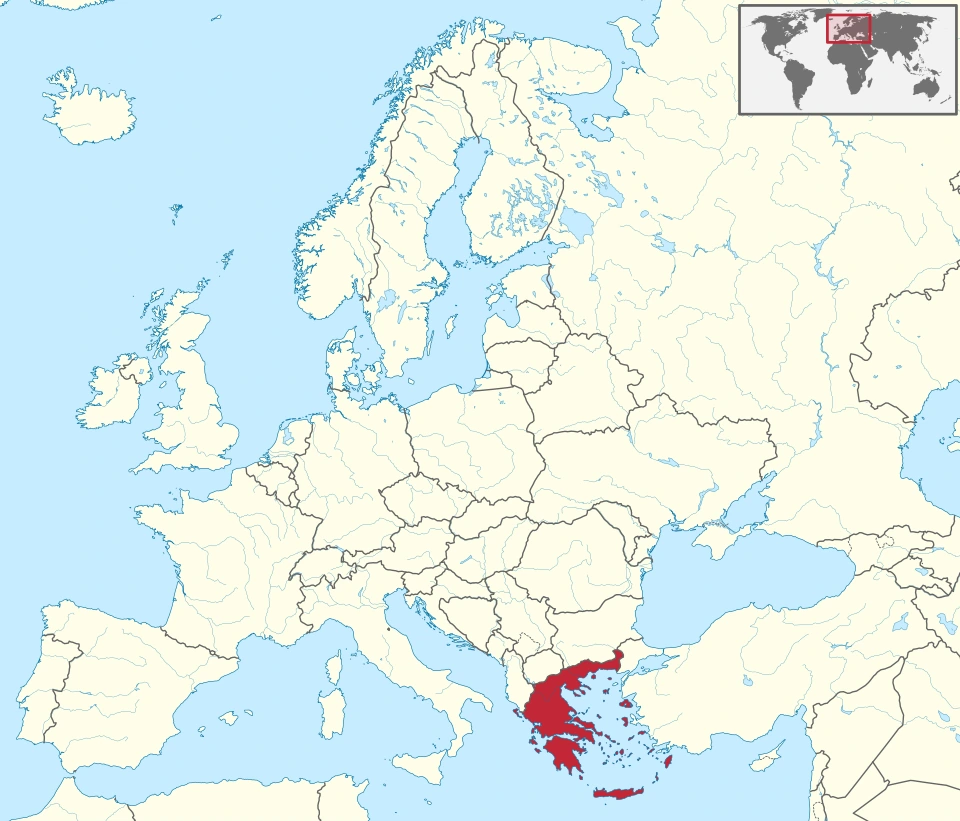 |

**认识国家／地区**：希腊位于巴尔干半岛南端，国土包括大陆、伯罗奔尼撒半岛和大量爱琴海、伊奥尼亚海岛屿。山地与海湾使城市联系常依赖海上通道。古希腊文明遗产很有名，但现代国家与古代各城邦不能混为一谈。

**认识首都／城市**：雅典位于希腊东南部的阿提卡地区，卫城俯瞰城市，是古代政治与文化遗产最鲜明的象征。它在现代希腊国家形成后成为首都。将大陆东南角、卫城与附近港口比雷埃夫斯联系起来，能形成空间定位。

> **记忆钩子**：希腊东南雅典，卫城记首都。

**容易混淆**：圣托里尼等岛屿是旅游目的地，国家首都在雅典。

资料：[UNData 国家概况（统计快照）](https://data.un.org/legacy/en/iso/gr.html) · [国家／地区背景](https://en.wikipedia.org/wiki/Greece) · [首都／城市背景](https://en.wikipedia.org/wiki/Athens)

地图：[File:Greece-CIA WFB Map.png；见原图来源页；Public domain](https://commons.wikimedia.org/wiki/File:Greece-CIA_WFB_Map.png) · [File:Greece in Europe.svg；TUBS；CC BY-SA 3.0](https://commons.wikimedia.org/wiki/File:Greece_in_Europe.svg)

---

## 阿尔巴尼亚 — 地拉那

Albania · Tirana · 南欧

| 国家／地区地图 | 欧洲位置图 |
|:---:|:---:|
| 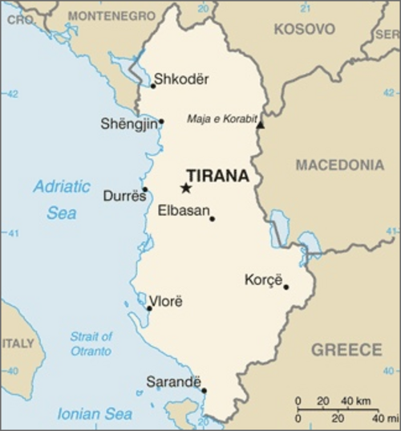 | 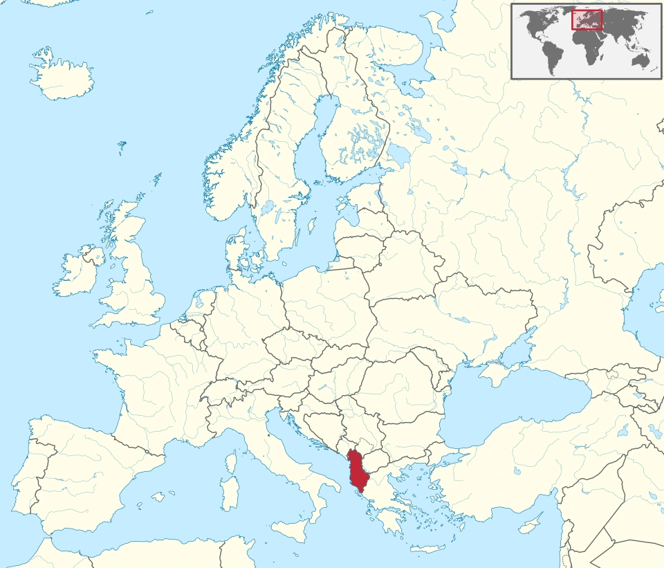 |

**认识国家／地区**：阿尔巴尼亚位于巴尔干半岛西侧，西临亚得里亚海和伊奥尼亚海，内陆多山。它邻近希腊、北马其顿、黑山及科索沃地区。地图上先找到巴尔干西岸，再向内陆寻找首都，定位很直观。

**认识首都／城市**：地拉那位于国家中西部，处在沿海平原与山地之间。1920 年被确立为首都后，城市行政功能持续发展；斯坎德培广场提供了很好的地标记忆。它距海岸不算远，却不是沿海港口城市。

> **记忆钩子**：巴尔干西岸阿尔巴尼亚，向内陆找地拉那。

**容易混淆**：都拉斯是重要港口，国家首都为地拉那。

资料：[UNData 国家概况（统计快照）](https://data.un.org/legacy/en/iso/al.html) · [国家／地区背景](https://en.wikipedia.org/wiki/Albania) · [首都／城市背景](https://en.wikipedia.org/wiki/Tirana)

地图：[File:Albania-CIA WFB Map.png；United States Central Intelligence Agency；Public domain](https://commons.wikimedia.org/wiki/File:Albania-CIA_WFB_Map.png) · [File:Albania in Europe.svg；TUBS；CC BY-SA 3.0](https://commons.wikimedia.org/wiki/File:Albania_in_Europe.svg)

---

## 北马其顿 — 斯科普里

North Macedonia · Skopje · 南欧

| 国家／地区地图 | 欧洲位置图 |
|:---:|:---:|
| 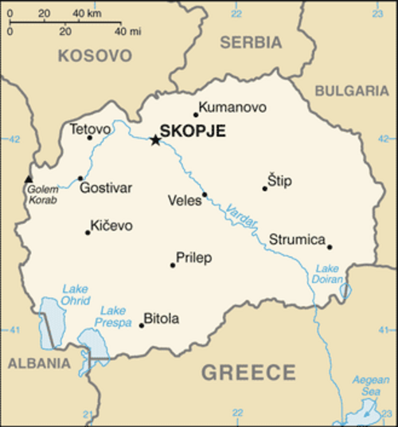 | 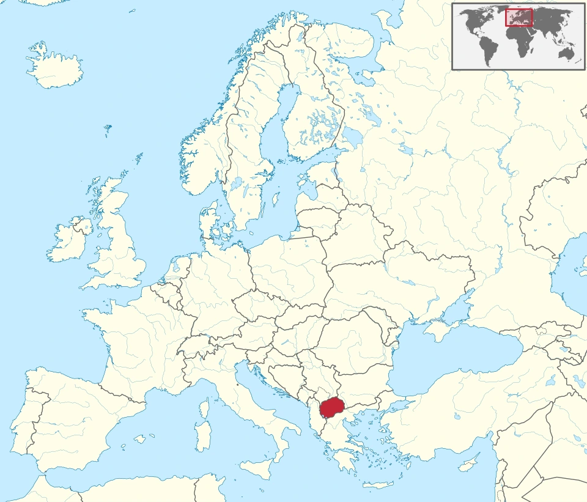 |

**认识国家／地区**：北马其顿位于巴尔干内陆，邻希腊、保加利亚、阿尔巴尼亚、塞尔维亚及科索沃地区。它与古代或今日希腊的马其顿地区不能直接等同。2019 年启用北马其顿这一国家名称，旧地图仍可能只写 Macedonia。

**认识首都／城市**：斯科普里位于国家北部，瓦尔达尔河穿过城市。古桥、集市与现代行政区反映不同历史阶段；1963 年地震后的重建对城市布局影响很大。国家改名并未改变首都，所以“北马其顿—斯科普里”要固定成对记。

> **记忆钩子**：国家名加了“北”，首都仍是斯科普里。

**容易混淆**：旧资料中的马其顿国家通常对应今日北马其顿，别与希腊的马其顿地区混淆。

资料：[UNData 国家概况（统计快照）](https://data.un.org/legacy/en/iso/mk.html) · [国家／地区背景](https://en.wikipedia.org/wiki/North_Macedonia) · [首都／城市背景](https://en.wikipedia.org/wiki/Skopje)

地图：[File:North Macedonia-CIA WFB Map.png；见原图来源页；Public domain](https://commons.wikimedia.org/wiki/File:North_Macedonia-CIA_WFB_Map.png) · [File:Macedonia in Europe.svg；TUBS；CC BY-SA 3.0](https://commons.wikimedia.org/wiki/File:Macedonia_in_Europe.svg)

---

## 塞尔维亚 — 贝尔格莱德

Serbia · Belgrade · 南欧

| 国家／地区地图 | 欧洲位置图 |
|:---:|:---:|
| 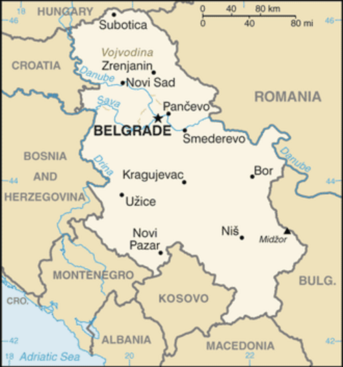 | 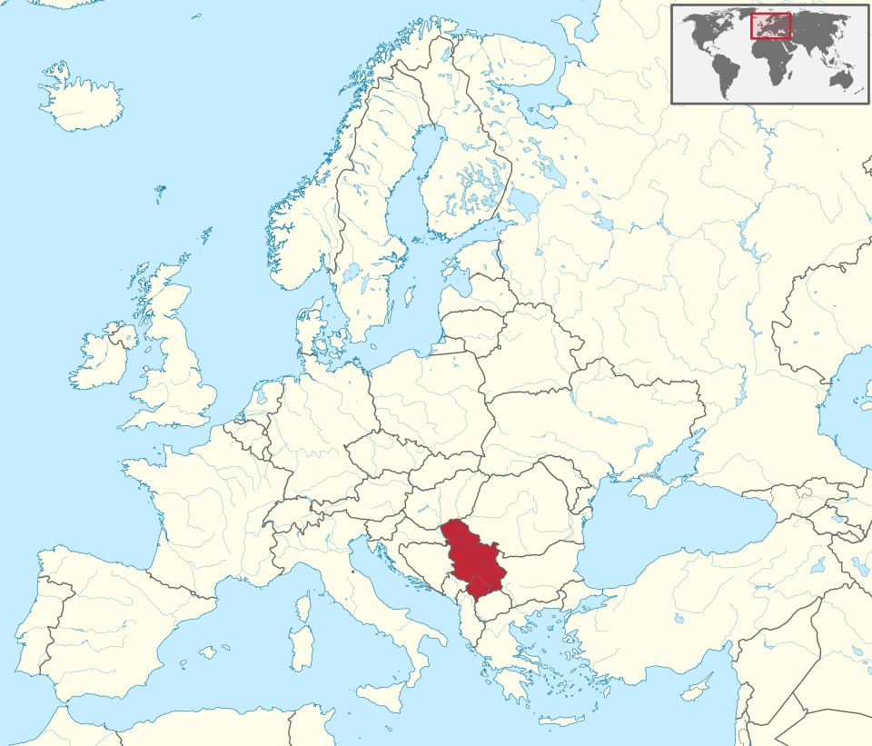 |

**认识国家／地区**：塞尔维亚位于巴尔干半岛内陆，是连接中欧与东南欧的重要交通区域。北部平原与南部丘陵、山地形成地形差异，多瑙河提供主要地理线索。前南斯拉夫历史容易使旧地图与现今国界混淆，应以当前国名记忆。

**认识首都／城市**：贝尔格莱德位于萨瓦河与多瑙河交汇处，卡莱梅格丹要塞体现了河流交通和防御位置的历史价值。它曾是南斯拉夫首都，今日是塞尔维亚首都。记住“两河交汇的白城”，比只凭旧国家名称联想更稳。

> **记忆钩子**：萨瓦河汇入多瑙河，河口城市贝尔格莱德。

**容易混淆**：科索沃另在扩展页说明，其地位不能用一个无说明的统一答案处理。

资料：[UNData 国家概况（统计快照）](https://data.un.org/legacy/en/iso/rs.html) · [国家／地区背景](https://en.wikipedia.org/wiki/Serbia) · [首都／城市背景](https://en.wikipedia.org/wiki/Belgrade)

地图：[File:Serbia-CIA WFB Map.png；United States Central Intelligence Agency；Public domain](https://commons.wikimedia.org/wiki/File:Serbia-CIA_WFB_Map.png) · [File:Serbia in Europe.svg；TUBS；CC BY-SA 3.0](https://commons.wikimedia.org/wiki/File:Serbia_in_Europe.svg)

---

## 黑山 — 波德戈里察

Montenegro · Podgorica · 南欧

| 国家／地区地图 | 欧洲位置图 |
|:---:|:---:|
| 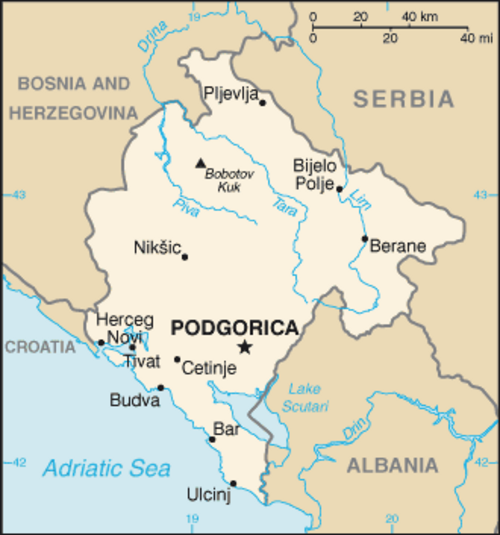 | 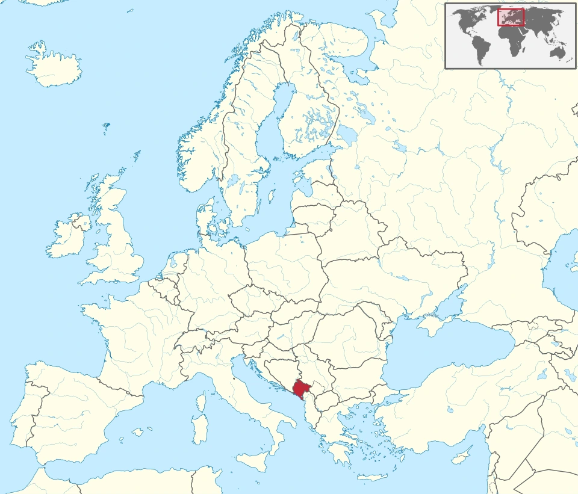 |

**认识国家／地区**：黑山位于巴尔干半岛西部，拥有亚得里亚海岸和崎岖山地。科托尔湾是著名地理景观，国家名称也很适合联想到山地。2006 年独立后的国家地图不应再直接采用塞尔维亚和黑山的合并轮廓。

**认识首都／城市**：波德戈里察位于国家南部内陆，是现代行政首都，河谷与平地便于城市发展。采蒂涅是旧王都，仍具有特殊历史与国家机构地位。现代首都与历史王都分开背，能解释为什么资料里常出现两座城市。

> **记忆钩子**：黑山现代行政中心波德戈里察，旧王都采蒂涅。

**容易混淆**：采蒂涅为旧王都，不应替代波德戈里察作为一般首都题答案。

资料：[UNData 国家概况（统计快照）](https://data.un.org/legacy/en/iso/me.html) · [国家／地区背景](https://en.wikipedia.org/wiki/Montenegro) · [首都／城市背景](https://en.wikipedia.org/wiki/Podgorica)

地图：[File:Montenegro-CIA WFB Map.png；见原图来源页；Public domain](https://commons.wikimedia.org/wiki/File:Montenegro-CIA_WFB_Map.png) · [File:Montenegro in Europe.svg；TUBS；CC BY-SA 3.0](https://commons.wikimedia.org/wiki/File:Montenegro_in_Europe.svg)

---

## 波斯尼亚和黑塞哥维那 — 萨拉热窝

Bosnia and Herzegovina · Sarajevo · 南欧

| 国家／地区地图 | 欧洲位置图 |
|:---:|:---:|
| 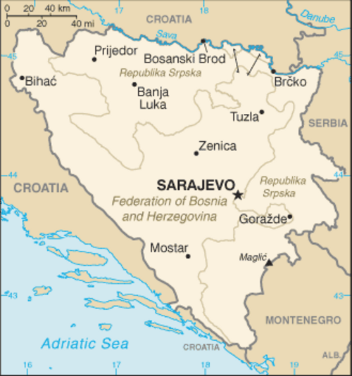 | 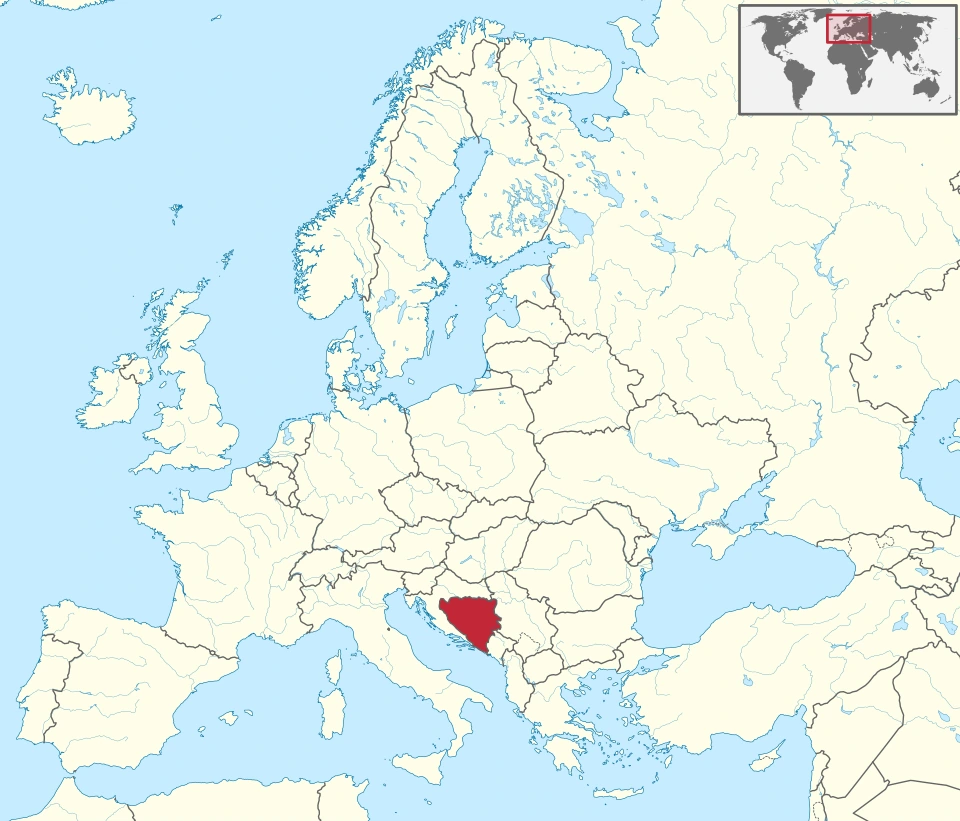 |

**认识国家／地区**：波斯尼亚和黑塞哥维那位于巴尔干半岛西部，主体多山，与克罗地亚、塞尔维亚和黑山接壤，并拥有很短的亚得里亚海岸线。长国名可简称波黑，但国家与内部政治实体的层级需要区分。

**认识首都／城市**：萨拉热窝位于国家中东部的山谷中，米利亚茨卡河穿过城市。奥斯曼、奥匈等历史影响体现在不同街区；1914 年萨拉热窝事件和 1984 年冬奥会也提供了两个历史记忆点。城市是现代国家首都，不能只按战争标签理解。

> **记忆钩子**：波黑山谷首都萨拉热窝。

**容易混淆**：莫斯塔尔是著名历史城市，国家首都为萨拉热窝。

资料：[UNData 国家概况（统计快照）](https://data.un.org/legacy/en/iso/ba.html) · [国家／地区背景](https://en.wikipedia.org/wiki/Bosnia_and_Herzegovina) · [首都／城市背景](https://en.wikipedia.org/wiki/Sarajevo)

地图：[File:Bosnia and Herzegovina-CIA WFB Map.png；见原图来源页；Public domain](https://commons.wikimedia.org/wiki/File:Bosnia_and_Herzegovina-CIA_WFB_Map.png) · [File:Bosnia and Herzegovina in Europe.svg；TUBS；CC BY-SA 3.0](https://commons.wikimedia.org/wiki/File:Bosnia_and_Herzegovina_in_Europe.svg)

---

## 克罗地亚 — 萨格勒布

Croatia · Zagreb · 南欧

| 国家／地区地图 | 欧洲位置图 |
|:---:|:---:|
| 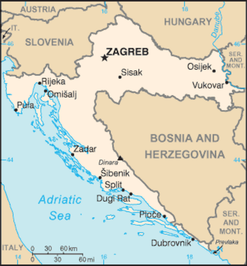 | 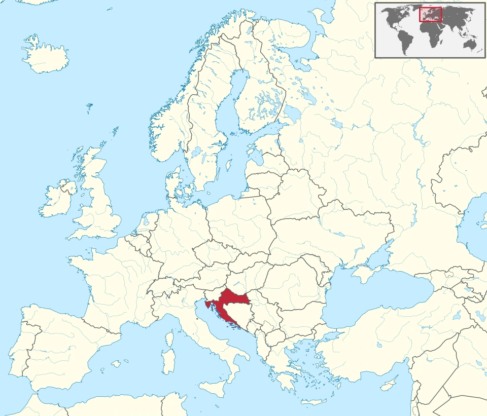 |

**认识国家／地区**：克罗地亚位于巴尔干西北部，拥有漫长而曲折的亚得里亚海岸和许多岛屿，内陆部分则连接中欧。国土轮廓沿海岸弯曲展开，很容易被海滨旅游城市抢走记忆注意力。

**认识首都／城市**：萨格勒布位于克罗地亚北部内陆、萨瓦河附近，是行政、文化和交通中心。上城与下城的空间分布体现城市逐步发展的历史。记忆首都时要主动从海岸退回北部内陆，避免把杜布罗夫尼克或斯普利特当成首都。

> **记忆钩子**：克罗地亚看海岸，问首都回北部萨格勒布。

**容易混淆**：杜布罗夫尼克是著名海滨古城，不是国家首都。

资料：[UNData 国家概况（统计快照）](https://data.un.org/legacy/en/iso/hr.html) · [国家／地区背景](https://en.wikipedia.org/wiki/Croatia) · [首都／城市背景](https://en.wikipedia.org/wiki/Zagreb)

地图：[File:Croatia-CIA WFB Map.png；Central Intelligence Agency；Public domain](https://commons.wikimedia.org/wiki/File:Croatia-CIA_WFB_Map.png) · [File:Croatia in Europe.svg；TUBS；CC BY-SA 3.0](https://commons.wikimedia.org/wiki/File:Croatia_in_Europe.svg)

---

## 斯洛文尼亚 — 卢布尔雅那

Slovenia · Ljubljana · 南欧

| 国家／地区地图 | 欧洲位置图 |
|:---:|:---:|
| 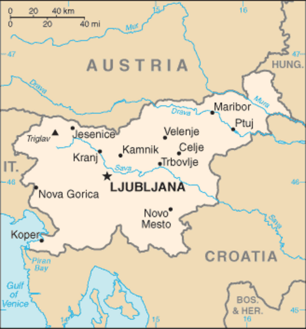 |  |

**认识国家／地区**：斯洛文尼亚位于阿尔卑斯山、亚得里亚海和巴尔干地区的交接处，邻意大利、奥地利、匈牙利和克罗地亚。它有很短的海岸线，主体仍是山地与内陆河谷。国名与斯洛伐克相似，应一起对照。

**认识首都／城市**：卢布尔雅那位于国家中部盆地，卢布尔雅尼察河穿过城区，城堡山俯瞰旧城。它的中央位置适合连接不同地形区域，也让“斯洛文尼亚—卢布尔雅那”成为一组典型长词配对题。

> **记忆钩子**：斯洛文尼亚中央盆地，卢布尔雅那。

**容易混淆**：斯洛文尼亚—卢布尔雅那；斯洛伐克—布拉迪斯拉发。

资料：[UNData 国家概况（统计快照）](https://data.un.org/legacy/en/iso/si.html) · [国家／地区背景](https://en.wikipedia.org/wiki/Slovenia) · [首都／城市背景](https://en.wikipedia.org/wiki/Ljubljana)

地图：[File:Slovenia-CIA WFB Map.png；见原图来源页；Public domain](https://commons.wikimedia.org/wiki/File:Slovenia-CIA_WFB_Map.png) · [File:Slovenia in Europe.svg；TUBS；CC BY-SA 3.0](https://commons.wikimedia.org/wiki/File:Slovenia_in_Europe.svg)

---

## 波兰 — 华沙

Poland · Warsaw · 东欧

| 国家／地区地图 | 欧洲位置图 |
|:---:|:---:|
| 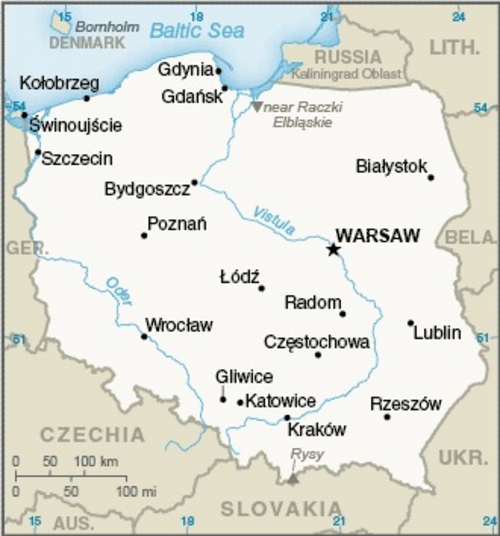 | 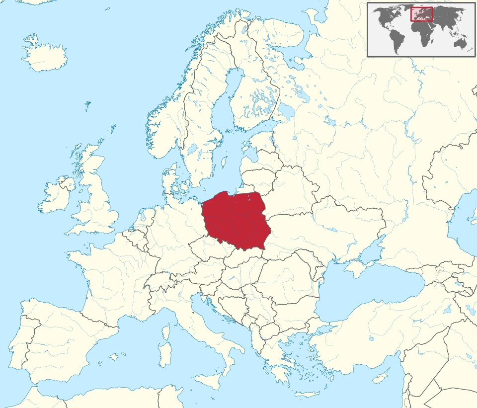 |

**认识国家／地区**：波兰位于欧洲中东部，北临波罗的海，西邻德国，南部接山地，主体以平原为主。维斯瓦河由南向北贯穿国家，是组织城市位置的好线索。华沙与克拉科夫分别体现现代政治中心与历史王都传统。

**认识首都／城市**：华沙位于波兰中东部、维斯瓦河畔。第二次世界大战中城市遭到严重破坏，战后老城重建成为城市历史的重要一部分。记住河流与重建故事，能把首都身份和具有辨识度的城市背景联系起来。

> **记忆钩子**：波兰维斯瓦河畔，重建古城华沙。

**容易混淆**：克拉科夫曾是历史王都，现国家首都为华沙。

资料：[UNData 国家概况（统计快照）](https://data.un.org/legacy/en/iso/pl.html) · [国家／地区背景](https://en.wikipedia.org/wiki/Poland) · [首都／城市背景](https://en.wikipedia.org/wiki/Warsaw)

地图：[File:Poland-CIA WFB Map.png；见原图来源页；Public domain](https://commons.wikimedia.org/wiki/File:Poland-CIA_WFB_Map.png) · [File:Poland in Europe.svg；TUBS；CC BY-SA 3.0](https://commons.wikimedia.org/wiki/File:Poland_in_Europe.svg)

---

## 捷克 — 布拉格

Czech Republic · Prague · 东欧

| 国家／地区地图 | 欧洲位置图 |
|:---:|:---:|
| 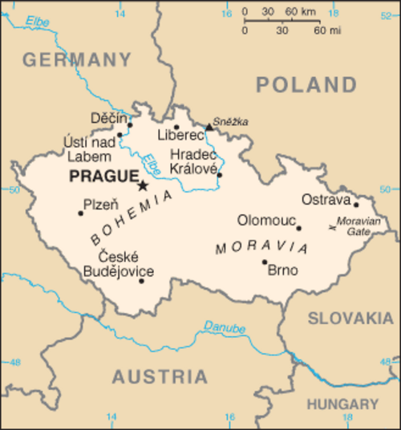 | 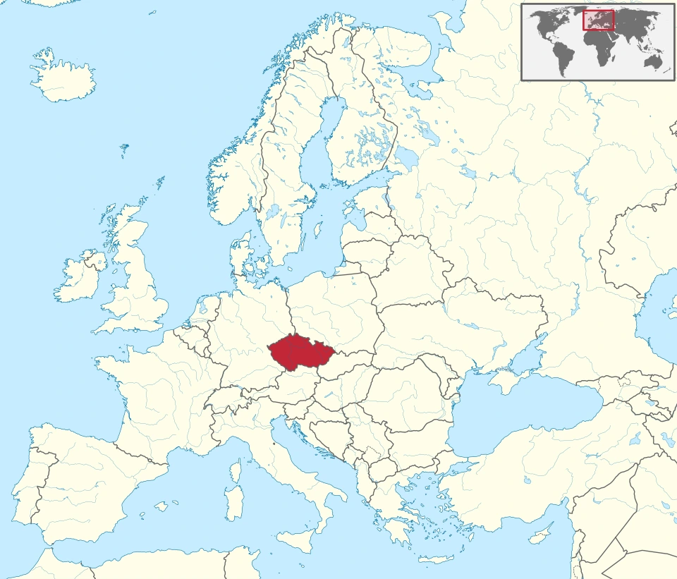 |

**认识国家／地区**：捷克位于欧洲中部，是被德国、波兰、斯洛伐克和奥地利包围的内陆国家，主要历史地区包括波希米亚和摩拉维亚。它与斯洛伐克曾组成同一国家，1993 年后成为两个独立国家，因此两组首都需要分开背。

**认识首都／城市**：布拉格位于捷克西部的波希米亚地区，伏尔塔瓦河穿过城市。查理大桥、城堡和老城广场构成鲜明的历史画面。它既是捷克首都，也曾是捷克斯洛伐克首都，这段历史能解释旧资料里的名称关联。

> **记忆钩子**：捷克伏尔塔瓦河畔，查理桥旁布拉格。

**容易混淆**：Czechia 与 Czech Republic 都指捷克；不要与斯洛伐克混为一国。

资料：[UNData 国家概况（统计快照）](https://data.un.org/legacy/en/iso/cz.html) · [国家／地区背景](https://en.wikipedia.org/wiki/Czech_Republic) · [首都／城市背景](https://en.wikipedia.org/wiki/Prague)

地图：[File:Czech Republic-CIA WFB Map.png；见原图来源页；Public domain](https://commons.wikimedia.org/wiki/File:Czech_Republic-CIA_WFB_Map.png) · [File:Czech Republic in Europe.svg；TUBS；CC BY-SA 3.0](https://commons.wikimedia.org/wiki/File:Czech_Republic_in_Europe.svg)

---

## 斯洛伐克 — 布拉迪斯拉发

Slovakia · Bratislava · 东欧

| 国家／地区地图 | 欧洲位置图 |
|:---:|:---:|
| 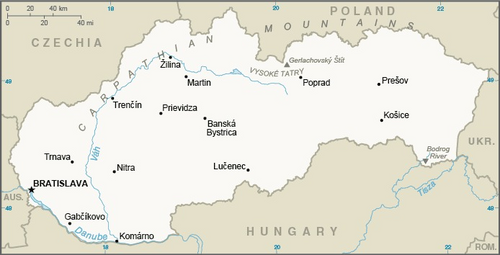 | 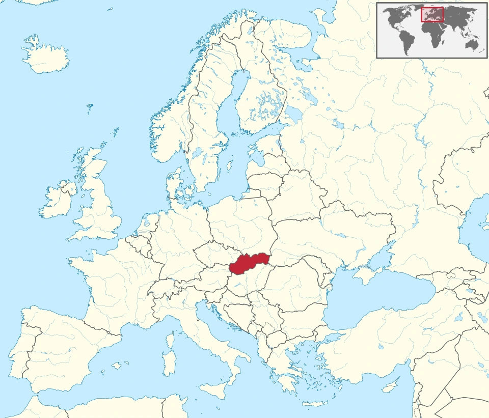 |

**认识国家／地区**：斯洛伐克位于欧洲中部内陆，邻捷克、波兰、乌克兰、匈牙利和奥地利，北部以喀尔巴阡山地为重要地形线索。与斯洛文尼亚相比，它更偏内陆中欧；名称相似而地理位置不同，是应专门练习的一组。

**认识首都／城市**：布拉迪斯拉发位于国家最西部、多瑙河畔，靠近奥地利和匈牙利边境。首都并不位于国土中央，它与维也纳地理上接近。以“西端边境＋多瑙河”来记，比单独硬背很长的中文名更有效。

> **记忆钩子**：斯洛伐克最西端，多瑙河边布拉迪斯拉发。

**容易混淆**：斯洛文尼亚的首都是卢布尔雅那；斯洛伐克的首都是布拉迪斯拉发。

资料：[UNData 国家概况（统计快照）](https://data.un.org/legacy/en/iso/sk.html) · [国家／地区背景](https://en.wikipedia.org/wiki/Slovakia) · [首都／城市背景](https://en.wikipedia.org/wiki/Bratislava)

地图：[File:Slovakia-CIA WFB Map.png；见原图来源页；Public domain](https://commons.wikimedia.org/wiki/File:Slovakia-CIA_WFB_Map.png) · [File:Slovakia in Europe.svg；TUBS；CC BY-SA 3.0](https://commons.wikimedia.org/wiki/File:Slovakia_in_Europe.svg)

---

## 匈牙利 — 布达佩斯

Hungary · Budapest · 东欧

| 国家／地区地图 | 欧洲位置图 |
|:---:|:---:|
| 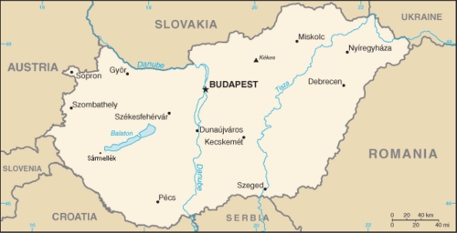 | 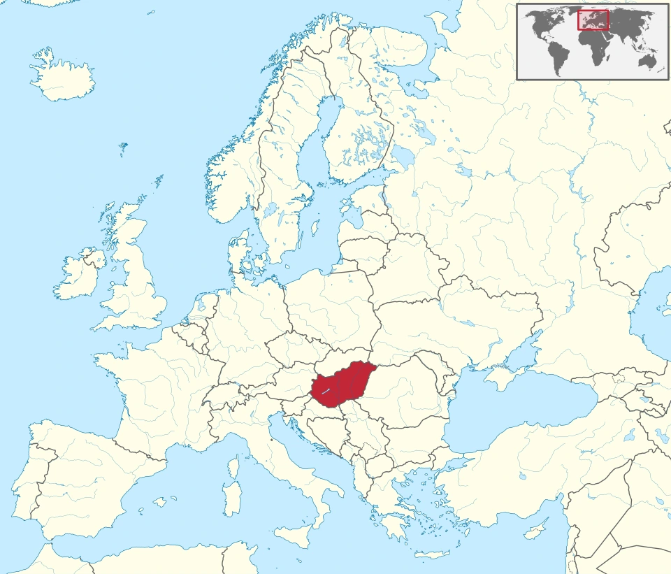 |

**认识国家／地区**：匈牙利位于欧洲中部的喀尔巴阡盆地，以内陆平原为主，多瑙河与蒂萨河构成重要水系。虽然属于中欧文化地理讨论的常见范围，本手册依 UN M49 归入东欧统计组；学习组标签不能当作文化边界。

**认识首都／城市**：布达佩斯位于多瑙河两岸，西岸的布达与东岸的佩斯等城市于 1873 年合并。丘陵城堡区与平原城区形成鲜明对比，国会大厦也位于河边。首都名称本身就能拆成“布达＋佩斯”，非常适合记忆。

> **记忆钩子**：多瑙河两岸合起来：布达＋佩斯＝布达佩斯。

**容易混淆**：不要把布达佩斯和罗马尼亚的布加勒斯特混淆。

资料：[UNData 国家概况（统计快照）](https://data.un.org/legacy/en/iso/hu.html) · [国家／地区背景](https://en.wikipedia.org/wiki/Hungary) · [首都／城市背景](https://en.wikipedia.org/wiki/Budapest)

地图：[File:Hungary-CIA WFB Map.png；见原图来源页；Public domain](https://commons.wikimedia.org/wiki/File:Hungary-CIA_WFB_Map.png) · [File:Hungary in Europe.svg；TUBS；CC BY-SA 3.0](https://commons.wikimedia.org/wiki/File:Hungary_in_Europe.svg)

---

## 罗马尼亚 — 布加勒斯特

Romania · Bucharest · 东欧

| 国家／地区地图 | 欧洲位置图 |
|:---:|:---:|
| 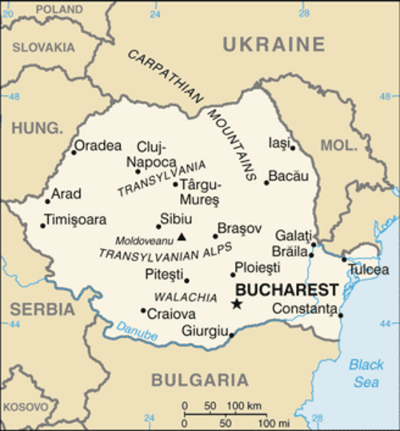 | 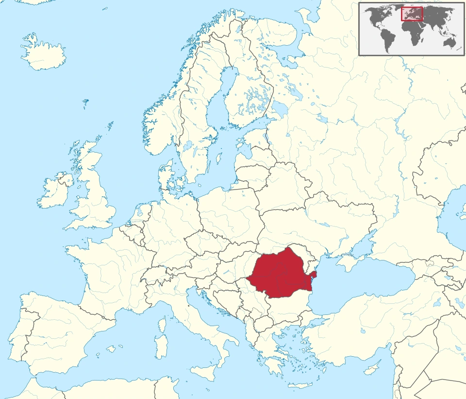 |

**认识国家／地区**：罗马尼亚位于欧洲东南部，东南临黑海，喀尔巴阡山脉、特兰西瓦尼亚地区和多瑙河构成主要地理框架。多瑙河三角洲位于国家东部附近，山地与南部平原在地图上容易形成对照。

**认识首都／城市**：布加勒斯特位于罗马尼亚南部平原、登博维察河畔。城市的国家行政功能与瓦拉几亚历史及现代国家形成相关。它不在最著名的特兰西瓦尼亚山地区域；记住“南部平原首都”，可避开旅游印象误导。

> **记忆钩子**：罗马尼亚南部平原，布加勒斯特。

**容易混淆**：匈牙利是布达佩斯，罗马尼亚是布加勒斯特；两者不能互换。

资料：[UNData 国家概况（统计快照）](https://data.un.org/legacy/en/iso/ro.html) · [国家／地区背景](https://en.wikipedia.org/wiki/Romania) · [首都／城市背景](https://en.wikipedia.org/wiki/Bucharest)

地图：[File:Romania-CIA WFB Map.png；CIA；Public domain](https://commons.wikimedia.org/wiki/File:Romania-CIA_WFB_Map.png) · [File:Romania in Europe.svg；TUBS；CC BY-SA 3.0](https://commons.wikimedia.org/wiki/File:Romania_in_Europe.svg)

---

## 保加利亚 — 索非亚

Bulgaria · Sofia · 东欧

| 国家／地区地图 | 欧洲位置图 |
|:---:|:---:|
| 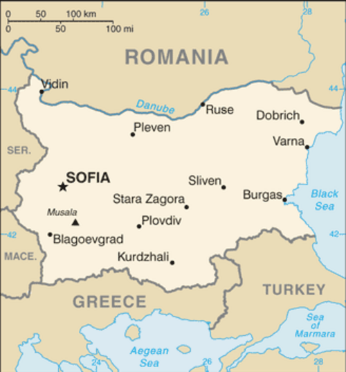 | 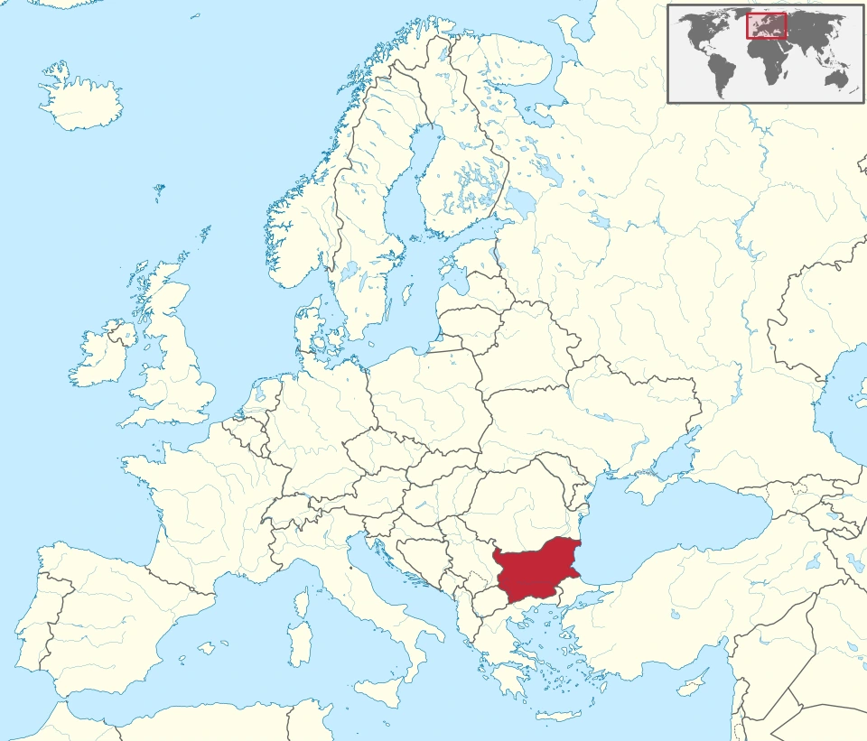 |

**认识国家／地区**：保加利亚位于巴尔干半岛东部，东临黑海，北部与罗马尼亚以多瑙河等区域相邻。巴尔干山脉横贯国土，西部则连接塞尔维亚和北马其顿方向。国家临海，但首都位于远离海岸的西部内陆。

**认识首都／城市**：索非亚位于保加利亚西部的盆地，附近有维托沙山。1879 年成为恢复独立后的国家首都，位置便于连接巴尔干内陆交通。山地背景与老教堂提供视觉线索，也可与黑海城市瓦尔纳作清楚对照。

> **记忆钩子**：保加利亚西部盆地，维托沙山下索非亚。

**容易混淆**：瓦尔纳是黑海港口，国家首都为索非亚。

资料：[UNData 国家概况（统计快照）](https://data.un.org/legacy/en/iso/bg.html) · [国家／地区背景](https://en.wikipedia.org/wiki/Bulgaria) · [首都／城市背景](https://en.wikipedia.org/wiki/Sofia)

地图：[File:Bulgaria-CIA WFB Map.png；United States Central Intelligence Agency；Public domain](https://commons.wikimedia.org/wiki/File:Bulgaria-CIA_WFB_Map.png) · [File:Bulgaria in Europe.svg；TUBS；CC BY-SA 3.0](https://commons.wikimedia.org/wiki/File:Bulgaria_in_Europe.svg)

---

## 摩尔多瓦 — 基希讷乌

Moldova · Chișinău · 东欧

| 国家／地区地图 | 欧洲位置图 |
|:---:|:---:|
| 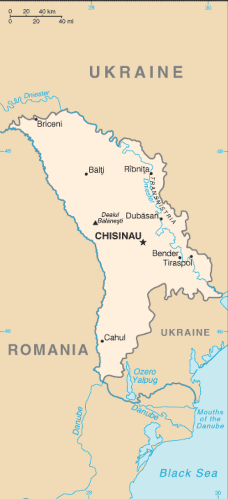 | 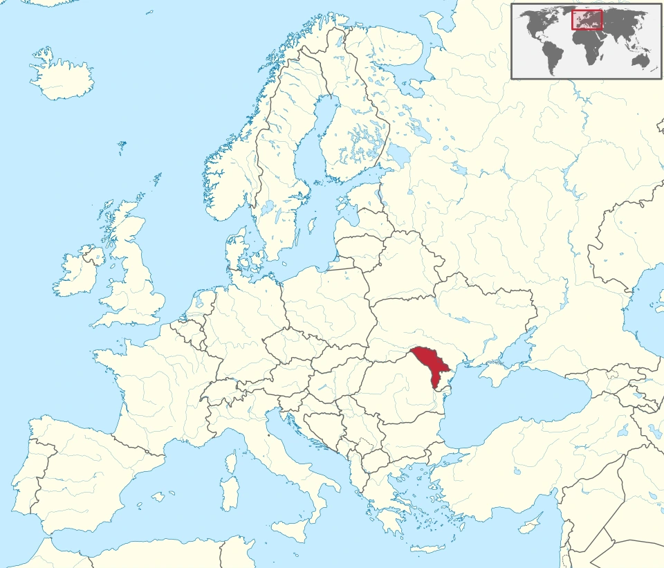 |

**认识国家／地区**：摩尔多瓦位于罗马尼亚与乌克兰之间，是东欧小型内陆国家，普鲁特河与德涅斯特河为重要定位线索。它与罗马尼亚具有语言和历史联系，但应作为独立的国家—首都组合记忆。

**认识首都／城市**：基希讷乌位于国家中部附近，城市沿比克河发展，是主要行政、教育和经济中心。中部丘陵和平缓河谷塑造城市环境。这个首都中文名称较拗口，建议与国名捆绑背，再用“罗乌之间、中部首都”作地图定位。

> **记忆钩子**：罗乌之间摩尔多瓦，中部基希讷乌。

**容易混淆**：德涅斯特河沿岸地区有复杂政治地位，不能据此把蒂拉斯波尔当作国家首都。

资料：[UNData 国家概况（统计快照）](https://data.un.org/legacy/en/iso/md.html) · [国家／地区背景](https://en.wikipedia.org/wiki/Moldova) · [首都／城市背景](https://en.wikipedia.org/wiki/Chi%C8%99in%C4%83u)

地图：[File:Moldova-CIA WFB Map.png；见原图来源页；Public domain](https://commons.wikimedia.org/wiki/File:Moldova-CIA_WFB_Map.png) · [File:Moldova in Europe.svg；TUBS；CC BY-SA 3.0](https://commons.wikimedia.org/wiki/File:Moldova_in_Europe.svg)

---

## 乌克兰 — 基辅

Ukraine · Kyiv · 东欧

| 国家／地区地图 | 欧洲位置图 |
|:---:|:---:|
| 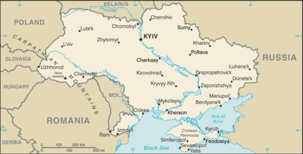 | 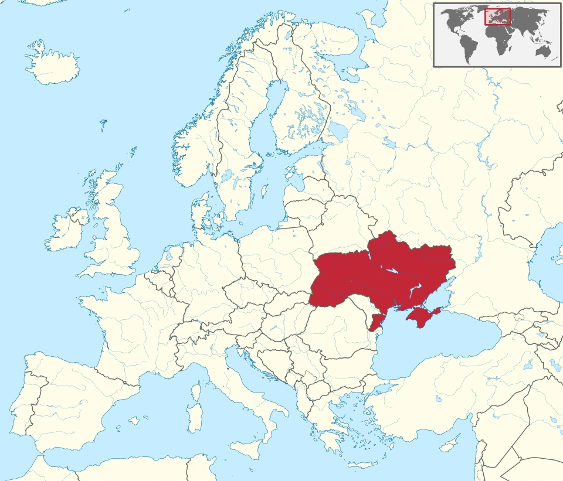 |

**认识国家／地区**：乌克兰位于东欧，南临黑海与亚速海，广阔平原和第聂伯河构成重要地理框架。国家城市分布可沿河流与海岸理解。领土与控制线涉及冲突，底图用于地理记忆，不应把图中绘法当作即时控制情况。

**认识首都／城市**：基辅位于乌克兰中北部、第聂伯河畔，是具有深厚历史的政治与文化中心。基辅罗斯历史和圣索菲亚大教堂等遗产构成背景。现代英文常用 Kyiv，中文仍通常写基辅；英文拼写变化不等于首都更换。

> **记忆钩子**：乌克兰第聂伯河畔，首都基辅 Kyiv。

**容易混淆**：基辅 Kyiv 与旧英文转写 Kiev 指同一城市；敖德萨不是首都。

资料：[UNData 国家概况（统计快照）](https://data.un.org/legacy/en/iso/ua.html) · [国家／地区背景](https://en.wikipedia.org/wiki/Ukraine) · [首都／城市背景](https://en.wikipedia.org/wiki/Kyiv)

地图：[File:Ukraine-CIA WFB Map.png；见原图来源页；Public domain](https://commons.wikimedia.org/wiki/File:Ukraine-CIA_WFB_Map.png) · [File:Ukraine in Europe.svg；TUBS；CC BY-SA 3.0](https://commons.wikimedia.org/wiki/File:Ukraine_in_Europe.svg)

---

## 白俄罗斯 — 明斯克

Belarus · Minsk · 东欧

| 国家／地区地图 | 欧洲位置图 |
|:---:|:---:|
| 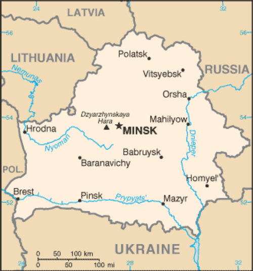 | 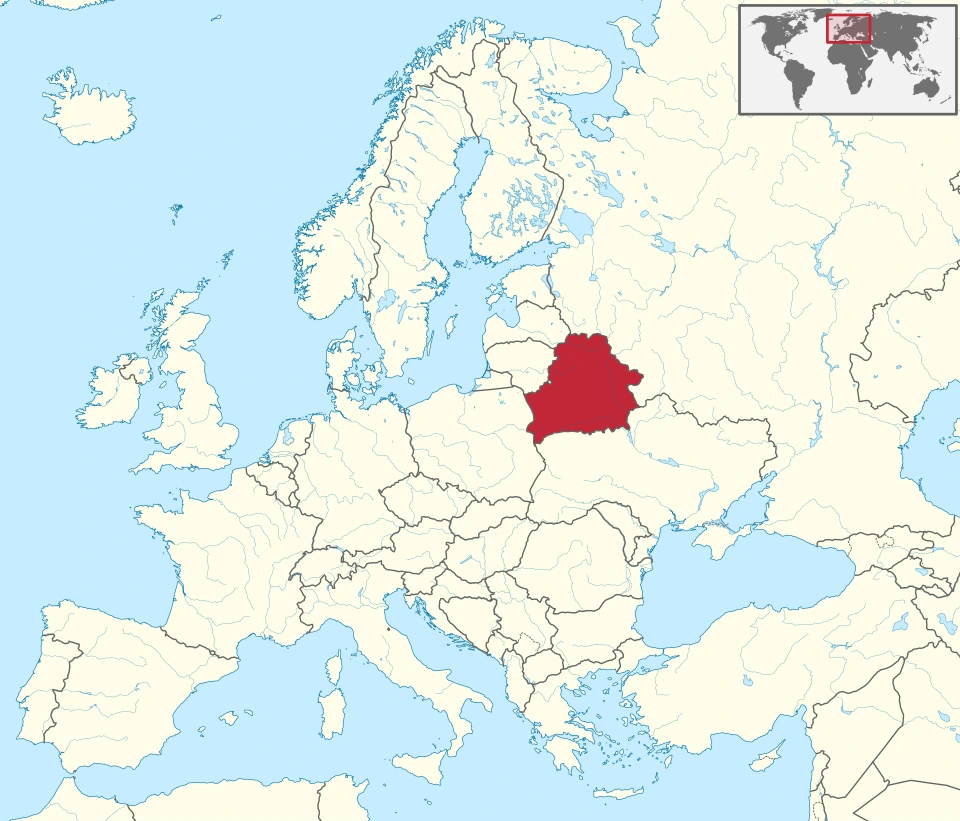 |

**认识国家／地区**：白俄罗斯位于东欧内陆，邻俄罗斯、乌克兰、波兰、立陶宛和拉脱维亚。平原、森林与湿地较多，国家地理上连接波罗的海附近地区与东欧腹地。中文国名虽含俄罗斯，仍是不同的国家。

**认识首都／城市**：明斯克位于白俄罗斯中部，斯维斯洛奇河穿过城区，是行政与交通中心。第二次世界大战后的大规模重建影响了今天的街道与公共建筑布局。记忆时可将“白俄罗斯中央、重建后的宽阔城市”与首都名联结。

> **记忆钩子**：白俄罗斯中央，首都明斯克。

**容易混淆**：白俄罗斯—明斯克；俄罗斯—莫斯科。

资料：[UNData 国家概况（统计快照）](https://data.un.org/legacy/en/iso/by.html) · [国家／地区背景](https://en.wikipedia.org/wiki/Belarus) · [首都／城市背景](https://en.wikipedia.org/wiki/Minsk)

地图：[File:Belarus-CIA WFB Map.png；United States Central Intelligence Agency；Public domain](https://commons.wikimedia.org/wiki/File:Belarus-CIA_WFB_Map.png) · [File:Belarus in Europe.svg；TUBS；CC BY-SA 3.0](https://commons.wikimedia.org/wiki/File:Belarus_in_Europe.svg)

---

## 俄罗斯 — 莫斯科

Russia · Moscow · 东欧

| 国家／地区地图 | 欧洲位置图 |
|:---:|:---:|
| 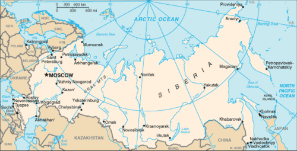 | 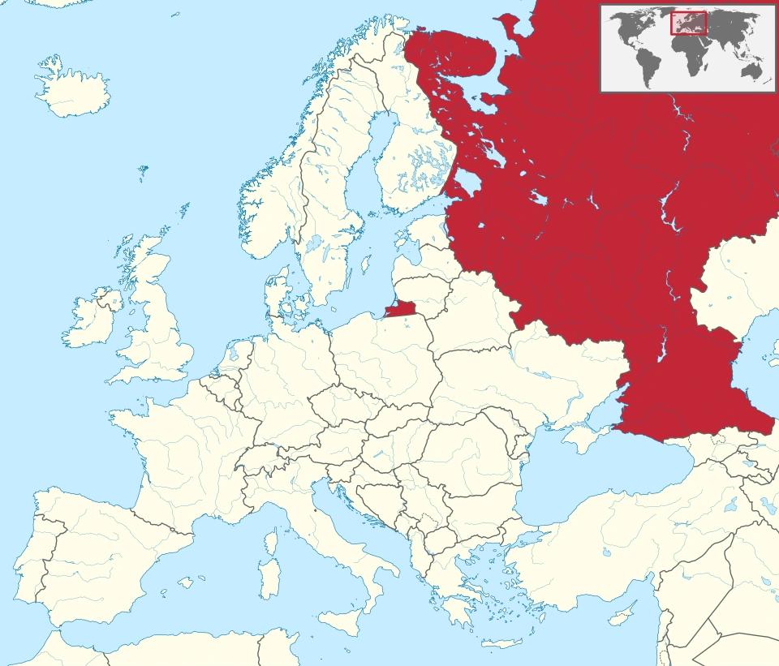 |

**认识国家／地区**：俄罗斯横跨欧洲与亚洲，乌拉尔山以东延展到西伯利亚和太平洋沿岸，是欧亚跨度很大的国家。大部分国土面积在亚洲，但主要人口与国家政治中心位于欧洲部分；本手册按 UN M49 放入欧洲主表。

**认识首都／城市**：莫斯科位于俄罗斯欧洲部分，莫斯科河流经城市，克里姆林宫和红场构成核心地标。圣彼得堡曾长期承担帝国首都角色，1918 年国家政治中心迁回莫斯科。用历史双城对比，可避免把知名度与首都身份混在一起。

> **记忆钩子**：俄罗斯横跨欧亚，欧洲部分莫斯科。

**容易混淆**：圣彼得堡是历史首都；现首都为莫斯科。洲内位置图不是只显示欧洲领土的国界裁切图。

资料：[UNData 国家概况（统计快照）](https://data.un.org/legacy/en/iso/ru.html) · [国家／地区背景](https://en.wikipedia.org/wiki/Russia) · [首都／城市背景](https://en.wikipedia.org/wiki/Moscow)

地图：[File:Russia-CIA WFB Map.png；CIA；Public domain](https://commons.wikimedia.org/wiki/File:Russia-CIA_WFB_Map.png) · [File:Russia in Europe.svg；TUBS；CC BY-SA 3.0](https://commons.wikimedia.org/wiki/File:Russia_in_Europe.svg)

---

# 非洲

| 国家／地区 | English | 首都／城市 | English |
|---|---|---|---|
| 埃及 | Egypt | 开罗 | Cairo |
| 利比亚 | Libya | 的黎波里 | Tripoli |
| 突尼斯 | Tunisia | 突尼斯市 | Tunis |
| 阿尔及利亚 | Algeria | 阿尔及尔 | Algiers |
| 摩洛哥 | Morocco | 拉巴特 | Rabat |
| 苏丹 | Sudan | 喀土穆 | Khartoum |
| 毛里塔尼亚 | Mauritania | 努瓦克肖特 | Nouakchott |
| 塞内加尔 | Senegal | 达喀尔 | Dakar |
| 冈比亚 | Gambia | 班珠尔 | Banjul |
| 佛得角 | Cape Verde | 普拉亚 | Praia |
| 几内亚比绍 | Guinea-Bissau | 比绍 | Bissau |
| 几内亚 | Guinea | 科纳克里 | Conakry |
| 塞拉利昂 | Sierra Leone | 弗里敦 | Freetown |
| 利比里亚 | Liberia | 蒙罗维亚 | Monrovia |
| 科特迪瓦 | Ivory Coast | 亚穆苏克罗 | Yamoussoukro |
| 加纳 | Ghana | 阿克拉 | Accra |
| 多哥 | Togo | 洛美 | Lomé |
| 贝宁 | Benin | 波多诺伏 | Porto-Novo |
| 尼日利亚 | Nigeria | 阿布贾 | Abuja |
| 尼日尔 | Niger | 尼亚美 | Niamey |
| 马里 | Mali | 巴马科 | Bamako |
| 布基纳法索 | Burkina Faso | 瓦加杜古 | Ouagadougou |
| 乍得 | Chad | 恩贾梅纳 | N'Djamena |
| 喀麦隆 | Cameroon | 雅温得 | Yaoundé |
| 中非共和国 | Central African Republic | 班吉 | Bangui |
| 赤道几内亚 | Equatorial Guinea | 和平城 | Ciudad de la Paz |
| 加蓬 | Gabon | 利伯维尔 | Libreville |
| 刚果共和国 | Republic of the Congo | 布拉柴维尔 | Brazzaville |
| 刚果民主共和国 | Democratic Republic of the Congo | 金沙萨 | Kinshasa |
| 圣多美和普林西比 | São Tomé and Príncipe | 圣多美 | São Tomé |
| 安哥拉 | Angola | 罗安达 | Luanda |
| 南苏丹 | South Sudan | 朱巴 | Juba |
| 埃塞俄比亚 | Ethiopia | 亚的斯亚贝巴 | Addis Ababa |
| 厄立特里亚 | Eritrea | 阿斯马拉 | Asmara |
| 吉布提 | Djibouti | 吉布提市 | Djibouti |
| 索马里 | Somalia | 摩加迪沙 | Mogadishu |
| 肯尼亚 | Kenya | 内罗毕 | Nairobi |
| 乌干达 | Uganda | 坎帕拉 | Kampala |
| 卢旺达 | Rwanda | 基加利 | Kigali |
| 布隆迪 | Burundi | 基特加 | Gitega |
| 坦桑尼亚 | Tanzania | 多多马 | Dodoma |
| 赞比亚 | Zambia | 卢萨卡 | Lusaka |
| 马拉维 | Malawi | 利隆圭 | Lilongwe |
| 莫桑比克 | Mozambique | 马普托 | Maputo |
| 津巴布韦 | Zimbabwe | 哈拉雷 | Harare |
| 马达加斯加 | Madagascar | 塔那那利佛 | Antananarivo |
| 科摩罗 | Comoros | 莫罗尼 | Moroni |
| 毛里求斯 | Mauritius | 路易港 | Port Louis |
| 塞舌尔 | Seychelles | 维多利亚 | Victoria |
| 南非 | South Africa | 比勒陀利亚／开普敦／布隆方丹 | Pretoria / Cape Town / Bloemfontein |
| 纳米比亚 | Namibia | 温得和克 | Windhoek |
| 博茨瓦纳 | Botswana | 哈博罗内 | Gaborone |
| 莱索托 | Lesotho | 马塞卢 | Maseru |
| 斯威士兰 | Eswatini | 姆巴巴内／洛班巴 | Mbabane / Lobamba |

## 埃及 — 开罗

Egypt · Cairo · 北非

| 国家／地区地图 | 非洲位置图 |
|:---:|:---:|
| 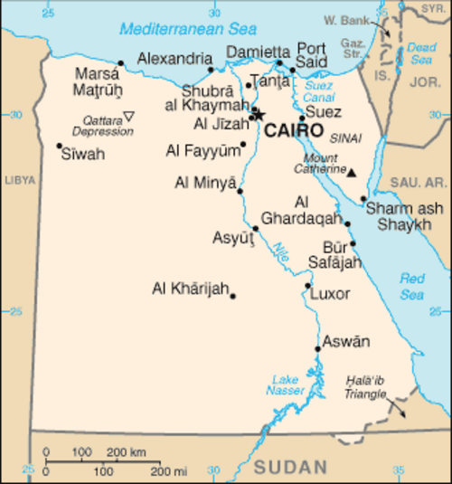 | 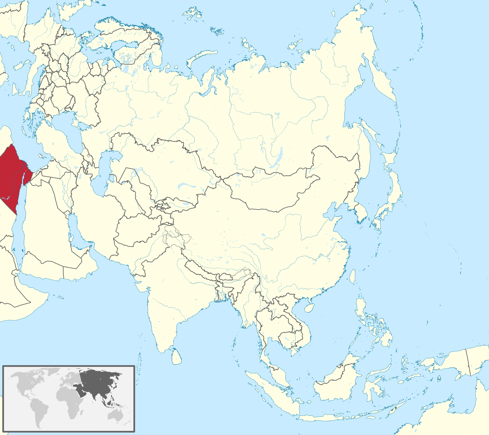 |

**认识国家／地区**：埃及横跨非洲东北部与亚洲西奈半岛，地中海、红海和苏伊士运河把它放在重要航路交点。大片国土是沙漠，人口和农业主要沿尼罗河及其三角洲分布。

**认识首都／城市**：开罗位于尼罗河三角洲南端，是长期的政治与文化中心，吉萨金字塔群在其西侧。新行政首都在开罗以东，政府机构陆续迁入；阅读资料时要分清传统首都名称与新的行政办公地点。

> **记忆钩子**：沿尼罗河北上，在三角洲入口找到开罗。

**容易混淆**：埃及归非洲；西奈半岛在亚洲。行政迁移另见说明。

资料：[UNData 国家概况（统计快照）](https://data.un.org/legacy/en/iso/eg.html) · [国家／地区背景](https://en.wikipedia.org/wiki/Egypt) · [首都／城市背景](https://en.wikipedia.org/wiki/Cairo) · [埃及官方：新行政首都与行政机构迁移](https://sis.gov.eg/en/media-center/press-releases/sis-refutes-economist-report-nac-is-an-integrated-development-project-serving-all-egyptians/)

地图：[File:Egypt-CIA WFB Map.png；CIA；Public domain](https://commons.wikimedia.org/wiki/File:Egypt-CIA_WFB_Map.png) · [File:Egypt in Africa (de-facto).svg；TUBS；CC BY-SA 3.0](https://commons.wikimedia.org/wiki/File:Egypt_in_Africa_(de-facto).svg)

---

## 利比亚 — 的黎波里

Libya · Tripoli · 北非

| 国家／地区地图 | 非洲位置图 |
|:---:|:---:|
| 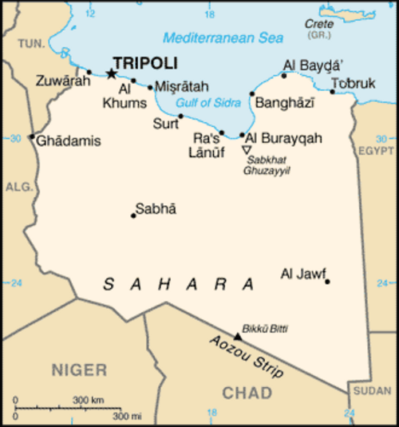 | 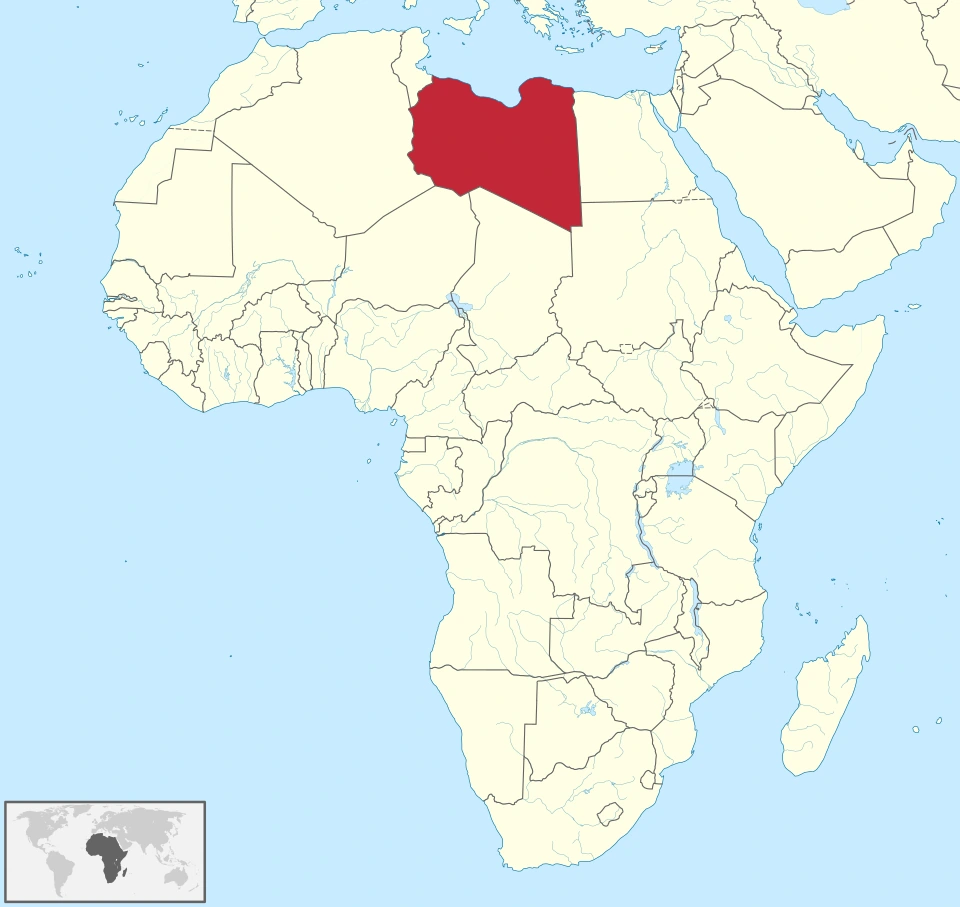 |

**认识国家／地区**：利比亚位于北非地中海南岸，西邻突尼斯和阿尔及利亚，东邻埃及。内陆主要是撒哈拉沙漠，沿海地带聚集城市；石油资源深刻影响其经济结构。

**认识首都／城市**：的黎波里坐落在西部海岸，有古老港口和城墙内的老城。它的名称源于古代“三城”概念；把首都记在靠近突尼斯的一侧，可与东部重要城市班加西区分。

> **记忆钩子**：利比亚西岸，的黎波里临海。

**容易混淆**：黎巴嫩也有名为的黎波里的城市，不能串国。

资料：[UNData 国家概况（统计快照）](https://data.un.org/legacy/en/iso/ly.html) · [国家／地区背景](https://en.wikipedia.org/wiki/Libya) · [首都／城市背景](https://en.wikipedia.org/wiki/Tripoli)

地图：[File:Libya-CIA WFB Map.png；CIA；Public domain](https://commons.wikimedia.org/wiki/File:Libya-CIA_WFB_Map.png) · [File:Libya in Africa.svg；TUBS；CC BY-SA 3.0](https://commons.wikimedia.org/wiki/File:Libya_in_Africa.svg)

---

## 突尼斯 — 突尼斯市

Tunisia · Tunis · 北非

| 国家／地区地图 | 非洲位置图 |
|:---:|:---:|
| 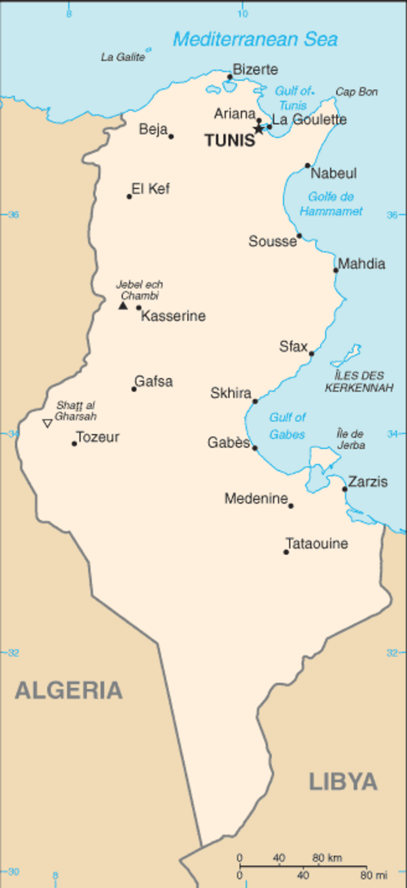 | 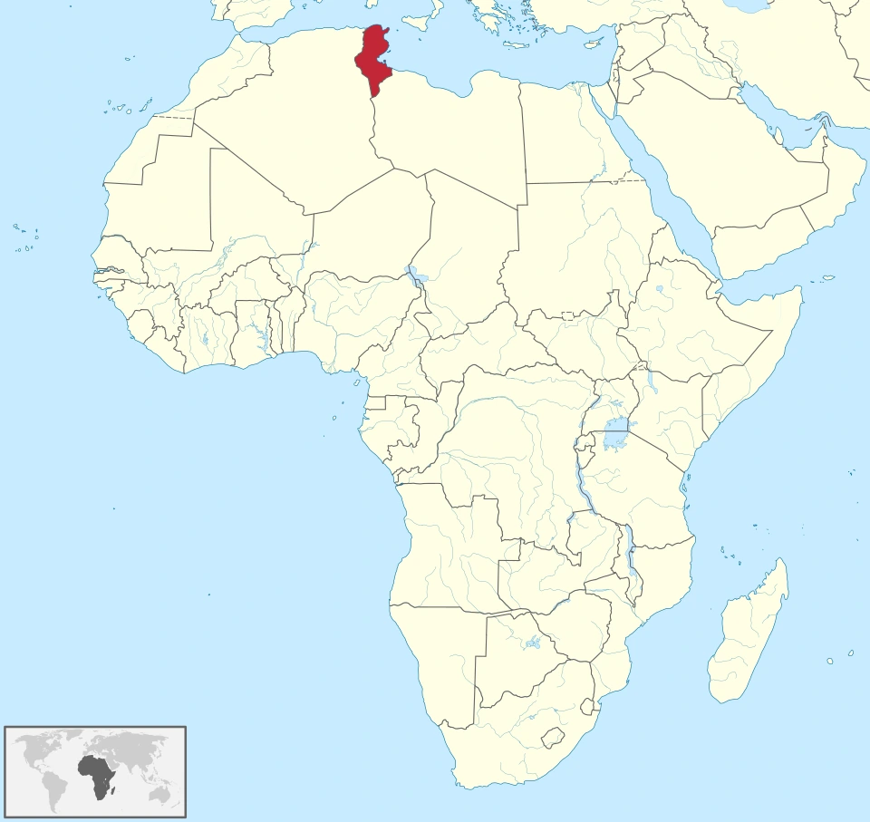 |

**认识国家／地区**：突尼斯是北非较小的沿海国家，夹在阿尔及利亚与利比亚之间。北部受地中海气候影响，向南逐渐过渡到干旱地区；古代迦太基遗址体现其悠久海洋联系。

**认识首都／城市**：突尼斯市位于北部、靠近突尼斯湾，城市与国家中文名称相同。传统麦地那和附近迦太基遗址是认识它的两条历史线索：一条通向阿拉伯城市生活，一条通向古地中海文明。

> **记忆钩子**：突尼斯的首都，就是突尼斯市。

**容易混淆**：国家同名首都；不要把古城迦太基当现首都。

资料：[UNData 国家概况（统计快照）](https://data.un.org/legacy/en/iso/tn.html) · [国家／地区背景](https://en.wikipedia.org/wiki/Tunisia) · [首都／城市背景](https://en.wikipedia.org/wiki/Tunis)

地图：[File:Tunisia-CIA WFB Map.png；见原图来源页；Public domain](https://commons.wikimedia.org/wiki/File:Tunisia-CIA_WFB_Map.png) · [File:Tunisia in Africa.svg；TUBS；CC BY-SA 3.0](https://commons.wikimedia.org/wiki/File:Tunisia_in_Africa.svg)

---

## 阿尔及利亚 — 阿尔及尔

Algeria · Algiers · 北非

| 国家／地区地图 | 非洲位置图 |
|:---:|:---:|
| 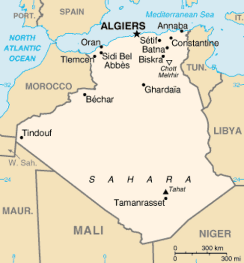 | 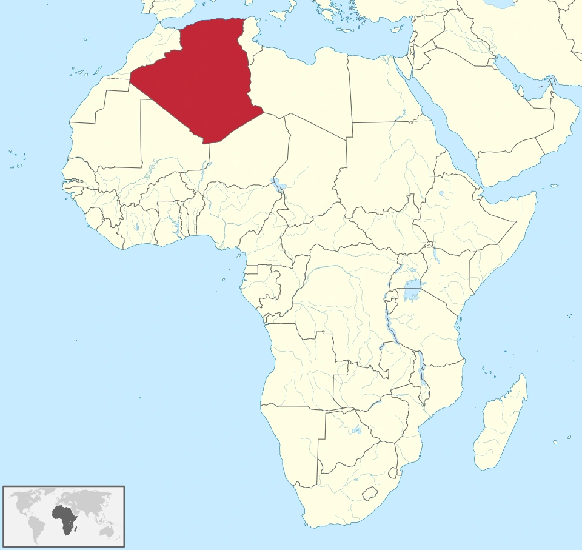 |

**认识国家／地区**：阿尔及利亚位于北非，北临地中海，南部深入撒哈拉。它是非洲面积最大的国家，主要城市多在北部沿海和山地；阿特拉斯山脉与沙漠构成鲜明的南北差异。

**认识首都／城市**：阿尔及尔建在北部海湾旁，山坡上的白色建筑使它常被称为“白城”。老城卡斯巴保留了密集街巷，港口和行政区则展现现代城市功能；记忆时抓住“北岸白城”的形象。

> **记忆钩子**：阿尔及利亚少一个“利亚”，首都是阿尔及尔。

**容易混淆**：国家名比首都名长，读音相似但不完全相同。

资料：[UNData 国家概况（统计快照）](https://data.un.org/legacy/en/iso/dz.html) · [国家／地区背景](https://en.wikipedia.org/wiki/Algeria) · [首都／城市背景](https://en.wikipedia.org/wiki/Algiers)

地图：[File:Algeria-CIA WFB Map.png；United States Central Intelligence Agency；Public domain](https://commons.wikimedia.org/wiki/File:Algeria_CIA_map.png) · [File:Algeria in Africa.svg；TUBS；CC BY-SA 3.0](https://commons.wikimedia.org/wiki/File:Algeria_in_Africa.svg)

---

## 摩洛哥 — 拉巴特

Morocco · Rabat · 北非

| 国家／地区地图 | 非洲位置图 |
|:---:|:---:|
| 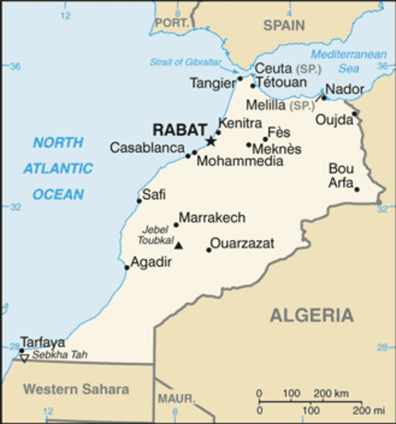 | 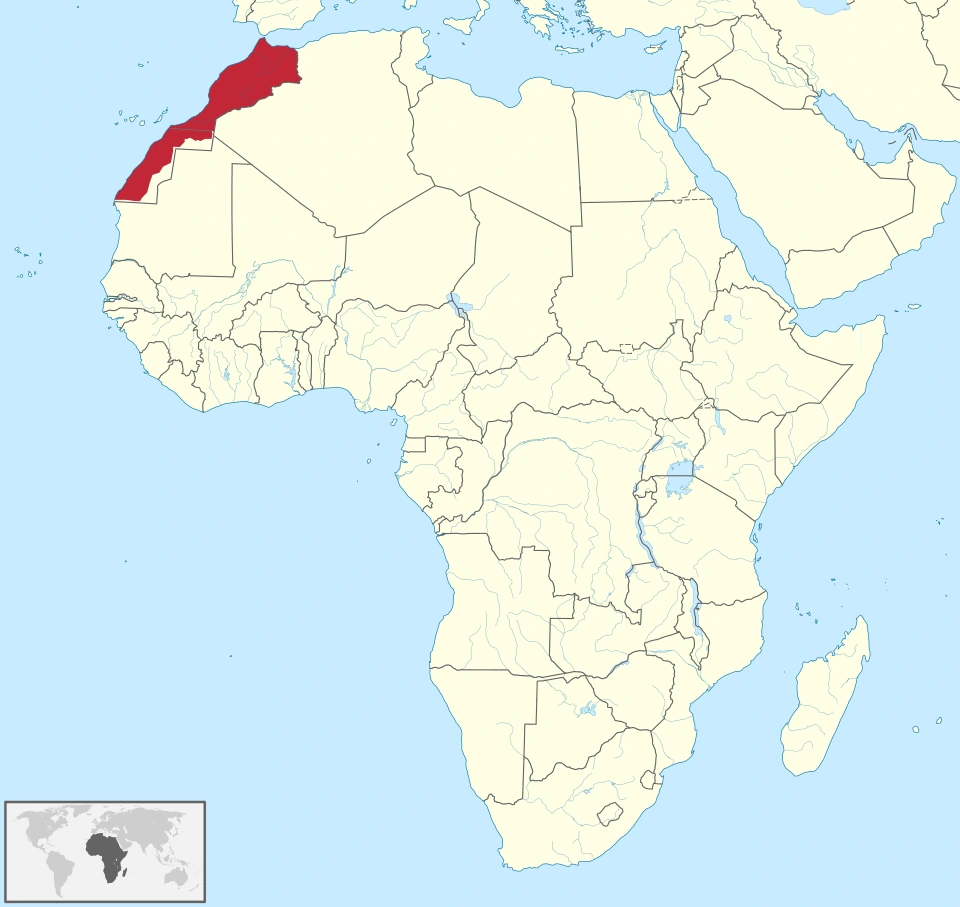 |

**认识国家／地区**：摩洛哥位于非洲西北角，北望直布罗陀海峡，西临大西洋。阿特拉斯山脉贯穿内陆，沿海城市、山地聚落与干旱地区并存；涉及西撒哈拉的地图需结合图源说明阅读。

**认识首都／城市**：拉巴特在大西洋岸、布雷格雷格河入海口南侧，与萨累隔河相望。它是行政首都，王宫和政府机构集中于此；规模更大的卡萨布兰卡偏重商业，马拉喀什则以历史城区闻名。

> **记忆钩子**：摩洛哥：王宫在拉巴特，商港是卡萨布兰卡。

**容易混淆**：卡萨布兰卡、马拉喀什都不是首都；边界涉及争议。

资料：[UNData 国家概况（统计快照）](https://data.un.org/legacy/en/iso/ma.html) · [国家／地区背景](https://en.wikipedia.org/wiki/Morocco) · [首都／城市背景](https://en.wikipedia.org/wiki/Rabat)

地图：[File:Morocco-CIA WFB Map.png；见原图来源页；Public domain](https://commons.wikimedia.org/wiki/File:Morocco-CIA_WFB_Map.png) · [File:Morocco in Africa (de-facto).svg；TUBS；CC BY-SA 3.0](https://commons.wikimedia.org/wiki/File:Morocco_in_Africa_(de-facto).svg)

---

## 苏丹 — 喀土穆

Sudan · Khartoum · 北非

| 国家／地区地图 | 非洲位置图 |
|:---:|:---:|
| 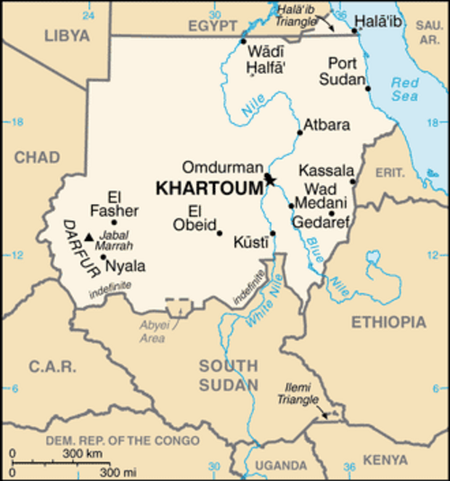 | 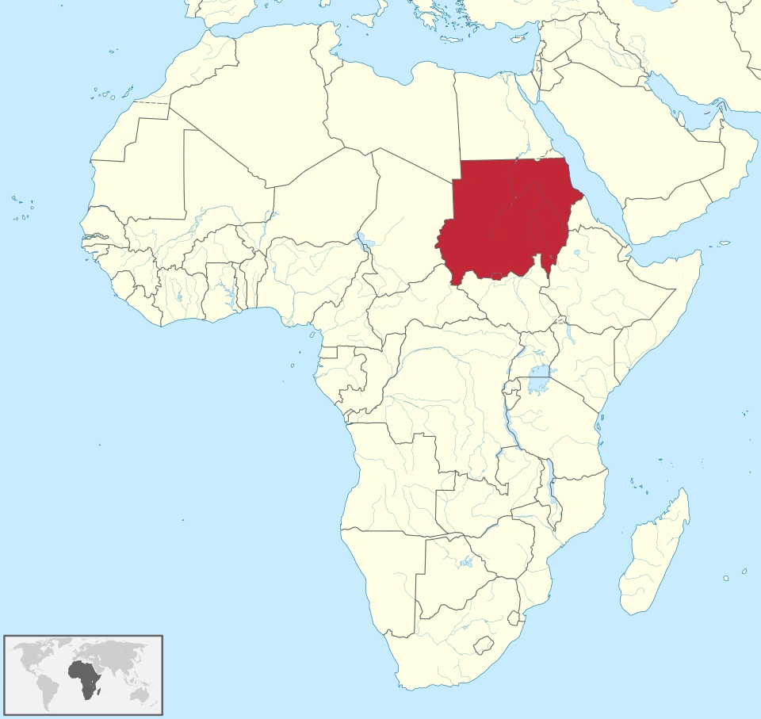 |

**认识国家／地区**：苏丹位于非洲东北部，东临红海，国土横跨沙漠和萨赫勒地带。尼罗河贯穿其人口较集中的区域；2011年南苏丹独立后，两国必须分别学习。

**认识首都／城市**：喀土穆处于青尼罗河与白尼罗河汇合地带，与恩图曼、北喀土穆组成相连的城市群。河流交汇是最清晰的位置线索；冲突期间政府办公地点变化，不宜直接理解成正式迁都。

> **记忆钩子**：两条尼罗河会合，想到喀土穆。

**容易混淆**：苏丹是喀土穆，南苏丹是朱巴；临时办公地点另辨。

资料：[UNData 国家概况（统计快照）](https://data.un.org/legacy/en/iso/sd.html) · [国家／地区背景](https://en.wikipedia.org/wiki/Sudan) · [首都／城市背景](https://en.wikipedia.org/wiki/Khartoum)

地图：[File:Sudan-CIA WFB Map.png；United States Central Intelligence Agency；Public domain](https://commons.wikimedia.org/wiki/File:Sudan-CIA_WFB_Map.png) · [File:Sudan in Africa (de-facto).svg；Stasyan117；CC BY-SA 4.0](https://commons.wikimedia.org/wiki/File:Sudan_in_Africa_(de-facto).svg)

---

## 毛里塔尼亚 — 努瓦克肖特

Mauritania · Nouakchott · 西非

| 国家／地区地图 | 非洲位置图 |
|:---:|:---:|
| 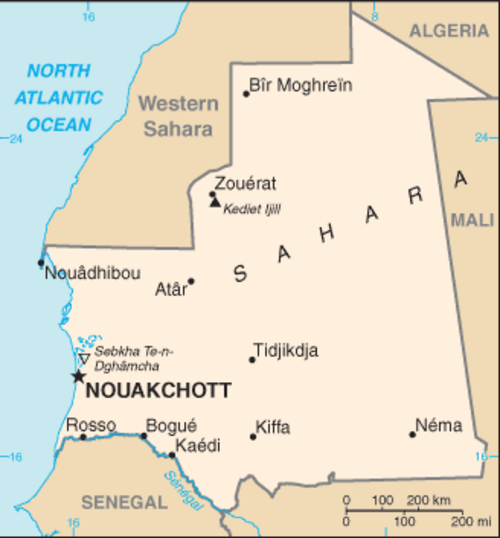 | 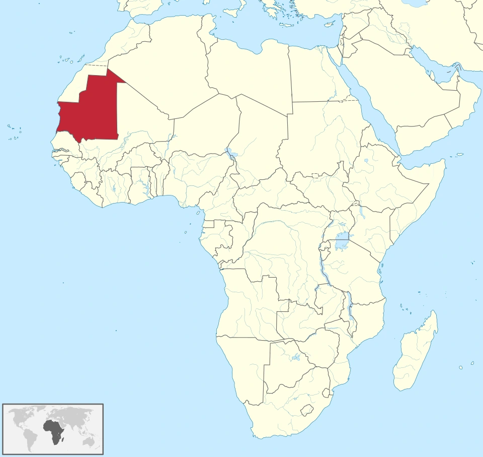 |

**认识国家／地区**：毛里塔尼亚位于非洲西北部大西洋岸，北部沙漠广阔，南部接近塞内加尔河。它连接马格里布与西非，传统游牧生活和沿海渔业都是理解国家地理的线索。

**认识首都／城市**：努瓦克肖特靠近西部海岸，作为独立时期的行政中心发展起来。城市位于沙漠与海洋相遇的地带，快速扩展的街区与渔港并存；记忆首都可把“沙海之间的新城”作为画面。

> **记忆钩子**：毛里塔尼亚长名字，配努瓦克肖特长名字。

**容易混淆**：毛里塔尼亚在非洲大陆，毛里求斯是印度洋岛国。

资料：[UNData 国家概况（统计快照）](https://data.un.org/legacy/en/iso/mr.html) · [国家／地区背景](https://en.wikipedia.org/wiki/Mauritania) · [首都／城市背景](https://en.wikipedia.org/wiki/Nouakchott)

地图：[File:Mauritania-CIA WFB Map.png；CIA；Public domain](https://commons.wikimedia.org/wiki/File:Mauritania-CIA_WFB_Map.png) · [File:Mauritania in Africa.svg；TUBS；CC BY-SA 3.0](https://commons.wikimedia.org/wiki/File:Mauritania_in_Africa.svg)

---

## 塞内加尔 — 达喀尔

Senegal · Dakar · 西非

| 国家／地区地图 | 非洲位置图 |
|:---:|:---:|
| 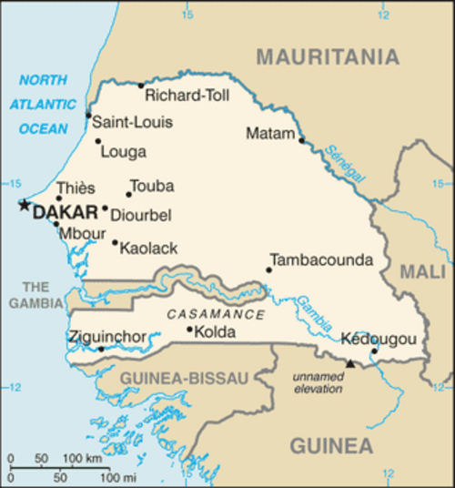 | 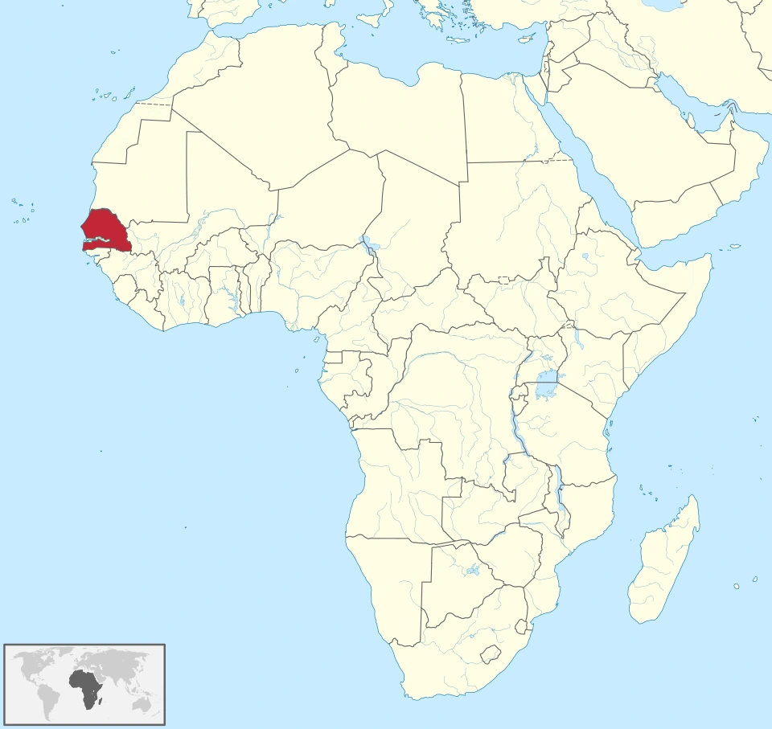 |

**认识国家／地区**：塞内加尔位于西非大西洋岸，塞内加尔河构成其北部的重要地理边界。冈比亚狭长地伸入其国土，因此地图上会看到一道沿河的嵌入；首都所在半岛尤其突出。

**认识首都／城市**：达喀尔位于佛得角半岛，是非洲大陆最西端附近的重要港城。它面向大西洋，历史上连接欧洲、西非与美洲；附近戈雷岛的历史也让这座城市成为理解大西洋联系的入口。

> **记忆钩子**：塞内加尔向西伸出半岛，尖端是达喀尔。

**容易混淆**：“达喀尔拉力赛”的名称不意味着比赛始终在此举行。

资料：[UNData 国家概况（统计快照）](https://data.un.org/legacy/en/iso/sn.html) · [国家／地区背景](https://en.wikipedia.org/wiki/Senegal) · [首都／城市背景](https://en.wikipedia.org/wiki/Dakar)

地图：[File:Senegal-CIA WFB Map.png；见原图来源页；Public domain](https://commons.wikimedia.org/wiki/File:Senegal-CIA_WFB_Map.png) · [File:Senegal in Africa.svg；TUBS；CC BY-SA 3.0](https://commons.wikimedia.org/wiki/File:Senegal_in_Africa.svg)

---

## 冈比亚 — 班珠尔

Gambia · Banjul · 西非

| 国家／地区地图 | 非洲位置图 |
|:---:|:---:|
| 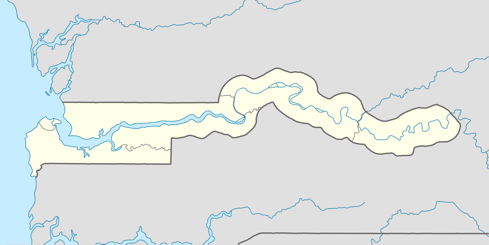 | 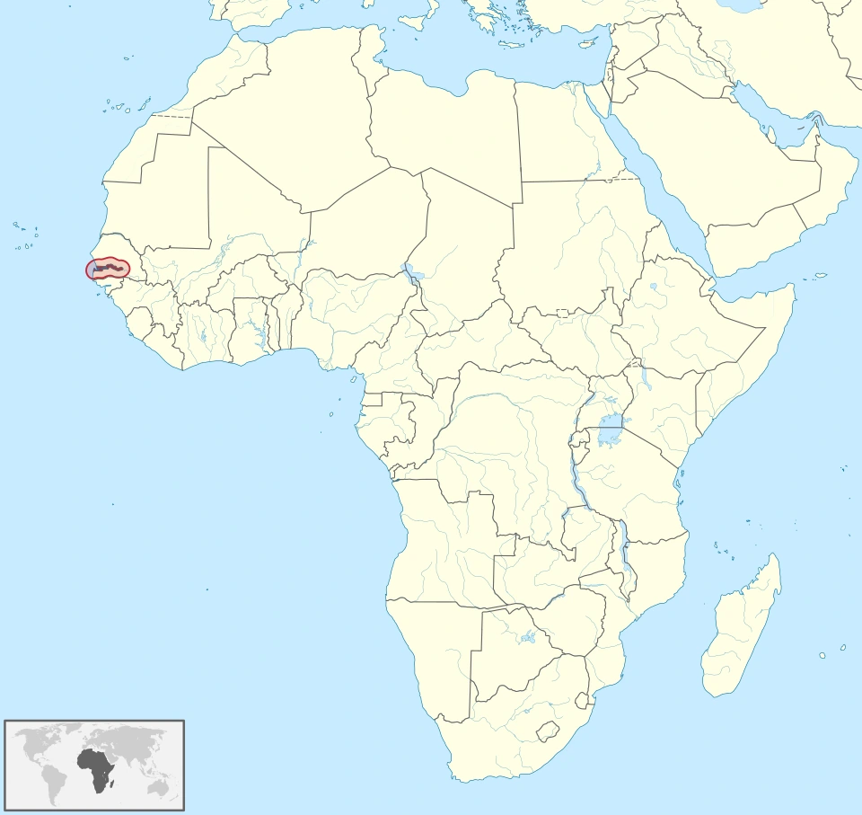 |

**认识国家／地区**：冈比亚是西非沿冈比亚河延伸的狭长国家，除大西洋出口外，大部分周边与塞内加尔相接。河道决定国土形状，也解释了城市、交通和农业分布。

**认识首都／城市**：班珠尔位于冈比亚河入海口附近的圣玛丽岛，是行政首都和港口。更大的城市聚集区还包括塞雷昆达；把首都放在河口，而不是狭长国土的中部，能迅速定位。

> **记忆钩子**：冈比亚像一条河带，班珠尔守河口。

**容易混淆**：班珠尔是首都，人口更大的塞雷昆达不是。

资料：[UNData 国家概况（统计快照）](https://data.un.org/legacy/en/iso/gm.html) · [国家／地区背景](https://en.wikipedia.org/wiki/The_Gambia) · [首都／城市背景](https://en.wikipedia.org/wiki/Banjul)

地图：[File:Gambia location map.svg；NordNordWest；CC BY-SA 3.0](https://commons.wikimedia.org/wiki/File:Gambia_location_map.svg) · [File:Gambia in Africa.svg；TUBS；CC BY-SA 3.0](https://commons.wikimedia.org/wiki/File:Gambia_in_Africa.svg)

---

## 佛得角 — 普拉亚

Cape Verde · Praia · 西非

| 国家／地区地图 | 非洲位置图 |
|:---:|:---:|
| 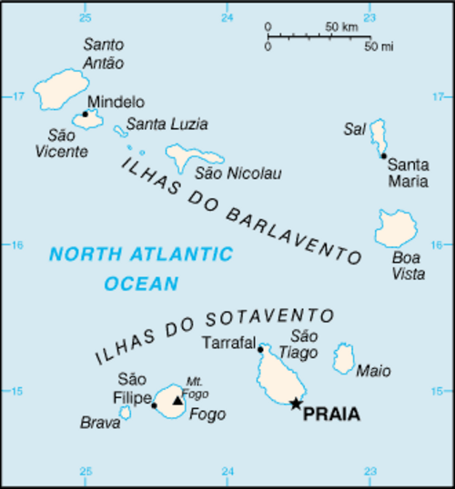 | 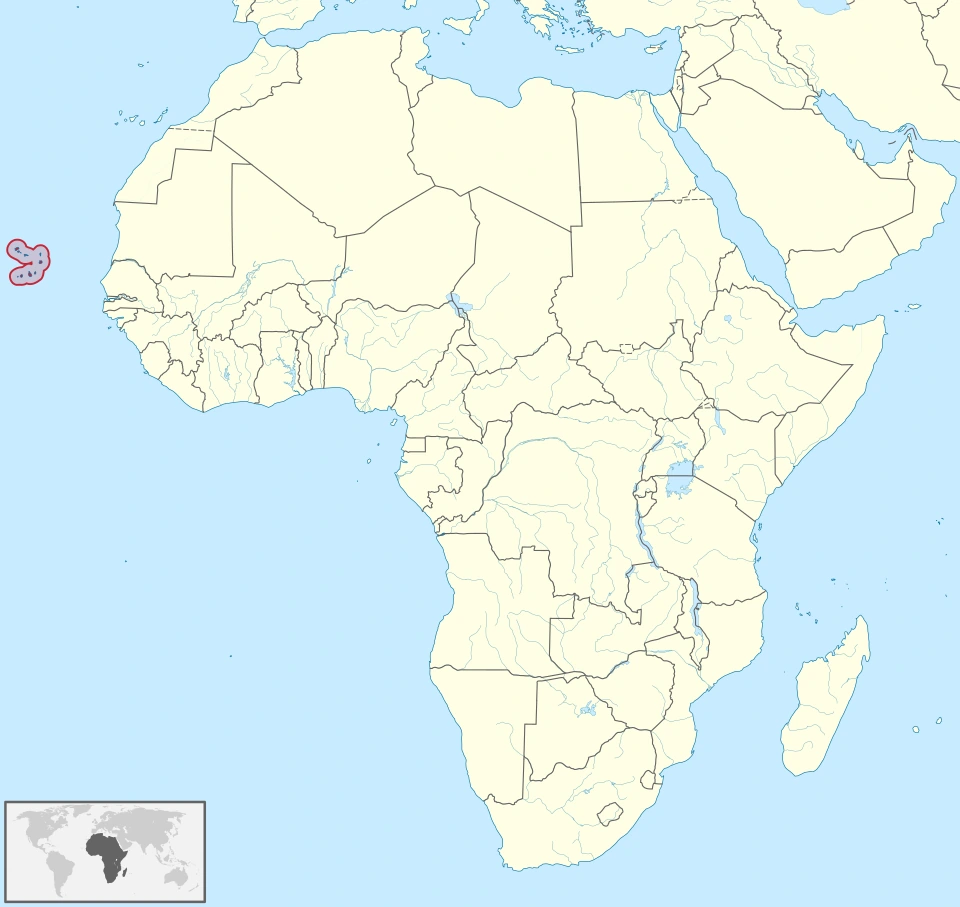 |

**认识国家／地区**：佛得角位于西非外海的大西洋上，由多座火山岛组成。名称虽然有“角”，却不是大陆上的半岛；岛屿之间距离和降水差异，使海运、航空及海外联系格外重要。

**认识首都／城市**：普拉亚在圣地亚哥岛南部，名字在葡萄牙语中有“海滩”之意。城市的高地老城区与沿岸街区相连，是政府和交通中心；学习时先找圣地亚哥岛，再找岛南岸的首都。

> **记忆钩子**：佛得角是群岛，普拉亚在圣地亚哥岛。

**容易混淆**：不要与塞内加尔的佛得角半岛混淆。

资料：[UNData 国家概况（统计快照）](https://data.un.org/legacy/en/iso/cv.html) · [国家／地区背景](https://en.wikipedia.org/wiki/Cape_Verde) · [首都／城市背景](https://en.wikipedia.org/wiki/Praia)

地图：[File:Cape Verde-CIA WFB Map.png；CIA；Public domain](https://commons.wikimedia.org/wiki/File:Cape_Verde-CIA_WFB_Map.png) · [File:Cape Verde in Africa.svg；TUBS；CC BY-SA 3.0](https://commons.wikimedia.org/wiki/File:Cape_Verde_in_Africa.svg)

---

## 几内亚比绍 — 比绍

Guinea-Bissau · Bissau · 西非

| 国家／地区地图 | 非洲位置图 |
|:---:|:---:|
| 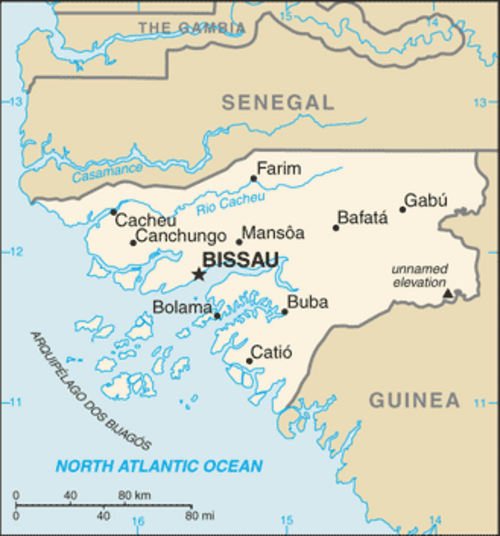 |  |

**认识国家／地区**：几内亚比绍位于西非海岸，邻接塞内加尔和几内亚。大陆沿岸河口众多，近海有比热戈斯群岛；“比绍”既帮助区分同名国家，也直接提示首都名称。

**认识首都／城市**：比绍位于热巴河口附近，是面向大西洋的港城。它由殖民时期的贸易据点发展为政治中心，沿岸位置有利于连接内陆河道与外海；国家名和首都名的重复最适合直接记忆。

> **记忆钩子**：几内亚比绍，首都就是比绍。

**容易混淆**：几内亚、几内亚比绍、赤道几内亚是三个国家。

资料：[UNData 国家概况（统计快照）](https://data.un.org/legacy/en/iso/gw.html) · [国家／地区背景](https://en.wikipedia.org/wiki/Guinea-Bissau) · [首都／城市背景](https://en.wikipedia.org/wiki/Bissau)

地图：[File:Guinea-Bissau-CIA WFB Map.png；见原图来源页；Public domain](https://commons.wikimedia.org/wiki/File:Guinea-Bissau-CIA_WFB_Map.png) · [File:Guinea-Bissau in Africa.svg；TUBS；CC BY-SA 3.0](https://commons.wikimedia.org/wiki/File:Guinea-Bissau_in_Africa.svg)

---

## 几内亚 — 科纳克里

Guinea · Conakry · 西非

| 国家／地区地图 | 非洲位置图 |
|:---:|:---:|
| 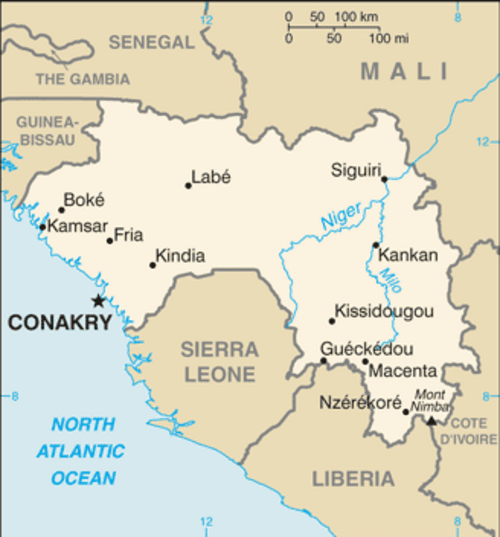 | 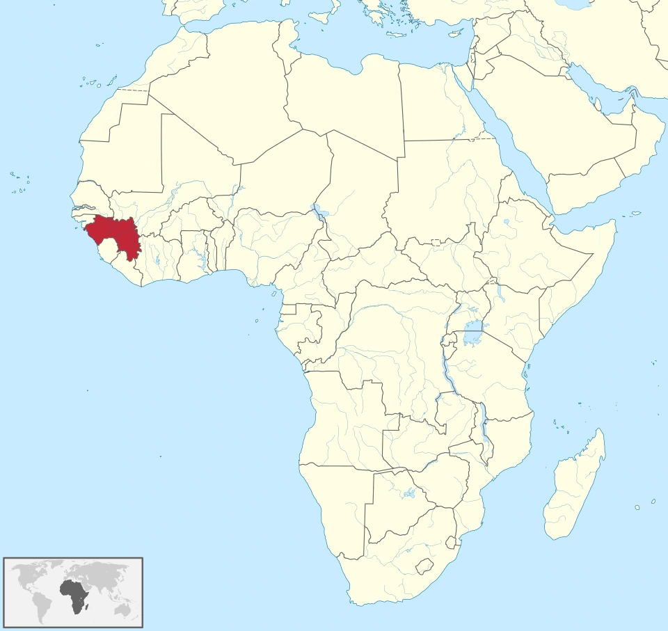 |

**认识国家／地区**：几内亚位于西非大西洋岸，境内高地是多条西非大河的源头地区。沿海平原、富塔贾隆高地和内陆森林带差异明显；铝土矿资源也是认识其经济的一条线索。

**认识首都／城市**：科纳克里位于西部海岸，由岛屿和向海伸出的半岛发展而来。它是港口、行政和商业中心；狭长的城市形态与国土内陆的山地形成对照，记忆时可想象“海边细长首都”。

> **记忆钩子**：几内亚在海岸，科纳克里伸向海。

**容易混淆**：科纳克里属于几内亚，不属于几内亚比绍。

资料：[UNData 国家概况（统计快照）](https://data.un.org/legacy/en/iso/gn.html) · [国家／地区背景](https://en.wikipedia.org/wiki/Guinea) · [首都／城市背景](https://en.wikipedia.org/wiki/Conakry)

地图：[File:Guinea-CIA WFB Map.png；见原图来源页；Public domain](https://commons.wikimedia.org/wiki/File:Guinea-CIA_WFB_Map.png) · [File:Guinea in Africa.svg；TUBS；CC BY-SA 3.0](https://commons.wikimedia.org/wiki/File:Guinea_in_Africa.svg)

---

## 塞拉利昂 — 弗里敦

Sierra Leone · Freetown · 西非

| 国家／地区地图 | 非洲位置图 |
|:---:|:---:|
| 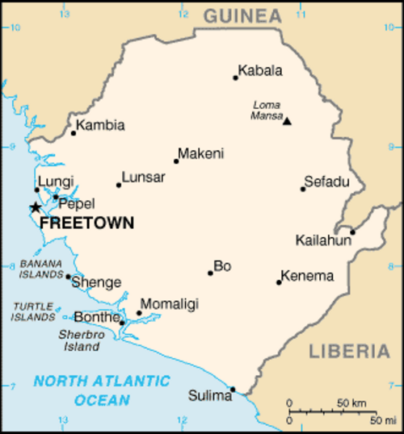 | 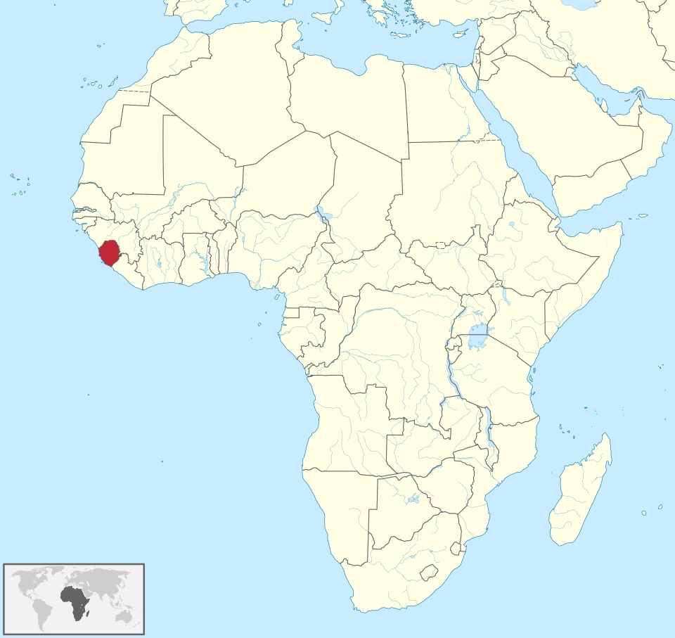 |

**认识国家／地区**：塞拉利昂位于西非海岸，邻接几内亚和利比里亚。沿海山地、河口和平原共同构成国家景观；国名常被解释为“狮子山”，可以帮助建立山与海相遇的印象。

**认识首都／城市**：弗里敦位于西部半岛，面向宽阔的天然港湾。城市历史与获释非洲人及反奴隶贸易活动有关，英文名意为“自由城”；将历史含义和海湾位置一起记，比单纯背音节更牢固。

> **记忆钩子**：塞拉利昂的“自由城”，就是弗里敦。

**容易混淆**：Freetown可直译自由城，中文通用译名是弗里敦。

资料：[UNData 国家概况（统计快照）](https://data.un.org/legacy/en/iso/sl.html) · [国家／地区背景](https://en.wikipedia.org/wiki/Sierra_Leone) · [首都／城市背景](https://en.wikipedia.org/wiki/Freetown)

地图：[File:Sierra Leone-CIA WFB Map.png；CIA；Public domain](https://commons.wikimedia.org/wiki/File:Sierra_Leone-CIA_WFB_Map.png) · [File:Sierra Leone in Africa.svg；TUBS；CC BY-SA 3.0](https://commons.wikimedia.org/wiki/File:Sierra_Leone_in_Africa.svg)

---

## 利比里亚 — 蒙罗维亚

Liberia · Monrovia · 西非

| 国家／地区地图 | 非洲位置图 |
|:---:|:---:|
| 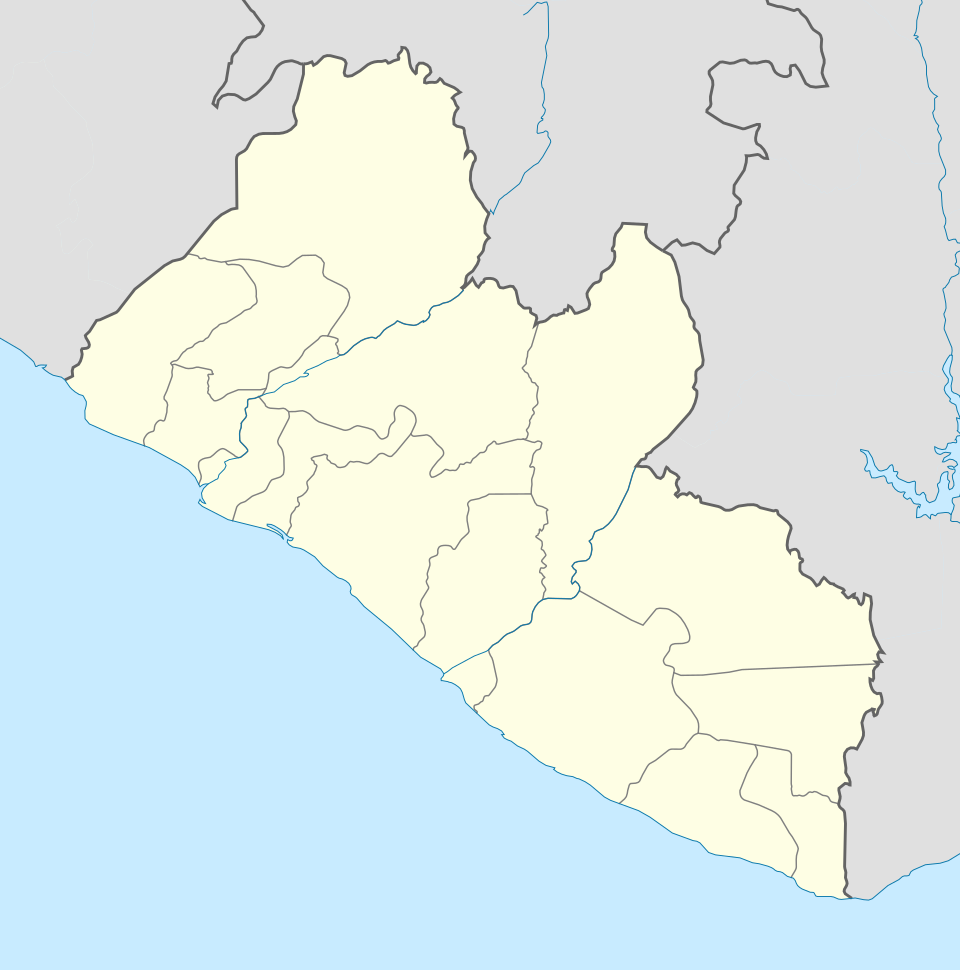 | 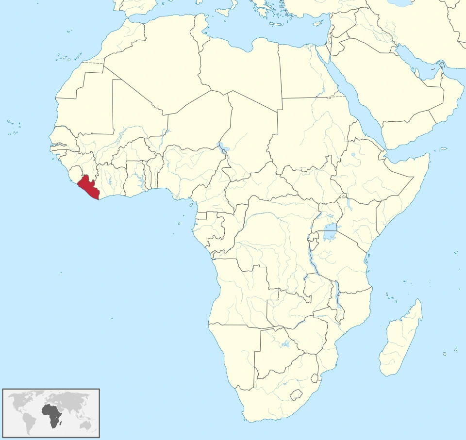 |

**认识国家／地区**：利比里亚位于西非大西洋岸，邻接塞拉利昂、几内亚和科特迪瓦。现代国家形成与来自美国的自由黑人移民有关，这一历史背景也体现在国名和首都命名中。

**认识首都／城市**：蒙罗维亚位于梅苏拉多河口附近，临大西洋。城市名称纪念美国总统詹姆斯·门罗，是政府与港口中心；把“利比里亚的移民历史—门罗—蒙罗维亚”连成一条记忆链即可。

> **记忆钩子**：利比里亚的历史联系门罗，首都蒙罗维亚。

**容易混淆**：门罗是命名来源，不是当地地理词语。

资料：[UNData 国家概况（统计快照）](https://data.un.org/legacy/en/iso/lr.html) · [国家／地区背景](https://en.wikipedia.org/wiki/Liberia) · [首都／城市背景](https://en.wikipedia.org/wiki/Monrovia)

地图：[File:Liberia location map.svg；Uwe Dedering；CC BY-SA 3.0](https://commons.wikimedia.org/wiki/File:Liberia_location_map.svg) · [File:Liberia in Africa.svg；TUBS；CC BY-SA 3.0](https://commons.wikimedia.org/wiki/File:Liberia_in_Africa.svg)

---

## 科特迪瓦 — 亚穆苏克罗

Ivory Coast · Yamoussoukro · 西非

| 国家／地区地图 | 非洲位置图 |
|:---:|:---:|
| 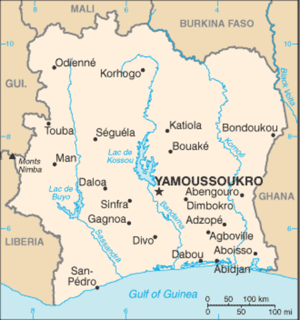 | 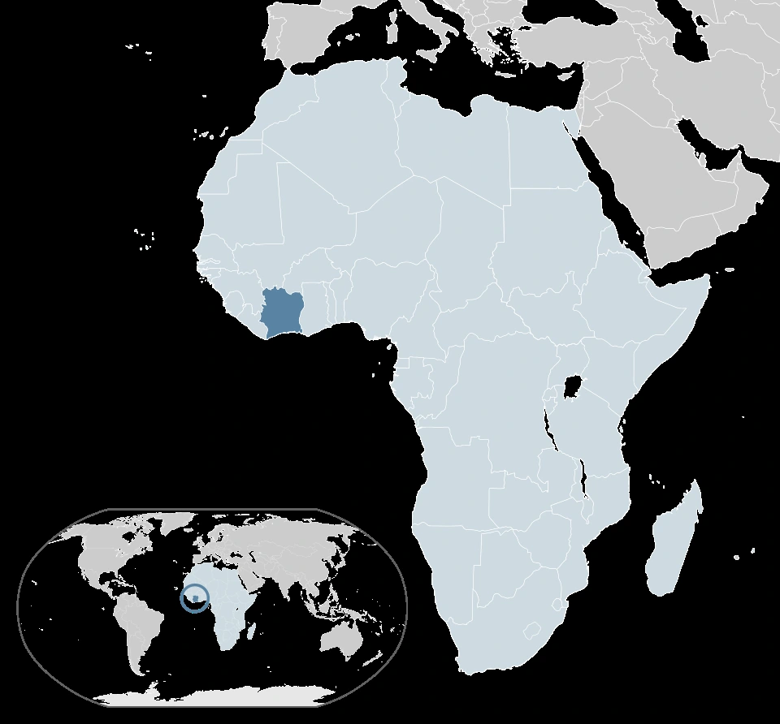 |

**认识国家／地区**：科特迪瓦位于西非几内亚湾北岸，南部湿润、北部较干。国名意为“象牙海岸”，可用于联想旧时贸易；可可生产和海港城市是理解其经济与空间分布的线索。

**认识首都／城市**：亚穆苏克罗在内陆，是1983年确立的政治首都；原首都阿比让仍承担重要经济和行政功能。首都以开阔规划和大型宗教建筑闻名，学习时要同时记住“内陆首都、沿海大城”的分工。

> **记忆钩子**：科特迪瓦：内陆亚穆苏克罗，海边阿比让。

**容易混淆**：不要因为阿比让更大、更常见就把它写成首都。

资料：[UNData 国家概况（统计快照）](https://data.un.org/legacy/en/iso/ci.html) · [国家／地区背景](https://en.wikipedia.org/wiki/Ivory_Coast) · [首都／城市背景](https://en.wikipedia.org/wiki/Yamoussoukro)

地图：[File:Cote d'Ivoire-CIA WFB Map.png；CIA；Public domain](https://commons.wikimedia.org/wiki/File:Cote_d%27Ivoire-CIA_WFB_Map.png) · [File:Location Côte d'Ivoire AU Africa.svg；Alvaro1984 18；Public domain](https://commons.wikimedia.org/wiki/File:Location_C%C3%B4te_d%27Ivoire_AU_Africa.svg)

---

## 加纳 — 阿克拉

Ghana · Accra · 西非

| 国家／地区地图 | 非洲位置图 |
|:---:|:---:|
| 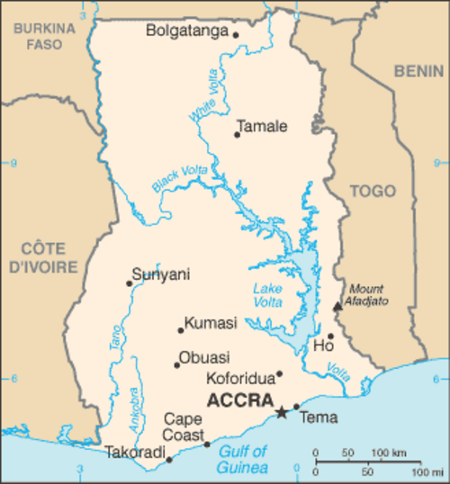 | 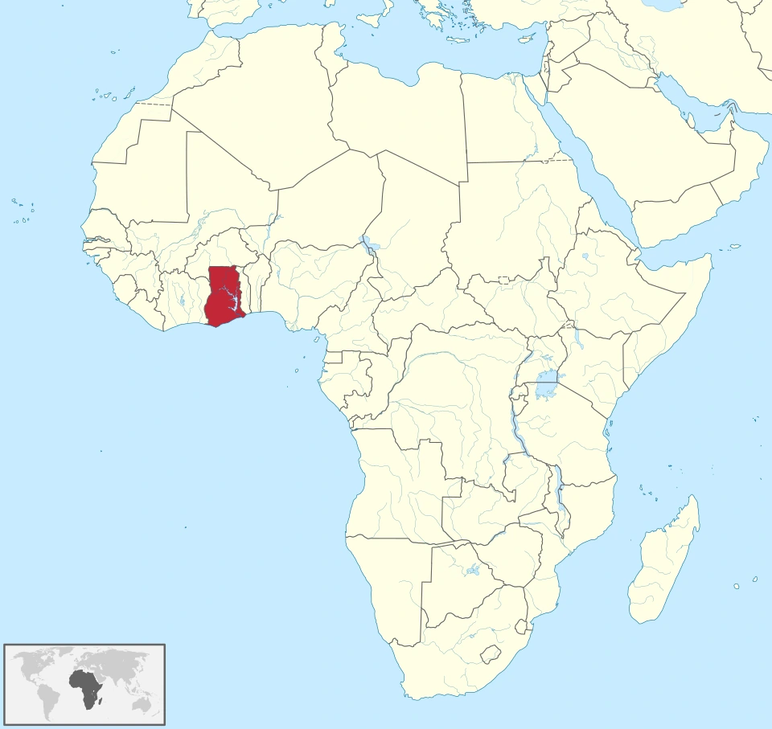 |

**认识国家／地区**：加纳位于西非几内亚湾岸，西邻科特迪瓦、东邻多哥。内陆沃尔特河系统与大型水库影响交通和电力；黄金海岸的历史名称，也提示其资源与海上贸易传统。

**认识首都／城市**：阿克拉位于东南部海岸，紧邻几内亚湾，是行政与商业中心。现代街区、传统聚落和海岸城堡反映不同历史阶段；记忆首都位置时，注意它靠海，且偏向国土东侧。

> **记忆钩子**：加纳靠海，阿克拉在东南岸。

**容易混淆**：阿克拉是首都，库马西是另一重要历史与商业城市。

资料：[UNData 国家概况（统计快照）](https://data.un.org/legacy/en/iso/gh.html) · [国家／地区背景](https://en.wikipedia.org/wiki/Ghana) · [首都／城市背景](https://en.wikipedia.org/wiki/Accra)

地图：[File:Ghana-CIA WFB Map.png；CIA；Public domain](https://commons.wikimedia.org/wiki/File:Ghana-CIA_WFB_Map.png) · [File:Ghana in Africa.svg；TUBS；CC BY-SA 3.0](https://commons.wikimedia.org/wiki/File:Ghana_in_Africa.svg)

---

## 多哥 — 洛美

Togo · Lomé · 西非

| 国家／地区地图 | 非洲位置图 |
|:---:|:---:|
| 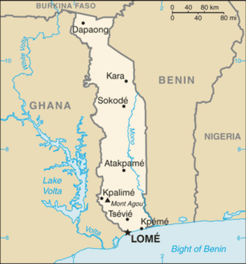 | 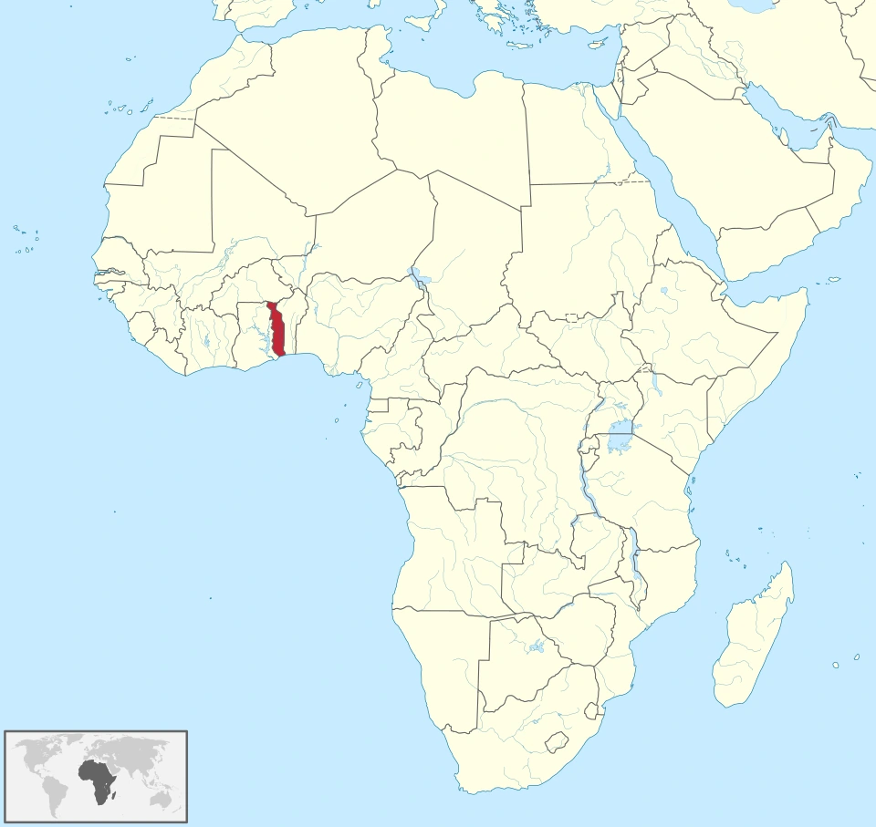 |

**认识国家／地区**：多哥位于西非，是从几内亚湾向北延伸的狭长国家，夹在加纳与贝宁之间。短海岸与较长的南北轴线形成鲜明外形，地形由沿海平原过渡到内陆高地。

**认识首都／城市**：洛美位于最南端海岸，紧靠与加纳相邻的国境，是港口和首都。沿海位置让城市承担国际贸易功能；看地图时抓住“狭长国家底端、靠西边界”的位置便能定位。

> **记忆钩子**：多哥是一条长带，洛美在海边底端。

**容易混淆**：洛美在多哥；邻国贝宁的首都是波多诺伏。

资料：[UNData 国家概况（统计快照）](https://data.un.org/legacy/en/iso/tg.html) · [国家／地区背景](https://en.wikipedia.org/wiki/Togo) · [首都／城市背景](https://en.wikipedia.org/wiki/Lom%C3%A9)

地图：[File:Togo-CIA WFB Map.png；见原图来源页；Public domain](https://commons.wikimedia.org/wiki/File:Togo-CIA_WFB_Map.png) · [File:Togo in Africa.svg；TUBS；CC BY-SA 3.0](https://commons.wikimedia.org/wiki/File:Togo_in_Africa.svg)

---

## 贝宁 — 波多诺伏

Benin · Porto-Novo · 西非

| 国家／地区地图 | 非洲位置图 |
|:---:|:---:|
| 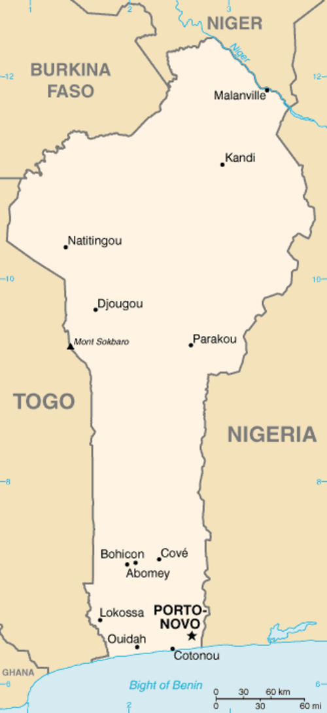 | 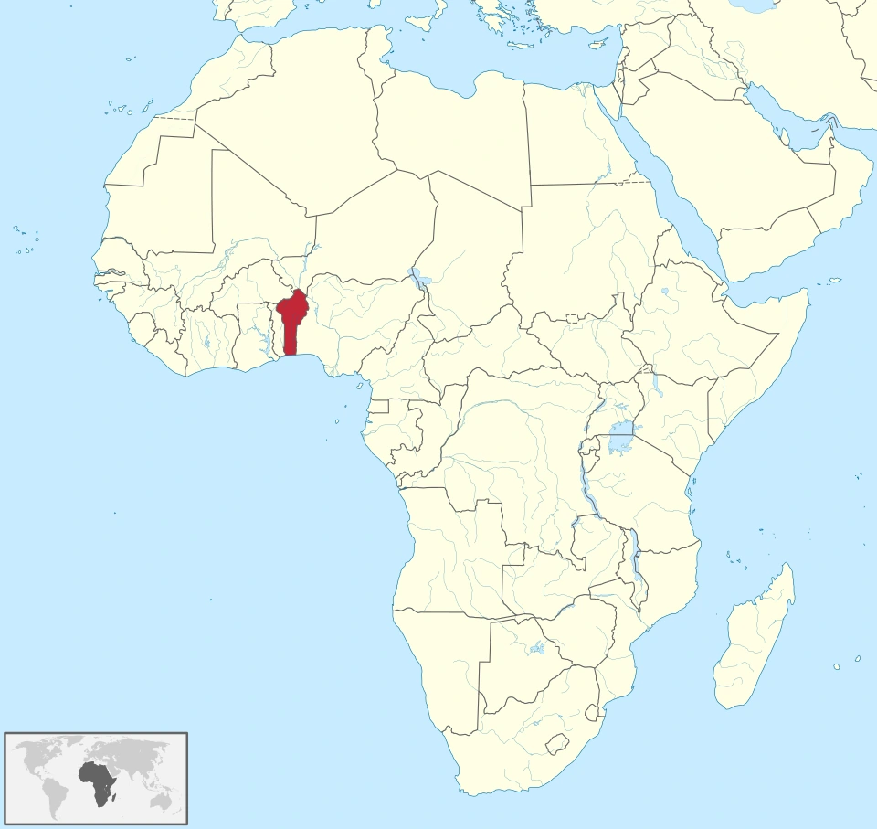 |

**认识国家／地区**：贝宁位于西非，南临几内亚湾，西邻多哥、东邻尼日利亚。国土向北扩展，历史上的达荷美王国与沿海贸易遗迹，为认识国家文化提供背景。

**认识首都／城市**：波多诺伏位于东南部潟湖一带，是正式首都；政府主要办公机构及重要商业活动则集中在科托努。两城相距不远，容易被简化资料混用，因此要把法律首都与行政活动地点一起记住。

> **记忆钩子**：贝宁正式首都波多诺伏，政府多在科托努。

**容易混淆**：科托努是主要行政与经济中心，不能替代正式首都名。

资料：[UNData 国家概况（统计快照）](https://data.un.org/legacy/en/iso/bj.html) · [国家／地区背景](https://en.wikipedia.org/wiki/Benin) · [首都／城市背景](https://en.wikipedia.org/wiki/Porto-Novo)

地图：[File:Benin-CIA WFB Map.png；United States Central Intelligence Agency；Public domain](https://commons.wikimedia.org/wiki/File:Benin-CIA_WFB_Map.png) · [File:Benin in Africa.svg；TUBS；CC BY-SA 3.0](https://commons.wikimedia.org/wiki/File:Benin_in_Africa.svg)

---

## 尼日利亚 — 阿布贾

Nigeria · Abuja · 西非

| 国家／地区地图 | 非洲位置图 |
|:---:|:---:|
| 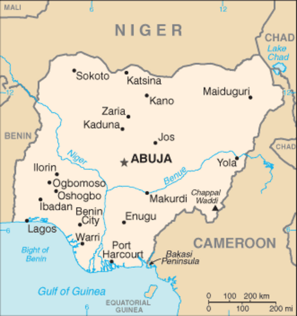 | 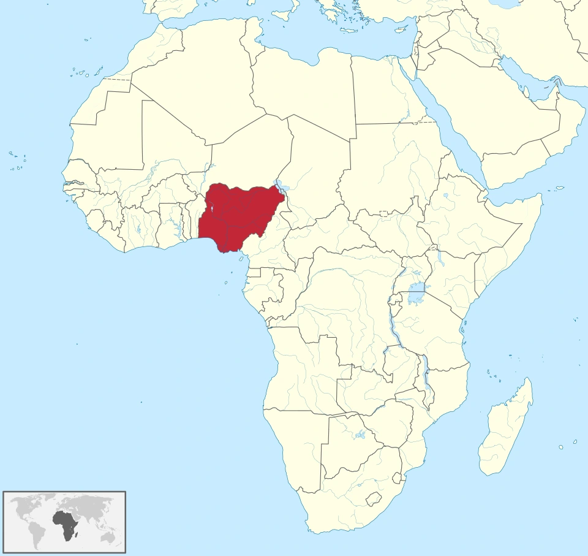 |

**认识国家／地区**：尼日利亚位于西非几内亚湾岸，尼日尔河与贝努埃河在内陆汇合。人口、语言与区域文化多样，南部海岸和北部内陆差异鲜明；不要把它与邻国尼日尔混为一国。

**认识首都／城市**：阿布贾位于内陆较居中的地区，1991年取代拉各斯成为首都。规划新城的选择旨在缓解旧首都压力，并提供较中性的行政位置；拉各斯仍是规模庞大的商业与港口都市。

> **记忆钩子**：尼日利亚迁向内陆，首都阿布贾。

**容易混淆**：拉各斯是旧首都；尼日尔的首都是尼亚美。

资料：[UNData 国家概况（统计快照）](https://data.un.org/legacy/en/iso/ng.html) · [国家／地区背景](https://en.wikipedia.org/wiki/Nigeria) · [首都／城市背景](https://en.wikipedia.org/wiki/Abuja)

地图：[File:Nigeria-CIA WFB Map.png；CIA；Public domain](https://commons.wikimedia.org/wiki/File:Nigeria-CIA_WFB_Map.png) · [File:Nigeria in Africa.svg；TUBS；CC BY-SA 3.0](https://commons.wikimedia.org/wiki/File:Nigeria_in_Africa.svg)

---

## 尼日尔 — 尼亚美

Niger · Niamey · 西非

| 国家／地区地图 | 非洲位置图 |
|:---:|:---:|
| 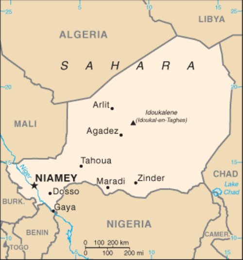 | 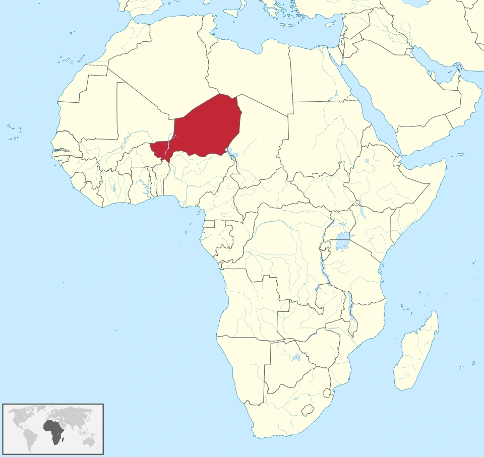 |

**认识国家／地区**：尼日尔是西非内陆国家，北部深入撒哈拉，南部接近萨赫勒农业带。国名来自尼日尔河，但河流仅经过其西南角；大片沙漠与较集中的南部人口带形成对照。

**认识首都／城市**：尼亚美位于西南部尼日尔河畔，靠近布基纳法索与贝宁方向。它是行政、教育和交通中心；首都并不在国土几何中心，河水与通道条件比沙漠面积更能解释其位置。

> **记忆钩子**：尼日尔河边的尼亚美，国家和首都都带“尼”。

**容易混淆**：尼日尔—尼亚美；尼日利亚—阿布贾。

资料：[UNData 国家概况（统计快照）](https://data.un.org/legacy/en/iso/ne.html) · [国家／地区背景](https://en.wikipedia.org/wiki/Niger) · [首都／城市背景](https://en.wikipedia.org/wiki/Niamey)

地图：[File:Niger-CIA WFB Map.png；CIA；Public domain](https://commons.wikimedia.org/wiki/File:Niger-CIA_WFB_Map.png) · [File:Niger in Africa.svg；TUBS；CC BY-SA 3.0](https://commons.wikimedia.org/wiki/File:Niger_in_Africa.svg)

---

## 马里 — 巴马科

Mali · Bamako · 西非

| 国家／地区地图 | 非洲位置图 |
|:---:|:---:|
| 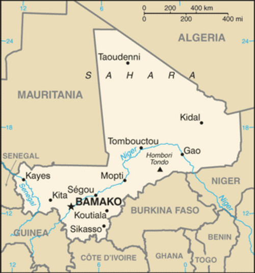 | 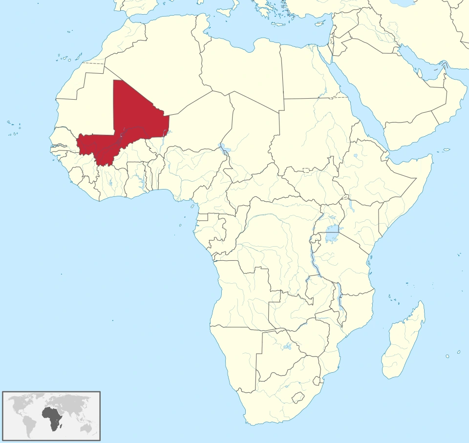 |

**认识国家／地区**：马里是西非内陆国家，北部撒哈拉与南部较湿润地区差异很大。尼日尔河构成重要交通与农业走廊；廷巴克图、杰内等古城体现撒哈拉商路与学术传统。

**认识首都／城市**：巴马科位于国土西南部尼日尔河畔，是政治与交通中心。城市靠近较适宜生活和耕作的区域，而非广阔的北部沙漠；把“马里南部河城”记牢，比把首都放在地图中央更准确。

> **记忆钩子**：马里在尼日尔河边“巴”住，首都巴马科。

**容易混淆**：廷巴克图很有名，但马里的首都是巴马科。

资料：[UNData 国家概况（统计快照）](https://data.un.org/legacy/en/iso/ml.html) · [国家／地区背景](https://en.wikipedia.org/wiki/Mali) · [首都／城市背景](https://en.wikipedia.org/wiki/Bamako)

地图：[File:Mali-CIA WFB Map.png；见原图来源页；Public domain](https://commons.wikimedia.org/wiki/File:Mali-CIA_WFB_Map.png) · [File:Mali in Africa.svg；TUBS；CC BY-SA 3.0](https://commons.wikimedia.org/wiki/File:Mali_in_Africa.svg)

---

## 布基纳法索 — 瓦加杜古

Burkina Faso · Ouagadougou · 西非

| 国家／地区地图 | 非洲位置图 |
|:---:|:---:|
| 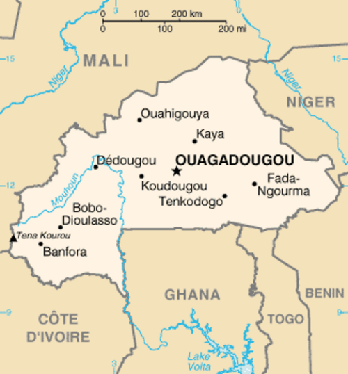 | 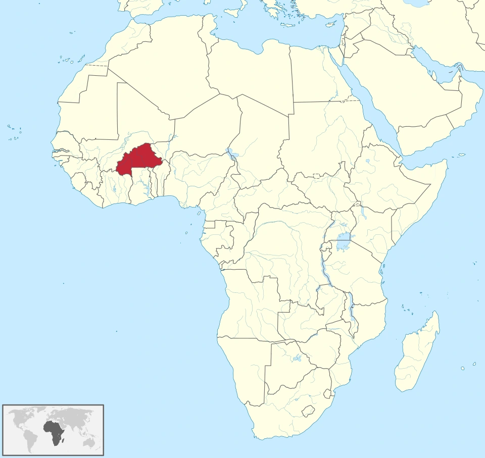 |

**认识国家／地区**：布基纳法索位于西非内陆，夹在萨赫勒与较湿润的南部地区之间。国土不临海，传统村落、农业与区域交通相互联系；旧国名“上沃尔特”可在历史资料中见到。

**认识首都／城市**：瓦加杜古位于国土中部，是政府和文化活动中心。城市与莫西王国历史有关，也因非洲电影节而受到关注；长名称可拆成“瓦加—杜古”，再与内陆中心位置联系起来。

> **记忆钩子**：布基纳法索配瓦加杜古：两组节奏都很鲜明。

**容易混淆**：不要只记旧国名上沃尔特；首都仍是瓦加杜古。

资料：[UNData 国家概况（统计快照）](https://data.un.org/legacy/en/iso/bf.html) · [国家／地区背景](https://en.wikipedia.org/wiki/Burkina_Faso) · [首都／城市背景](https://en.wikipedia.org/wiki/Ouagadougou)

地图：[File:Burkina Faso-CIA WFB Map.png；United States Central Intelligence Agency；Public domain](https://commons.wikimedia.org/wiki/File:Burkina_Faso_map.png) · [File:Burkina Faso in Africa.svg；TUBS；CC BY-SA 3.0](https://commons.wikimedia.org/wiki/File:Burkina_Faso_in_Africa.svg)

---

## 乍得 — 恩贾梅纳

Chad · N'Djamena · 中非

| 国家／地区地图 | 非洲位置图 |
|:---:|:---:|
| 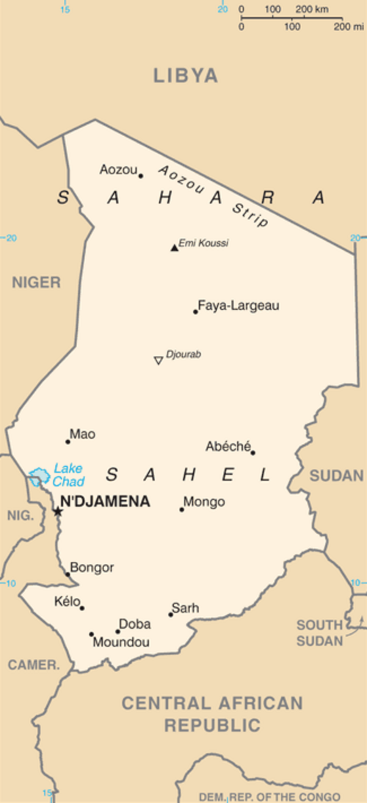 | 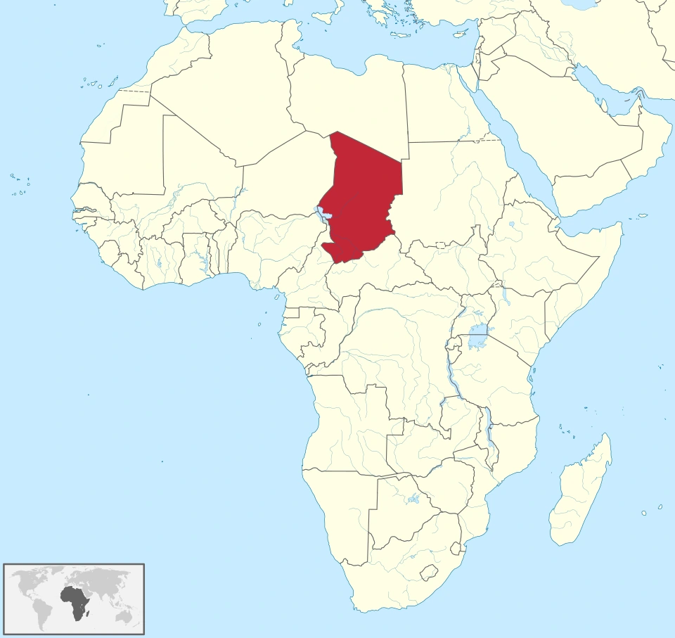 |

**认识国家／地区**：乍得位于非洲中北部内陆，北部为撒哈拉，南部较适宜农业。西南侧的乍得湖与国家同名，但湖水范围长期变化；国家的南北气候梯度十分明显。

**认识首都／城市**：恩贾梅纳位于西南部沙里河畔，与喀麦隆的库塞里隔河相望。它靠近较集中的人口与交通带，旧称拉密堡；记忆首都可把位置设在“西南河边、邻国对岸”。

> **记忆钩子**：乍得西南河岸，恩贾梅纳守在边界。

**容易混淆**：乍得湖不是首都；拉密堡是恩贾梅纳旧称。

资料：[UNData 国家概况（统计快照）](https://data.un.org/legacy/en/iso/td.html) · [国家／地区背景](https://en.wikipedia.org/wiki/Chad) · [首都／城市背景](https://en.wikipedia.org/wiki/N%27Djamena)

地图：[File:Chad-CIA WFB Map.png；United States Central Intelligence Agency；Public domain](https://commons.wikimedia.org/wiki/File:Cd-map.png) · [File:Chad in Africa.svg；TUBS；CC BY-SA 3.0](https://commons.wikimedia.org/wiki/File:Chad_in_Africa.svg)

---

## 喀麦隆 — 雅温得

Cameroon · Yaoundé · 中非

| 国家／地区地图 | 非洲位置图 |
|:---:|:---:|
| 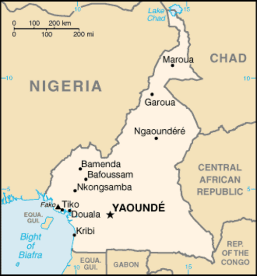 | 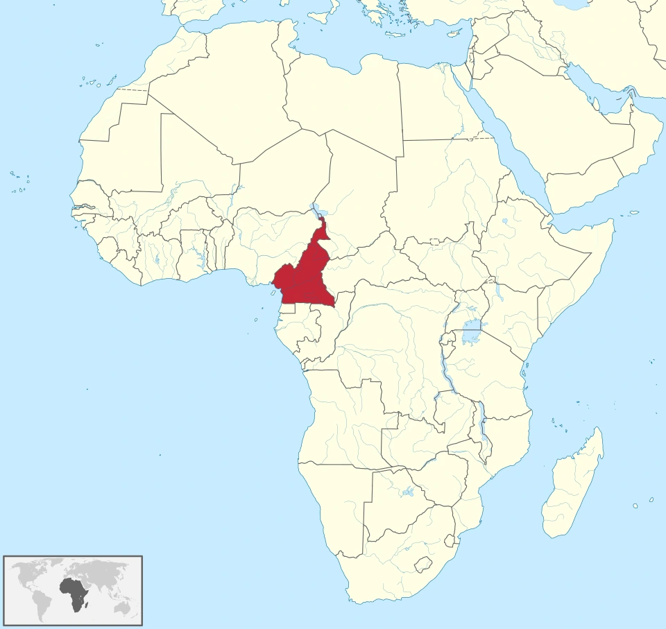 |

**认识国家／地区**：喀麦隆位于中非与西非相接处，从几内亚湾海岸延伸到乍得湖附近。火山、雨林、高原与较干北部并存，地理多样；英语和法语地区的历史背景也值得区分。

**认识首都／城市**：雅温得位于南部内陆丘陵，是行政首都。海港杜阿拉承担大量商业和贸易功能，两城角色不同；将雅温得记成“丘陵里的政府城”，便能与海边经济中心分开。

> **记忆钩子**：喀麦隆：内陆雅温得，海港杜阿拉。

**容易混淆**：杜阿拉更常出现在贸易信息中，但不是首都。

资料：[UNData 国家概况（统计快照）](https://data.un.org/legacy/en/iso/cm.html) · [国家／地区背景](https://en.wikipedia.org/wiki/Cameroon) · [首都／城市背景](https://en.wikipedia.org/wiki/Yaound%C3%A9)

地图：[File:Cameroon-CIA WFB Map.png；United States Central Intelligence Agency；Public domain](https://commons.wikimedia.org/wiki/File:Cameroon-CIA_WFB_Map.png) · [File:Cameroon in Africa.svg；TUBS；CC BY-SA 3.0](https://commons.wikimedia.org/wiki/File:Cameroon_in_Africa.svg)

---

## 中非共和国 — 班吉

Central African Republic · Bangui · 中非

| 国家／地区地图 | 非洲位置图 |
|:---:|:---:|
| 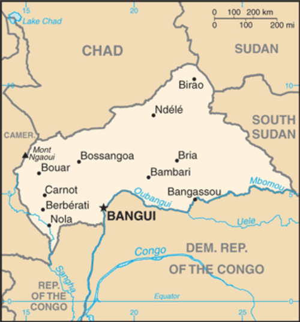 | 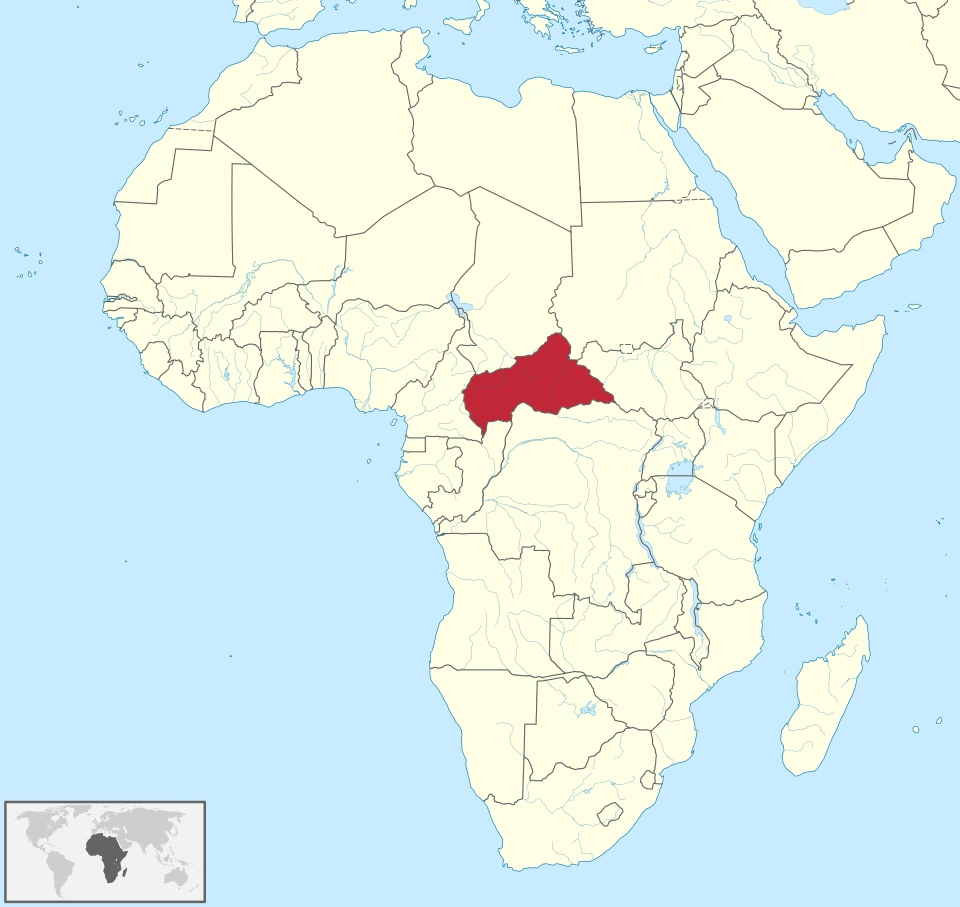 |

**认识国家／地区**：中非共和国位于非洲内陆，周围连接乍得、苏丹、南苏丹和刚果盆地方向。北部稀树草原与南部森林带过渡明显；国名本身直接提示它处于大陆腹地。

**认识首都／城市**：班吉位于南部乌班吉河岸，与刚果民主共和国的宗戈隔河相望。首都靠河流运输通道和南部人口带，而不在国土中心；“中非—乌班吉河—班吉”形成自然的记忆链。

> **记忆钩子**：中非共和国在乌班吉河边，首都班吉。

**容易混淆**：班吉属于中非共和国，不是泛指中部非洲的中心城市。

资料：[UNData 国家概况（统计快照）](https://data.un.org/legacy/en/iso/cf.html) · [国家／地区背景](https://en.wikipedia.org/wiki/Central_African_Republic) · [首都／城市背景](https://en.wikipedia.org/wiki/Bangui)

地图：[File:Central African Republic-CIA WFB Map.png；United States Central Intelligence Agency；Public domain](https://commons.wikimedia.org/wiki/File:Central_African_Republic-CIA_WFB_Map.png) · [File:Central African Republic in Africa.svg；TUBS；CC BY-SA 3.0](https://commons.wikimedia.org/wiki/File:Central_African_Republic_in_Africa.svg)

---

## 赤道几内亚 — 和平城

Equatorial Guinea · Ciudad de la Paz · 中非

| 国家／地区地图 | 非洲位置图 |
|:---:|:---:|
| 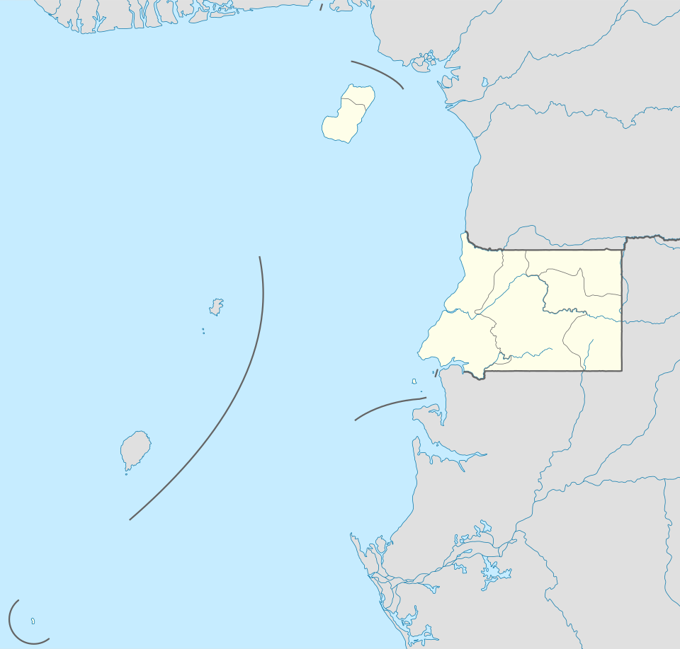 | 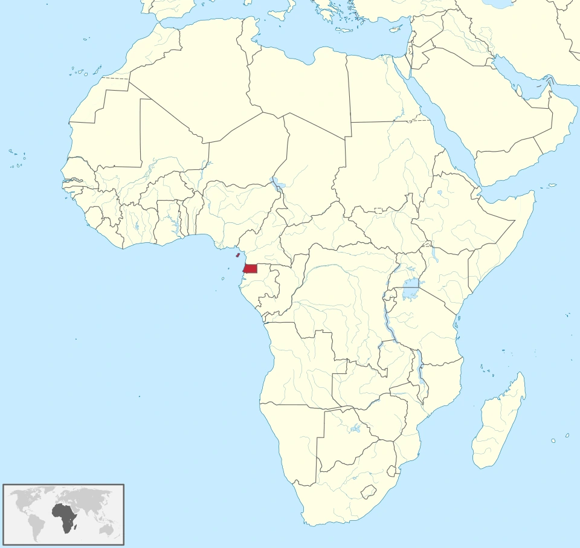 |

**认识国家／地区**：赤道几内亚位于非洲中西部，包括大陆部分和几内亚湾岛屿。比奥科岛与大陆隔海相望，西班牙语背景在非洲较少见；国名带“赤道”，却不能据此推断所有国土都在赤道线上。

**认识首都／城市**：和平城，即Ciudad de la Paz，位于大陆部分，2026年1月2日获官方法令宣布为首都。旧首都马拉博在比奥科岛；新旧城市的大陆与海岛差别，是理解迁都最有效的地理线索。

> **记忆钩子**：赤道几内亚从海岛马拉博，迁向大陆和平城。

**容易混淆**：旧地图、旧教材仍可能写马拉博；本版按2026年官方法令。

资料：[UNData 国家概况（统计快照）](https://data.un.org/legacy/en/iso/gq.html) · [国家／地区背景](https://en.wikipedia.org/wiki/Equatorial_Guinea) · [首都／城市背景](https://en.wikipedia.org/wiki/Ciudad_de_la_Paz) · [赤道几内亚政府：2026年宣布和平城为首都](https://www.guineaecuatorialpress.com/index.php/noticias/el_presidente_de_la_republica_proclama_la_ciudad_de_la_paz_como_capital_de_la_republica_de_guinea_ecuatorial_con_la_firma_de_un_decreto_ley)

地图：[File:Equatorial Guinea location map.svg；NordNordWest；CC BY-SA 3.0](https://commons.wikimedia.org/wiki/File:Equatorial_Guinea_location_map.svg) · [File:Equatorial Guinea in Africa.svg；TUBS；CC BY-SA 3.0](https://commons.wikimedia.org/wiki/File:Equatorial_Guinea_in_Africa.svg)

---

## 加蓬 — 利伯维尔

Gabon · Libreville · 中非

| 国家／地区地图 | 非洲位置图 |
|:---:|:---:|
| 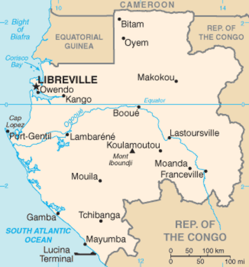 | 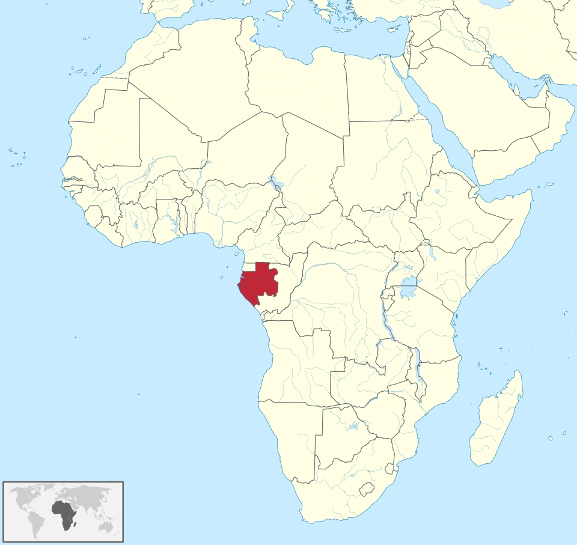 |

**认识国家／地区**：加蓬位于赤道附近的大西洋岸，邻接赤道几内亚、喀麦隆和刚果共和国。境内热带森林覆盖广，河流向海汇集；海岸、森林与资源开发共同塑造国家经济地理。

**认识首都／城市**：利伯维尔位于西北部海岸、加蓬河口附近，名称含“自由城”的含义。它是行政和海港中心，起源与获释奴隶的安置历史有关；记忆时可与另一“自由城”弗里敦成对区分。

> **记忆钩子**：加蓬的自由城叫利伯维尔。

**容易混淆**：利伯维尔属于加蓬；弗里敦属于塞拉利昂。

资料：[UNData 国家概况（统计快照）](https://data.un.org/legacy/en/iso/ga.html) · [国家／地区背景](https://en.wikipedia.org/wiki/Gabon) · [首都／城市背景](https://en.wikipedia.org/wiki/Libreville)

地图：[File:Gabon-CIA WFB Map.png；CIA；Public domain](https://commons.wikimedia.org/wiki/File:Carte_gabon.png) · [File:Gabon in Africa.svg；TUBS；CC BY-SA 3.0](https://commons.wikimedia.org/wiki/File:Gabon_in_Africa.svg)

---

## 刚果共和国 — 布拉柴维尔

Republic of the Congo · Brazzaville · 中非

| 国家／地区地图 | 非洲位置图 |
|:---:|:---:|
| 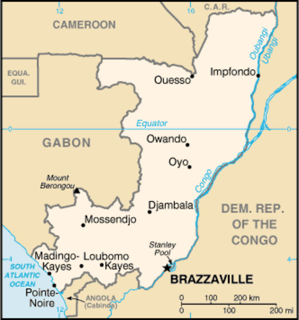 | 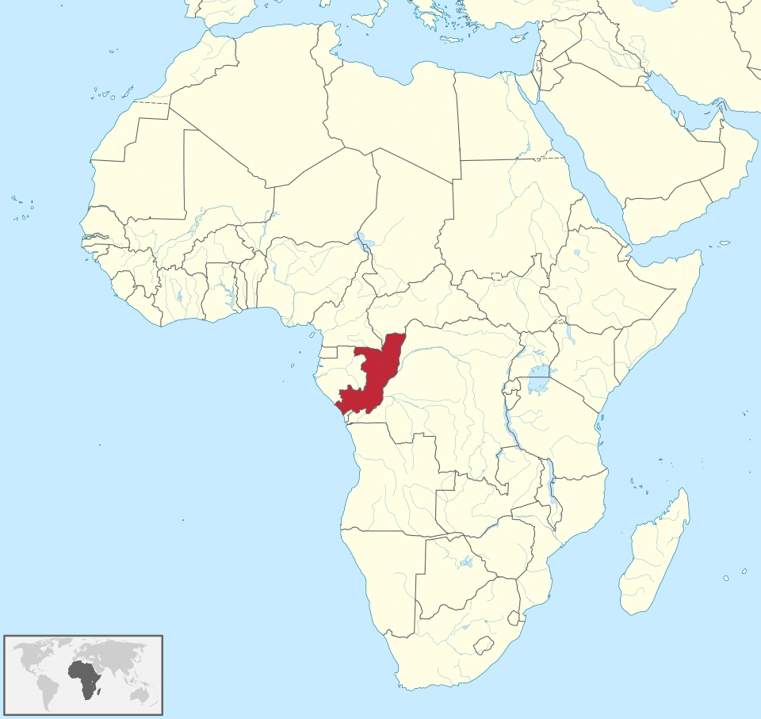 |

**认识国家／地区**：刚果共和国位于中非大西洋岸，东南侧沿刚果河与刚果民主共和国相接。热带森林、河流和海岸共同构成国家地理；中文常简称“刚果（布）”，括号提示首都。

**认识首都／城市**：布拉柴维尔位于刚果河北岸，与金沙萨隔河相望。两国首都如此接近，特别适合对照记忆；城市名与探险者德布拉柴有关，行政中心与河运交通共同支撑其发展。

> **记忆钩子**：刚果（布）—布拉柴维尔，河对岸是金沙萨。

**容易混淆**：刚果共和国与刚果民主共和国是不同国家。

资料：[UNData 国家概况（统计快照）](https://data.un.org/legacy/en/iso/cg.html) · [国家／地区背景](https://en.wikipedia.org/wiki/Republic_of_the_Congo) · [首都／城市背景](https://en.wikipedia.org/wiki/Brazzaville)

地图：[File:Congo, Republic of the-CIA WFB Map.png；CIA；Public domain](https://commons.wikimedia.org/wiki/File:Congo,_Republic_of_the-CIA_WFB_Map.png) · [File:Republic of the Congo in Africa.svg；TUBS；CC BY-SA 3.0](https://commons.wikimedia.org/wiki/File:Republic_of_the_Congo_in_Africa.svg)

---

## 刚果民主共和国 — 金沙萨

Democratic Republic of the Congo · Kinshasa · 中非

| 国家／地区地图 | 非洲位置图 |
|:---:|:---:|
| 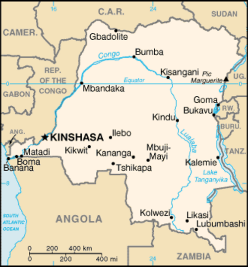 | 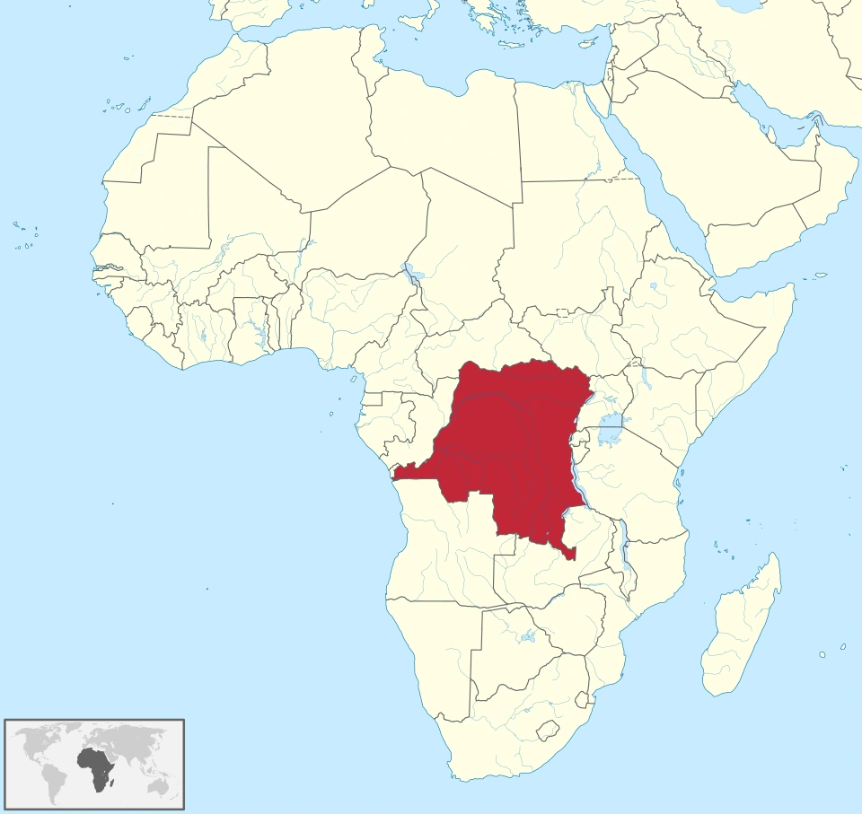 |

**认识国家／地区**：刚果民主共和国位于中非，幅员广阔，刚果盆地雨林与东部高地构成主要景观。大西洋海岸很短，刚果河系统深入内陆；中文常称“刚果（金）”。

**认识首都／城市**：金沙萨位于西部刚果河南岸，与布拉柴维尔隔河相望。旧称利奥波德维尔，1960年代改用现名；理解首都位置时，抓住它处于河运与通向下游海岸路线交接的地带。

> **记忆钩子**：刚果（金）—金沙萨，河对岸是布拉柴维尔。

**容易混淆**：两国首都隔河；地图上先分清国界再记城市。

资料：[UNData 国家概况（统计快照）](https://data.un.org/legacy/en/iso/cd.html) · [国家／地区背景](https://en.wikipedia.org/wiki/Democratic_Republic_of_the_Congo) · [首都／城市背景](https://en.wikipedia.org/wiki/Kinshasa)

地图：[File:Congo, Democratic Republic of the-CIA WFB Map.png；United States Central Intelligence Agency；Public domain](https://commons.wikimedia.org/wiki/File:Congo,_Democratic_Republic_of_the-CIA_WFB_Map.png) · [File:Democratic Republic of the Congo in Africa.svg；TUBS；CC BY-SA 3.0](https://commons.wikimedia.org/wiki/File:Democratic_Republic_of_the_Congo_in_Africa.svg)

---

## 圣多美和普林西比 — 圣多美

São Tomé and Príncipe · São Tomé · 中非

| 国家／地区地图 | 非洲位置图 |
|:---:|:---:|
| 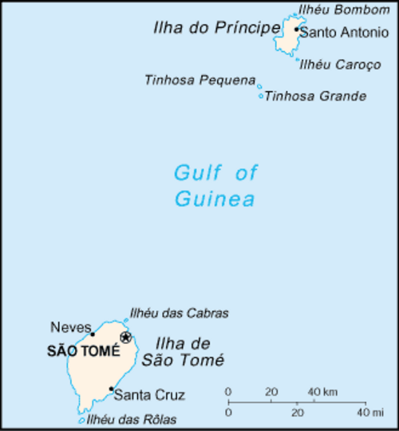 |  |

**认识国家／地区**：圣多美和普林西比是几内亚湾中的岛国，主要由两座同名火山岛组成。赤道穿过其南部附近的小岛，热带气候和种植园历史鲜明；不要把长国名当成一座城市。

**认识首都／城市**：圣多美市位于圣多美岛东北岸，是政治和港口中心。国家名的前半部分就是首都名；学习时先分出圣多美与普林西比两岛，再把政府中心放在较大的圣多美岛上。

> **记忆钩子**：圣多美和普林西比，首都取前半段圣多美。

**容易混淆**：圣多美可指岛也可指城市，首都指圣多美市。

资料：[UNData 国家概况（统计快照）](https://data.un.org/legacy/en/iso/st.html) · [国家／地区背景](https://en.wikipedia.org/wiki/S%C3%A3o_Tom%C3%A9_and_Pr%C3%ADncipe) · [首都／城市背景](https://en.wikipedia.org/wiki/S%C3%A3o_Tom%C3%A9)

地图：[File:Sao Tome and Principe-CIA WFB Map.png；CIA；Public domain](https://commons.wikimedia.org/wiki/File:Sao_Tome_and_Principe-CIA_WFB_Map.png) · [File:Sao Tome and Principe in Africa.svg；TUBS；CC BY-SA 3.0](https://commons.wikimedia.org/wiki/File:Sao_Tome_and_Principe_in_Africa.svg)

---

## 安哥拉 — 罗安达

Angola · Luanda · 中非

| 国家／地区地图 | 非洲位置图 |
|:---:|:---:|
| 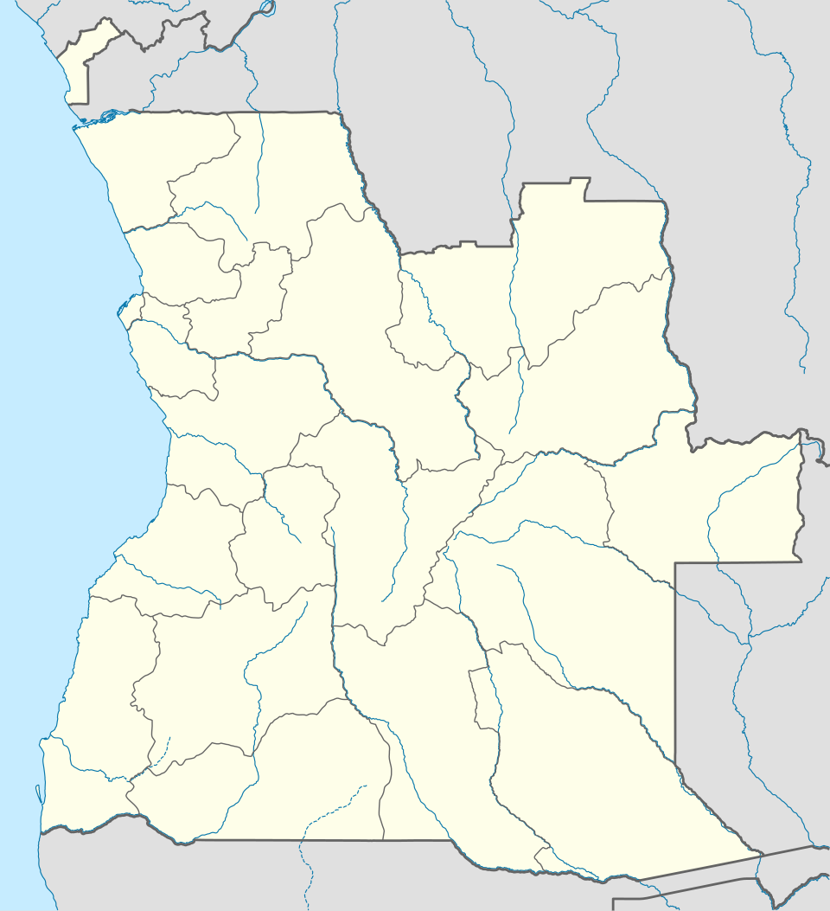 | 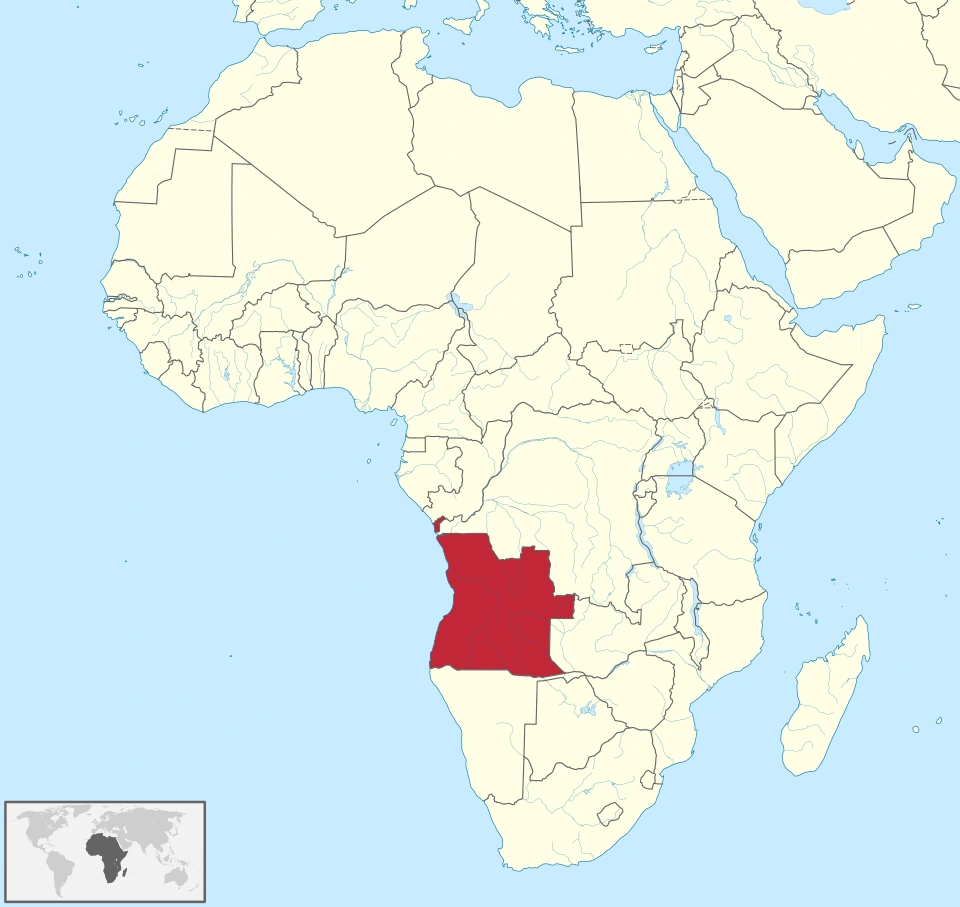 |

**认识国家／地区**：安哥拉位于非洲西南部大西洋岸，内陆有大片高原。卡宾达是与主体国土分开的沿海地区，葡萄牙语体现殖民历史；石油与矿产资源影响其产业布局。

**认识首都／城市**：罗安达位于西北部海岸，是重要港口和政府中心。城市由葡萄牙时期据点发展而来，海湾和沿岸新区构成醒目的空间特征；把首都记在国土上半部靠海的位置即可。

> **记忆钩子**：安哥拉面向大西洋，罗安达在西北海岸。

**容易混淆**：卡宾达与主体国土分开，但罗安达在主体部分。

资料：[UNData 国家概况（统计快照）](https://data.un.org/legacy/en/iso/ao.html) · [国家／地区背景](https://en.wikipedia.org/wiki/Angola) · [首都／城市背景](https://en.wikipedia.org/wiki/Luanda)

地图：[File:Angola location map.svg；NordNordWest , with changes from Petnog；CC BY-SA 3.0](https://commons.wikimedia.org/wiki/File:Angola_location_map.svg) · [File:Angola in Africa.svg；TUBS；CC BY-SA 3.0](https://commons.wikimedia.org/wiki/File:Angola_in_Africa.svg)

---

## 南苏丹 — 朱巴

South Sudan · Juba · 东非

| 国家／地区地图 | 非洲位置图 |
|:---:|:---:|
| 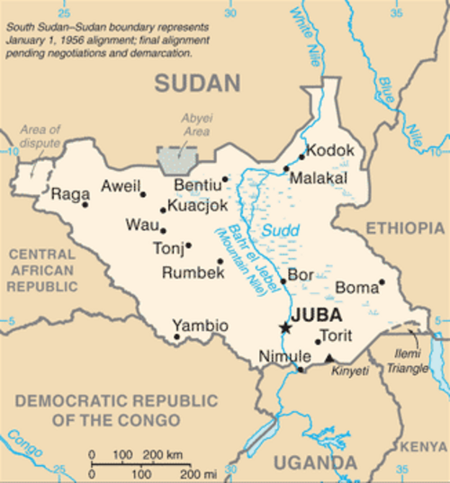 | 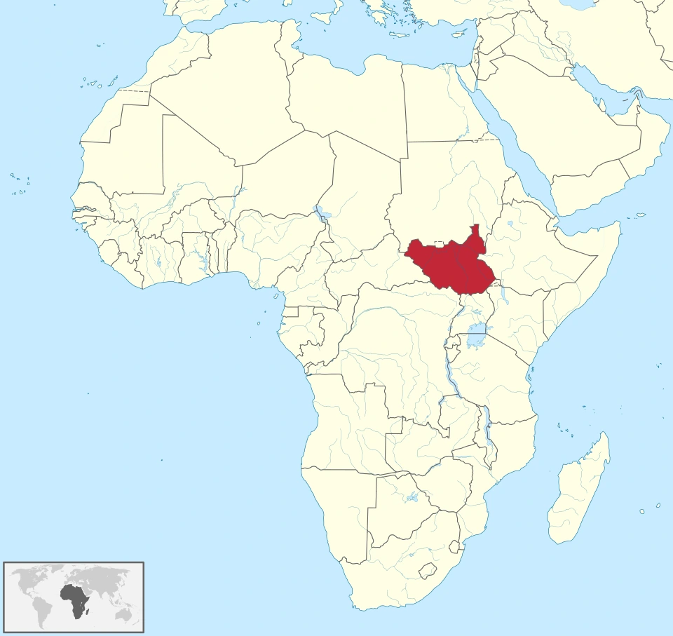 |

**认识国家／地区**：南苏丹于2011年独立，位于非洲内陆，北邻苏丹。白尼罗河流经国境，苏德沼泽是突出的湿地景观；与苏丹分开记忆，才能避免把两国首都串联错。

**认识首都／城市**：朱巴位于南部白尼罗河沿岸，是独立后沿用的首都。河道、跨河桥梁和通往周边国家的道路使其成为交通节点；关于迁往拉姆塞尔的规划，不能直接当作已经完成迁都。

> **记忆钩子**：南苏丹在南边，朱巴也靠南。

**容易混淆**：朱巴是现首都；迁都规划不等于首都已变。

资料：[UNData 国家概况（统计快照）](https://data.un.org/legacy/en/iso/ss.html) · [国家／地区背景](https://en.wikipedia.org/wiki/South_Sudan) · [首都／城市背景](https://en.wikipedia.org/wiki/Juba)

地图：[File:South Sudan-CIA WFB Map.png；Directorate of Intelligence, United States Central Intelligence Agency；Public domain](https://commons.wikimedia.org/wiki/File:South_Sudan-CIA_WFB_Map.png) · [File:South Sudan in Africa (de-facto).svg；TUBS；CC BY-SA 3.0](https://commons.wikimedia.org/wiki/File:South_Sudan_in_Africa_(de-facto).svg)

---

## 埃塞俄比亚 — 亚的斯亚贝巴

Ethiopia · Addis Ababa · 东非

| 国家／地区地图 | 非洲位置图 |
|:---:|:---:|
| 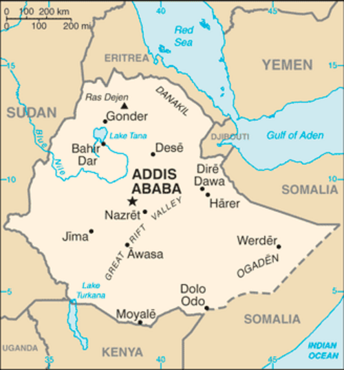 | 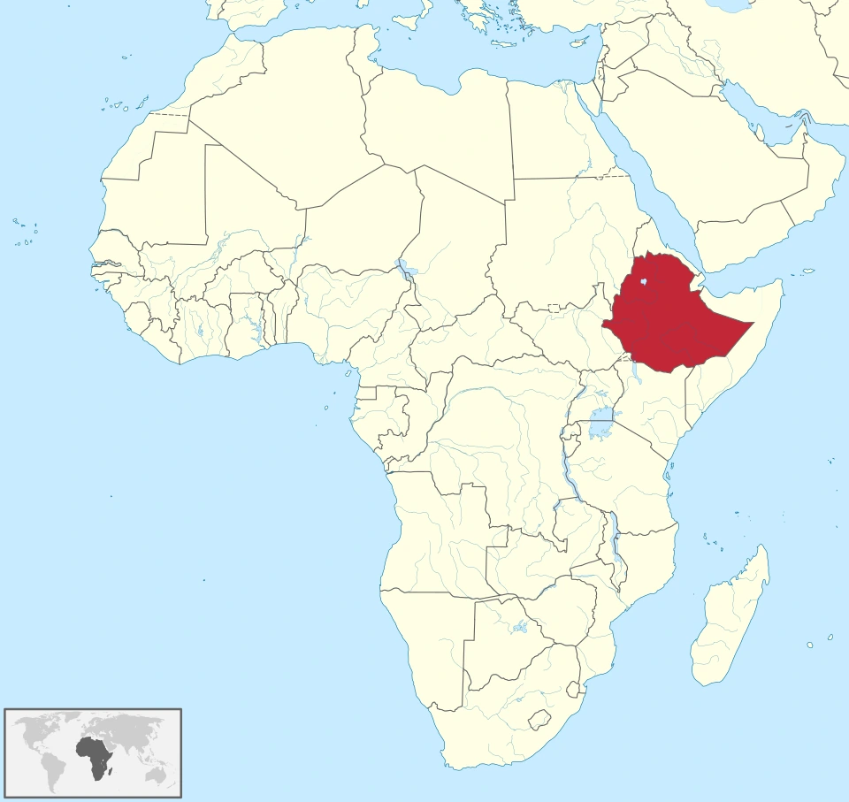 |

**认识国家／地区**：埃塞俄比亚位于非洲之角内陆，以高原和山地为主要地貌。东非大裂谷穿过国境，历史王朝与多种语言文化并存；厄立特里亚独立后，它不再拥有海岸线。

**认识首都／城市**：亚的斯亚贝巴位于高地，名称常译为“新花”。它既是国家首都，也是非洲联盟总部所在地；高海拔与大陆外交中心这两条线索，可帮助理解其气候和国际角色。

> **记忆钩子**：埃塞高原开“新花”，亚的斯亚贝巴。

**容易混淆**：首都在高原内陆；非盟总部也在这里。

资料：[UNData 国家概况（统计快照）](https://data.un.org/legacy/en/iso/et.html) · [国家／地区背景](https://en.wikipedia.org/wiki/Ethiopia) · [首都／城市背景](https://en.wikipedia.org/wiki/Addis_Ababa)

地图：[File:Ethiopia-CIA WFB Map.png；United States Central Intelligence Agency；Public domain](https://commons.wikimedia.org/wiki/File:Ethiopia-CIA_WFB_Map.png) · [File:Ethiopia in Africa.svg；TUBS；CC BY-SA 3.0](https://commons.wikimedia.org/wiki/File:Ethiopia_in_Africa.svg)

---

## 厄立特里亚 — 阿斯马拉

Eritrea · Asmara · 东非

| 国家／地区地图 | 非洲位置图 |
|:---:|:---:|
| 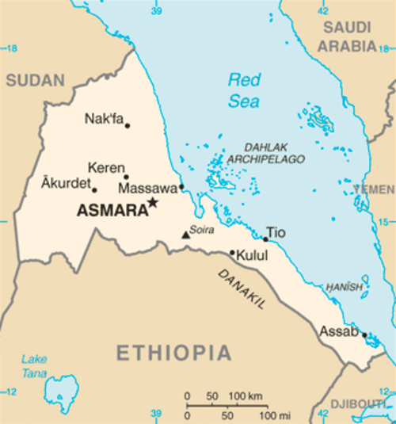 | 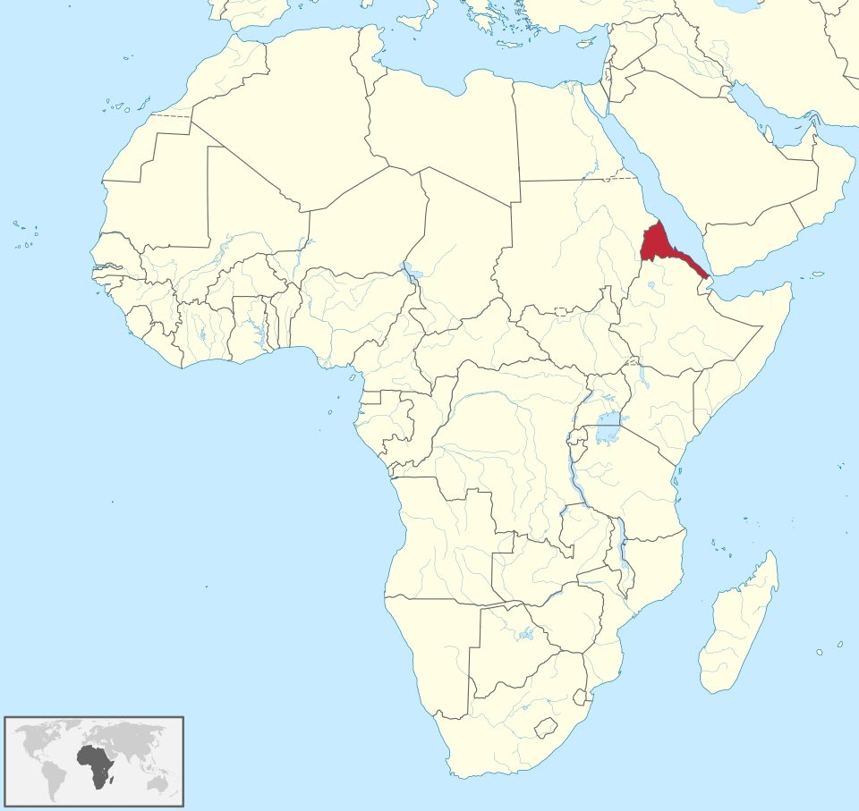 |

**认识国家／地区**：厄立特里亚位于非洲之角西北侧，东临红海，包括沿岸岛屿。海岸低地与内陆高原气候差异较大；其现代国家历史与埃塞俄比亚及意大利殖民时期均有关联。

**认识首都／城市**：阿斯马拉位于内陆高原，是1993年独立后国家的首都。城市保留较多20世纪早期建筑，现代主义建筑群受到文化遗产关注；记忆时将它放在高地，而非红海港口。

> **记忆钩子**：厄立特里亚有海岸，阿斯马拉却在高原。

**容易混淆**：马萨瓦是港口，阿斯马拉才是首都。

资料：[UNData 国家概况（统计快照）](https://data.un.org/legacy/en/iso/er.html) · [国家／地区背景](https://en.wikipedia.org/wiki/Eritrea) · [首都／城市背景](https://en.wikipedia.org/wiki/Asmara)

地图：[File:Eritrea-CIA WFB Map.png；见原图来源页；Public domain](https://commons.wikimedia.org/wiki/File:Eritrea-CIA_WFB_Map.png) · [File:Eritrea in Africa.svg；TUBS；CC BY-SA 3.0](https://commons.wikimedia.org/wiki/File:Eritrea_in_Africa.svg)

---

## 吉布提 — 吉布提市

Djibouti · Djibouti · 东非

| 国家／地区地图 | 非洲位置图 |
|:---:|:---:|
| 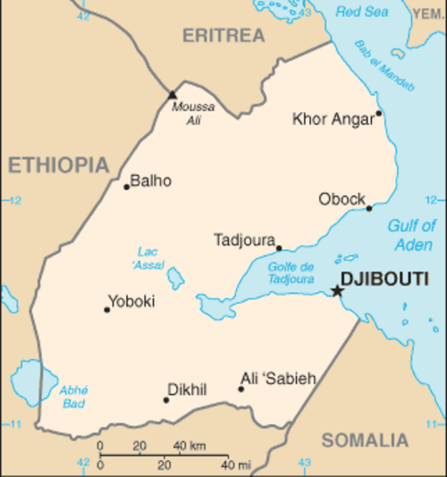 | 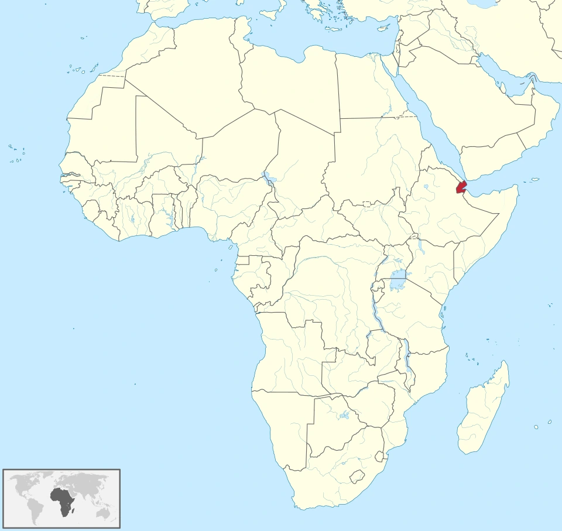 |

**认识国家／地区**：吉布提位于红海南端与亚丁湾相接处，扼守曼德海峡附近的海上通道。国土较小，气候干旱，邻接厄立特里亚、埃塞俄比亚和索马里；港口功能非常突出。

**认识首都／城市**：吉布提市位于东南部沿海，与国家同名。它承担政府、海港与区域转运功能，是埃塞俄比亚对外贸易的重要通道之一；“小国—海峡—同名港城”可以连成完整记忆。

> **记忆钩子**：吉布提国家小，首都直接叫吉布提市。

**容易混淆**：城市与国家同名；注意这里属于非洲。

资料：[UNData 国家概况（统计快照）](https://data.un.org/legacy/en/iso/dj.html) · [国家／地区背景](https://en.wikipedia.org/wiki/Djibouti) · [首都／城市背景](https://en.wikipedia.org/wiki/Djibouti)

地图：[File:Djibouti-CIA WFB Map.png；CIA；Public domain](https://commons.wikimedia.org/wiki/File:Djibouti-CIA_WFB_Map.png) · [File:Djibouti in Africa.svg；TUBS；CC BY-SA 3.0](https://commons.wikimedia.org/wiki/File:Djibouti_in_Africa.svg)

---

## 索马里 — 摩加迪沙

Somalia · Mogadishu · 东非

| 国家／地区地图 | 非洲位置图 |
|:---:|:---:|
| 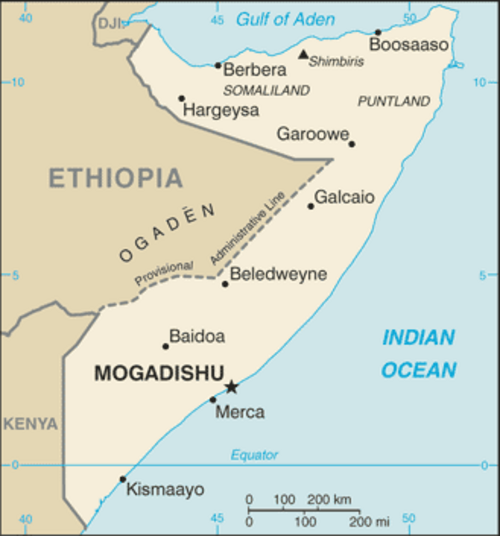 | 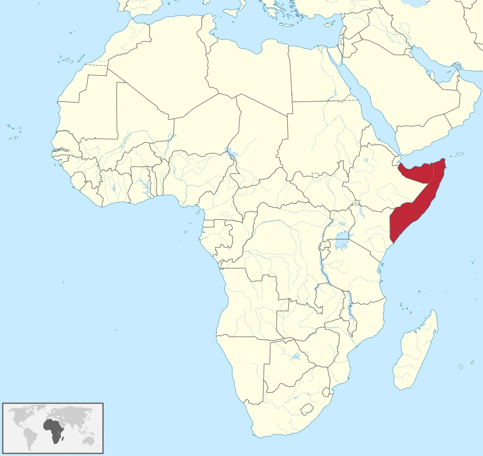 |

**认识国家／地区**：索马里占据非洲之角东部，长海岸面向亚丁湾与印度洋。国土大体呈向东伸出的角状，气候较干；涉及地区自治及争议地位的资料应区分不同口径。

**认识首都／城市**：摩加迪沙位于南部印度洋岸，是历史悠久的贸易港口和首都。海上商路连接阿拉伯地区、东非与印度洋各地；把它记在“非洲之角南侧海岸”，即可与北部沿湾城市区分。

> **记忆钩子**：索马里的角伸向海，摩加迪沙在南岸。

**容易混淆**：哈尔格萨等城市有各自地区背景，不能替换全国首都。

资料：[UNData 国家概况（统计快照）](https://data.un.org/legacy/en/iso/so.html) · [国家／地区背景](https://en.wikipedia.org/wiki/Somalia) · [首都／城市背景](https://en.wikipedia.org/wiki/Mogadishu)

地图：[File:Somalia-CIA WFB Map.png；见原图来源页；Public domain](https://commons.wikimedia.org/wiki/File:Somalia-CIA_WFB_Map.png) · [File:Somalia in Africa.svg；TUBS；CC BY-SA 3.0](https://commons.wikimedia.org/wiki/File:Somalia_in_Africa.svg)

---

## 肯尼亚 — 内罗毕

Kenya · Nairobi · 东非

| 国家／地区地图 | 非洲位置图 |
|:---:|:---:|
| 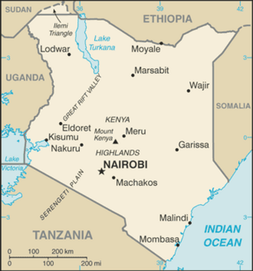 | 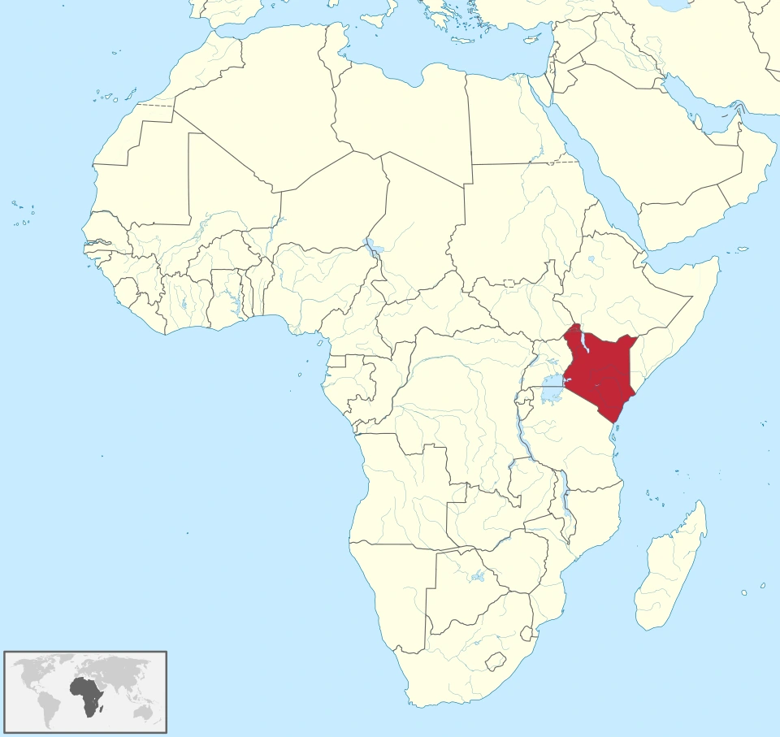 |

**认识国家／地区**：肯尼亚位于东非，东南临印度洋，赤道穿过国境。高原、东非大裂谷和沿海低地并存，野生动物保护区闻名；国家位置可通过邻近维多利亚湖和印度洋定位。

**认识首都／城市**：内罗毕位于南部内陆高原，由铁路相关聚落发展成重要城市。它是政府、交通和国际机构中心，海拔使气候区别于热带海岸；蒙巴萨是海港，两者在地图上相距明显。

> **记忆钩子**：肯尼亚高原记内罗毕，海岸记蒙巴萨。

**容易混淆**：内罗毕不是海港；不要把旅游港城当首都。

资料：[UNData 国家概况（统计快照）](https://data.un.org/legacy/en/iso/ke.html) · [国家／地区背景](https://en.wikipedia.org/wiki/Kenya) · [首都／城市背景](https://en.wikipedia.org/wiki/Nairobi)

地图：[File:Kenya-CIA WFB Map.png；United States Central Intelligence Agency；Public domain](https://commons.wikimedia.org/wiki/File:Kenya-CIA_WFB_Map.png) · [File:Kenya in Africa (de-facto).svg；TUBS；CC BY-SA 3.0](https://commons.wikimedia.org/wiki/File:Kenya_in_Africa_(de-facto).svg)

---

## 乌干达 — 坎帕拉

Uganda · Kampala · 东非

| 国家／地区地图 | 非洲位置图 |
|:---:|:---:|
| 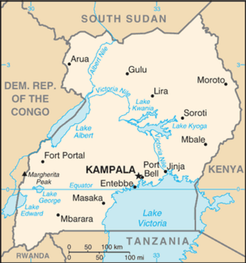 | 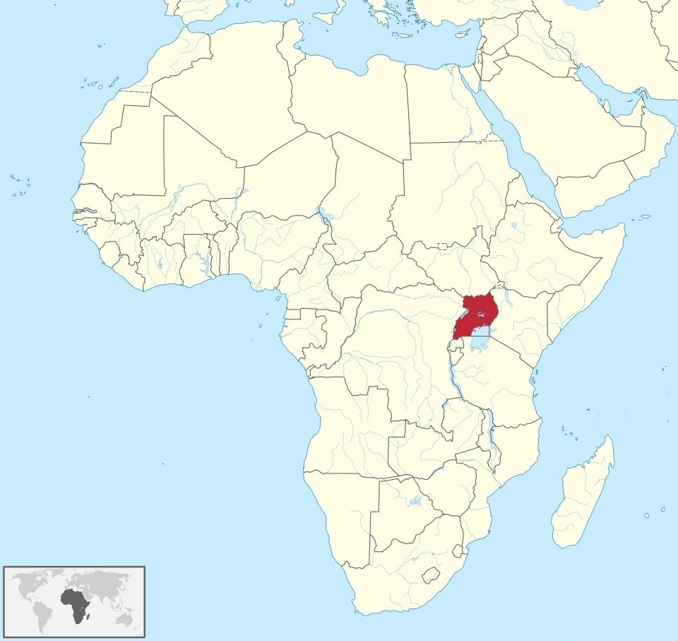 |

**认识国家／地区**：乌干达位于东非内陆，南部临维多利亚湖，白尼罗河上游与其相连。湖泊、高原及湿润农业区是主要地理线索；国家不临海，但水域资源丰富。

**认识首都／城市**：坎帕拉位于维多利亚湖北侧的丘陵地区，历史与布干达王国有关。它是政治和商业中心，附近恩德培承担重要航空与部分政府功能；首都名称与坎帕拉的丘陵形象相联系最便于记忆。

> **记忆钩子**：乌干达在湖边丘陵上“坎”着，首都坎帕拉。

**容易混淆**：恩德培机场有名，但首都是坎帕拉。

资料：[UNData 国家概况（统计快照）](https://data.un.org/legacy/en/iso/ug.html) · [国家／地区背景](https://en.wikipedia.org/wiki/Uganda) · [首都／城市背景](https://en.wikipedia.org/wiki/Kampala)

地图：[File:Uganda-CIA WFB Map.png；United States Central Intelligence Agency；Public domain](https://commons.wikimedia.org/wiki/File:Uganda-CIA_WFB_Map.png) · [File:Uganda in Africa.svg；TUBS；CC BY-SA 3.0](https://commons.wikimedia.org/wiki/File:Uganda_in_Africa.svg)

---

## 卢旺达 — 基加利

Rwanda · Kigali · 东非

| 国家／地区地图 | 非洲位置图 |
|:---:|:---:|
| 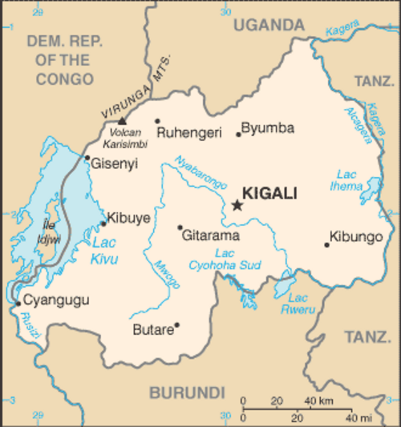 |  |

**认识国家／地区**：卢旺达是东非内陆小国，邻接乌干达、坦桑尼亚、布隆迪和刚果民主共和国。起伏丘陵密集，常以“千丘之国”描述；学习时应与南邻布隆迪成对比较。

**认识首都／城市**：基加利位于国土中部，城市沿丘陵和山谷铺展。它是行政与交通枢纽，1994年种族灭绝纪念设施让历史反思成为认识城市的重要部分；记忆首都位置可直接抓住“中央丘陵城”。

> **记忆钩子**：卢旺达千丘，中心丘陵是基加利。

**容易混淆**：基加利属卢旺达；基特加属布隆迪。

资料：[UNData 国家概况（统计快照）](https://data.un.org/legacy/en/iso/rw.html) · [国家／地区背景](https://en.wikipedia.org/wiki/Rwanda) · [首都／城市背景](https://en.wikipedia.org/wiki/Kigali)

地图：[File:Rwanda-CIA WFB Map.png；CIA；Public domain](https://commons.wikimedia.org/wiki/File:Rwanda-CIA_WFB_Map.png) · [File:Rwanda in Africa.svg；TUBS；CC BY-SA 3.0](https://commons.wikimedia.org/wiki/File:Rwanda_in_Africa.svg)

---

## 布隆迪 — 基特加

Burundi · Gitega · 东非

| 国家／地区地图 | 非洲位置图 |
|:---:|:---:|
| 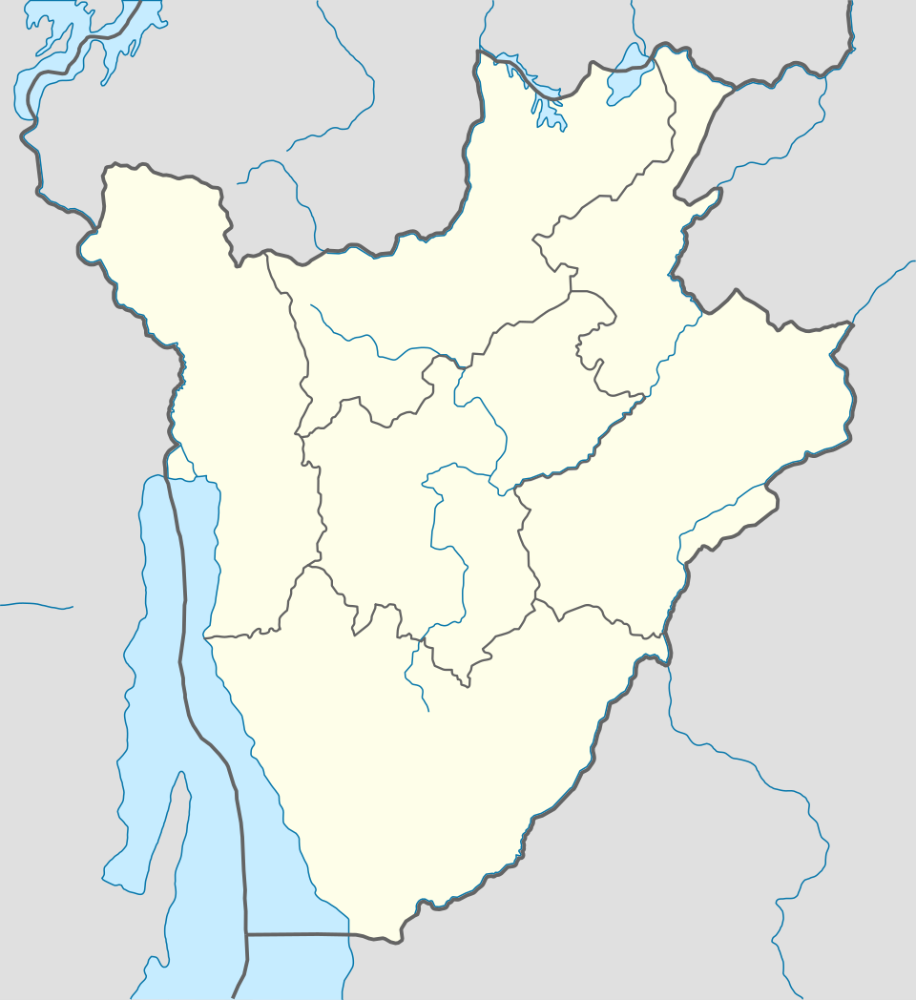 | 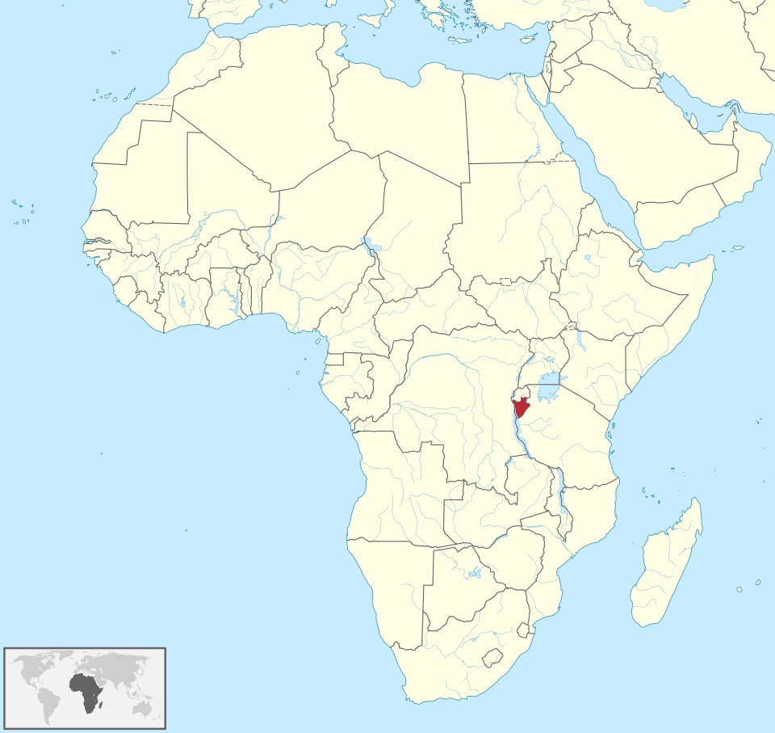 |

**认识国家／地区**：布隆迪位于东非内陆，西南临坦噶尼喀湖，地形以高地和丘陵为主。北邻卢旺达，两国面积和地理背景相近，但首都迁移经历不同，适合放在一起辨认。

**认识首都／城市**：基特加位于内陆中部高地，2019年成为政治首都，历史上也是王室中心。旧首都布琼布拉在坦噶尼喀湖岸，继续承担重要经济功能；“高地政治城、湖岸经济城”是关键区分。

> **记忆钩子**：布隆迪政治首都上高地，基特加。

**容易混淆**：布琼布拉是旧首都与经济中心，旧地图可能仍标它。

资料：[UNData 国家概况（统计快照）](https://data.un.org/legacy/en/iso/bi.html) · [国家／地区背景](https://en.wikipedia.org/wiki/Burundi) · [首都／城市背景](https://en.wikipedia.org/wiki/Gitega) · [布隆迪政府：国家概况与政治首都](https://primature.gov.bi/presentation-generale/)

地图：[File:Burundi location map.svg；NordNordWest；CC BY 3.0](https://commons.wikimedia.org/wiki/File:Burundi_location_map.svg) · [File:Burundi in Africa.svg；TUBS；CC BY-SA 3.0](https://commons.wikimedia.org/wiki/File:Burundi_in_Africa.svg)

---

## 坦桑尼亚 — 多多马

Tanzania · Dodoma · 东非

| 国家／地区地图 | 非洲位置图 |
|:---:|:---:|
| 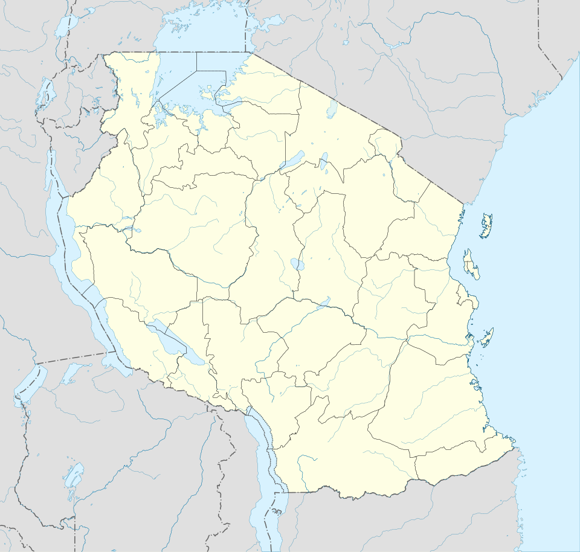 | 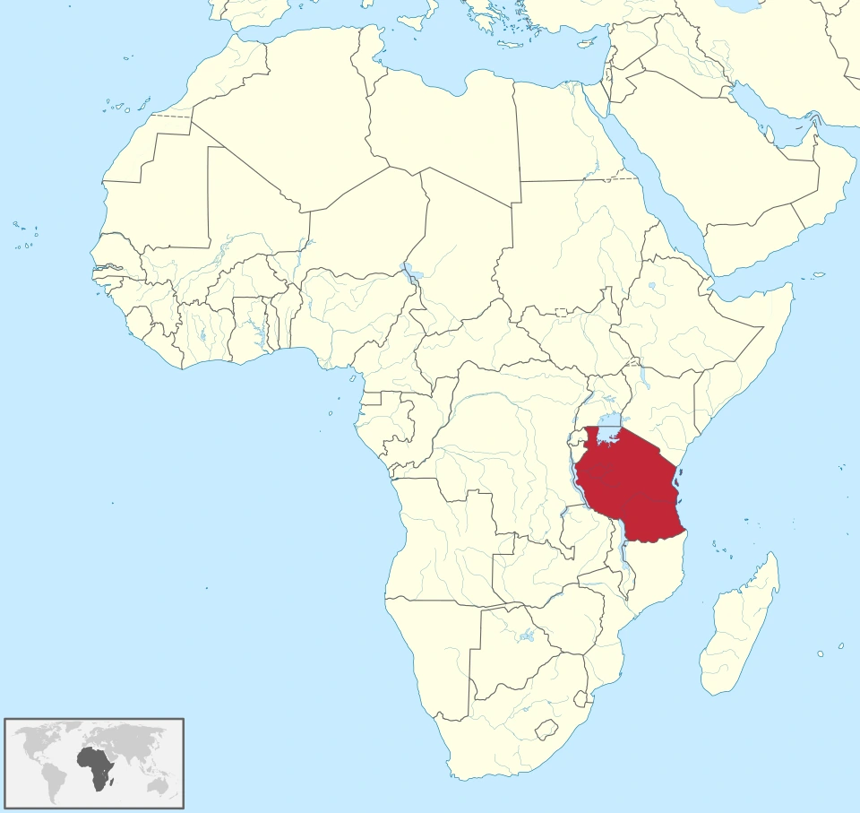 |

**认识国家／地区**：坦桑尼亚位于东非印度洋岸，由大陆坦噶尼喀与桑给巴尔联合形成。维多利亚湖、坦噶尼喀湖及乞力马扎罗山提供鲜明定位线索；沿海与内陆高原差异较大。

**认识首都／城市**：多多马位于大陆内陆中部，是正式首都，议会与政府机构在此发展。达累斯萨拉姆是旧首都和重要海港，仍有显著经济作用；记忆时用“多多马在中间，达市在海边”区分。

> **记忆钩子**：坦桑尼亚向内陆建首都，多多马在中部。

**容易混淆**：达累斯萨拉姆不是现正式首都；地图注意版本。

资料：[UNData 国家概况（统计快照）](https://data.un.org/legacy/en/iso/tz.html) · [国家／地区背景](https://en.wikipedia.org/wiki/Tanzania) · [首都／城市背景](https://en.wikipedia.org/wiki/Dodoma)

地图：[File:Tanzania location map.svg；Tanzania map-fr.svg : Sémhur / derivative work: Sémhur；CC BY-SA 4.0](https://commons.wikimedia.org/wiki/File:Tanzania_location_map.svg) · [File:Tanzania in Africa.svg；TUBS；CC BY-SA 3.0](https://commons.wikimedia.org/wiki/File:Tanzania_in_Africa.svg)

---

## 赞比亚 — 卢萨卡

Zambia · Lusaka · 东非

| 国家／地区地图 | 非洲位置图 |
|:---:|:---:|
| 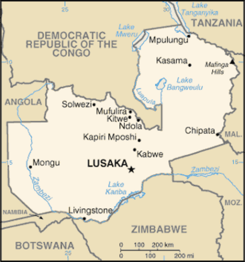 | 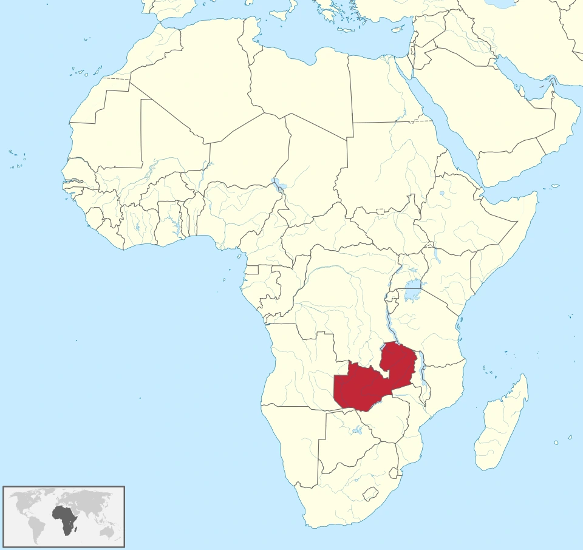 |

**认识国家／地区**：赞比亚是南部非洲内陆国家，南部与赞比西河及维多利亚瀑布相连。高原地形广泛，铜矿带位于较北部地区；国名与赞比西河的联系可帮助定位。

**认识首都／城市**：卢萨卡位于国土南部高原，是行政和交通中心，殖民时期取代利文斯通成为首府。道路与铁路在此汇集，便于连接铜矿带和南部邻国；首都不在国名所指的大河岸边。

> **记忆钩子**：赞比亚南部高原，卢萨卡连通四方。

**容易混淆**：卢萨卡属赞比亚，卢旺达的首都是基加利。

资料：[UNData 国家概况（统计快照）](https://data.un.org/legacy/en/iso/zm.html) · [国家／地区背景](https://en.wikipedia.org/wiki/Zambia) · [首都／城市背景](https://en.wikipedia.org/wiki/Lusaka)

地图：[File:Zambia-CIA WFB Map.png；CIA；Public domain](https://commons.wikimedia.org/wiki/File:Zambia-CIA_WFB_Map.png) · [File:Zambia in Africa.svg；TUBS；CC BY-SA 3.0](https://commons.wikimedia.org/wiki/File:Zambia_in_Africa.svg)

---

## 马拉维 — 利隆圭

Malawi · Lilongwe · 东非

| 国家／地区地图 | 非洲位置图 |
|:---:|:---:|
| 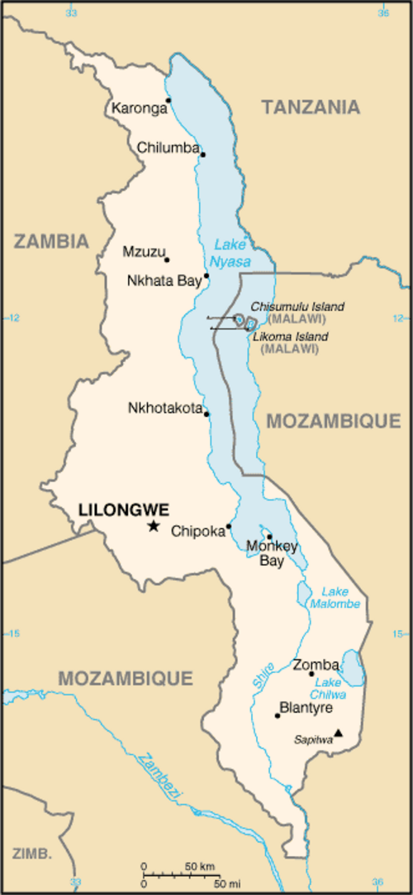 | 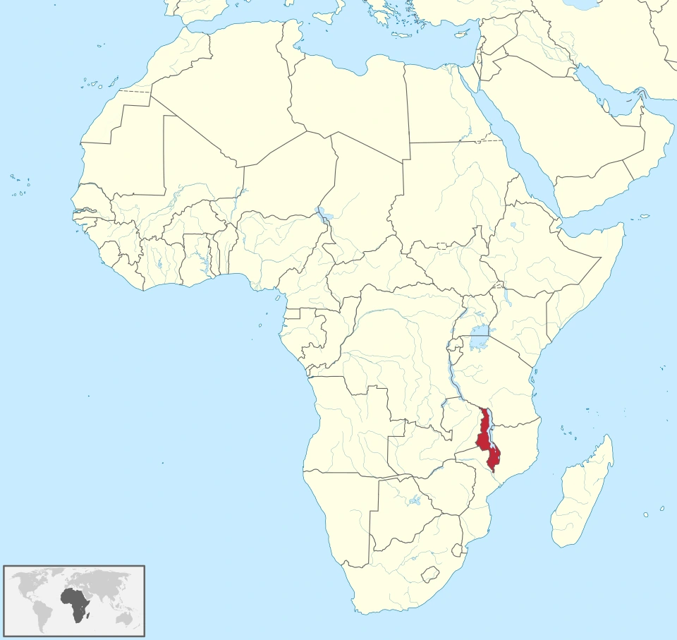 |

**认识国家／地区**：马拉维是南部非洲内陆国家，沿狭长的马拉维湖西岸及南端延伸。湖泊与周边高地决定许多聚落和农业区分布；看图时先找到东侧长湖，再识别国家轮廓。

**认识首都／城市**：利隆圭位于中部内陆，1975年取代松巴成为首都。城市分为传统商业区域与规划行政街区，较居中的位置有利于联系南北；布兰太尔是另一重要经济城市，不能替代首都。

> **记忆钩子**：马拉维围着长湖，利隆圭在中部内陆。

**容易混淆**：松巴是旧首都，布兰太尔是重要商业城市。

资料：[UNData 国家概况（统计快照）](https://data.un.org/legacy/en/iso/mw.html) · [国家／地区背景](https://en.wikipedia.org/wiki/Malawi) · [首都／城市背景](https://en.wikipedia.org/wiki/Lilongwe)

地图：[File:Malawi-CIA WFB Map.png；CIA；Public domain](https://commons.wikimedia.org/wiki/File:Malawi-CIA_WFB_Map.png) · [File:Malawi in Africa.svg；TUBS；CC BY-SA 3.0](https://commons.wikimedia.org/wiki/File:Malawi_in_Africa.svg)

---

## 莫桑比克 — 马普托

Mozambique · Maputo · 东非

| 国家／地区地图 | 非洲位置图 |
|:---:|:---:|
| 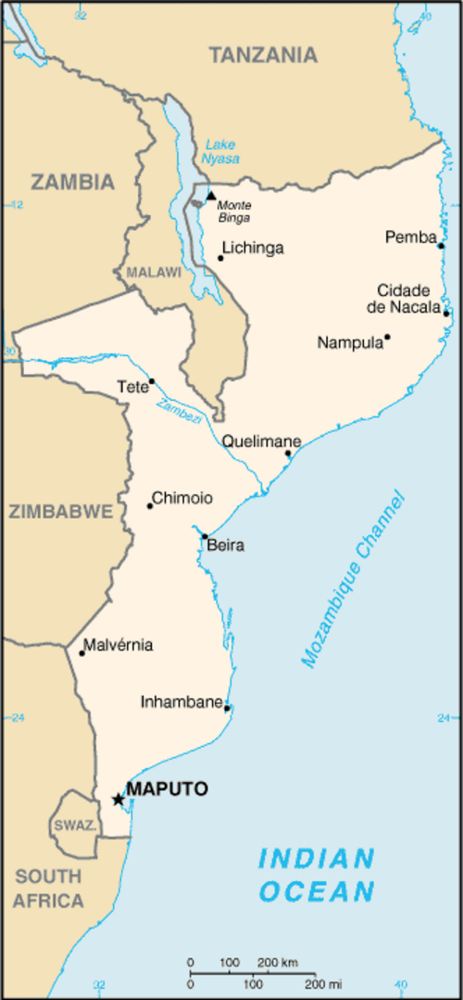 | 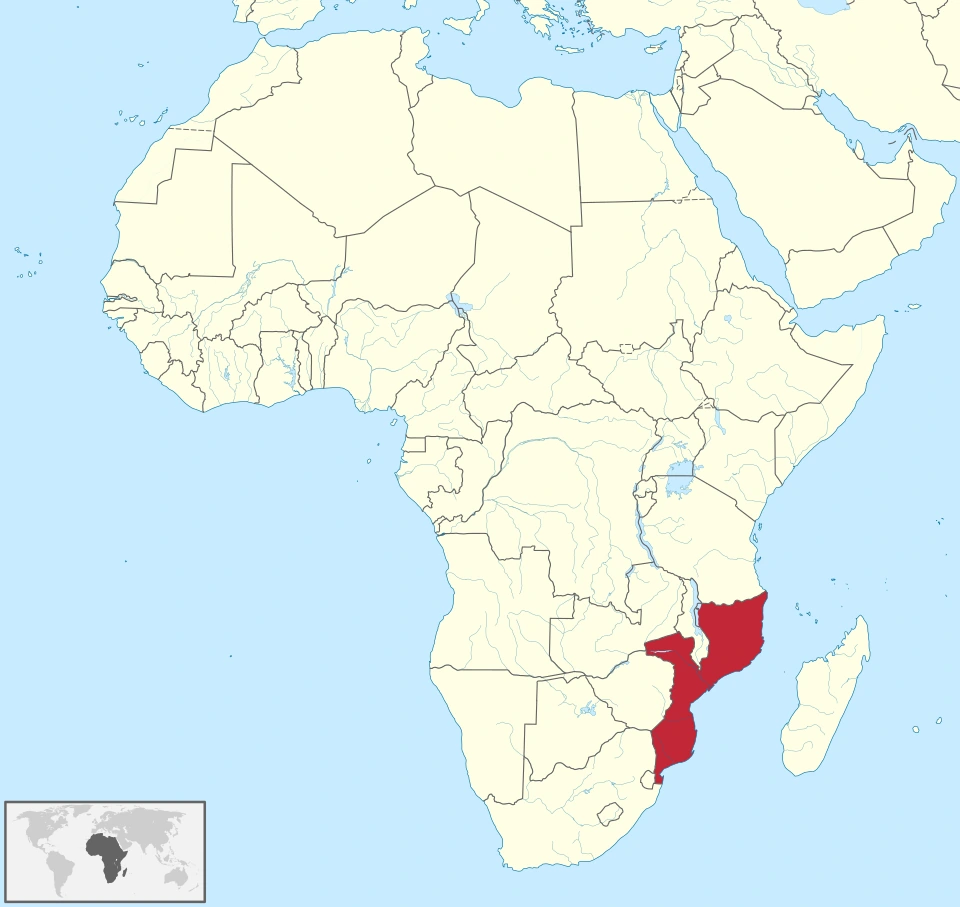 |

**认识国家／地区**：莫桑比克位于非洲东南部印度洋岸，海岸线很长，与马达加斯加隔莫桑比克海峡相望。赞比西河向海汇入，南北交通跨度大；葡萄牙语体现其历史联系。

**认识首都／城市**：马普托位于国土最南部附近的海湾，接近南非与斯威士兰方向。旧称洛伦索马贵斯，独立后采用现名；它是政府、海港和区域交通中心，位置远离国家的几何中心。

> **记忆钩子**：莫桑比克长海岸，马普托在最南端附近。

**容易混淆**：马普托偏南，不要自动把首都放在国土中央。

资料：[UNData 国家概况（统计快照）](https://data.un.org/legacy/en/iso/mz.html) · [国家／地区背景](https://en.wikipedia.org/wiki/Mozambique) · [首都／城市背景](https://en.wikipedia.org/wiki/Maputo)

地图：[File:Mozambique-CIA WFB Map.png；CIA；Public domain](https://commons.wikimedia.org/wiki/File:Mozambique-CIA_WFB_Map.png) · [File:Mozambique in Africa.svg；TUBS；CC BY-SA 3.0](https://commons.wikimedia.org/wiki/File:Mozambique_in_Africa.svg)

---

## 津巴布韦 — 哈拉雷

Zimbabwe · Harare · 东非

| 国家／地区地图 | 非洲位置图 |
|:---:|:---:|
| 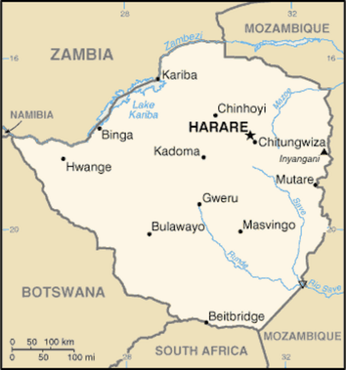 | 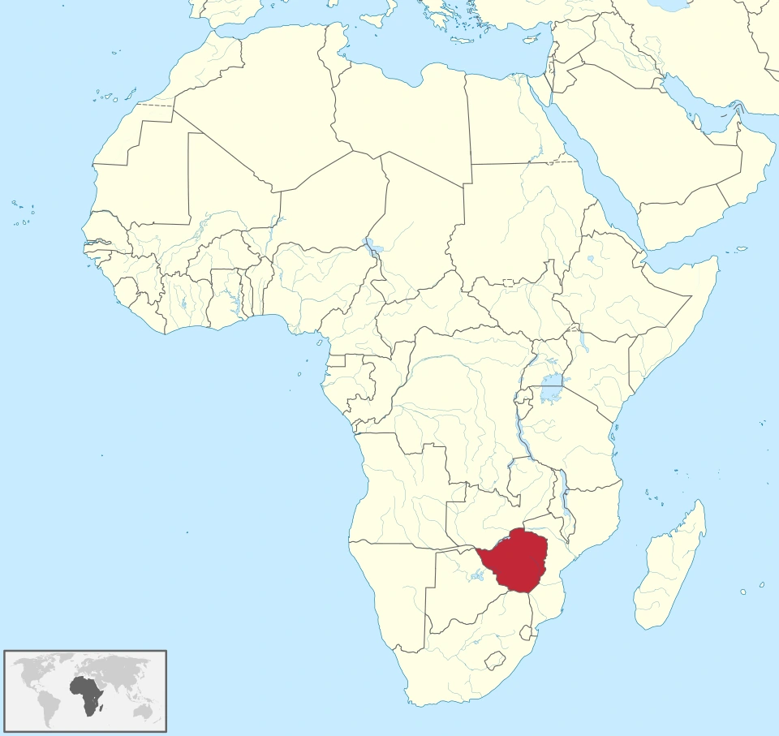 |

**认识国家／地区**：津巴布韦位于南部非洲内陆，北侧有赞比西河，南侧有林波波河。高原地形及大津巴布韦石建筑遗址，是认识自然与历史的两条线索。

**认识首都／城市**：哈拉雷位于东北部高原，独立前称索尔兹伯里，1982年改名。它是行政与商业中心，海拔使城市气候区别于低地；国名来自历史遗址，首都则是现代高原城市。

> **记忆钩子**：津巴布韦高原上，哈拉雷是现代首都。

**容易混淆**：索尔兹伯里是旧称；大津巴布韦遗址不是首都。

资料：[UNData 国家概况（统计快照）](https://data.un.org/legacy/en/iso/zw.html) · [国家／地区背景](https://en.wikipedia.org/wiki/Zimbabwe) · [首都／城市背景](https://en.wikipedia.org/wiki/Harare)

地图：[File:Zimbabwe-CIA WFB Map.png；CIA；Public domain](https://commons.wikimedia.org/wiki/File:Zimbabwe-CIA_WFB_Map.png) · [File:Zimbabwe in Africa.svg；TUBS；CC BY-SA 3.0](https://commons.wikimedia.org/wiki/File:Zimbabwe_in_Africa.svg)

---

## 马达加斯加 — 塔那那利佛

Madagascar · Antananarivo · 东非

| 国家／地区地图 | 非洲位置图 |
|:---:|:---:|
| 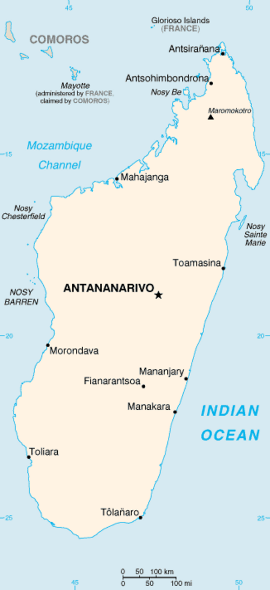 | 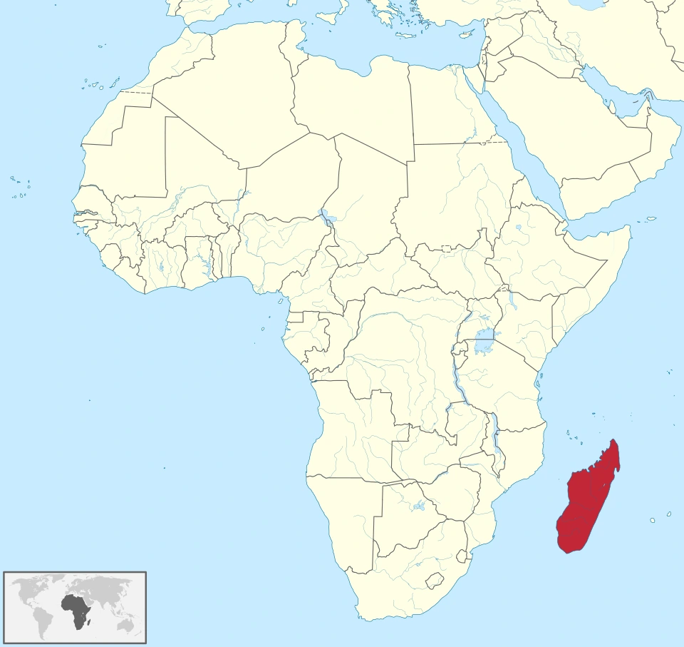 |

**认识国家／地区**：马达加斯加位于非洲东南外海，是与大陆隔海峡相望的大岛国家。长期相对隔离使动植物具有鲜明特色；中央高地、东部湿润海岸与西南干旱地区差异明显。

**认识首都／城市**：塔那那利佛位于中央高地，名字常解释为“千人之城”。它与梅里纳王国历史相连，王宫山丘和起伏街区体现高地首都形态；不要因岛国身份就把首都想成海港。

> **记忆钩子**：马达加斯加大岛中央，千人之城塔那那利佛。

**容易混淆**：首都在高地内陆，不在海岸。

资料：[UNData 国家概况（统计快照）](https://data.un.org/legacy/en/iso/mg.html) · [国家／地区背景](https://en.wikipedia.org/wiki/Madagascar) · [首都／城市背景](https://en.wikipedia.org/wiki/Antananarivo)

地图：[File:Madagascar-CIA WFB Map.png；CIA；Public domain](https://commons.wikimedia.org/wiki/File:Madagascar_map.png) · [File:Madagascar in Africa.svg；TUBS；CC BY-SA 3.0](https://commons.wikimedia.org/wiki/File:Madagascar_in_Africa.svg)

---

## 科摩罗 — 莫罗尼

Comoros · Moroni · 东非

| 国家／地区地图 | 非洲位置图 |
|:---:|:---:|
| 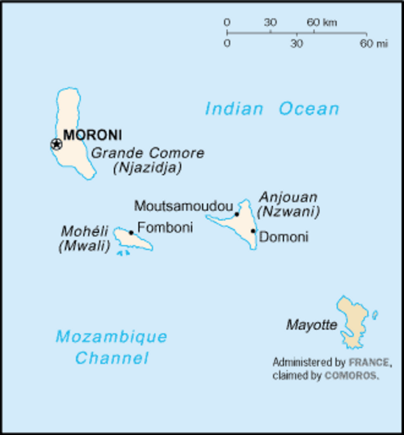 |  |

**认识国家／地区**：科摩罗位于莫桑比克海峡北端，是非洲东岸与马达加斯加之间的火山群岛国家。印度洋航路带来非洲、阿拉伯与欧洲文化联系；马约特的地位涉及法国及科摩罗的不同主张。

**认识首都／城市**：莫罗尼位于大科摩罗岛西岸，海港、老城和火山背景共同构成城市景观。它是联邦政府所在地，名称与科摩罗读音接近；把首都放在最大主岛的西侧便容易定位。

> **记忆钩子**：科摩罗—莫罗尼，重复“摩罗”来记。

**容易混淆**：马约特不作为本手册独立国家条目；地图需读图源说明。

资料：[UNData 国家概况（统计快照）](https://data.un.org/legacy/en/iso/km.html) · [国家／地区背景](https://en.wikipedia.org/wiki/Comoros) · [首都／城市背景](https://en.wikipedia.org/wiki/Moroni)

地图：[File:Comoros-CIA WFB Map.png；CIA；Public domain](https://commons.wikimedia.org/wiki/File:Comoros-CIA_WFB_Map.png) · [File:Comoros in Africa.svg；TUBS；CC BY-SA 3.0](https://commons.wikimedia.org/wiki/File:Comoros_in_Africa.svg)

---

## 毛里求斯 — 路易港

Mauritius · Port Louis · 东非

| 国家／地区地图 | 非洲位置图 |
|:---:|:---:|
| 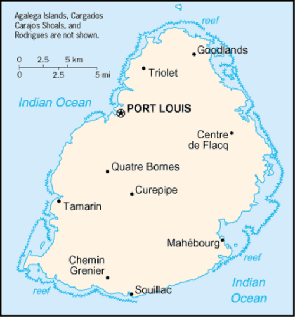 | 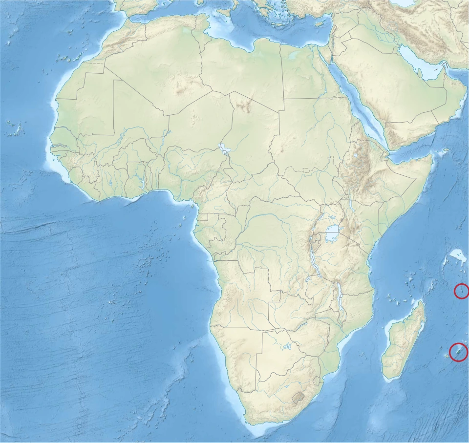 |

**认识国家／地区**：毛里求斯是非洲东侧印度洋上的岛国，位于马达加斯加以东。火山岛地形、糖业历史与多种语言文化并存；名字与毛里塔尼亚相似，地理位置却相隔很远。

**认识首都／城市**：路易港位于主岛西北岸，山地与海港相邻，是政府和商业中心。城市名纪念法国国王路易十五，历史上承担印度洋海运功能；“岛国西北港口”是最直接的位置线索。

> **记忆钩子**：毛里求斯在印度洋，首都路易港。

**容易混淆**：毛里塔尼亚在大陆西岸，首都努瓦克肖特。

资料：[UNData 国家概况（统计快照）](https://data.un.org/legacy/en/iso/mu.html) · [国家／地区背景](https://en.wikipedia.org/wiki/Mauritius) · [首都／城市背景](https://en.wikipedia.org/wiki/Port_Louis)

地图：[File:Mauritius-CIA WFB Map.png；CIA；Public domain](https://commons.wikimedia.org/wiki/File:Mauritius-CIA_WFB_Map.png) · [File:Mauritius in Africa (relief) (-mini map).svg；TUBS；CC BY-SA 3.0](https://commons.wikimedia.org/wiki/File:Mauritius_in_Africa_(relief)_(-mini_map).svg)

---

## 塞舌尔 — 维多利亚

Seychelles · Victoria · 东非

| 国家／地区地图 | 非洲位置图 |
|:---:|:---:|
| 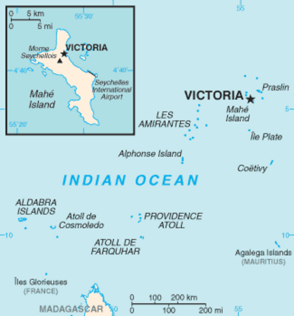 | 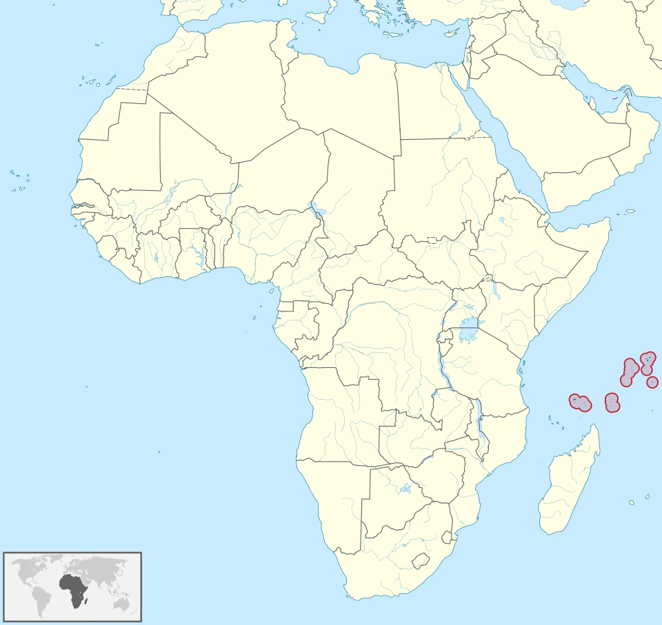 |

**认识国家／地区**：塞舌尔位于西印度洋，由花岗岩岛与珊瑚岛组成，远离非洲大陆。主要居民集中在马埃岛等岛屿，岛群分散；海洋、保护区和岛际联系是国家地理的重点。

**认识首都／城市**：维多利亚位于马埃岛东北岸，是规模较小的港口首都。名称保留英国殖民时期背景，市场、港湾与行政街区距离较近；学习时先认马埃岛，再记维多利亚的位置。

> **记忆钩子**：塞舌尔主岛马埃，首都维多利亚。

**容易混淆**：维多利亚是常见地名，答题要连同塞舌尔一起记。

资料：[UNData 国家概况（统计快照）](https://data.un.org/legacy/en/iso/sc.html) · [国家／地区背景](https://en.wikipedia.org/wiki/Seychelles) · [首都／城市背景](https://en.wikipedia.org/wiki/Victoria%2C_Seychelles)

地图：[File:Seychelles-CIA WFB Map.png；见原图来源页；Public domain](https://commons.wikimedia.org/wiki/File:Seychelles-CIA_WFB_Map.png) · [File:Seychelles in Africa.svg；TUBS；CC BY-SA 3.0](https://commons.wikimedia.org/wiki/File:Seychelles_in_Africa.svg)

---

## 南非 — 比勒陀利亚／开普敦／布隆方丹

South Africa · Pretoria / Cape Town / Bloemfontein · 南部非洲

| 国家／地区地图 | 非洲位置图 |
|:---:|:---:|
| 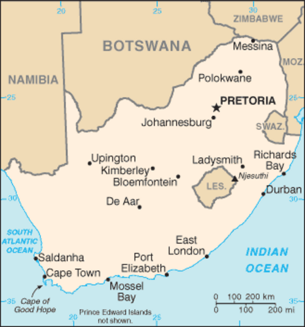 | 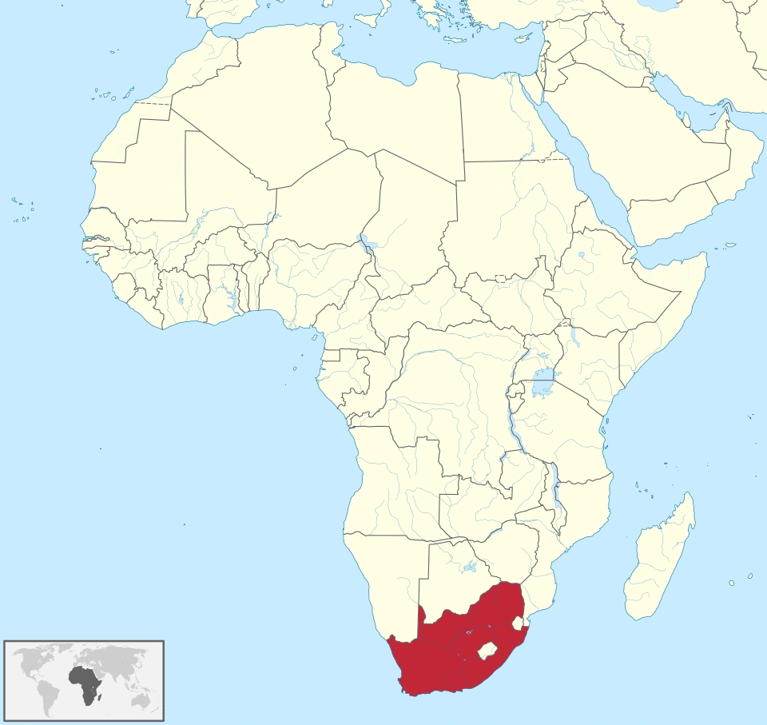 |

**认识国家／地区**：南非位于非洲大陆南端，面向大西洋和印度洋，内陆多高原。地区地形与城市分工多样，莱索托完全被其包围；首都问题需按政府职能分别记忆。

**认识首都／城市**：比勒陀利亚是行政首都，开普敦是立法首都，布隆方丹传统上称司法首都并有最高上诉法院。最高层级的宪法法院位于约翰内斯堡，不能把“司法首都”理解为所有最高法院都在布隆方丹。

> **记忆钩子**：南非三城：比办行政、开办立法、布办司法。

**容易混淆**：约翰内斯堡不是三首都之一；司法机构分布有例外。

资料：[UNData 国家概况（统计快照）](https://data.un.org/legacy/en/iso/za.html) · [国家／地区背景](https://en.wikipedia.org/wiki/South_Africa) · [首都／城市背景](https://en.wikipedia.org/wiki/Pretoria) · [南非政府：首都分工与省份](https://www.gov.za/about-sa/south-africas-provinces) · [南非政府：司法系统](https://www.gov.za/about-sa/government-systems)

地图：[File:South Africa-CIA WFB Map.png；CIA；Public domain](https://commons.wikimedia.org/wiki/File:South_Africa-CIA_WFB_Map.png) · [File:South Africa in Africa.svg；TUBS；CC BY-SA 3.0](https://commons.wikimedia.org/wiki/File:South_Africa_in_Africa.svg)

---

## 纳米比亚 — 温得和克

Namibia · Windhoek · 南部非洲

| 国家／地区地图 | 非洲位置图 |
|:---:|:---:|
| 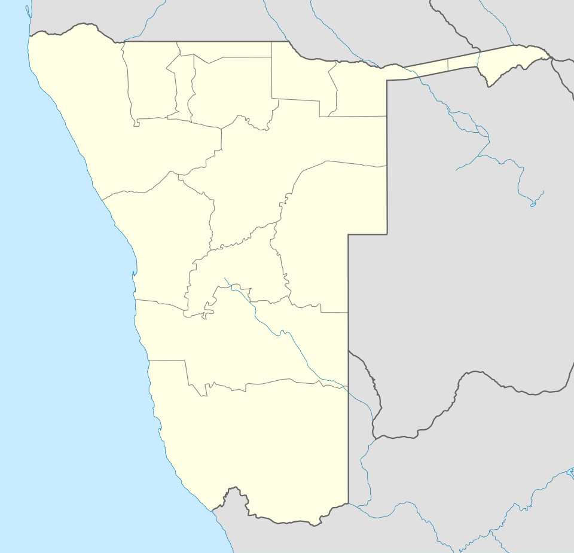 | 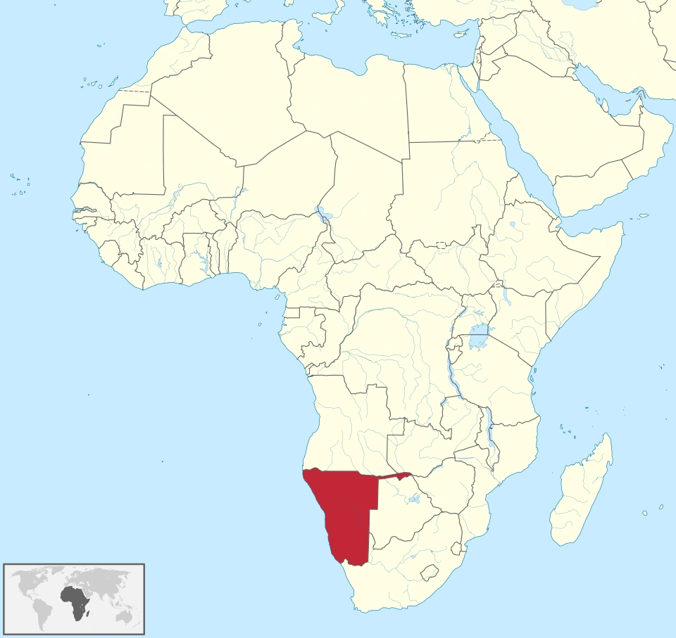 |

**认识国家／地区**：纳米比亚位于非洲西南部大西洋岸，纳米布沙漠沿海延伸，内陆还有高原与卡拉哈里地区。干旱环境和广阔国土影响聚落分布；德国殖民历史留下部分地名与建筑。

**认识首都／城市**：温得和克位于中部高原，是行政与交通中心，1990年独立后继续作为首都。它不在海岸，而是在通往不同地区的内陆节点；周边山地与较高海拔是城市的重要地理背景。

> **记忆钩子**：纳米比亚西岸是沙漠，首都温得和克在高原。

**容易混淆**：鲸湾港是重要海港，温得和克才是首都。

资料：[UNData 国家概况（统计快照）](https://data.un.org/legacy/en/iso/na.html) · [国家／地区背景](https://en.wikipedia.org/wiki/Namibia) · [首都／城市背景](https://en.wikipedia.org/wiki/Windhoek)

地图：[File:Namibia location map.svg；Uwe Dedering；CC BY-SA 3.0](https://commons.wikimedia.org/wiki/File:Namibia_location_map.svg) · [File:Namibia in Africa.svg；TUBS；CC BY-SA 3.0](https://commons.wikimedia.org/wiki/File:Namibia_in_Africa.svg)

---

## 博茨瓦纳 — 哈博罗内

Botswana · Gaborone · 南部非洲

| 国家／地区地图 | 非洲位置图 |
|:---:|:---:|
| 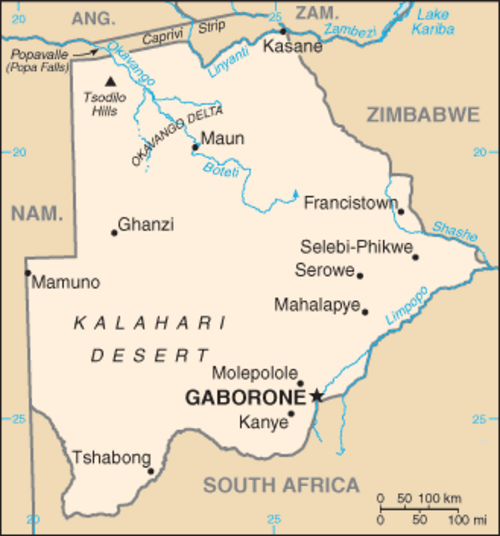 | 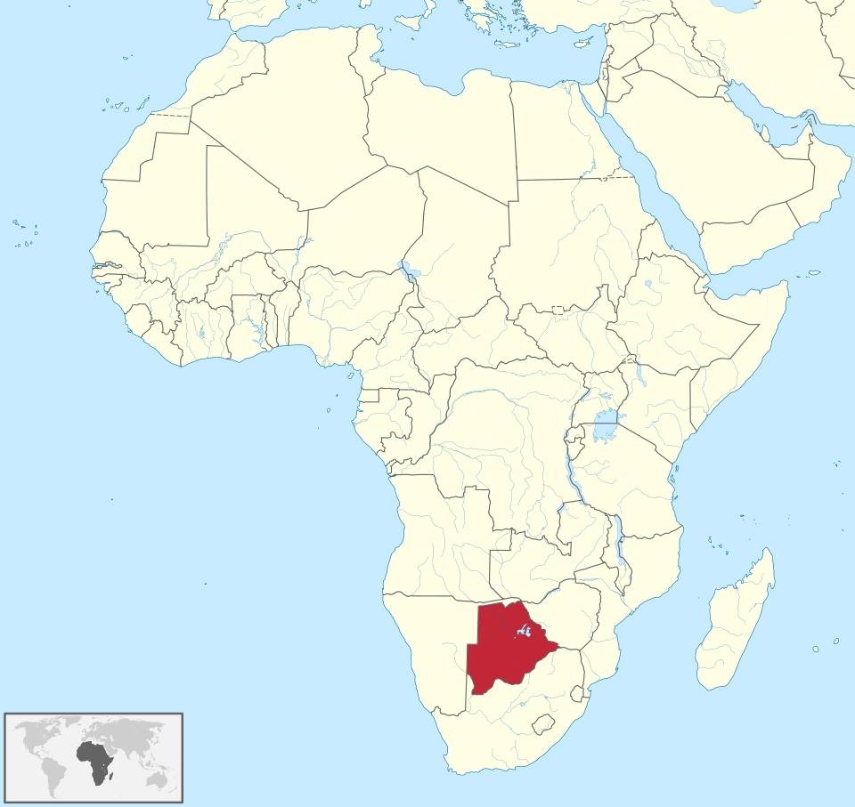 |

**认识国家／地区**：博茨瓦纳是南部非洲内陆国家，大部分国土处于卡拉哈里地区。北部奥卡万戈三角洲是内陆河形成的湿地，南东部人口较集中；地理差异比“全是沙漠”更准确。

**认识首都／城市**：哈博罗内位于东南部、接近南非边界，1966年独立时成为国家首都。规划城区与交通走廊相连，其位置便于联系区域经济；国家广阔的北部湿地并不是首都所在。

> **记忆钩子**：博茨瓦纳东南角，哈博罗内靠南非。

**容易混淆**：奥卡万戈是北部湿地，首都在东南部。

资料：[UNData 国家概况（统计快照）](https://data.un.org/legacy/en/iso/bw.html) · [国家／地区背景](https://en.wikipedia.org/wiki/Botswana) · [首都／城市背景](https://en.wikipedia.org/wiki/Gaborone)

地图：[File:Botswana-CIA WFB Map.png；CIA；Public domain](https://commons.wikimedia.org/wiki/File:Botswana-CIA_WFB_Map.png) · [File:Botswana in Africa.svg；TUBS；CC BY-SA 3.0](https://commons.wikimedia.org/wiki/File:Botswana_in_Africa.svg)

---

## 莱索托 — 马塞卢

Lesotho · Maseru · 南部非洲

| 国家／地区地图 | 非洲位置图 |
|:---:|:---:|
| 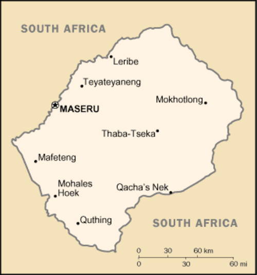 | 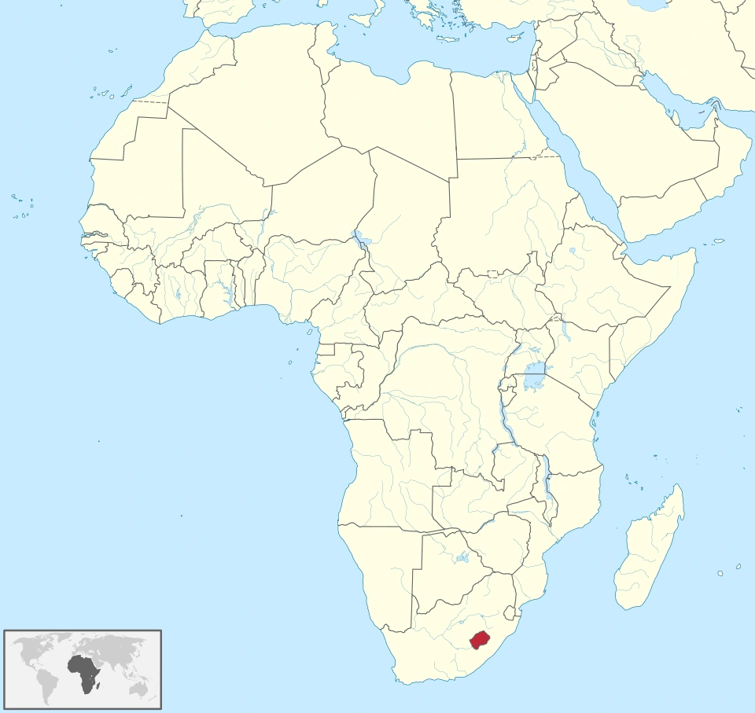 |

**认识国家／地区**：莱索托是完全被南非包围的内陆国家，地形以高地和山地为主。巴苏陀人的历史与山地环境密切相关；它是“国中之国”定位练习中最容易识别的一例。

**认识首都／城市**：马塞卢位于西部卡利登河附近、紧邻南非边界，是行政与商业中心。首都处于相对较低的西部人口带，而非最高山地；将“被南非包围、高地国家、西边首都”连起来即可。

> **记忆钩子**：莱索托被南非围住，马塞卢在西边出口。

**容易混淆**：马塞卢属莱索托，不是南非的城市首都。

资料：[UNData 国家概况（统计快照）](https://data.un.org/legacy/en/iso/ls.html) · [国家／地区背景](https://en.wikipedia.org/wiki/Lesotho) · [首都／城市背景](https://en.wikipedia.org/wiki/Maseru)

地图：[File:Lesotho-CIA WFB Map.png；CIA；Public domain](https://commons.wikimedia.org/wiki/File:Lesotho-CIA_WFB_Map.png) · [File:Lesotho in Africa.svg；TUBS；CC BY-SA 3.0](https://commons.wikimedia.org/wiki/File:Lesotho_in_Africa.svg)

---

## 斯威士兰 — 姆巴巴内／洛班巴

Eswatini · Mbabane / Lobamba · 南部非洲

| 国家／地区地图 | 非洲位置图 |
|:---:|:---:|
| 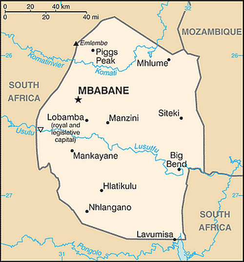 |  |

**认识国家／地区**：斯威士兰官方英文国名为Eswatini，位于南部非洲内陆，邻接南非与莫桑比克。西部高地向东下降到较低地区，王室传统在国家制度中具有重要位置。

**认识首都／城市**：姆巴巴内是行政首都，位于西部高地；洛班巴是王室及立法中心，两城承担不同职能。记忆时把“姆巴巴内办公、洛班巴王室与议会”配对，避免只背一个名字而忽略另一座城市。

> **记忆钩子**：斯威士兰双中心：姆行政，洛王室与立法。

**容易混淆**：Eswatini与旧英文名Swaziland指同一国家。

资料：[UNData 国家概况（统计快照）](https://data.un.org/legacy/en/iso/sz.html) · [国家／地区背景](https://en.wikipedia.org/wiki/Eswatini) · [首都／城市背景](https://en.wikipedia.org/wiki/Mbabane)

地图：[File:Eswatini-CIA WFB Map.png；CIA；Public domain](https://commons.wikimedia.org/wiki/File:Eswatini-CIA_WFB_Map.png) · [File:Eswatini in Africa.svg；TUBS；CC BY-SA 3.0](https://commons.wikimedia.org/wiki/File:Eswatini_in_Africa.svg)

---

# 北美洲

| 国家／地区 | English | 首都／城市 | English |
|---|---|---|---|
| 加拿大 | Canada | 渥太华 | Ottawa |
| 美国 | United States | 华盛顿哥伦比亚特区 | Washington, D.C. |
| 墨西哥 | Mexico | 墨西哥城 | Mexico City |
| 伯利兹 | Belize | 贝尔莫潘 | Belmopan |
| 危地马拉 | Guatemala | 危地马拉城 | Guatemala City |
| 洪都拉斯 | Honduras | 特古西加尔巴 | Tegucigalpa |
| 萨尔瓦多 | El Salvador | 圣萨尔瓦多 | San Salvador |
| 尼加拉瓜 | Nicaragua | 马那瓜 | Managua |
| 哥斯达黎加 | Costa Rica | 圣何塞 | San José |
| 巴拿马 | Panama | 巴拿马城 | Panama City |
| 古巴 | Cuba | 哈瓦那 | Havana |
| 牙买加 | Jamaica | 金斯敦 | Kingston |
| 海地 | Haiti | 太子港 | Port-au-Prince |
| 多米尼加共和国 | Dominican Republic | 圣多明各 | Santo Domingo |
| 巴哈马 | Bahamas | 拿骚 | Nassau |
| 安提瓜和巴布达 | Antigua and Barbuda | 圣约翰 | Saint John's |
| 圣基茨和尼维斯 | Saint Kitts and Nevis | 巴斯特尔 | Basseterre |
| 多米尼克 | Dominica | 罗索 | Roseau |
| 圣卢西亚 | Saint Lucia | 卡斯特里 | Castries |
| 圣文森特和格林纳丁斯 | Saint Vincent and the Grenadines | 金斯敦 | Kingstown |
| 巴巴多斯 | Barbados | 布里奇敦 | Bridgetown |
| 格林纳达 | Grenada | 圣乔治 | Saint George's |
| 特立尼达和多巴哥 | Trinidad and Tobago | 西班牙港 | Port of Spain |

## 加拿大 — 渥太华

Canada · Ottawa · 北美大陆

| 国家／地区地图 | 北美洲位置图 |
|:---:|:---:|
| 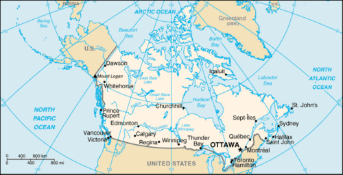 | 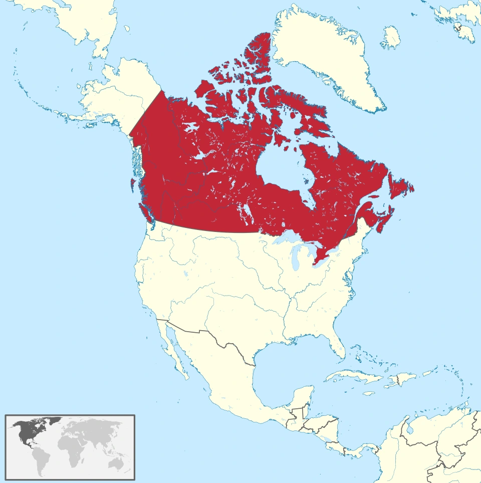 |

**认识国家／地区**：加拿大位于北美洲北部，面向大西洋、太平洋和北冰洋。国土广阔，南部人口较集中，落基山脉、草原与五大湖地区景观不同；英语和法语文化背景影响城市分布。

**认识首都／城市**：渥太华位于安大略省、渥太华河南岸，与魁北克省的加蒂诺隔河相望。1857年被选为首府，位置兼顾不同地区的联系；多伦多是大都市，蒙特利尔是重要法语城市，均不是国家首都。

> **记忆钩子**：加拿大首都在英法地区相接处，渥太华。

**容易混淆**：多伦多、温哥华、蒙特利尔都不是首都。

资料：[UNData 国家概况（统计快照）](https://data.un.org/legacy/en/iso/ca.html) · [国家／地区背景](https://en.wikipedia.org/wiki/Canada) · [首都／城市背景](https://en.wikipedia.org/wiki/Ottawa)

地图：[File:Canada-CIA WFB Map.png；CIA；Public domain](https://commons.wikimedia.org/wiki/File:Canada-CIA_WFB_Map.png) · [File:Canada in North America.svg；TUBS；CC BY-SA 3.0](https://commons.wikimedia.org/wiki/File:Canada_in_North_America.svg)

---

## 美国 — 华盛顿哥伦比亚特区

United States · Washington, D.C. · 北美大陆

| 国家／地区地图 | 北美洲位置图 |
|:---:|:---:|
| 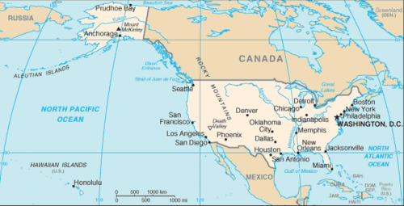 | 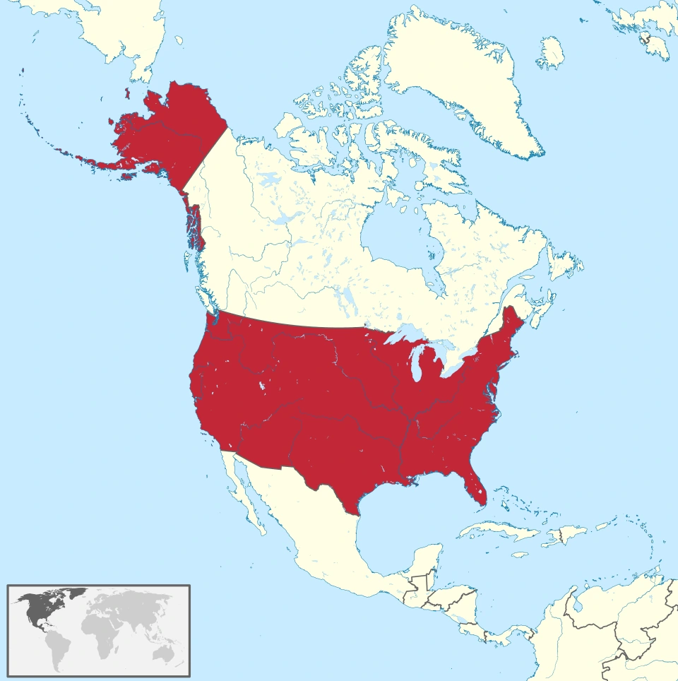 |

**认识国家／地区**：美国主体位于北美洲中部，还包括阿拉斯加与夏威夷。大陆地形从东部山地、中央平原到西部高山差异显著；联邦制度使国家首都与各州首府需分别辨认。

**认识首都／城市**：华盛顿哥伦比亚特区位于波托马克河畔，是独立于各州的联邦首都区。国会、白宫和最高法院分别体现立法、行政与司法；名称纪念乔治·华盛顿，不能与西北部华盛顿州混淆。

> **记忆钩子**：美国政府三大机构，集中华盛顿特区。

**容易混淆**：纽约不是首都；华盛顿州与华盛顿特区不是同一地方。

资料：[UNData 国家概况（统计快照）](https://data.un.org/legacy/en/iso/us.html) · [国家／地区背景](https://en.wikipedia.org/wiki/United_States) · [首都／城市背景](https://en.wikipedia.org/wiki/Washington%2C_D.C.)

地图：[File:United States-CIA WFB Map.png；见原图来源页；Public domain](https://commons.wikimedia.org/wiki/File:United_States-CIA_WFB_Map.png) · [File:United States in North America.svg；TUBS；CC BY-SA 3.0](https://commons.wikimedia.org/wiki/File:United_States_in_North_America.svg)

---

## 墨西哥 — 墨西哥城

Mexico · Mexico City · 中美洲

| 国家／地区地图 | 北美洲位置图 |
|:---:|:---:|
| 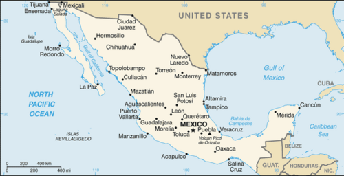 | 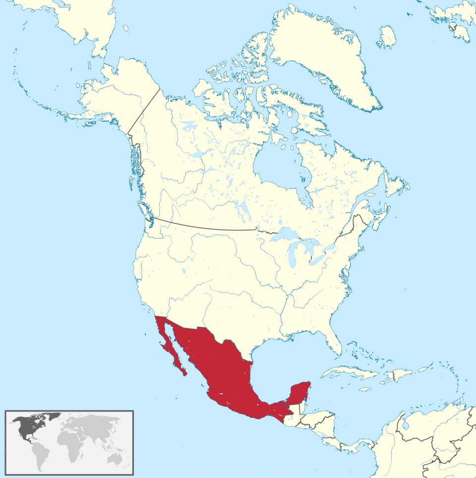 |

**认识国家／地区**：墨西哥位于北美洲南部，东面向墨西哥湾和加勒比海，西临太平洋。高原、山脉和南部热带地区并存；玛雅与阿兹特克文明及西班牙殖民历史构成重要文化背景。

**认识首都／城市**：墨西哥城位于中部高原盆地，建在阿兹特克都城特诺奇蒂特兰的历史基础上。城市海拔较高，是国家政治与文化中心；国家名加“城”就得到首都名，位置却是内陆而非沿海。

> **记忆钩子**：墨西哥加一个“城”，高原上是墨西哥城。

**容易混淆**：首都在高原盆地；不是海边旅游城市。

资料：[UNData 国家概况（统计快照）](https://data.un.org/legacy/en/iso/mx.html) · [国家／地区背景](https://en.wikipedia.org/wiki/Mexico) · [首都／城市背景](https://en.wikipedia.org/wiki/Mexico_City)

地图：[File:Mexico-CIA WFB Map.png；见原图来源页；Public domain](https://commons.wikimedia.org/wiki/File:Mexico-CIA_WFB_Map.png) · [File:Mexico in North America.svg；TUBS；CC BY-SA 3.0](https://commons.wikimedia.org/wiki/File:Mexico_in_North_America.svg)

---

## 伯利兹 — 贝尔莫潘

Belize · Belmopan · 中美洲

| 国家／地区地图 | 北美洲位置图 |
|:---:|:---:|
| 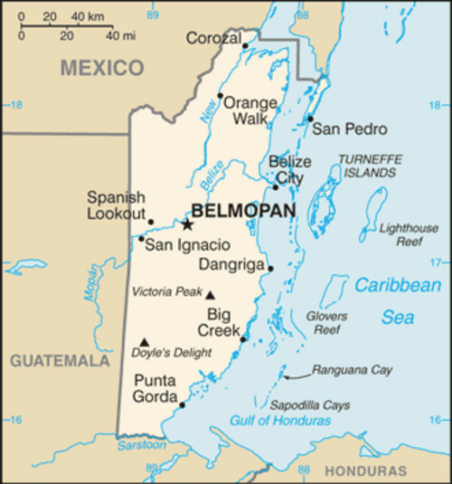 |  |

**认识国家／地区**：伯利兹位于中美洲加勒比海岸，西邻危地马拉、北邻墨西哥。它以英语为官方语言，沿海珊瑚礁和内陆玛雅遗址都很鲜明；在中美洲语言分布中较特别。

**认识首都／城市**：贝尔莫潘位于内陆，1970年成为首都，迁建与旧首都伯利兹城遭受飓风有关。新城承担政府功能，伯利兹城仍是重要港口与商业中心；“避开海岸风险，迁向内陆”是记忆主线。

> **记忆钩子**：伯利兹从海边迁内陆，贝尔莫潘。

**容易混淆**：伯利兹城是旧首都，不是现首都。

资料：[UNData 国家概况（统计快照）](https://data.un.org/legacy/en/iso/bz.html) · [国家／地区背景](https://en.wikipedia.org/wiki/Belize) · [首都／城市背景](https://en.wikipedia.org/wiki/Belmopan)

地图：[File:Belize-CIA WFB Map.png；United States Central Intelligence Agency；Public domain](https://commons.wikimedia.org/wiki/File:Belize-CIA_WFB_Map.png) · [File:Belize in North America.svg；TUBS；CC BY-SA 3.0](https://commons.wikimedia.org/wiki/File:Belize_in_North_America.svg)

---

## 危地马拉 — 危地马拉城

Guatemala · Guatemala City · 中美洲

| 国家／地区地图 | 北美洲位置图 |
|:---:|:---:|
| 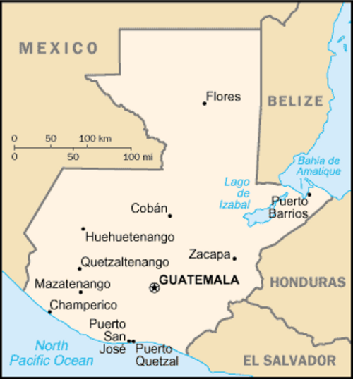 | 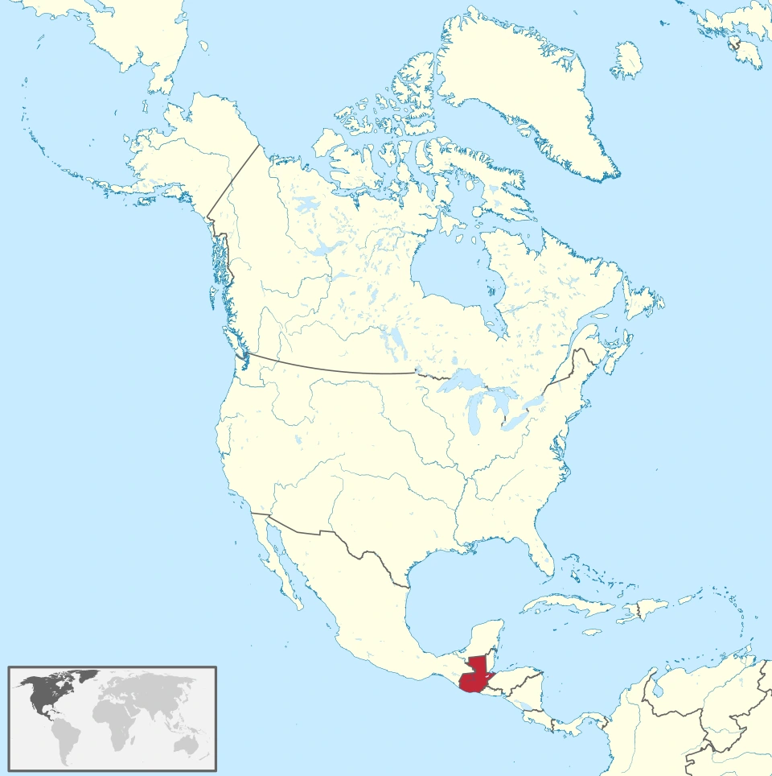 |

**认识国家／地区**：危地马拉位于中美洲北部，拥有太平洋海岸及较短的加勒比海出口。火山高地与北部低地不同，玛雅文化遗产丰富；蒂卡尔遗址是历史线索，但不是现代首都。

**认识首都／城市**：危地马拉城位于南部高原，1776年在旧首都遭地震破坏后建立。现首都与历史名城安提瓜危地马拉应区分；首都名称直接加“城”，再联想地震后的新行政中心就能记牢。

> **记忆钩子**：危地马拉—危地马拉城，地震后重建首都。

**容易混淆**：安提瓜危地马拉是旧首都；不是安提瓜和巴布达岛国。

资料：[UNData 国家概况（统计快照）](https://data.un.org/legacy/en/iso/gt.html) · [国家／地区背景](https://en.wikipedia.org/wiki/Guatemala) · [首都／城市背景](https://en.wikipedia.org/wiki/Guatemala_City)

地图：[File:Guatemala-CIA WFB Map.png；CIA；Public domain](https://commons.wikimedia.org/wiki/File:Guatemala-CIA_WFB_Map.png) · [File:Guatemala in North America.svg；TUBS；CC BY-SA 3.0](https://commons.wikimedia.org/wiki/File:Guatemala_in_North_America.svg)

---

## 洪都拉斯 — 特古西加尔巴

Honduras · Tegucigalpa · 中美洲

| 国家／地区地图 | 北美洲位置图 |
|:---:|:---:|
| 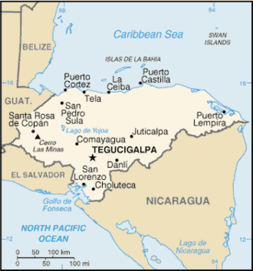 |  |

**认识国家／地区**：洪都拉斯位于中美洲，北临加勒比海，南部通过丰塞卡湾通向太平洋。内陆多山，海岸低地与高地差异明显；首都位于南部内陆，而非北部港口带。

**认识首都／城市**：特古西加尔巴建在丘陵河谷，历史与矿业聚落有关，与科马亚圭拉共同组成中央区。长名称适合分段记忆，再配上“山谷里的行政中心”形象，避免被加勒比海岸位置带偏。

> **记忆钩子**：洪都拉斯山谷里，特古—西加尔巴。

**容易混淆**：名称较长，别与危地马拉城或马那瓜串联。

资料：[UNData 国家概况（统计快照）](https://data.un.org/legacy/en/iso/hn.html) · [国家／地区背景](https://en.wikipedia.org/wiki/Honduras) · [首都／城市背景](https://en.wikipedia.org/wiki/Tegucigalpa)

地图：[File:Honduras-CIA WFB Map.png；CIA；Public domain](https://commons.wikimedia.org/wiki/File:Honduras-CIA_WFB_Map.png) · [File:Honduras in North America.svg；Alex Great；CC BY-SA 3.0](https://commons.wikimedia.org/wiki/File:Honduras_in_North_America.svg)

---

## 萨尔瓦多 — 圣萨尔瓦多

El Salvador · San Salvador · 中美洲

| 国家／地区地图 | 北美洲位置图 |
|:---:|:---:|
| 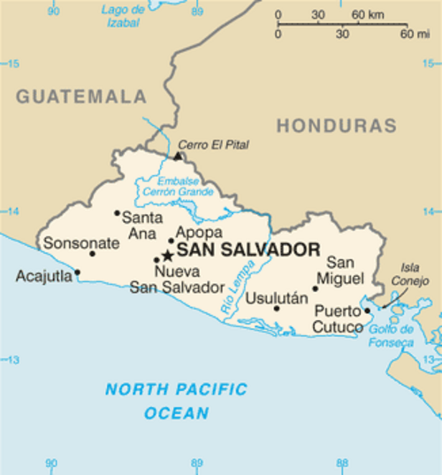 |  |

**认识国家／地区**：萨尔瓦多位于中美洲太平洋一侧，是该地区面积较小、人口集中的国家。火山和山地影响城市与农业分布；它没有加勒比海岸，位置可通过太平洋海岸快速辨认。

**认识首都／城市**：圣萨尔瓦多位于内陆火山谷地，是行政、商业与文化中心。国家名意为“救世主”，首都在国名前加“圣”；城市周边火山与地震背景也解释了其建筑及灾害历史。

> **记忆钩子**：萨尔瓦多前加“圣”，首都圣萨尔瓦多。

**容易混淆**：国家与首都相似，但首都多一个“圣”。

资料：[UNData 国家概况（统计快照）](https://data.un.org/legacy/en/iso/sv.html) · [国家／地区背景](https://en.wikipedia.org/wiki/El_Salvador) · [首都／城市背景](https://en.wikipedia.org/wiki/San_Salvador)

地图：[File:El Salvador-CIA WFB Map.png；见原图来源页；Public domain](https://commons.wikimedia.org/wiki/File:El_Salvador-CIA_WFB_Map.png) · [File:El Salvador in North America.svg；TUBS；CC BY-SA 3.0](https://commons.wikimedia.org/wiki/File:El_Salvador_in_North_America.svg)

---

## 尼加拉瓜 — 马那瓜

Nicaragua · Managua · 中美洲

| 国家／地区地图 | 北美洲位置图 |
|:---:|:---:|
| 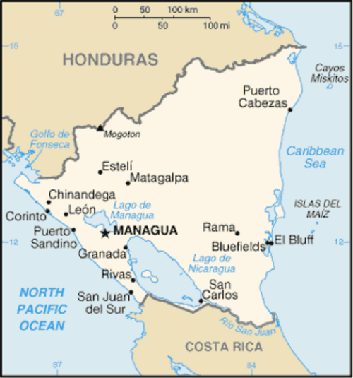 | 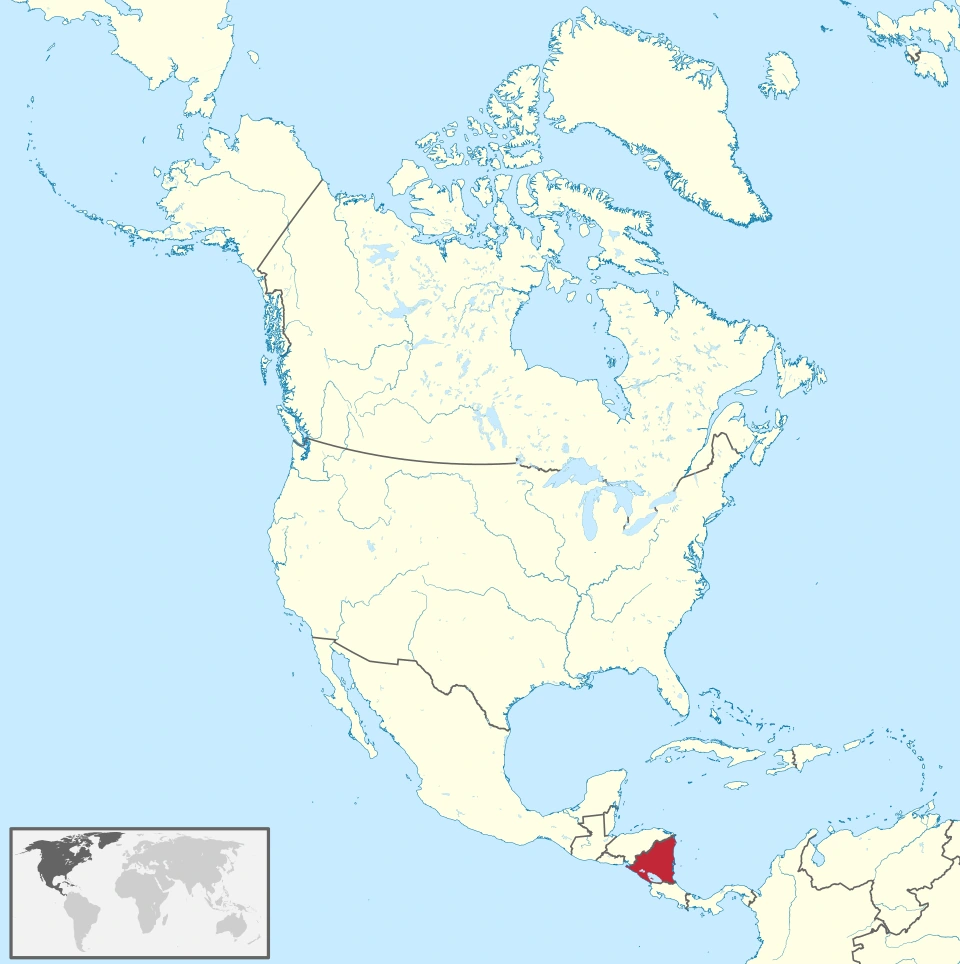 |

**认识国家／地区**：尼加拉瓜位于中美洲，夹在洪都拉斯与哥斯达黎加之间，两侧分别面向加勒比海和太平洋。西部火山带及马那瓜湖、尼加拉瓜湖是地图识别的关键。

**认识首都／城市**：马那瓜位于马那瓜湖南岸，1852年成为首都，处于旧政治中心莱昂与格拉纳达之间。湖岸位置与地震经历都影响城市发展；把“尼加拉瓜—马那瓜湖—马那瓜城”连在一起记。

> **记忆钩子**：尼加拉瓜在湖边，马那瓜就是首都。

**容易混淆**：国家名和首都名都带“瓜”，但音节不相同。

资料：[UNData 国家概况（统计快照）](https://data.un.org/legacy/en/iso/ni.html) · [国家／地区背景](https://en.wikipedia.org/wiki/Nicaragua) · [首都／城市背景](https://en.wikipedia.org/wiki/Managua)

地图：[File:Nicaragua-CIA WFB Map.png；CIA；Public domain](https://commons.wikimedia.org/wiki/File:Nicaragua-CIA_WFB_Map.png) · [File:Nicaragua in North America.svg；TUBS；CC BY-SA 3.0](https://commons.wikimedia.org/wiki/File:Nicaragua_in_North_America.svg)

---

## 哥斯达黎加 — 圣何塞

Costa Rica · San José · 中美洲

| 国家／地区地图 | 北美洲位置图 |
|:---:|:---:|
| 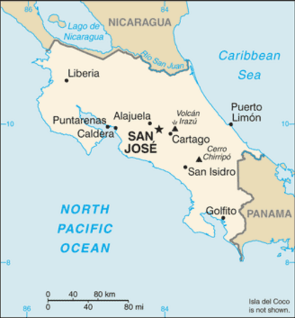 | 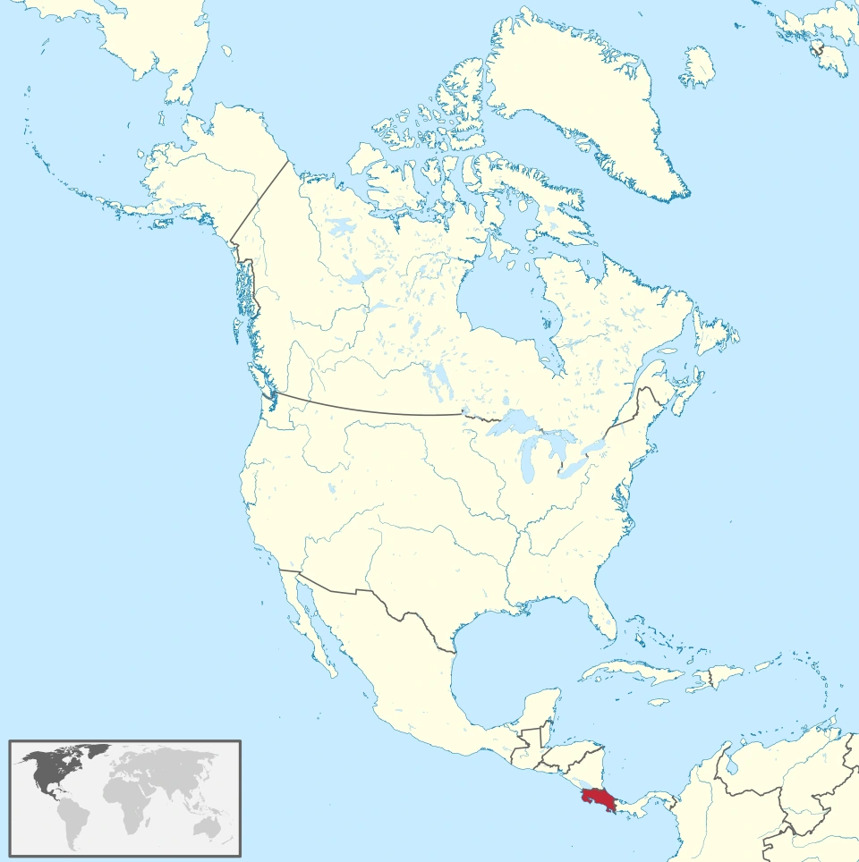 |

**认识国家／地区**：哥斯达黎加位于中美洲，北邻尼加拉瓜，南接巴拿马，两侧临海。中央山地与两岸低地差异明显，森林和生物多样性受到关注；国名常译为“富饶海岸”。

**认识首都／城市**：圣何塞位于中央谷地，是政治和交通中心，周边多个城市构成相连的都市区域。首都并不在海岸，较高地势与内陆交通联系更能解释其位置；咖啡种植历史与城市发展有关。

> **记忆钩子**：哥斯达黎加有两岸，圣何塞在中央谷地。

**容易混淆**：圣何塞是常见城市名，答题需连同国家记忆。

资料：[UNData 国家概况（统计快照）](https://data.un.org/legacy/en/iso/cr.html) · [国家／地区背景](https://en.wikipedia.org/wiki/Costa_Rica) · [首都／城市背景](https://en.wikipedia.org/wiki/San_Jos%C3%A9)

地图：[File:Costa Rica-CIA WFB Map.png；United States Central Intelligence Agency；Public domain](https://commons.wikimedia.org/wiki/File:Costa_Rica-CIA_WFB_Map.png) · [File:Costa Rica in North America.svg；TUBS；CC BY-SA 3.0](https://commons.wikimedia.org/wiki/File:Costa_Rica_in_North_America.svg)

---

## 巴拿马 — 巴拿马城

Panama · Panama City · 中美洲

| 国家／地区地图 | 北美洲位置图 |
|:---:|:---:|
| 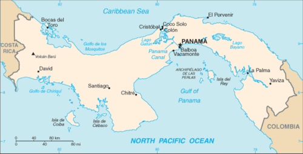 | 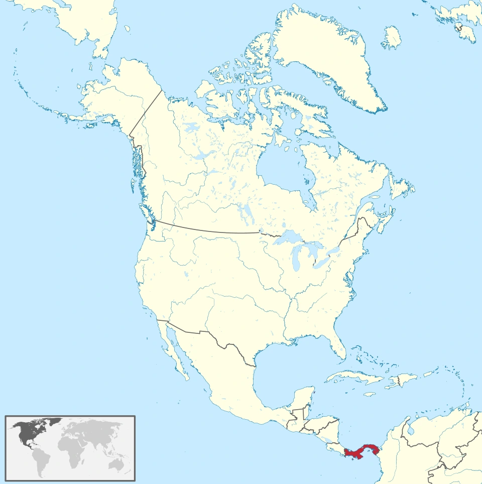 |

**认识国家／地区**：巴拿马位于连接中美洲与南美洲的地峡，北临加勒比海、南临太平洋。巴拿马运河穿越较狭窄地带，地理位置直接塑造国家的航运、贸易与城市功能。

**认识首都／城市**：巴拿马城位于运河南端附近的太平洋岸，是行政与商业中心。旧城区与现代高层建筑并存，城市历史与跨地峡通道相关；国名加“城”，再把位置放到运河南口即可。

> **记忆钩子**：巴拿马运河南端，巴拿马城看太平洋。

**容易混淆**：运河北端的科隆不是首都。

资料：[UNData 国家概况（统计快照）](https://data.un.org/legacy/en/iso/pa.html) · [国家／地区背景](https://en.wikipedia.org/wiki/Panama) · [首都／城市背景](https://en.wikipedia.org/wiki/Panama_City)

地图：[File:Panama-CIA WFB Map.png；CIA；Public domain](https://commons.wikimedia.org/wiki/File:Panama-CIA_WFB_Map.png) · [File:Panama in North America.svg；TUBS；CC BY-SA 3.0](https://commons.wikimedia.org/wiki/File:Panama_in_North_America.svg)

---

## 古巴 — 哈瓦那

Cuba · Havana · 加勒比

| 国家／地区地图 | 北美洲位置图 |
|:---:|:---:|
| 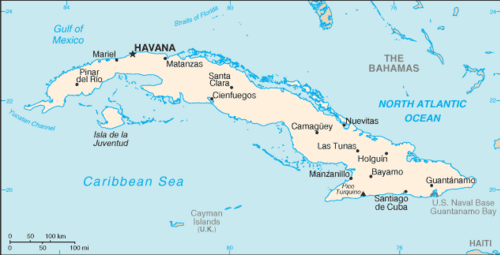 |  |

**认识国家／地区**：古巴是加勒比海的大岛国家，位于佛罗里达以南、墨西哥湾与加勒比海相接处。主岛狭长，热带气候、糖业历史和海上贸易塑造国家景观。

**认识首都／城市**：哈瓦那位于古巴主岛西北海岸，围绕天然港湾发展。老城的广场和防御建筑体现其在西班牙海上航路中的角色；把首都记在接近佛罗里达方向的海岸，比只记城市风格更准确。

> **记忆钩子**：古巴西北海岸，港湾城市哈瓦那。

**容易混淆**：圣地亚哥是古巴另一重要城市，但首都为哈瓦那。

资料：[UNData 国家概况（统计快照）](https://data.un.org/legacy/en/iso/cu.html) · [国家／地区背景](https://en.wikipedia.org/wiki/Cuba) · [首都／城市背景](https://en.wikipedia.org/wiki/Havana)

地图：[File:Cuba-CIA WFB Map.png；United States Central Intelligence Agency；Public domain](https://commons.wikimedia.org/wiki/File:Cuba-CIA_WFB_Map.png) · [File:Cuba in North America.svg；TUBS；CC BY-SA 3.0](https://commons.wikimedia.org/wiki/File:Cuba_in_North_America.svg)

---

## 牙买加 — 金斯敦

Jamaica · Kingston · 加勒比

| 国家／地区地图 | 北美洲位置图 |
|:---:|:---:|
| 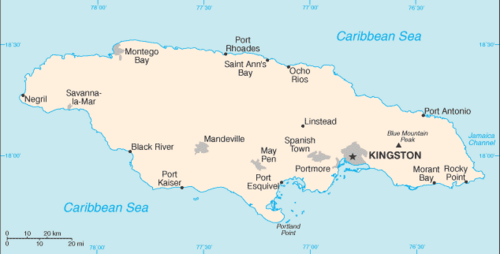 | 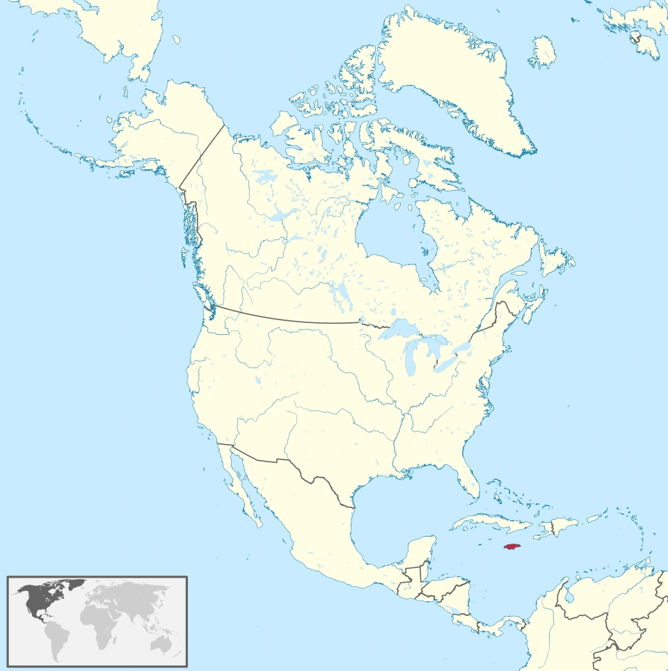 |

**认识国家／地区**：牙买加位于加勒比海，古巴以南、伊斯帕尼奥拉岛以西。内陆山地与海岸平原并存，英语背景与雷鬼音乐是文化线索；地图上它是一座独立的大岛。

**认识首都／城市**：金斯敦位于东南海岸，面向大型天然港湾，1872年成为首都。城市与音乐文化及港口经济紧密联系；英文Kingston没有结尾的w，这一点能帮助区分圣文森特的Kingstown。

> **记忆钩子**：牙买加东南岸，Kingston金斯敦。

**容易混淆**：与圣文森特的Kingstown中文译名近似，英文拼写不同。

资料：[UNData 国家概况（统计快照）](https://data.un.org/legacy/en/iso/jm.html) · [国家／地区背景](https://en.wikipedia.org/wiki/Jamaica) · [首都／城市背景](https://en.wikipedia.org/wiki/Kingston%2C_Jamaica)

地图：[File:Jamaica-CIA WFB Map.png；CIA；Public domain](https://commons.wikimedia.org/wiki/File:Jamaica-CIA_WFB_Map.png) · [File:Jamaica in North America.svg；TUBS；CC BY-SA 3.0](https://commons.wikimedia.org/wiki/File:Jamaica_in_North_America.svg)

---

## 海地 — 太子港

Haiti · Port-au-Prince · 加勒比

| 国家／地区地图 | 北美洲位置图 |
|:---:|:---:|
| 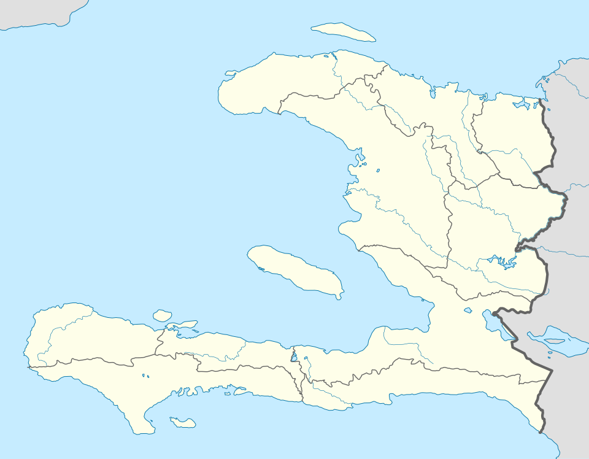 |  |

**认识国家／地区**：海地位于伊斯帕尼奥拉岛西部，东部为多米尼加共和国。山地和沿岸盆地交错，法语与海地克里奥尔语体现历史；1804年独立是理解现代国家的重要节点。

**认识首都／城市**：太子港位于西部戈纳夫湾内，是行政和港口中心。城市由海湾向周边山坡扩展，交通和人口高度集中；2010年地震是近现代城市史的重要事件，地形也影响其发展条件。

> **记忆钩子**：海地在岛西侧，太子港面对西部海湾。

**容易混淆**：海地—太子港；同岛东部多米尼加共和国—圣多明各。

资料：[UNData 国家概况（统计快照）](https://data.un.org/legacy/en/iso/ht.html) · [国家／地区背景](https://en.wikipedia.org/wiki/Haiti) · [首都／城市背景](https://en.wikipedia.org/wiki/Port-au-Prince)

地图：[File:Haiti location map.svg；Alexrk2；CC BY-SA 3.0](https://commons.wikimedia.org/wiki/File:Haiti_location_map.svg) · [File:Haiti in North America.svg；TUBS；CC BY-SA 3.0](https://commons.wikimedia.org/wiki/File:Haiti_in_North_America.svg)

---

## 多米尼加共和国 — 圣多明各

Dominican Republic · Santo Domingo · 加勒比

| 国家／地区地图 | 北美洲位置图 |
|:---:|:---:|
| 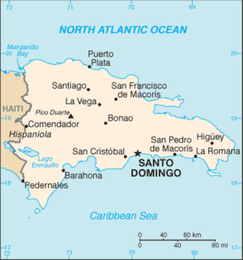 | 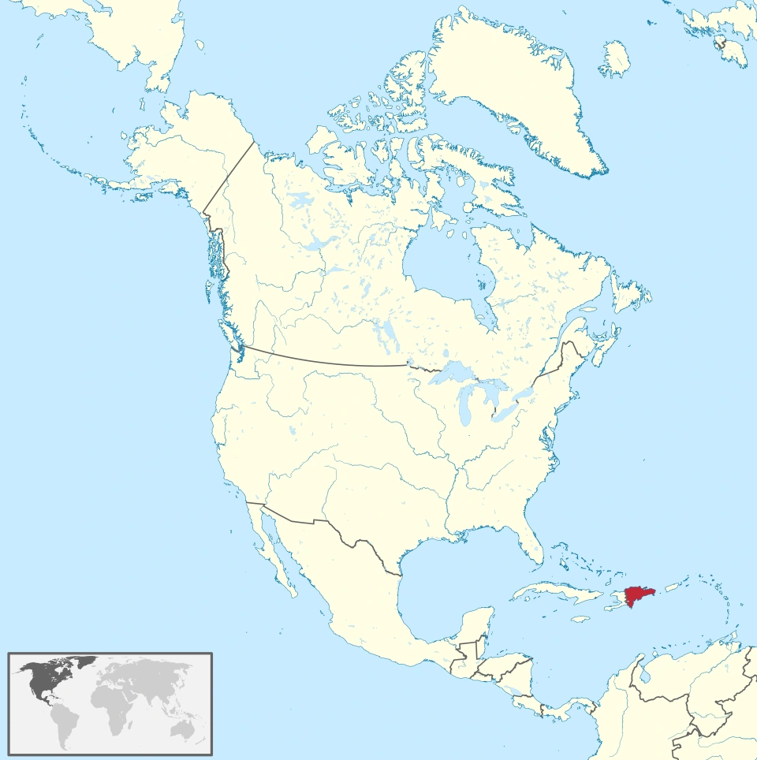 |

**认识国家／地区**：多米尼加共和国位于伊斯帕尼奥拉岛东部，西邻海地，南临加勒比海。山地、河谷与沿岸旅游地区并存，西班牙语背景鲜明；名称容易与另一个岛国多米尼克混淆。

**认识首都／城市**：圣多明各位于南岸奥萨马河口，拥有早期欧洲殖民城市遗存。殖民城区的教堂、广场与街道体现其历史地位；把国名里的“多米尼”与首都“多明”联系起来，再记它在大岛南岸。

> **记忆钩子**：多米尼加共和国在大岛，首都圣多明各。

**容易混淆**：多米尼克是另一岛国，首都罗索。

资料：[UNData 国家概况（统计快照）](https://data.un.org/legacy/en/iso/do.html) · [国家／地区背景](https://en.wikipedia.org/wiki/Dominican_Republic) · [首都／城市背景](https://en.wikipedia.org/wiki/Santo_Domingo)

地图：[File:Dominican Republic-CIA WFB Map.png；CIA；Public domain](https://commons.wikimedia.org/wiki/File:Dominican_Republic-CIA_WFB_Map.png) · [File:Dominican Republic in North America.svg；TUBS；CC BY-SA 3.0](https://commons.wikimedia.org/wiki/File:Dominican_Republic_in_North_America.svg)

---

## 巴哈马 — 拿骚

Bahamas · Nassau · 加勒比

| 国家／地区地图 | 北美洲位置图 |
|:---:|:---:|
| 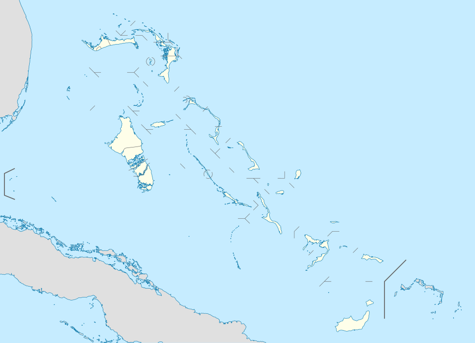 | 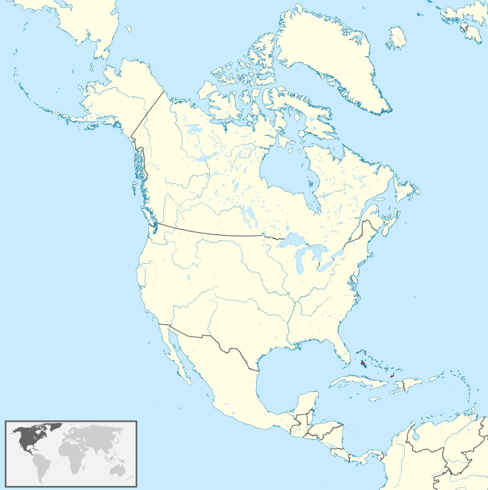 |

**认识国家／地区**：巴哈马由大西洋上的众多岛屿和浅滩组成，位于佛罗里达东南、古巴以北。虽常列入加勒比地区，许多岛屿位于大西洋一侧；岛群分散，海洋活动与旅游联系密切。

**认识首都／城市**：拿骚位于新普罗维登斯岛，是行政、商业和旅游中心。历史港口与海盗时代的故事让城市辨识度很高；国家岛屿众多，首都却集中在一座较小的主城市岛上。

> **记忆钩子**：巴哈马群岛中，拿骚在新普罗维登斯岛。

**容易混淆**：别把巴哈马与巴巴多斯混淆。

资料：[UNData 国家概况（统计快照）](https://data.un.org/legacy/en/iso/bs.html) · [国家／地区背景](https://en.wikipedia.org/wiki/The_Bahamas) · [首都／城市背景](https://en.wikipedia.org/wiki/Nassau)

地图：[File:Bahamas location map.svg；NordNordWest；CC BY-SA 3.0](https://commons.wikimedia.org/wiki/File:Bahamas_location_map.svg) · [File:Bahamas in North America.svg；TUBS；CC BY-SA 3.0](https://commons.wikimedia.org/wiki/File:Bahamas_in_North_America.svg)

---

## 安提瓜和巴布达 — 圣约翰

Antigua and Barbuda · Saint John's · 加勒比

| 国家／地区地图 | 北美洲位置图 |
|:---:|:---:|
| 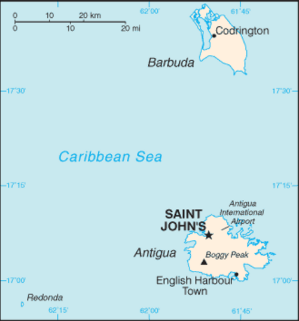 | 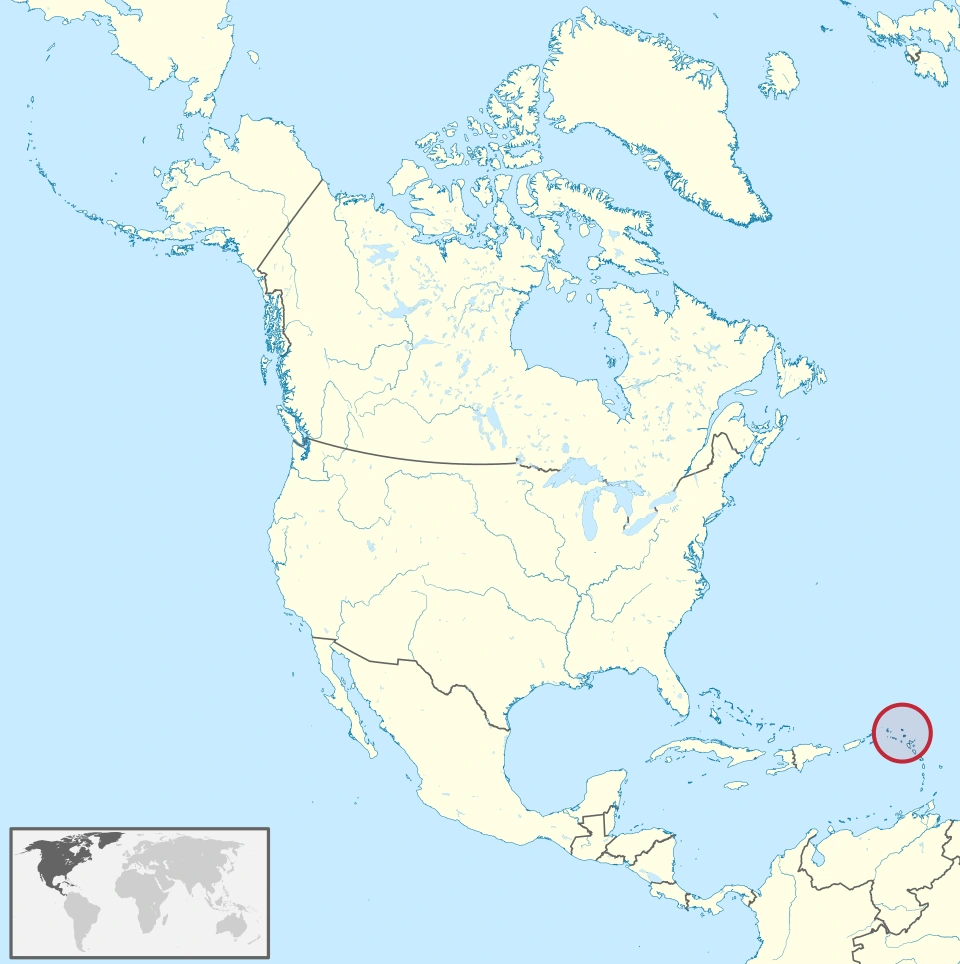 |

**认识国家／地区**：安提瓜和巴布达位于东加勒比海，是以两座同名岛屿组成的国家。岛屿地势和人口分布不同，海湾、珊瑚与海上联系很鲜明；先记两岛，再找人口集中的安提瓜岛。

**认识首都／城市**：圣约翰位于安提瓜岛西北岸，是政府和港口中心。海湾与市集体现其航运、旅游和城市生活联系；中文名字较常见，记忆时必须把“安提瓜岛西北港口”一并带上。

> **记忆钩子**：安提瓜岛西北岸，圣约翰是首都。

**容易混淆**：不是加拿大纽芬兰的圣约翰斯。

资料：[UNData 国家概况（统计快照）](https://data.un.org/legacy/en/iso/ag.html) · [国家／地区背景](https://en.wikipedia.org/wiki/Antigua_and_Barbuda) · [首都／城市背景](https://en.wikipedia.org/wiki/St._John%27s%2C_Antigua_and_Barbuda)

地图：[File:Antigua and Barbuda-CIA WFB Map.png；见原图来源页；Public domain](https://commons.wikimedia.org/wiki/File:Antigua_and_Barbuda-CIA_WFB_Map.png) · [File:Antigua and Barbuda in North America.svg；TUBS；CC BY-SA 3.0](https://commons.wikimedia.org/wiki/File:Antigua_and_Barbuda_in_North_America.svg)

---

## 圣基茨和尼维斯 — 巴斯特尔

Saint Kitts and Nevis · Basseterre · 加勒比

| 国家／地区地图 | 北美洲位置图 |
|:---:|:---:|
| 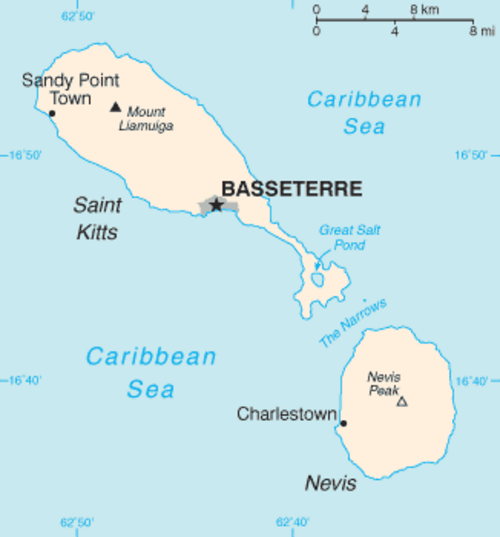 | 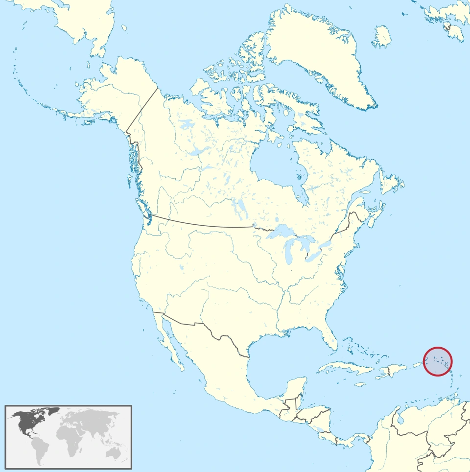 |

**认识国家／地区**：圣基茨和尼维斯位于东加勒比海，由相邻的两座火山岛组成。国家规模较小，岛际海峡清晰，糖业历史和海港遗迹帮助理解聚落布局。

**认识首都／城市**：巴斯特尔位于圣基茨岛南部海岸，是联邦首都和港口。城市名来自法语“低地”，与岛上较高火山形成对照；尼维斯岛的主要城镇是查尔斯敦，不能替代联邦首都。

> **记忆钩子**：圣基茨岛南岸低地，巴斯特尔。

**容易混淆**：首都在圣基茨岛，不在尼维斯岛。

资料：[UNData 国家概况（统计快照）](https://data.un.org/legacy/en/iso/kn.html) · [国家／地区背景](https://en.wikipedia.org/wiki/Saint_Kitts_and_Nevis) · [首都／城市背景](https://en.wikipedia.org/wiki/Basseterre)

地图：[File:Saint Kitts and Nevis-CIA WFB Map.png；Unknown author Unknown author；Public domain](https://commons.wikimedia.org/wiki/File:Saint_Kitts_and_Nevis-CIA_WFB_Map.png) · [File:Saint Kitts and Nevis in North America.svg；TUBS；CC BY-SA 3.0](https://commons.wikimedia.org/wiki/File:Saint_Kitts_and_Nevis_in_North_America.svg)

---

## 多米尼克 — 罗索

Dominica · Roseau · 加勒比

| 国家／地区地图 | 北美洲位置图 |
|:---:|:---:|
| 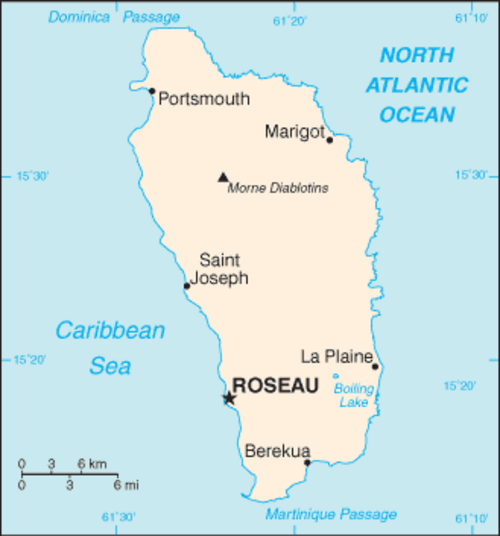 |  |

**认识国家／地区**：多米尼克位于东加勒比海、瓜德罗普与马提尼克之间，是山地和雨林鲜明的岛国。火山地貌与河流众多，与以大岛东部为国土的多米尼加共和国不同。

**认识首都／城市**：罗索位于西南海岸，靠近罗索河入海口，是政府与港口中心。名称与河口植物背景相关，城市背靠山地；把“雨林火山岛西南角的小首都”作为图像，更容易记住短名字。

> **记忆钩子**：多米尼克小山岛，西南罗索。

**容易混淆**：多米尼克—罗索；多米尼加共和国—圣多明各。

资料：[UNData 国家概况（统计快照）](https://data.un.org/legacy/en/iso/dm.html) · [国家／地区背景](https://en.wikipedia.org/wiki/Dominica) · [首都／城市背景](https://en.wikipedia.org/wiki/Roseau)

地图：[File:Dominica-CIA WFB Map.png；见原图来源页；Public domain](https://commons.wikimedia.org/wiki/File:Dominica-CIA_WFB_Map.png) · [File:Dominica in North America.svg；TUBS；CC BY-SA 3.0](https://commons.wikimedia.org/wiki/File:Dominica_in_North_America.svg)

---

## 圣卢西亚 — 卡斯特里

Saint Lucia · Castries · 加勒比

| 国家／地区地图 | 北美洲位置图 |
|:---:|:---:|
| 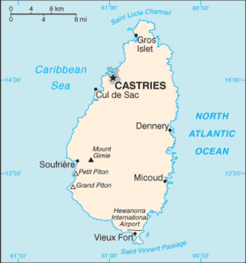 |  |

**认识国家／地区**：圣卢西亚位于东加勒比海，马提尼克以南、圣文森特以北。它是一座火山岛，南部双峰地貌尤其鲜明；海岸港湾与山地共同决定城市和旅游区分布。

**认识首都／城市**：卡斯特里位于西北海岸，围绕天然港湾发展，是行政和商业中心。城市名称与法国历史人物有关；地理记忆可用“北边港湾首都、南边双峰景观”形成对照。

> **记忆钩子**：圣卢西亚北边港湾，卡斯特里。

**容易混淆**：著名双峰在南部，首都在西北海岸。

资料：[UNData 国家概况（统计快照）](https://data.un.org/legacy/en/iso/lc.html) · [国家／地区背景](https://en.wikipedia.org/wiki/Saint_Lucia) · [首都／城市背景](https://en.wikipedia.org/wiki/Castries)

地图：[File:Saint Lucia-CIA WFB Map.png；见原图来源页；Public domain](https://commons.wikimedia.org/wiki/File:Saint_Lucia-CIA_WFB_Map.png) · [File:Saint Lucia in North America.svg；TUBS；CC BY-SA 3.0](https://commons.wikimedia.org/wiki/File:Saint_Lucia_in_North_America.svg)

---

## 圣文森特和格林纳丁斯 — 金斯敦

Saint Vincent and the Grenadines · Kingstown · 加勒比

| 国家／地区地图 | 北美洲位置图 |
|:---:|:---:|
| 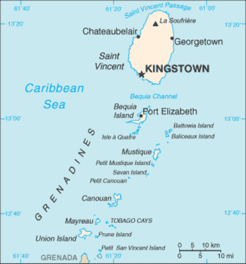 |  |

**认识国家／地区**：圣文森特和格林纳丁斯位于东加勒比海，包括圣文森特主岛与向南延伸的岛链。主岛北部有火山，较小岛屿分散，海运和岛际联系是重要地理特点。

**认识首都／城市**：金斯敦位于圣文森特岛西南岸，是行政和港口中心。英文拼写为Kingstown，比牙买加的Kingston多一个w；用“圣文森特主岛西南港口”帮助区分同译名的两个首都。

> **记忆钩子**：圣文森特Kingstown，比牙买加多一个w。

**容易混淆**：两国首都中文常同译金斯敦，要核对英文。

资料：[UNData 国家概况（统计快照）](https://data.un.org/legacy/en/iso/vc.html) · [国家／地区背景](https://en.wikipedia.org/wiki/Saint_Vincent_and_the_Grenadines) · [首都／城市背景](https://en.wikipedia.org/wiki/Kingstown)

地图：[File:Saint Vincent and the Grenadines-CIA WFB Map.png；见原图来源页；Public domain](https://commons.wikimedia.org/wiki/File:Saint_Vincent_and_the_Grenadines-CIA_WFB_Map.png) · [File:Saint Vincent and the Grenadines in North America.svg；TUBS；CC BY-SA 3.0](https://commons.wikimedia.org/wiki/File:Saint_Vincent_and_the_Grenadines_in_North_America.svg)

---

## 巴巴多斯 — 布里奇敦

Barbados · Bridgetown · 加勒比

| 国家／地区地图 | 北美洲位置图 |
|:---:|:---:|
| 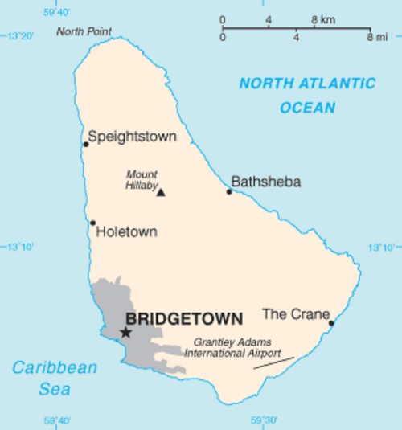 |  |

**认识国家／地区**：巴巴多斯位于加勒比岛链以东的大西洋上，是地势相对较低的珊瑚灰岩岛国。它与巴哈马名称相似，却是一座更靠东南的单独主岛；糖业与英国历史联系明显。

**认识首都／城市**：布里奇敦位于主岛西南岸，是行政与港口中心。英文名含“桥镇”之意，历史城区和驻军遗址保留殖民时期城市格局；把“巴巴多斯—桥—布里奇敦”连起来可减少音译负担。

> **记忆钩子**：巴巴多斯有座桥镇，布里奇敦。

**容易混淆**：巴巴多斯—布里奇敦；巴哈马—拿骚。

资料：[UNData 国家概况（统计快照）](https://data.un.org/legacy/en/iso/bb.html) · [国家／地区背景](https://en.wikipedia.org/wiki/Barbados) · [首都／城市背景](https://en.wikipedia.org/wiki/Bridgetown)

地图：[File:Barbados-CIA WFB Map.png；United States Central Intelligence Agency；Public domain](https://commons.wikimedia.org/wiki/File:Barbados-CIA_WFB_Map.png) · [File:Barbados in North America.svg；TUBS；CC BY-SA 3.0](https://commons.wikimedia.org/wiki/File:Barbados_in_North_America.svg)

---

## 格林纳达 — 圣乔治

Grenada · Saint George's · 加勒比

| 国家／地区地图 | 北美洲位置图 |
|:---:|:---:|
| 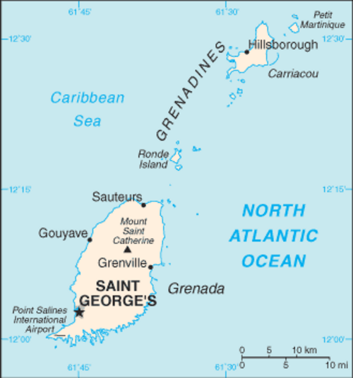 | 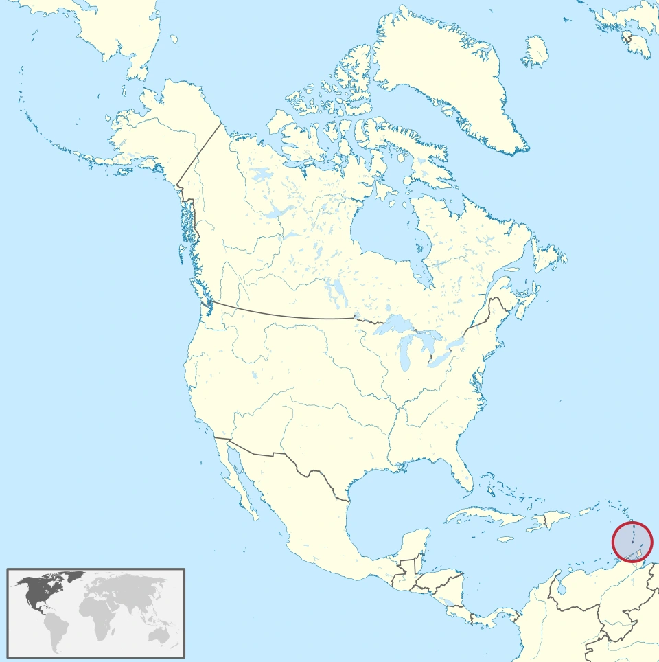 |

**认识国家／地区**：格林纳达位于东加勒比海岛链南端，包括主岛与附近岛屿。火山地形和香料种植特色鲜明，常与肉豆蔻联系；看图时可把它放在圣文森特以南、特立尼达以北。

**认识首都／城市**：圣乔治位于格林纳达主岛西南岸，港湾形状醒目，山坡建筑环绕海面。它是行政与海运中心，紧凑的港口首都形态很适合用图记忆；首都名与国名并不相似，需要单独建立联想。

> **记忆钩子**：格林纳达香料岛，圣乔治环抱港湾。

**容易混淆**：圣乔治是常见地名，必须连着格林纳达记。

资料：[UNData 国家概况（统计快照）](https://data.un.org/legacy/en/iso/gd.html) · [国家／地区背景](https://en.wikipedia.org/wiki/Grenada) · [首都／城市背景](https://en.wikipedia.org/wiki/St._George%27s%2C_Grenada)

地图：[File:Grenada-CIA WFB Map.png；见原图来源页；Public domain](https://commons.wikimedia.org/wiki/File:Grenada-CIA_WFB_Map.png) · [File:Grenada in North America.svg；TUBS；CC BY-SA 3.0](https://commons.wikimedia.org/wiki/File:Grenada_in_North_America.svg)

---

## 特立尼达和多巴哥 — 西班牙港

Trinidad and Tobago · Port of Spain · 加勒比

| 国家／地区地图 | 北美洲位置图 |
|:---:|:---:|
| 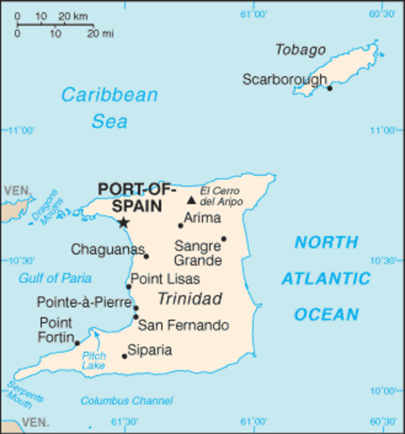 |  |

**认识国家／地区**：特立尼达和多巴哥位于加勒比海东南端，紧邻南美洲委内瑞拉外海。两岛面积和产业角色不同，特立尼达更大；能源工业与多种移民文化共同塑造国家特点。

**认识首都／城市**：西班牙港位于特立尼达岛西北岸，面向帕里亚湾，是行政首都。名称保留早期西班牙历史背景，但国家官方语言为英语；多巴哥岛的斯卡伯勒不是全国首都。

> **记忆钩子**：特立尼达西北岸，首都西班牙港。

**容易混淆**：名字叫西班牙港，不代表它位于西班牙。

资料：[UNData 国家概况（统计快照）](https://data.un.org/legacy/en/iso/tt.html) · [国家／地区背景](https://en.wikipedia.org/wiki/Trinidad_and_Tobago) · [首都／城市背景](https://en.wikipedia.org/wiki/Port_of_Spain)

地图：[File:Trinidad and Tobago-CIA WFB Map.png；见原图来源页；Public domain](https://commons.wikimedia.org/wiki/File:Trinidad_and_Tobago-CIA_WFB_Map.png) · [File:Trinidad and Tobago in North America.svg；TUBS；CC BY-SA 3.0](https://commons.wikimedia.org/wiki/File:Trinidad_and_Tobago_in_North_America.svg)

---

# 南美洲

| 国家／地区 | English | 首都／城市 | English |
|---|---|---|---|
| 哥伦比亚 | Colombia | 波哥大 | Bogotá |
| 厄瓜多尔 | Ecuador | 基多 | Quito |
| 秘鲁 | Peru | 利马 | Lima |
| 玻利维亚 | Bolivia | 苏克雷（宪法首都）／拉巴斯（政府所在地） | Sucre / La Paz |
| 智利 | Chile | 圣地亚哥 | Santiago |
| 委内瑞拉 | Venezuela | 加拉加斯 | Caracas |
| 圭亚那 | Guyana | 乔治敦 | Georgetown |
| 苏里南 | Suriname | 帕拉马里博 | Paramaribo |
| 巴西 | Brazil | 巴西利亚 | Brasília |
| 巴拉圭 | Paraguay | 亚松森 | Asunción |
| 乌拉圭 | Uruguay | 蒙得维的亚 | Montevideo |
| 阿根廷 | Argentina | 布宜诺斯艾利斯 | Buenos Aires |

## 哥伦比亚 — 波哥大

Colombia · Bogotá · 安第斯与太平洋沿岸

| 国家／地区地图 | 南美洲位置图 |
|:---:|:---:|
| 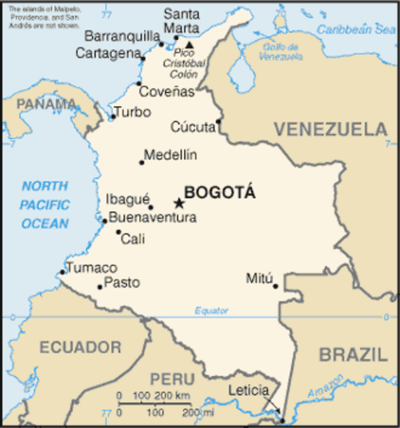 | 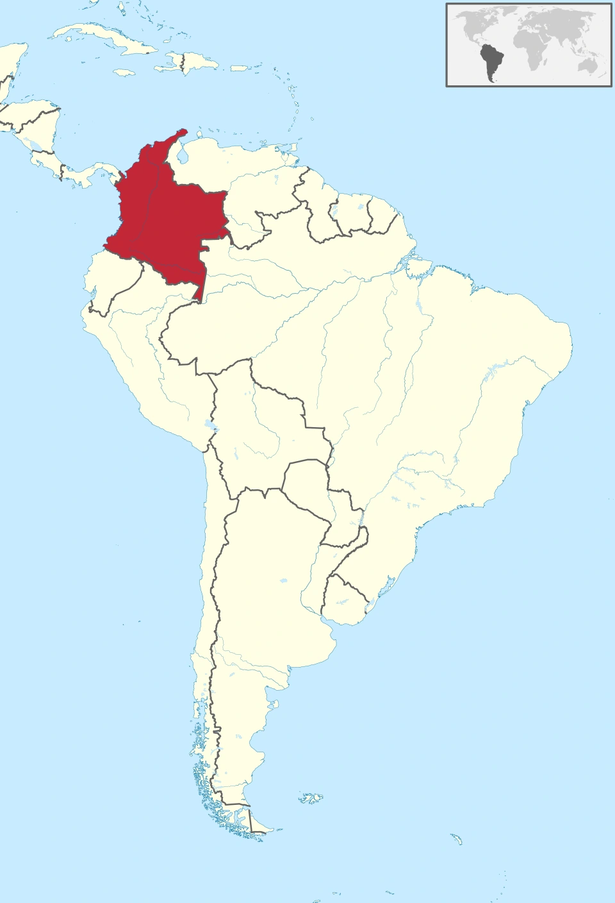 |

**认识国家／地区**：哥伦比亚位于南美洲西北部，同时面向加勒比海和太平洋。安第斯山地、亚马孙地区与平原差异明显；位置连接中美洲方向与南美洲内陆。

**认识首都／城市**：波哥大位于安第斯山脉的高原盆地，海拔较高，是行政与文化中心。首都在内陆高地而非两侧海岸，山地气候与热带低地区别明显；记忆可用“哥伦比亚高原上的波哥大”。

> **记忆钩子**：哥伦比亚有两片海，波哥大却在高原。

**容易混淆**：卡塔赫纳是海港名城，麦德林是重要城市，均非首都。

资料：[UNData 国家概况（统计快照）](https://data.un.org/legacy/en/iso/co.html) · [国家／地区背景](https://en.wikipedia.org/wiki/Colombia) · [首都／城市背景](https://en.wikipedia.org/wiki/Bogot%C3%A1)

地图：[File:Colombia-CIA WFB Map.png；CIA；Public domain](https://commons.wikimedia.org/wiki/File:Colombia-CIA_WFB_Map.png) · [File:Colombia in South America.svg；TUBS；CC BY-SA 3.0](https://commons.wikimedia.org/wiki/File:Colombia_in_South_America.svg)

---

## 厄瓜多尔 — 基多

Ecuador · Quito · 安第斯与太平洋沿岸

| 国家／地区地图 | 南美洲位置图 |
|:---:|:---:|
| 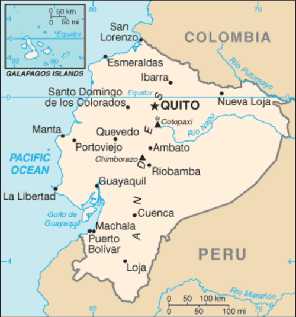 | 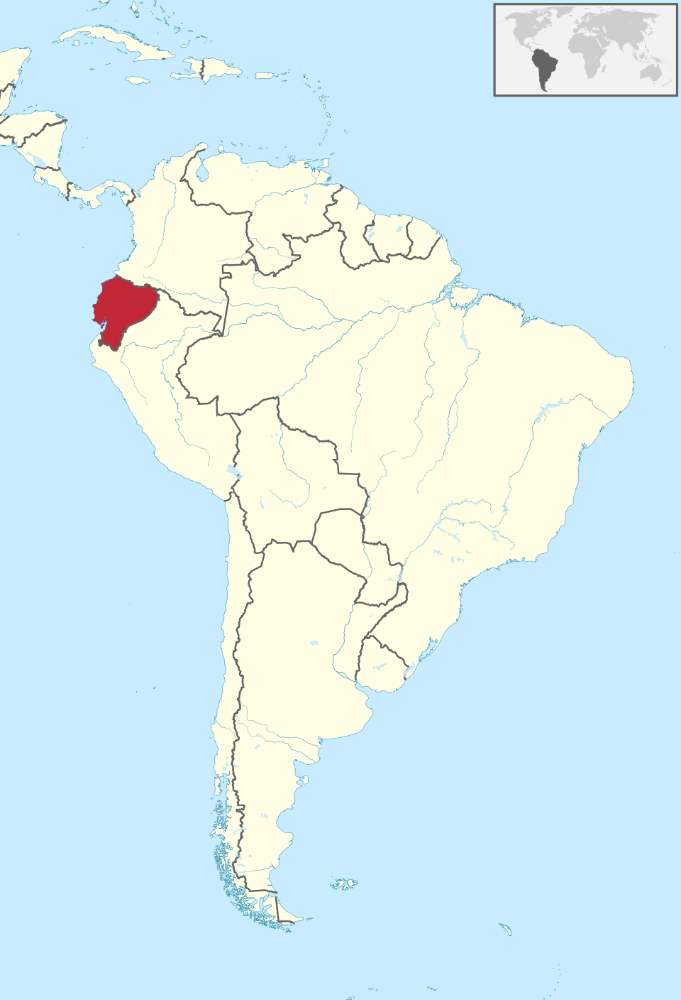 |

**认识国家／地区**：厄瓜多尔位于南美洲西北太平洋岸，赤道穿过国境，国名就与赤道有关。安第斯山地、亚马孙低地和加拉帕戈斯群岛共同构成多样景观。

**认识首都／城市**：基多位于安第斯高地，接近赤道，海拔使气候并非炎热海岸式。历史中心保留殖民时期街区与建筑；把“赤道国家、高原首都”同时记住，比仅凭纬度推断城市气候更准确。

> **记忆钩子**：厄瓜多尔在赤道，基多在高处。

**容易混淆**：瓜亚基尔是重要海港，首都是基多。

资料：[UNData 国家概况（统计快照）](https://data.un.org/legacy/en/iso/ec.html) · [国家／地区背景](https://en.wikipedia.org/wiki/Ecuador) · [首都／城市背景](https://en.wikipedia.org/wiki/Quito)

地图：[File:Ecuador-CIA WFB Map.png；CIA；Public domain](https://commons.wikimedia.org/wiki/File:Ecuador-CIA_WFB_Map.png) · [File:Ecuador in South America.svg；TUBS；CC BY-SA 3.0](https://commons.wikimedia.org/wiki/File:Ecuador_in_South_America.svg)

---

## 秘鲁 — 利马

Peru · Lima · 安第斯与太平洋沿岸

| 国家／地区地图 | 南美洲位置图 |
|:---:|:---:|
| 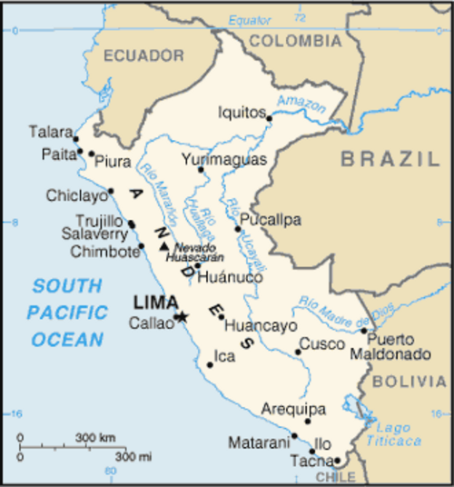 | 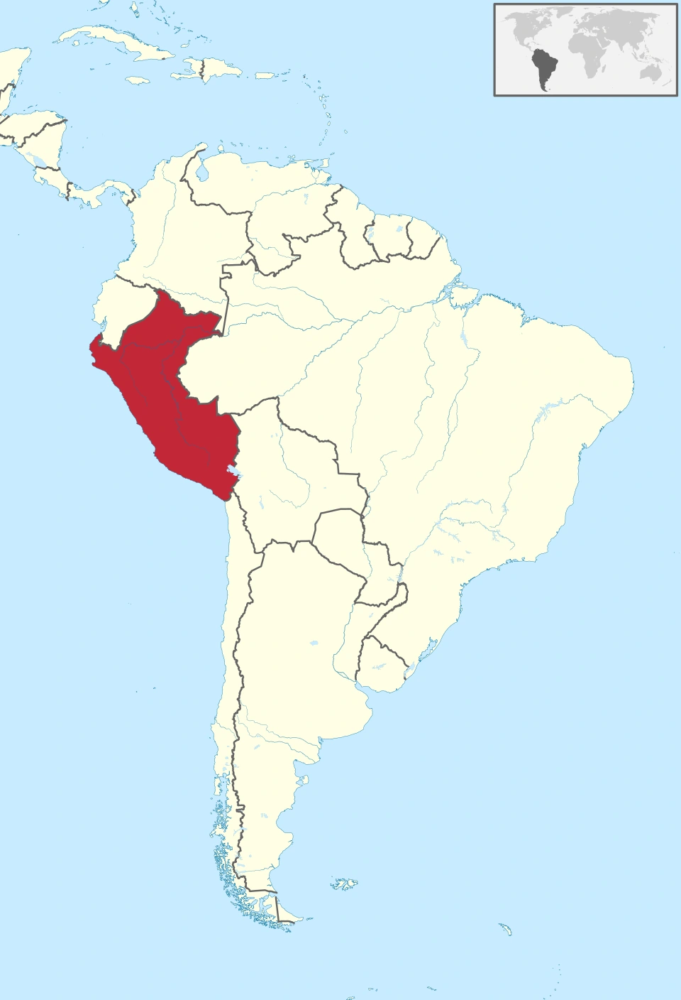 |

**认识国家／地区**：秘鲁位于南美洲西部，西临太平洋，安第斯山脉与东部亚马孙地区差异鲜明。沿海干旱带、山地文明和雨林并存，印加遗址是重要历史线索。

**认识首都／城市**：利马位于中部太平洋岸、里马克河附近，1535年由西班牙殖民者建立。它是政治与商业中心，海岸气候与高山库斯科明显不同；库斯科是印加历史中心，不能代替现代首都。

> **记忆钩子**：秘鲁海岸记利马，印加山城记库斯科。

**容易混淆**：马丘比丘与库斯科很有名，但首都是利马。

资料：[UNData 国家概况（统计快照）](https://data.un.org/legacy/en/iso/pe.html) · [国家／地区背景](https://en.wikipedia.org/wiki/Peru) · [首都／城市背景](https://en.wikipedia.org/wiki/Lima)

地图：[File:Peru-CIA WFB Map.png；CIA；Public domain](https://commons.wikimedia.org/wiki/File:Peru-CIA_WFB_Map.png) · [File:Peru in South America.svg；TUBS；CC BY-SA 3.0](https://commons.wikimedia.org/wiki/File:Peru_in_South_America.svg)

---

## 玻利维亚 — 苏克雷（宪法首都）／拉巴斯（政府所在地）

Bolivia · Sucre / La Paz · 安第斯与太平洋沿岸

| 国家／地区地图 | 南美洲位置图 |
|:---:|:---:|
| 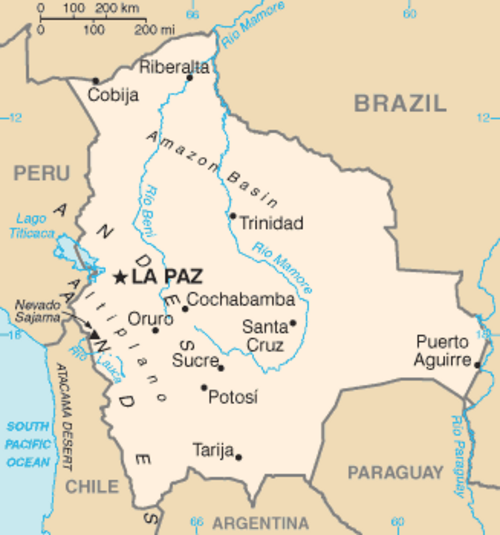 | 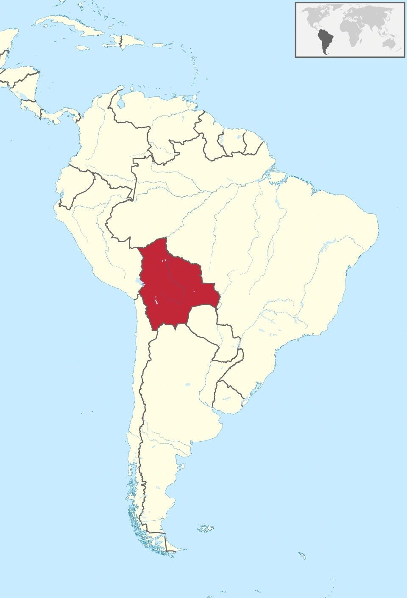 |

**认识国家／地区**：玻利维亚位于南美洲内陆，西部安第斯高原与东部低地跨度很大。的的喀喀湖、盐沼和亚马孙流域边缘提供地理线索；现代首都分工需特别说明。

**认识首都／城市**：苏克雷是宪法首都，名称纪念独立时期人物；拉巴斯是政府所在地，位于高海拔山谷。两城不能被简单互相替换，学习时用“苏克雷写在宪法里、拉巴斯负责政府办公”来区分。

> **记忆钩子**：玻利维亚：苏克雷宪法，拉巴斯政府。

**容易混淆**：不要只写拉巴斯而忽略苏克雷的宪法首都地位。

资料：[UNData 国家概况（统计快照）](https://data.un.org/legacy/en/iso/bo.html) · [国家／地区背景](https://en.wikipedia.org/wiki/Bolivia) · [首都／城市背景](https://en.wikipedia.org/wiki/Sucre) · [拉美一体化协会：苏克雷与拉巴斯分工](https://www2.aladi.org/nsfaladi/dirinter.nsf/Vrepresentacionesweb/Bolivia)

地图：[File:Bolivia-CIA WFB Map.png；United States Central Intelligence Agency；Public domain](https://commons.wikimedia.org/wiki/File:Bl-map.png) · [File:Bolivia in South America.svg；TUBS；CC BY-SA 3.0](https://commons.wikimedia.org/wiki/File:Bolivia_in_South_America.svg)

---

## 智利 — 圣地亚哥

Chile · Santiago · 安第斯与太平洋沿岸

| 国家／地区地图 | 南美洲位置图 |
|:---:|:---:|
| 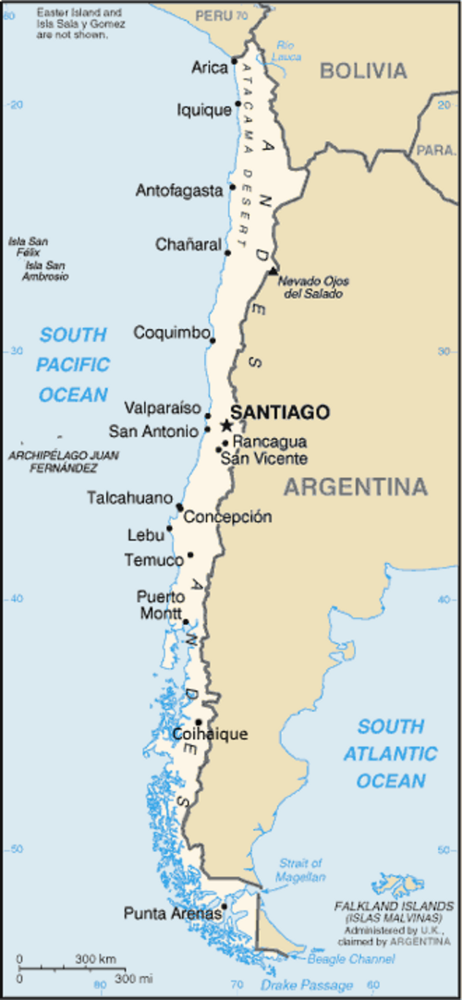 | 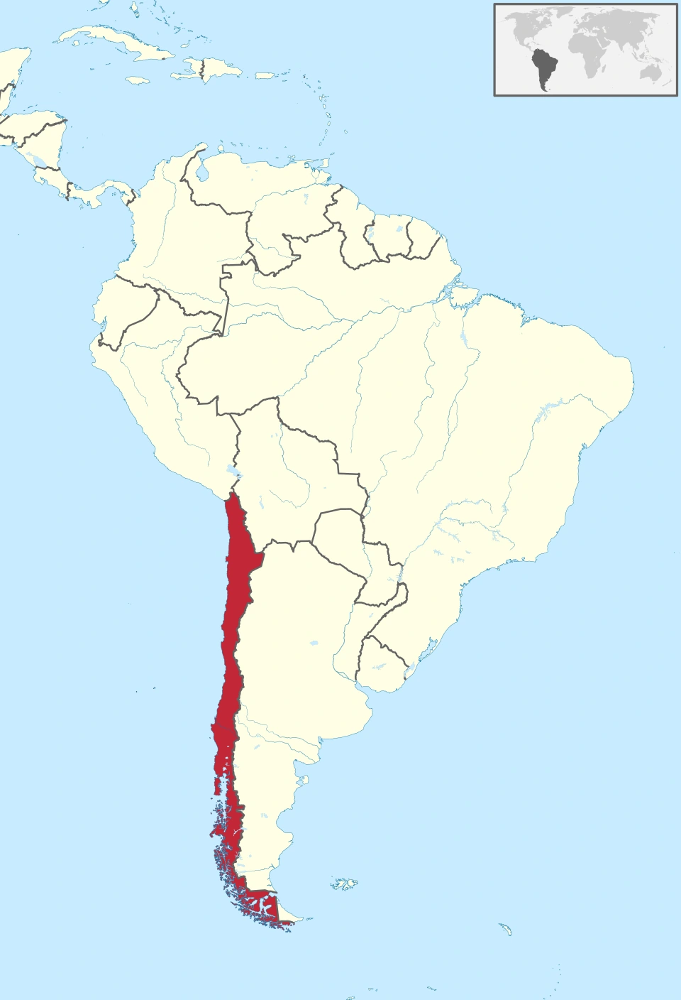 |

**认识国家／地区**：智利沿南美洲西岸南北延伸，太平洋与安第斯山脉把国土夹成长带。北部阿塔卡马沙漠、中部谷地与南部峡湾气候差异很大；领土还包括复活节岛等岛屿。

**认识首都／城市**：圣地亚哥位于中部内陆谷地，东侧是安第斯山地，是国家政治与经济中心。国会位于海港瓦尔帕莱索，说明政治机构不必全部集中于首都；记忆先找狭长国土的中部人口带。

> **记忆钩子**：智利长条中段，谷地首都圣地亚哥。

**容易混淆**：瓦尔帕莱索有国会，但国家首都是圣地亚哥。

资料：[UNData 国家概况（统计快照）](https://data.un.org/legacy/en/iso/cl.html) · [国家／地区背景](https://en.wikipedia.org/wiki/Chile) · [首都／城市背景](https://en.wikipedia.org/wiki/Santiago)

地图：[File:Chile-CIA WFB Map.png；CIA；Public domain](https://commons.wikimedia.org/wiki/File:Chile-CIA_WFB_Map.png) · [File:Chile in South America.svg；TUBS；CC BY-SA 3.0](https://commons.wikimedia.org/wiki/File:Chile_in_South_America.svg)

---

## 委内瑞拉 — 加拉加斯

Venezuela · Caracas · 北部与大西洋沿岸

| 国家／地区地图 | 南美洲位置图 |
|:---:|:---:|
| 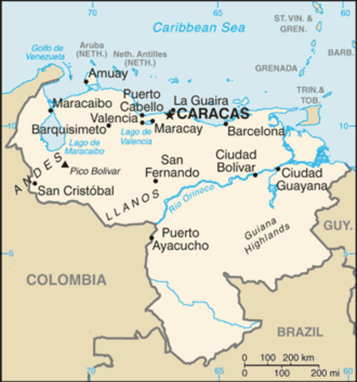 | 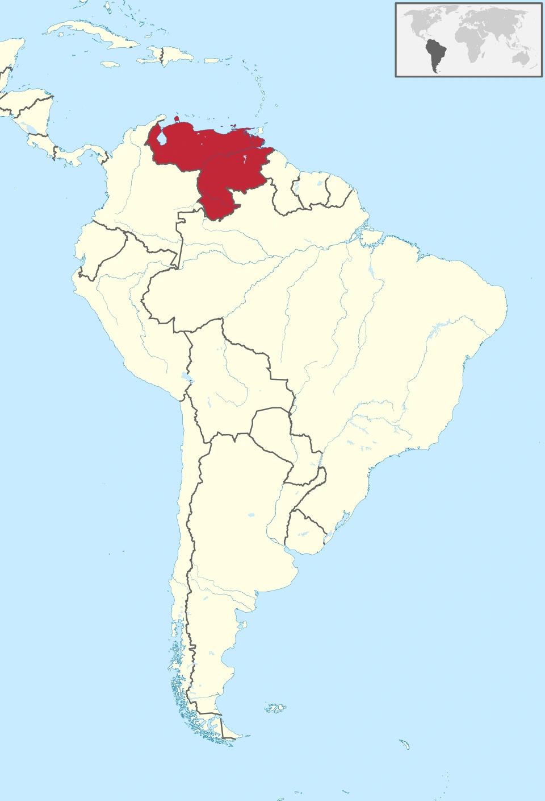 |

**认识国家／地区**：委内瑞拉位于南美洲北部，北临加勒比海。安第斯山地、奥里诺科平原与南部高地并存，石油开发影响经济；涉及与圭亚那的领土争议时应结合来源口径。

**认识首都／城市**：加拉加斯位于北部山谷，隔山接近加勒比海岸，是行政与文化中心。城市与独立领袖玻利瓦尔的历史相连；看地图时抓住“北部谷地、靠海却被山隔开”的位置特点。

> **记忆钩子**：委内瑞拉北部山谷，首都加拉加斯。

**容易混淆**：加拉加斯接近海岸，但核心城区在内陆山谷。

资料：[UNData 国家概况（统计快照）](https://data.un.org/legacy/en/iso/ve.html) · [国家／地区背景](https://en.wikipedia.org/wiki/Venezuela) · [首都／城市背景](https://en.wikipedia.org/wiki/Caracas)

地图：[File:Venezuela-CIA WFB Map.png；见原图来源页；Public domain](https://commons.wikimedia.org/wiki/File:Venezuela-CIA_WFB_Map.png) · [File:Venezuela in South America.svg；TUBS；CC BY-SA 3.0](https://commons.wikimedia.org/wiki/File:Venezuela_in_South_America.svg)

---

## 圭亚那 — 乔治敦

Guyana · Georgetown · 北部与大西洋沿岸

| 国家／地区地图 | 南美洲位置图 |
|:---:|:---:|
| 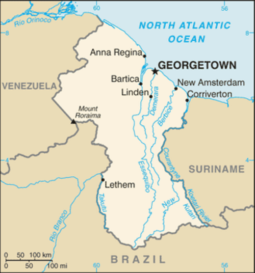 | 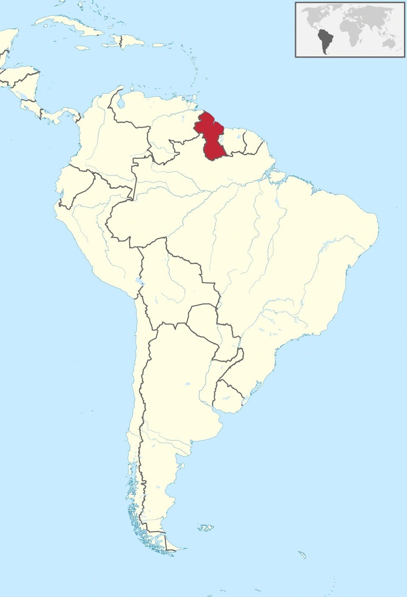 |

**认识国家／地区**：圭亚那位于南美洲东北岸，面向大西洋，内陆多森林和高地。英语为官方语言，文化联系也面向加勒比地区；东邻苏里南，西侧边界涉及与委内瑞拉的争议。

**认识首都／城市**：乔治敦位于德梅拉拉河口附近的大西洋岸，是行政与港口中心。沿海低地需要排水与海堤系统，木构建筑反映地方城市传统；把首都记在河口海岸，便能与内陆雨林区分。

> **记忆钩子**：圭亚那河口海岸，乔治敦。

**容易混淆**：英语国家圭亚那属于南美洲；争议地图需看说明。

资料：[UNData 国家概况（统计快照）](https://data.un.org/legacy/en/iso/gy.html) · [国家／地区背景](https://en.wikipedia.org/wiki/Guyana) · [首都／城市背景](https://en.wikipedia.org/wiki/Georgetown)

地图：[File:Guyana-CIA WFB Map.png；Directorate of Intelligence, CIA；Public domain](https://commons.wikimedia.org/wiki/File:Guyana-CIA_WFB_Map.png) · [File:Guyana in South America.svg；TUBS；CC BY-SA 3.0](https://commons.wikimedia.org/wiki/File:Guyana_in_South_America.svg)

---

## 苏里南 — 帕拉马里博

Suriname · Paramaribo · 北部与大西洋沿岸

| 国家／地区地图 | 南美洲位置图 |
|:---:|:---:|
| 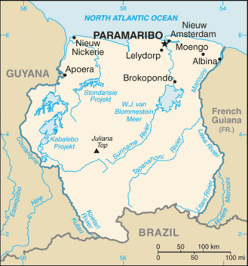 | 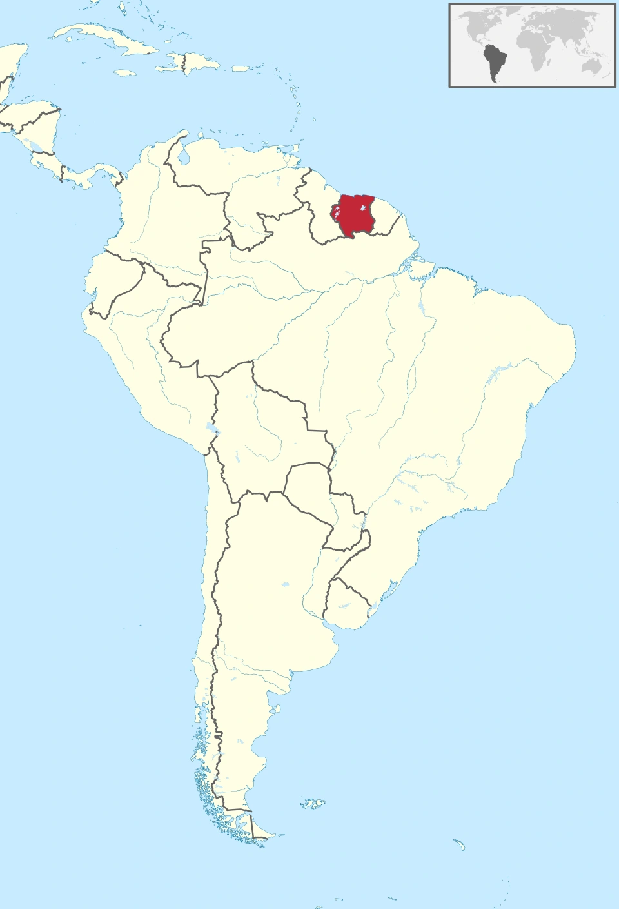 |

**认识国家／地区**：苏里南位于南美洲东北岸，夹在圭亚那和法属圭亚那之间。荷兰语背景鲜明，人口多集中于北部海岸带，南部内陆为大片热带森林。

**认识首都／城市**：帕拉马里博位于苏里南河沿岸、靠近大西洋河口，是行政与港口中心。木构建筑、宗教场所和多元文化构成城市特色；长首都名可分成“帕拉—马里博”来记。

> **记忆钩子**：苏里南北部河岸，帕拉—马里博。

**容易混淆**：法属圭亚那不是独立国家，不计入本版195个主条目。

资料：[UNData 国家概况（统计快照）](https://data.un.org/legacy/en/iso/sr.html) · [国家／地区背景](https://en.wikipedia.org/wiki/Suriname) · [首都／城市背景](https://en.wikipedia.org/wiki/Paramaribo)

地图：[File:Suriname-CIA WFB Map.png；见原图来源页；Public domain](https://commons.wikimedia.org/wiki/File:Suriname-CIA_WFB_Map.png) · [File:Suriname in South America.svg；TUBS；CC BY-SA 3.0](https://commons.wikimedia.org/wiki/File:Suriname_in_South_America.svg)

---

## 巴西 — 巴西利亚

Brazil · Brasília · 北部与大西洋沿岸

| 国家／地区地图 | 南美洲位置图 |
|:---:|:---:|
| 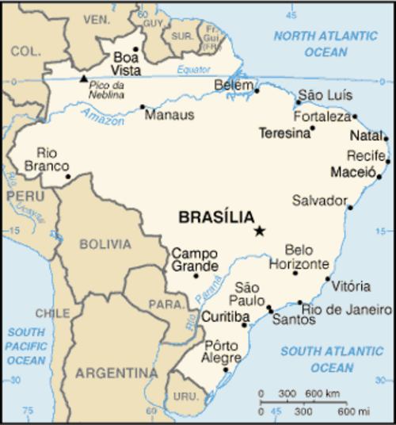 | 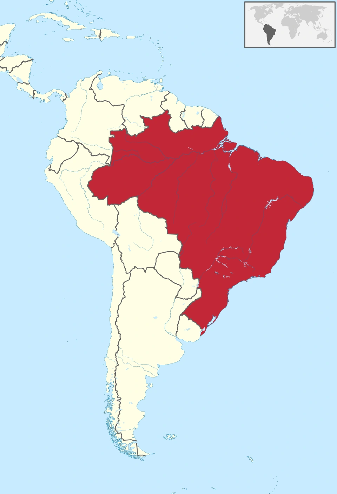 |

**认识国家／地区**：巴西占据南美洲大片中东部国土，东临大西洋。亚马孙流域、中央高原与东南城市带差异明显，葡萄牙语使其区别于多数西语邻国；辽阔国土是迁都背景。

**认识首都／城市**：巴西利亚位于内陆中央高原，1960年取代里约热内卢成为首都。规划城市强调行政功能，建筑与布局形成鲜明视觉形象；首都名称与国家相近，记“巴西向内陆建巴西利亚”即可。

> **记忆钩子**：巴西向内陆迁，巴西利亚是规划首都。

**容易混淆**：里约热内卢是旧首都，圣保罗是大都市。

资料：[UNData 国家概况（统计快照）](https://data.un.org/legacy/en/iso/br.html) · [国家／地区背景](https://en.wikipedia.org/wiki/Brazil) · [首都／城市背景](https://en.wikipedia.org/wiki/Bras%C3%ADlia)

地图：[File:Brazil-CIA WFB Map.png；CIA；Public domain](https://commons.wikimedia.org/wiki/File:Brazil_map_en_2004.png) · [File:Brazil in South America.svg；TUBS；CC BY-SA 3.0](https://commons.wikimedia.org/wiki/File:Brazil_in_South_America.svg)

---

## 巴拉圭 — 亚松森

Paraguay · Asunción · 南部与内陆

| 国家／地区地图 | 南美洲位置图 |
|:---:|:---:|
| 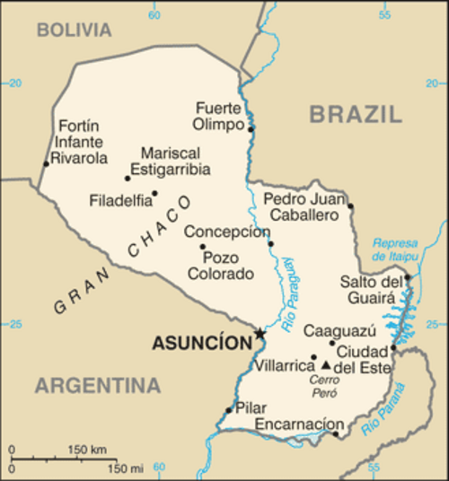 | 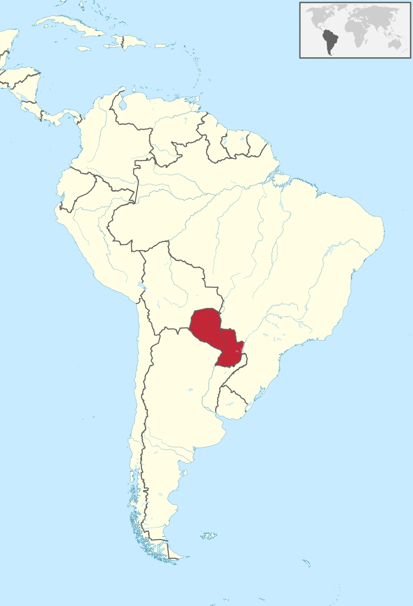 |

**认识国家／地区**：巴拉圭位于南美洲内陆，邻接巴西、阿根廷和玻利维亚。巴拉圭河把国土分成环境不同的东西两侧，西部查科较干；西班牙语与瓜拉尼语共同体现国家文化。

**认识首都／城市**：亚松森位于西部河岸边、接近巴拉圭河与皮尔科马约河汇合地带，是政治和商业中心。它也是南美洲较早建立的殖民城市之一；河流联系比海岸更能解释这个内陆首都。

> **记忆钩子**：巴拉圭靠大河，亚松森在河边。

**容易混淆**：巴拉圭—亚松森；乌拉圭—蒙得维的亚。

资料：[UNData 国家概况（统计快照）](https://data.un.org/legacy/en/iso/py.html) · [国家／地区背景](https://en.wikipedia.org/wiki/Paraguay) · [首都／城市背景](https://en.wikipedia.org/wiki/Asunci%C3%B3n)

地图：[File:Paraguay-CIA WFB Map.png；见原图来源页；Public domain](https://commons.wikimedia.org/wiki/File:Paraguay-CIA_WFB_Map.png) · [File:Paraguay in South America.svg；TUBS；CC BY-SA 3.0](https://commons.wikimedia.org/wiki/File:Paraguay_in_South_America.svg)

---

## 乌拉圭 — 蒙得维的亚

Uruguay · Montevideo · 南部与内陆

| 国家／地区地图 | 南美洲位置图 |
|:---:|:---:|
| 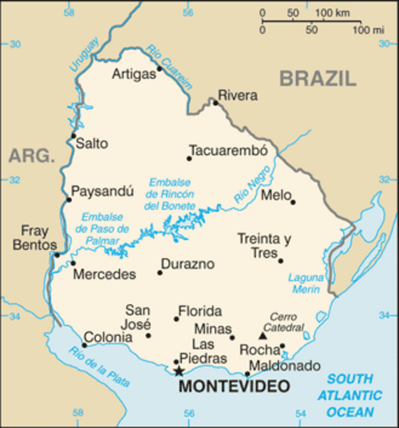 | 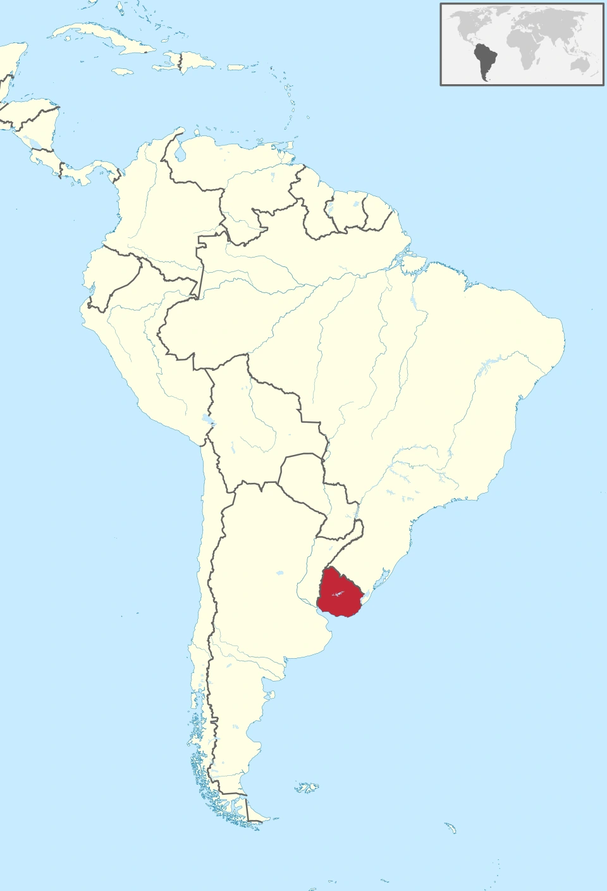 |

**认识国家／地区**：乌拉圭位于南美洲东南部，北邻巴西，西与阿根廷隔河相望。国土多草原与低丘，南面临拉普拉塔河口及大西洋；与巴拉圭名称相似但有海岸。

**认识首都／城市**：蒙得维的亚位于南岸拉普拉塔河口旁，是港口、政府与文化中心。它与对岸阿根廷首都布宜诺斯艾利斯形成区域联系；记忆时把两座河口首都放在同一片宽阔水域两侧。

> **记忆钩子**：乌拉圭南岸，蒙得维的亚面向拉普拉塔。

**容易混淆**：乌拉圭临海；巴拉圭内陆，首都亚松森。

资料：[UNData 国家概况（统计快照）](https://data.un.org/legacy/en/iso/uy.html) · [国家／地区背景](https://en.wikipedia.org/wiki/Uruguay) · [首都／城市背景](https://en.wikipedia.org/wiki/Montevideo)

地图：[File:Uruguay-CIA WFB Map.png；见原图来源页；Public domain](https://commons.wikimedia.org/wiki/File:Uruguay-CIA_WFB_Map.png) · [File:Uruguay in South America.svg；TUBS；CC BY-SA 3.0](https://commons.wikimedia.org/wiki/File:Uruguay_in_South_America.svg)

---

## 阿根廷 — 布宜诺斯艾利斯

Argentina · Buenos Aires · 南部与内陆

| 国家／地区地图 | 南美洲位置图 |
|:---:|:---:|
| 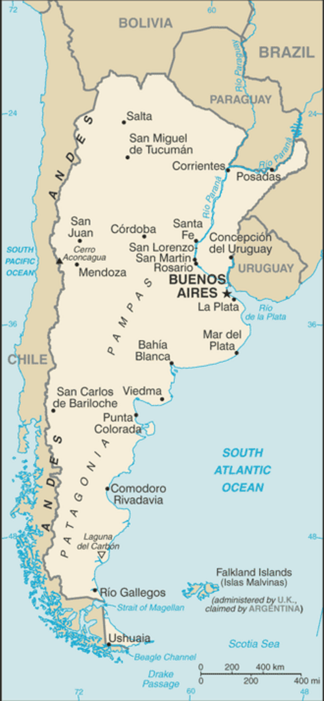 | 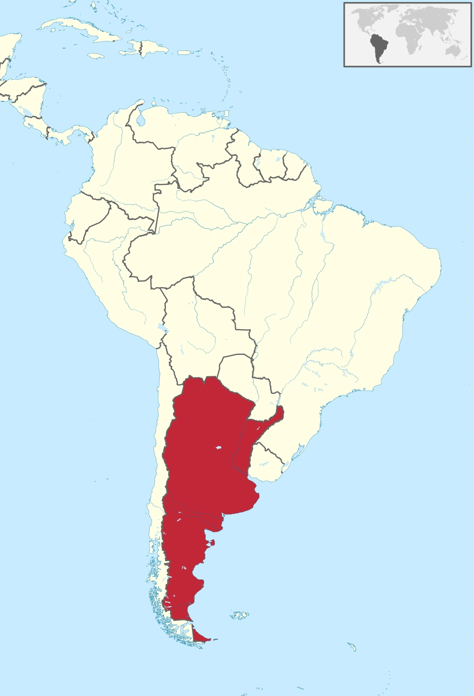 |

**认识国家／地区**：阿根廷位于南美洲南部，西邻安第斯山脉，东面向大西洋。潘帕斯草原、北部温暖地区与南部巴塔哥尼亚景观差异很大；西班牙语与移民文化塑造城市生活。

**认识首都／城市**：布宜诺斯艾利斯位于东部拉普拉塔河口西岸，名称有“好空气”的含义。港口、广场、探戈文化与联邦政府机构集中于此；国家首都的自治市与同名省应分别理解。

> **记忆钩子**：阿根廷河口西岸，好空气布宜诺斯艾利斯。

**容易混淆**：同名省的省会是拉普拉塔，国家首都是布宜诺斯艾利斯。

资料：[UNData 国家概况（统计快照）](https://data.un.org/legacy/en/iso/ar.html) · [国家／地区背景](https://en.wikipedia.org/wiki/Argentina) · [首都／城市背景](https://en.wikipedia.org/wiki/Buenos_Aires)

地图：[File:Argentina-CIA WFB Map.png；United States Central Intelligence Agency；Public domain](https://commons.wikimedia.org/wiki/File:Argentina-CIA_WFB_Map.png) · [File:Argentina in South America.svg；TUBS；CC BY-SA 3.0](https://commons.wikimedia.org/wiki/File:Argentina_in_South_America.svg)

---

# 大洋洲

| 国家／地区 | English | 首都／城市 | English |
|---|---|---|---|
| 澳大利亚 | Australia | 堪培拉 | Canberra |
| 新西兰 | New Zealand | 惠灵顿 | Wellington |
| 巴布亚新几内亚 | Papua New Guinea | 莫尔兹比港 | Port Moresby |
| 所罗门群岛 | Solomon Islands | 霍尼亚拉 | Honiara |
| 瓦努阿图 | Vanuatu | 维拉港 | Port Vila |
| 斐济 | Fiji | 苏瓦 | Suva |
| 密克罗尼西亚联邦 | Federated States of Micronesia | 帕利基尔 | Palikir |
| 帕劳 | Palau | 恩吉鲁穆德 | Ngerulmud |
| 马绍尔群岛 | Marshall Islands | 马朱罗 | Majuro |
| 瑙鲁 | Nauru | 无正式首都；亚伦为政府所在地 | Yaren (government district) |
| 基里巴斯 | Kiribati | 南塔拉瓦 | South Tarawa |
| 图瓦卢 | Tuvalu | 富纳富提 | Funafuti |
| 萨摩亚 | Samoa | 阿皮亚 | Apia |
| 汤加 | Tonga | 努库阿洛法 | Nukuʻalofa |

## 澳大利亚 — 堪培拉

Australia · Canberra · 澳大利亚与新西兰

| 国家／地区地图 | 大洋洲位置图 |
|:---:|:---:|
| 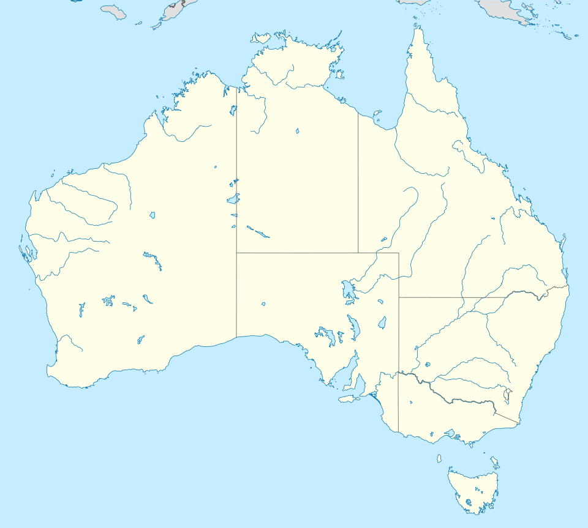 | 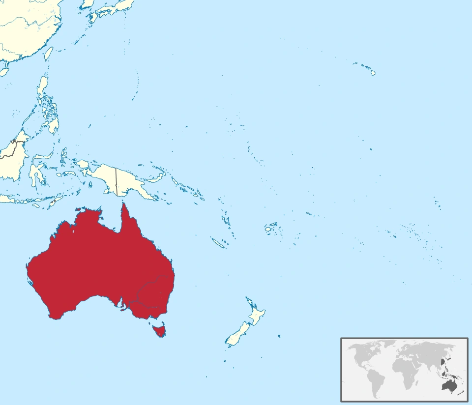 |

**认识国家／地区**：澳大利亚位于南半球，主体是一整块大陆，另有塔斯马尼亚等岛屿。内陆广泛干旱，人口多集中在沿海，东部山地与西部高原明显；国家与大洋洲的范围不可混为一谈。

**认识首都／城市**：堪培拉位于东南部内陆的澳大利亚首都领地，是20世纪规划建设的首都。选择位置与悉尼、墨尔本之间的协调有关，湖泊和行政建筑构成城市特色；两座大城市均不是国家首都。

> **记忆钩子**：悉尼、墨尔本之间另建城，首都堪培拉。

**容易混淆**：澳大利亚是国家，大洋洲是本手册的大洲分组。

资料：[UNData 国家概况（统计快照）](https://data.un.org/legacy/en/iso/au.html) · [国家／地区背景](https://en.wikipedia.org/wiki/Australia) · [首都／城市背景](https://en.wikipedia.org/wiki/Canberra)

地图：[File:Australia location map.svg；NordNordWest；CC BY-SA 3.0](https://commons.wikimedia.org/wiki/File:Australia_location_map.svg) · [File:Australia in Oceania.svg；TUBS；CC BY-SA 3.0](https://commons.wikimedia.org/wiki/File:Australia_in_Oceania.svg)

---

## 新西兰 — 惠灵顿

New Zealand · Wellington · 澳大利亚与新西兰

| 国家／地区地图 | 大洋洲位置图 |
|:---:|:---:|
| 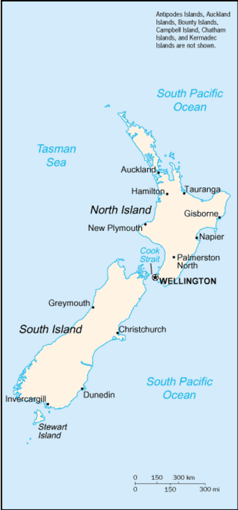 | 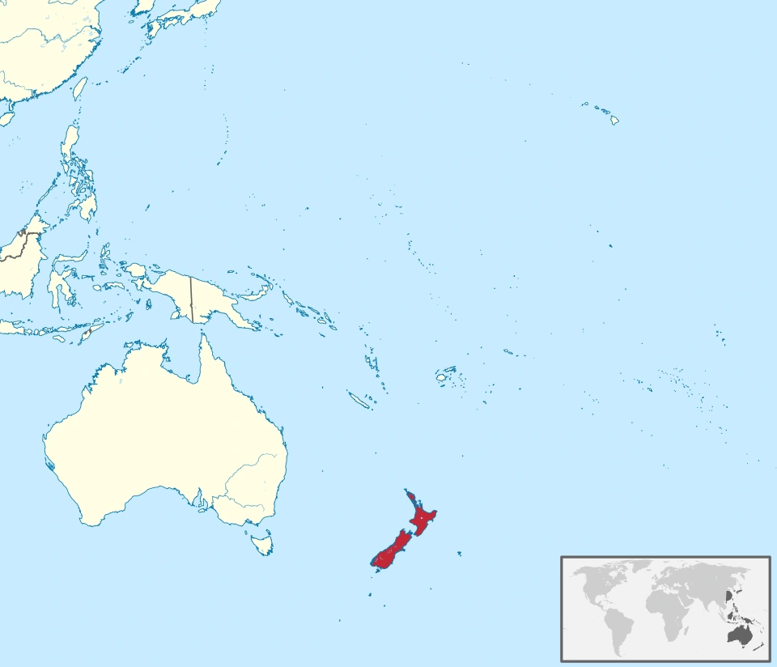 |

**认识国家／地区**：新西兰位于南太平洋，以北岛和南岛为主体，周围还有多座岛屿。火山、山脉与海岸景观丰富，毛利文化与欧洲移民历史共同塑造国家；它位于澳大利亚东南方向。

**认识首都／城市**：惠灵顿位于北岛南端，靠近连接两主岛的库克海峡，1865年取代奥克兰成为首都。位置便于联系南北，港湾、丘陵和多风环境辨识度高；奥克兰是大都市，不能写成首都。

> **记忆钩子**：北岛南端、两岛之间，首都惠灵顿。

**容易混淆**：奥克兰是旧首都与大城市，现首都是惠灵顿。

资料：[UNData 国家概况（统计快照）](https://data.un.org/legacy/en/iso/nz.html) · [国家／地区背景](https://en.wikipedia.org/wiki/New_Zealand) · [首都／城市背景](https://en.wikipedia.org/wiki/Wellington)

地图：[File:New Zealand-CIA WFB Map.png；CIA；Public domain](https://commons.wikimedia.org/wiki/File:New_Zealand-CIA_WFB_Map.png) · [File:New Zealand in Oceania.svg；TUBS；CC BY-SA 3.0](https://commons.wikimedia.org/wiki/File:New_Zealand_in_Oceania.svg)

---

## 巴布亚新几内亚 — 莫尔兹比港

Papua New Guinea · Port Moresby · 美拉尼西亚

| 国家／地区地图 | 大洋洲位置图 |
|:---:|:---:|
| 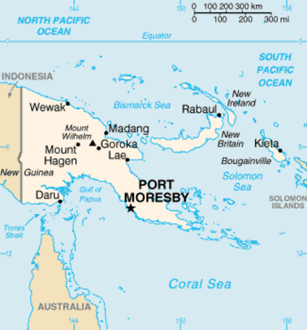 | 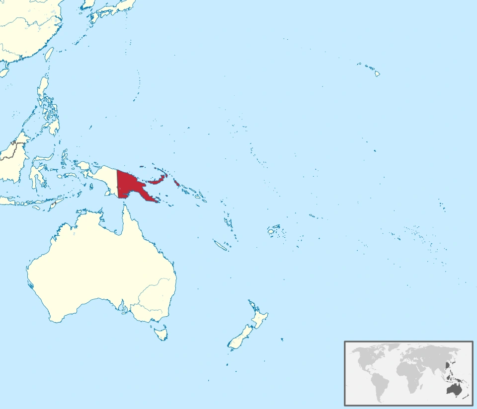 |

**认识国家／地区**：巴布亚新几内亚位于西南太平洋，主体占新几内亚岛东半部，并包括周边群岛。西半部属于印度尼西亚；山地阻隔与岛屿分散形成丰富的语言和文化差异。

**认识首都／城市**：莫尔兹比港位于主岛东南岸，面向珊瑚海，是政府与国际交通中心。城市以19世纪英国航海者命名，海港与周边丘陵相连；首都在主岛南侧，不能放到北部港口带。

> **记忆钩子**：新几内亚东半部，南岸莫尔兹比港。

**容易混淆**：整座新几内亚岛并非都属于这个国家。

资料：[UNData 国家概况（统计快照）](https://data.un.org/legacy/en/iso/pg.html) · [国家／地区背景](https://en.wikipedia.org/wiki/Papua_New_Guinea) · [首都／城市背景](https://en.wikipedia.org/wiki/Port_Moresby)

地图：[File:Papua New Guinea-CIA WFB Map.png；CIA；Public domain](https://commons.wikimedia.org/wiki/File:Papua_New_Guinea-CIA_WFB_Map.png) · [File:Papua New Guinea in Oceania.svg；TUBS；CC BY-SA 3.0](https://commons.wikimedia.org/wiki/File:Papua_New_Guinea_in_Oceania.svg)

---

## 所罗门群岛 — 霍尼亚拉

Solomon Islands · Honiara · 美拉尼西亚

| 国家／地区地图 | 大洋洲位置图 |
|:---:|:---:|
| 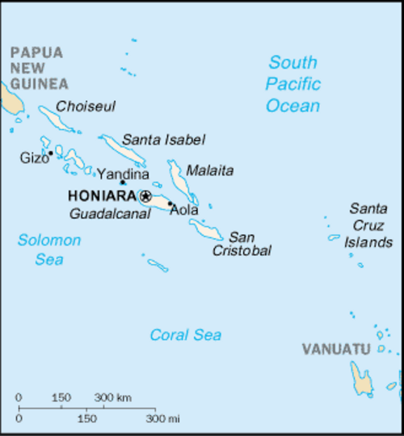 | 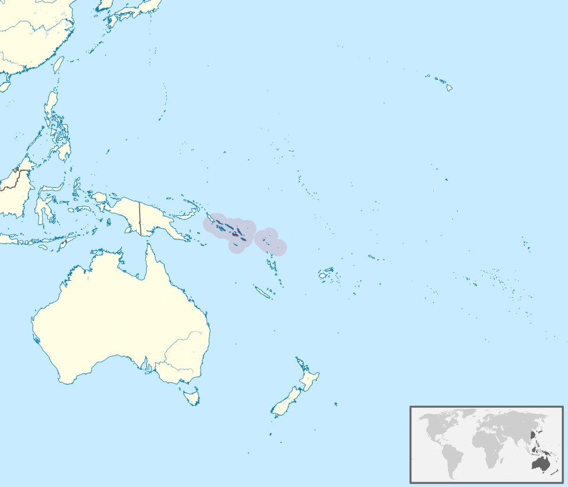 |

**认识国家／地区**：所罗门群岛位于巴布亚新几内亚以东、瓦努阿图以北，由多座较大的山地岛和小岛组成。海峡与岛际交通重要，第二次世界大战的太平洋战场历史也与该地区密切相关。

**认识首都／城市**：霍尼亚拉位于瓜达尔卡纳尔岛北岸，是战后发展起来的首都，取代旧首府图拉吉。港湾、沿海道路与内陆山地形成紧凑城市带；记忆时用“瓜岛北岸的霍尼亚拉”固定位置。

> **记忆钩子**：所罗门群岛，瓜岛北岸霍尼亚拉。

**容易混淆**：国家所罗门群岛与地理群岛的边界并非完全一致。

资料：[UNData 国家概况（统计快照）](https://data.un.org/legacy/en/iso/sb.html) · [国家／地区背景](https://en.wikipedia.org/wiki/Solomon_Islands) · [首都／城市背景](https://en.wikipedia.org/wiki/Honiara)

地图：[File:Solomon Islands-CIA WFB Map.png；CIA；Public domain](https://commons.wikimedia.org/wiki/File:Solomon_Islands-CIA_WFB_Map.png) · [File:Solomon Islands in Oceania.svg；TUBS；CC BY-SA 3.0](https://commons.wikimedia.org/wiki/File:Solomon_Islands_in_Oceania.svg)

---

## 瓦努阿图 — 维拉港

Vanuatu · Port Vila · 美拉尼西亚

| 国家／地区地图 | 大洋洲位置图 |
|:---:|:---:|
| 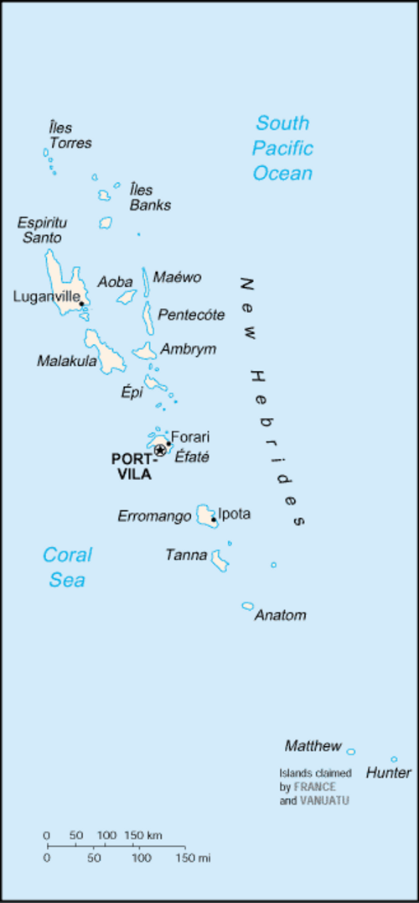 | 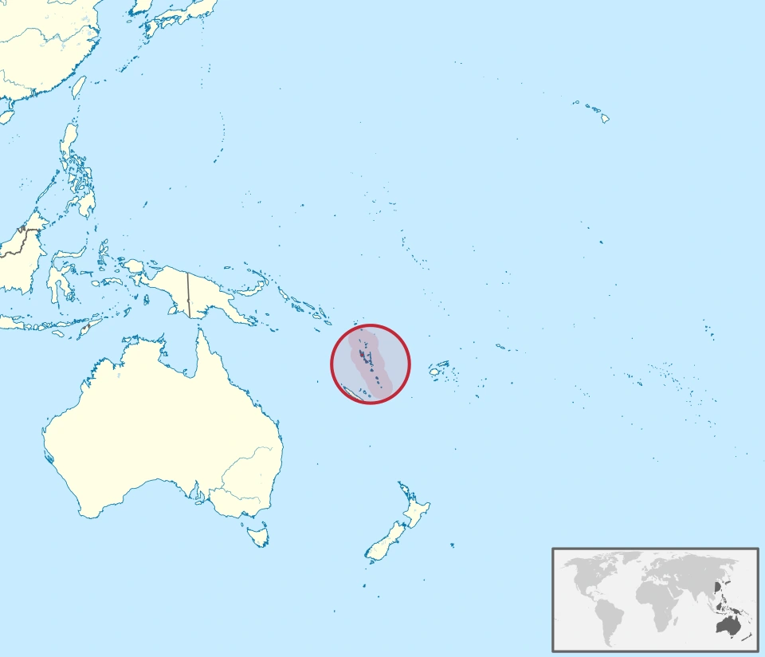 |

**认识国家／地区**：瓦努阿图位于南太平洋、所罗门群岛以南，国土由南北排列的火山岛组成。许多岛屿地形崎岖，海运、农业和地方文化联系紧密；旧称新赫布里底群岛。

**认识首都／城市**：维拉港位于埃法特岛西南岸，是行政、港口与航空中心。城市围绕港湾分布，政府与旅游活动都集中于此；首都名字已有“港”，再连到埃法特岛便能形成地图记忆。

> **记忆钩子**：瓦努阿图埃法特岛，西南维拉港。

**容易混淆**：新赫布里底是旧称；首都不是卢甘维尔。

资料：[UNData 国家概况（统计快照）](https://data.un.org/legacy/en/iso/vu.html) · [国家／地区背景](https://en.wikipedia.org/wiki/Vanuatu) · [首都／城市背景](https://en.wikipedia.org/wiki/Port_Vila)

地图：[File:Vanuatu-CIA WFB Map.png；CIA；Public domain](https://commons.wikimedia.org/wiki/File:Vanuatu-CIA_WFB_Map.png) · [File:Vanuatu in Oceania.svg；TUBS；CC BY-SA 3.0](https://commons.wikimedia.org/wiki/File:Vanuatu_in_Oceania.svg)

---

## 斐济 — 苏瓦

Fiji · Suva · 美拉尼西亚

| 国家／地区地图 | 大洋洲位置图 |
|:---:|:---:|
| 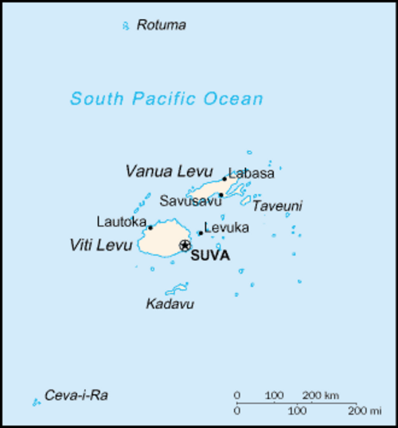 | 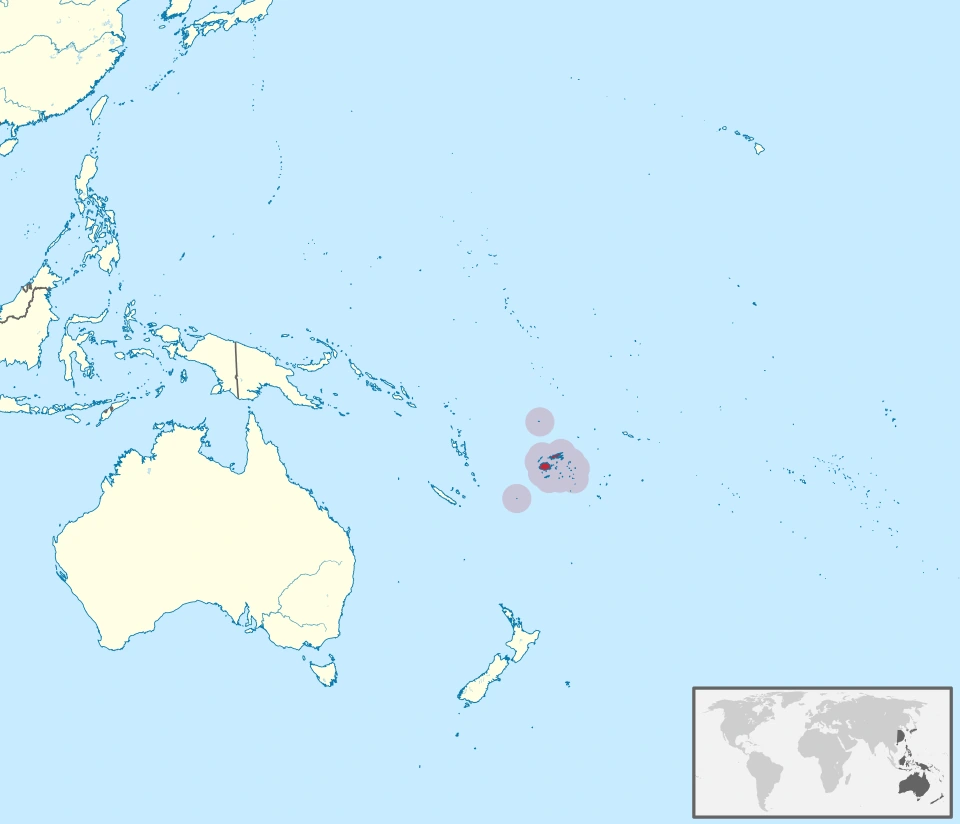 |

**认识国家／地区**：斐济位于南太平洋，由维提岛、瓦努阿岛及众多小岛组成。较大岛屿有山地和河流，岛际文化与印度移民历史共同影响国家社会；国家名短，适合先认两座主岛。

**认识首都／城市**：苏瓦位于维提岛东南岸，是行政与重要港口中心，1882年取代莱武卡成为首府。国际航班常使用岛西侧楠迪机场，因此“旅游到达城市”和“国家首都”需要分开记。

> **记忆钩子**：斐济维提岛东南岸，首都苏瓦。

**容易混淆**：楠迪是航空门户，莱武卡是旧首都，苏瓦是现首都。

资料：[UNData 国家概况（统计快照）](https://data.un.org/legacy/en/iso/fj.html) · [国家／地区背景](https://en.wikipedia.org/wiki/Fiji) · [首都／城市背景](https://en.wikipedia.org/wiki/Suva)

地图：[File:Fiji-CIA WFB Map.png；CIA；Public domain](https://commons.wikimedia.org/wiki/File:Fiji-CIA_WFB_Map.png) · [File:Fiji in Oceania.svg；TUBS；CC BY-SA 3.0](https://commons.wikimedia.org/wiki/File:Fiji_in_Oceania.svg)

---

## 密克罗尼西亚联邦 — 帕利基尔

Federated States of Micronesia · Palikir · 密克罗尼西亚

| 国家／地区地图 | 大洋洲位置图 |
|:---:|:---:|
| 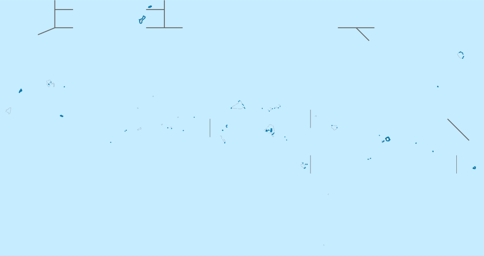 | 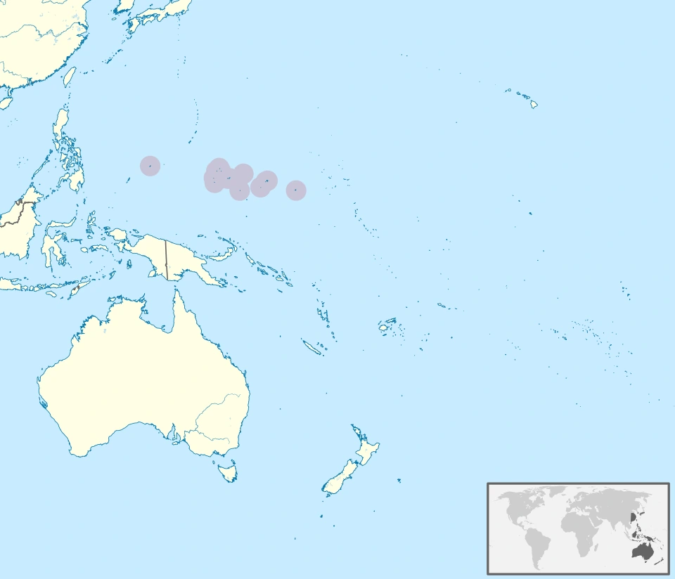 |

**认识国家／地区**：密克罗尼西亚联邦位于西太平洋，由雅浦、丘克、波纳佩和科斯雷四个州组成。岛屿分散在广阔海域，海洋联系比陆地距离更能说明国家结构；国名与地理上的密克罗尼西亚区域不同。

**认识首都／城市**：帕利基尔位于波纳佩岛内陆，1989年成为联邦首都，行政建筑集中在规划区域。科洛尼亚是同岛的重要城镇与旧首都；把“联邦行政中心在岛内、旧城在海边”作为区分线索。

> **记忆钩子**：密联四州，波纳佩岛内陆帕利基尔。

**容易混淆**：密克罗尼西亚是区域名；密克罗尼西亚联邦是一个国家。

资料：[UNData 国家概况（统计快照）](https://data.un.org/legacy/en/iso/fm.html) · [国家／地区背景](https://en.wikipedia.org/wiki/Federated_States_of_Micronesia) · [首都／城市背景](https://en.wikipedia.org/wiki/Palikir)

地图：[File:Federated States of Micronesia location map.svg；NordNordWest；CC BY 3.0](https://commons.wikimedia.org/wiki/File:Federated_States_of_Micronesia_location_map.svg) · [File:Micronesia in Oceania.svg；TUBS；CC BY-SA 3.0](https://commons.wikimedia.org/wiki/File:Micronesia_in_Oceania.svg)

---

## 帕劳 — 恩吉鲁穆德

Palau · Ngerulmud · 密克罗尼西亚

| 国家／地区地图 | 大洋洲位置图 |
|:---:|:---:|
| 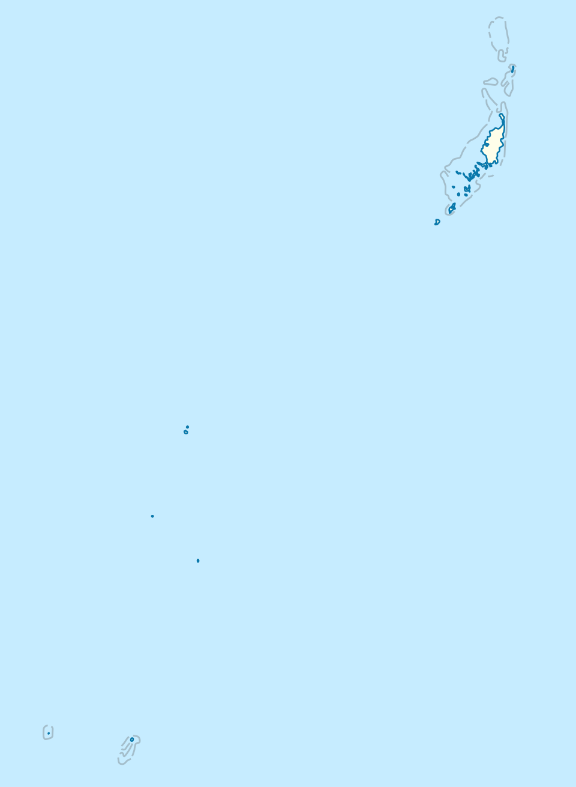 | 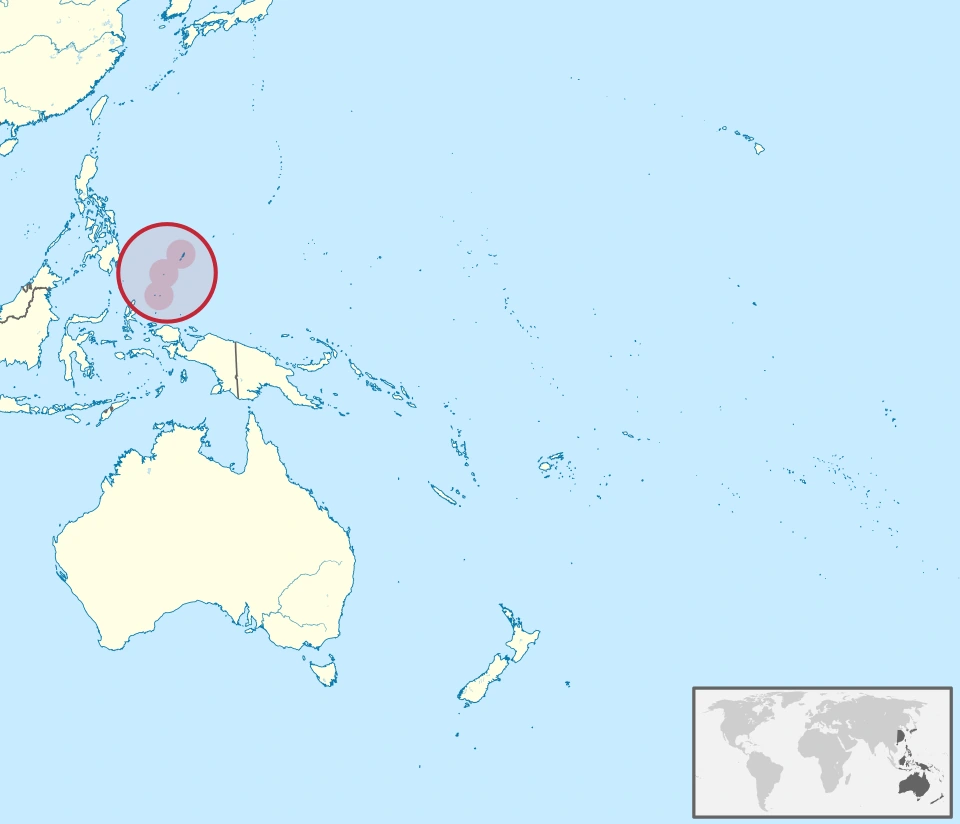 |

**认识国家／地区**：帕劳位于西太平洋、菲律宾以东，国土由巴伯尔道布岛及众多较小岛屿组成。海岛、珊瑚礁与海洋生态特色鲜明；主要人口城市与新首都所在地并不重合。

**认识首都／城市**：恩吉鲁穆德位于巴伯尔道布岛的梅莱凯奥克州，2006年取代科罗尔成为首都。它以政府建筑群为核心，规模小；资料中的“Melekeok”有时指州或附近聚落，应与具体首都名分清。

> **记忆钩子**：帕劳大岛建新都，恩吉鲁穆德。

**容易混淆**：科罗尔是旧首都；梅莱凯奥克州与新都名称层级不同。

资料：[UNData 国家概况（统计快照）](https://data.un.org/legacy/en/iso/pw.html) · [国家／地区背景](https://en.wikipedia.org/wiki/Palau) · [首都／城市背景](https://en.wikipedia.org/wiki/Ngerulmud)

地图：[File:Palau location map.svg；NordNordWest；CC BY-SA 3.0 de](https://commons.wikimedia.org/wiki/File:Palau_location_map.svg) · [File:Palau in Oceania.svg；TUBS；CC BY-SA 3.0](https://commons.wikimedia.org/wiki/File:Palau_in_Oceania.svg)

---

## 马绍尔群岛 — 马朱罗

Marshall Islands · Majuro · 密克罗尼西亚

| 国家／地区地图 | 大洋洲位置图 |
|:---:|:---:|
| 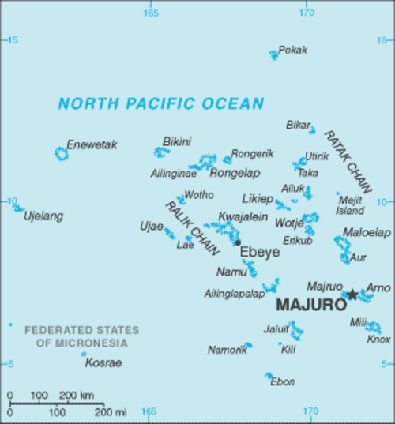 | 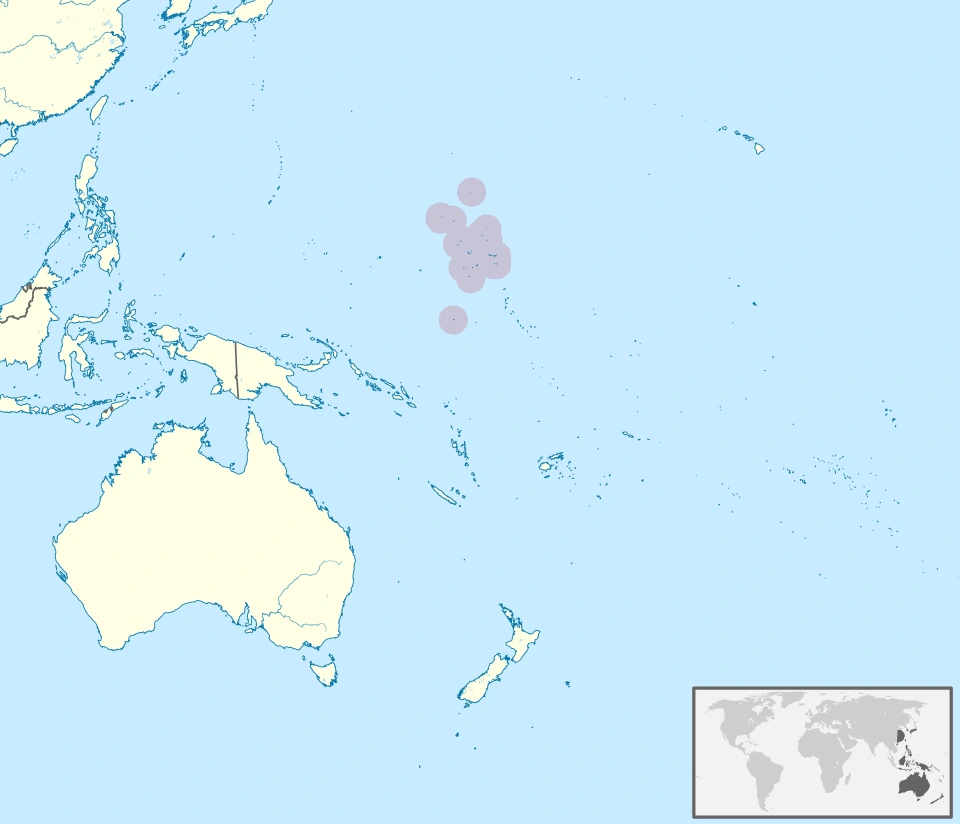 |

**认识国家／地区**：马绍尔群岛位于北太平洋，由两列环礁和岛屿组成。陆地面积较小却分布在广阔海域，海洋交通和核试验历史都是认识国家的重要背景；地图不能只看主岛比例。

**认识首都／城市**：马朱罗指首都所在的环礁及其城市区域，行政和商业活动主要集中在环礁东部。细长岛带环抱潟湖，城市形态不同于大陆首都；把“环礁上的马朱罗”当作核心图像即可。

> **记忆钩子**：马绍尔群岛，马朱罗环礁。

**容易混淆**：首都是环礁城市区域，不是一块大大陆上的单点。

资料：[UNData 国家概况（统计快照）](https://data.un.org/legacy/en/iso/mh.html) · [国家／地区背景](https://en.wikipedia.org/wiki/Marshall_Islands) · [首都／城市背景](https://en.wikipedia.org/wiki/Majuro)

地图：[File:Marshall Islands-CIA WFB Map.png；This image is in the public domain because it contains materials that originally came from the United States Central Intelligence Agency 's World Factbook .；Public domain](https://commons.wikimedia.org/wiki/File:Marshall_Islands-CIA_WFB_Map.png) · [File:Marshall Islands in Oceania.svg；TUBS；CC BY-SA 3.0](https://commons.wikimedia.org/wiki/File:Marshall_Islands_in_Oceania.svg)

---

## 瑙鲁 — 无正式首都；亚伦为政府所在地

Nauru · Yaren (government district) · 密克罗尼西亚

| 国家／地区地图 | 大洋洲位置图 |
|:---:|:---:|
| 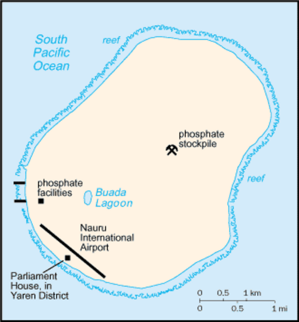 | 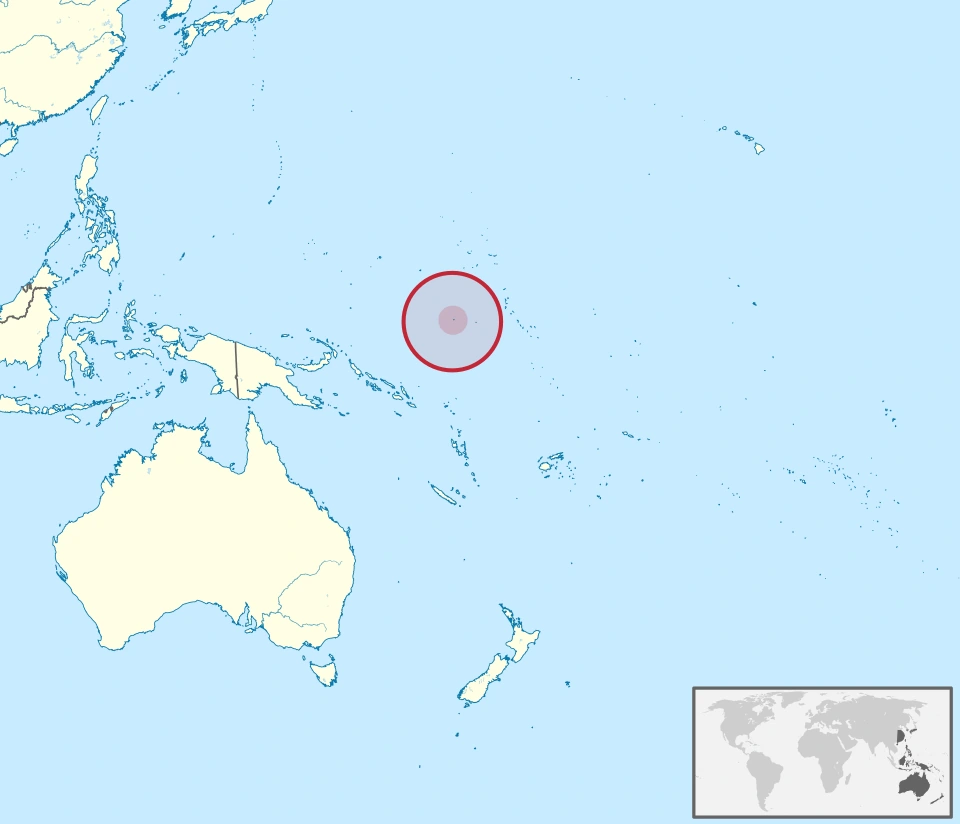 |

**认识国家／地区**：瑙鲁是赤道以南的太平洋小岛国，由一座珊瑚岛构成。磷酸盐开采历史显著影响内陆地貌，居民多沿海岸分布；它的政府所在地问题不适合套用普通首都模式。

**认识首都／城市**：瑙鲁没有正式首都，议会和主要政府机构位于岛南部的亚伦区。常见表格为方便而填写Yaren，严格学习时应写“亚伦为政府所在地”，避免把行政区说成依法指定的首都城市。

> **记忆钩子**：瑙鲁无正式首都，政府在南部亚伦区。

**容易混淆**：亚伦是行政区与政府所在地，首都栏需带说明。

资料：[UNData 国家概况（统计快照）](https://data.un.org/legacy/en/iso/nr.html) · [国家／地区背景](https://en.wikipedia.org/wiki/Nauru) · [首都／城市背景](https://en.wikipedia.org/wiki/Yaren) · [联合国贸发会议：无正式首都，亚伦为政府所在地](https://dgff2021.unctad.org/nauru/)

地图：[File:Nauru-CIA WFB Map.png；CIA；Public domain](https://commons.wikimedia.org/wiki/File:Nauru-CIA_WFB_Map.png) · [File:Nauru in Oceania.svg；TUBS；CC BY-SA 3.0](https://commons.wikimedia.org/wiki/File:Nauru_in_Oceania.svg)

---

## 基里巴斯 — 南塔拉瓦

Kiribati · South Tarawa · 密克罗尼西亚

| 国家／地区地图 | 大洋洲位置图 |
|:---:|:---:|
| 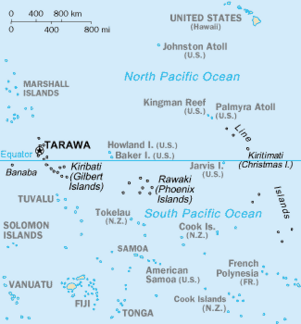 | 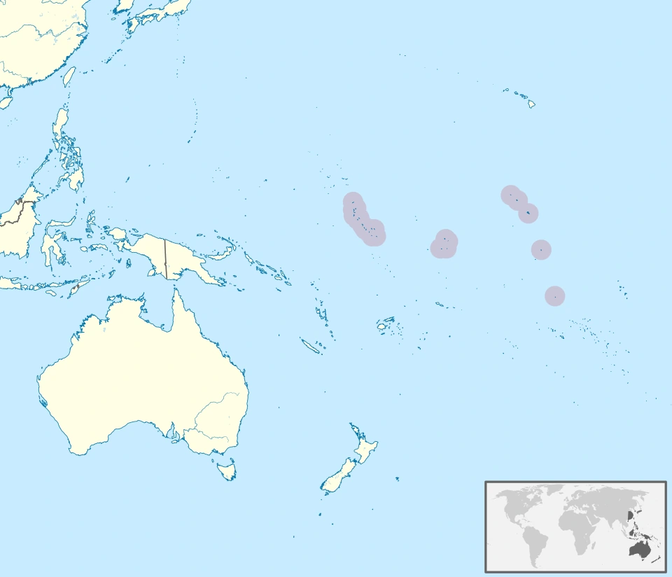 |

**认识国家／地区**：基里巴斯位于中太平洋，包括吉尔伯特、菲尼克斯和莱恩三组岛屿。岛群跨度很大，跨越赤道两侧；日期变更线调整后的时间安排，也是理解其分散地理的线索。

**认识首都／城市**：南塔拉瓦位于塔拉瓦环礁南部，是多个相连岛段构成的行政与城市带。政府机构分布在拜里基等地点，因此旧表格有时只写某一岛段名；记首都时使用南塔拉瓦这一整体名称。

> **记忆钩子**：基里巴斯跨度广，政府集中南塔拉瓦。

**容易混淆**：拜里基是南塔拉瓦的组成地点，不能忽略整体城市带。

资料：[UNData 国家概况（统计快照）](https://data.un.org/legacy/en/iso/ki.html) · [国家／地区背景](https://en.wikipedia.org/wiki/Kiribati) · [首都／城市背景](https://en.wikipedia.org/wiki/South_Tarawa)

地图：[File:Kiribati-CIA WFB Map.png；见原图来源页；Public domain](https://commons.wikimedia.org/wiki/File:Map_of_Kiribati_CIA_WFB.png) · [File:Kiribati in Oceania.svg；TUBS；CC BY-SA 3.0](https://commons.wikimedia.org/wiki/File:Kiribati_in_Oceania.svg)

---

## 图瓦卢 — 富纳富提

Tuvalu · Funafuti · 波利尼西亚

| 国家／地区地图 | 大洋洲位置图 |
|:---:|:---:|
| 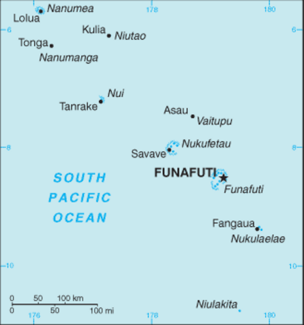 | 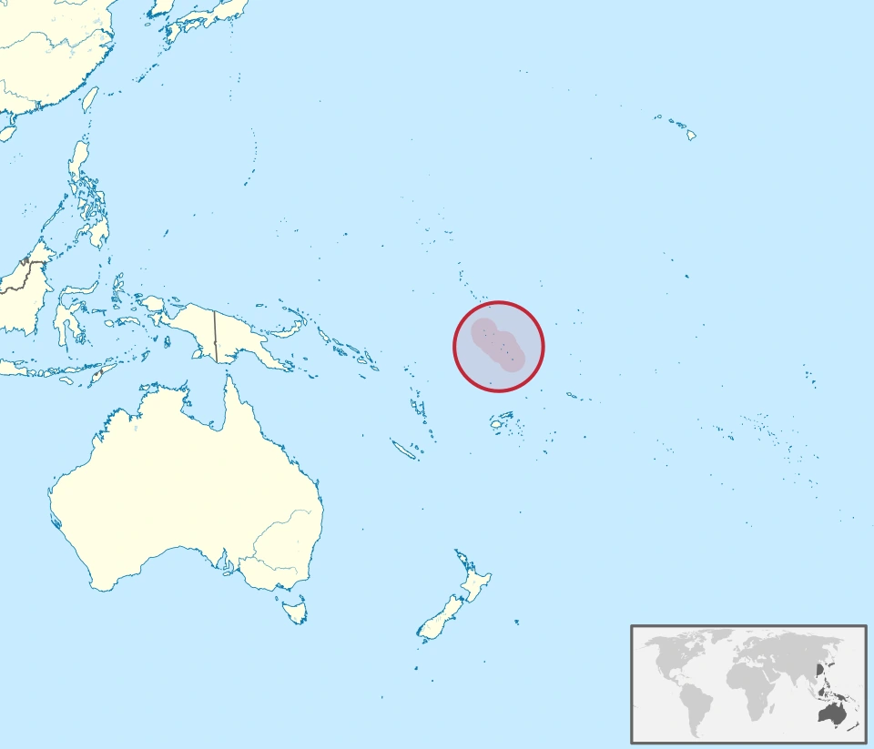 |

**认识国家／地区**：图瓦卢位于南太平洋，由多座低平珊瑚岛和环礁组成。土地与淡水资源有限，海洋和岛际联系占重要位置；国土不能只用地图上很小的点来理解。

**认识首都／城市**：富纳富提是首都所在环礁，主要政府机构位于其中的丰阿法莱岛。机场和行政街区沿狭长岛带排列，周围为潟湖与海洋；“环礁名称、具体岛段、政府位置”是三个相关层次。

> **记忆钩子**：图瓦卢低平环礁，首都富纳富提。

**容易混淆**：富纳富提是环礁整体，政府集中于丰阿法莱岛。

资料：[UNData 国家概况（统计快照）](https://data.un.org/legacy/en/iso/tv.html) · [国家／地区背景](https://en.wikipedia.org/wiki/Tuvalu) · [首都／城市背景](https://en.wikipedia.org/wiki/Funafuti)

地图：[File:Tuvalu-CIA WFB Map.png；CIA；Public domain](https://commons.wikimedia.org/wiki/File:Tuvalu-CIA_WFB_Map.png) · [File:Tuvalu in Oceania.svg；TUBS；CC BY-SA 3.0](https://commons.wikimedia.org/wiki/File:Tuvalu_in_Oceania.svg)

---

## 萨摩亚 — 阿皮亚

Samoa · Apia · 波利尼西亚

| 国家／地区地图 | 大洋洲位置图 |
|:---:|:---:|
| 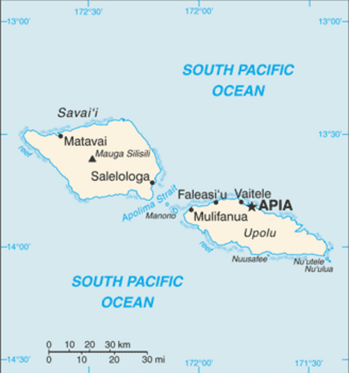 | 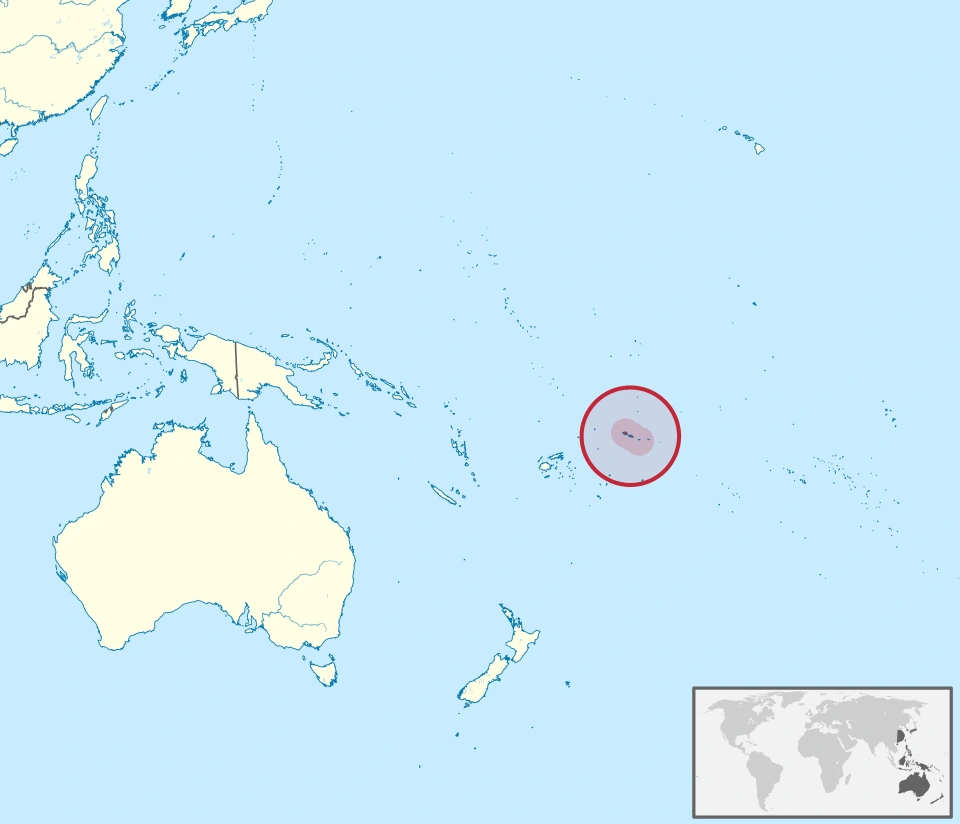 |

**认识国家／地区**：萨摩亚位于南太平洋，主要包括乌波卢岛和萨瓦伊岛。火山岛地形、村落文化与海洋联系鲜明；独立国家萨摩亚与美属萨摩亚在政治地位上不同。

**认识首都／城市**：阿皮亚位于乌波卢岛北岸，是行政和主要港口城市。海滨与内陆山地相邻，殖民史和传统萨摩亚社会都能在城市中找到线索；首都名短，可直接配上“乌波卢岛北岸”来记。

> **记忆钩子**：萨摩亚乌波卢岛，北岸阿皮亚。

**容易混淆**：美属萨摩亚不是本条国家，主要城镇帕果帕果也不是其首都。

资料：[国家／地区背景](https://en.wikipedia.org/wiki/Samoa) · [首都／城市背景](https://en.wikipedia.org/wiki/Apia) · [萨摩亚旅游局：阿皮亚首都与位置](https://www.samoa.travel/discover/the-islands-of-samoa/upolu-island/apia/)

地图：[File:Samoa-CIA WFB Map.png；见原图来源页；Public domain](https://commons.wikimedia.org/wiki/File:Samoa-CIA_WFB_Map.png) · [File:Samoa in Oceania.svg；TUBS；CC BY-SA 3.0](https://commons.wikimedia.org/wiki/File:Samoa_in_Oceania.svg)

---

## 汤加 — 努库阿洛法

Tonga · Nukuʻalofa · 波利尼西亚

| 国家／地区地图 | 大洋洲位置图 |
|:---:|:---:|
| 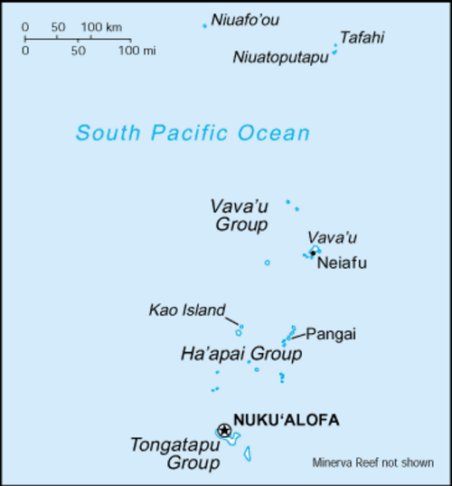 | 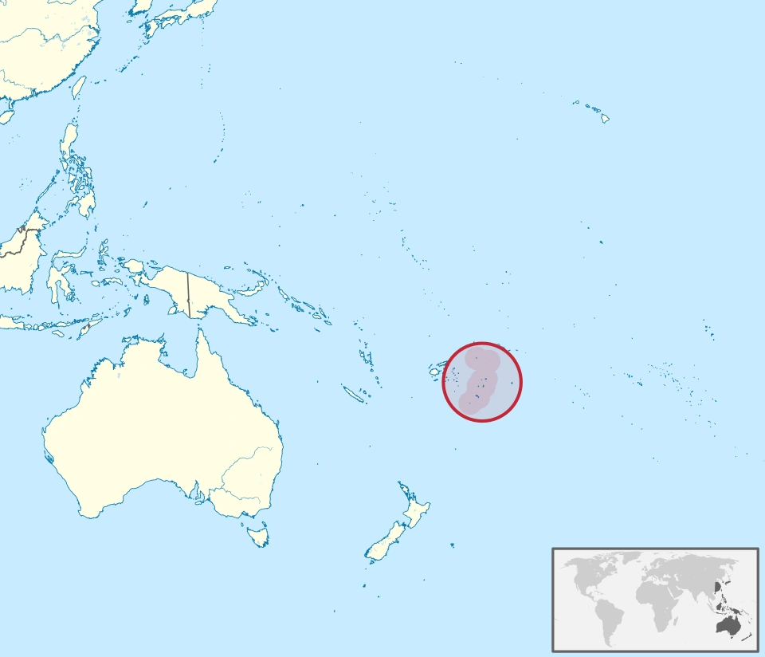 |

**认识国家／地区**：汤加位于南太平洋，国土由南北分布的多组岛屿组成，是保留王室传统的岛国。珊瑚岛与火山岛并存，岛群分散，海上交通是理解国土布局的关键。

**认识首都／城市**：努库阿洛法位于汤加塔布岛北岸，是行政与王室中心。港口和王宫构成城市识别点；首都名称较长，可分成“努库—阿洛法”，再把它记在国家南部主岛的北岸。

> **记忆钩子**：汤加王室主岛，努库—阿洛法。

**容易混淆**：岛名汤加塔布与国家汤加不同，首都在该岛北岸。

资料：[UNData 国家概况（统计快照）](https://data.un.org/legacy/en/iso/to.html) · [国家／地区背景](https://en.wikipedia.org/wiki/Tonga) · [首都／城市背景](https://en.wikipedia.org/wiki/Nuku%CA%BBalofa)

地图：[File:Tonga-CIA WFB Map.png；CIA；Public domain](https://commons.wikimedia.org/wiki/File:Tonga-CIA_WFB_Map.png) · [File:Tonga in Oceania.svg；TUBS；CC BY-SA 3.0](https://commons.wikimedia.org/wiki/File:Tonga_in_Oceania.svg)

---

# 补充地区

| 国家／地区 | English | 首都／城市 | English |
|---|---|---|---|
| 台湾 | Taiwan | 台北（行政中心） | Taipei |
| 科索沃 | Kosovo | 普里什蒂纳 | Pristina |
| 西撒哈拉 | Western Sahara | 阿尤恩（地区主要城市） | Laayoune |
| 库克群岛 | Cook Islands | 阿瓦鲁阿 | Avarua |
| 纽埃 | Niue | 阿洛菲 | Alofi |

## 台湾 — 台北（行政中心）

Taiwan · Taipei · 亚洲

| 国家／地区地图 | 扩展位置图 |
|:---:|:---:|
| 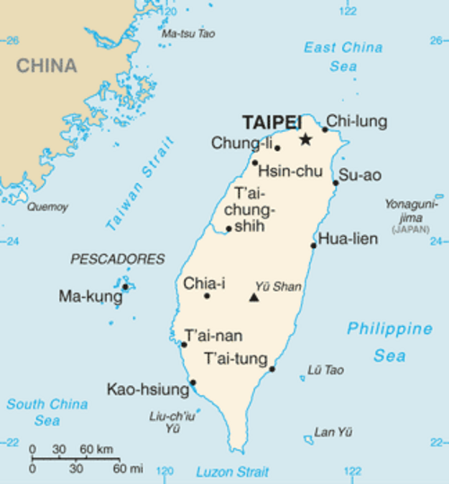 | 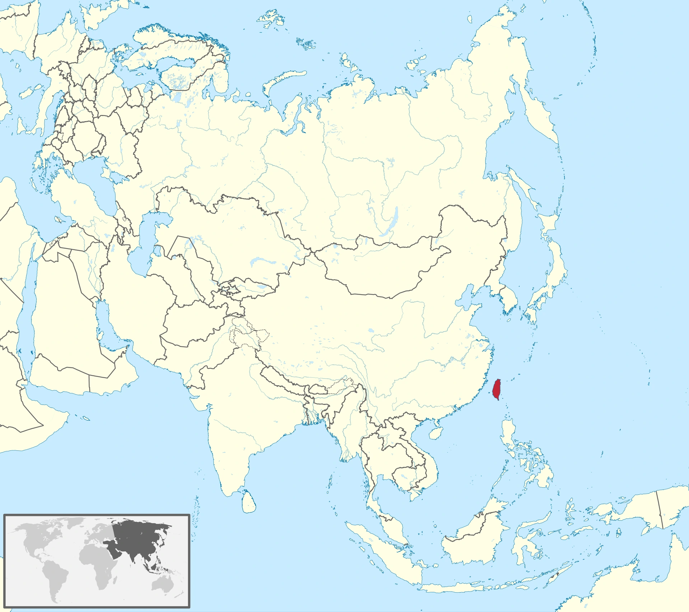 |

**认识国家／地区**：台湾位于东亚大陆东南外海，主体岛屿山地多，西部平原与城市带较集中。另有周边岛屿与不同管理地域；本条作为地理学习补充，单列于195个主条目之外。

**认识首都／城市**：台北位于台湾岛北部盆地，是主要行政机构所在地。淡水河水系、周边山地与城市交通共同构成空间印象；台北市与新北市是不同地方行政单位，都会区联系紧密但范围不能等同。

> **记忆钩子**：台湾北部盆地，行政中心台北。

**容易混淆**：补充条目使用行政中心称谓，台北与新北范围不同。

资料：[国家／地区背景](https://en.wikipedia.org/wiki/Taiwan) · [首都／城市背景](https://en.wikipedia.org/wiki/Taipei)

地图：[File:Taiwan-CIA WFB Map.png；见原图来源页；Public domain](https://commons.wikimedia.org/wiki/File:Taiwan-CIA_WFB_Map.png) · [File:Taiwan in Asia.svg；TUBS；CC BY-SA 3.0](https://commons.wikimedia.org/wiki/File:Taiwan_in_Asia.svg)

---

## 科索沃 — 普里什蒂纳

Kosovo · Pristina · 欧洲

| 国家／地区地图 | 扩展位置图 |
|:---:|:---:|
| 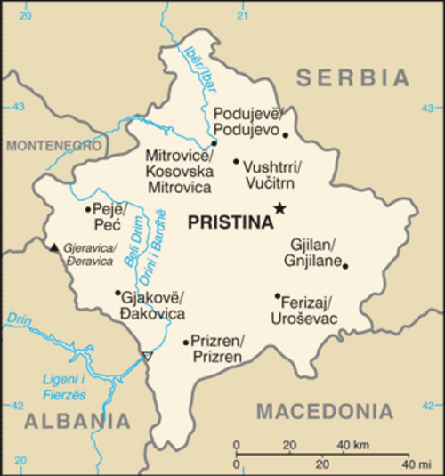 | 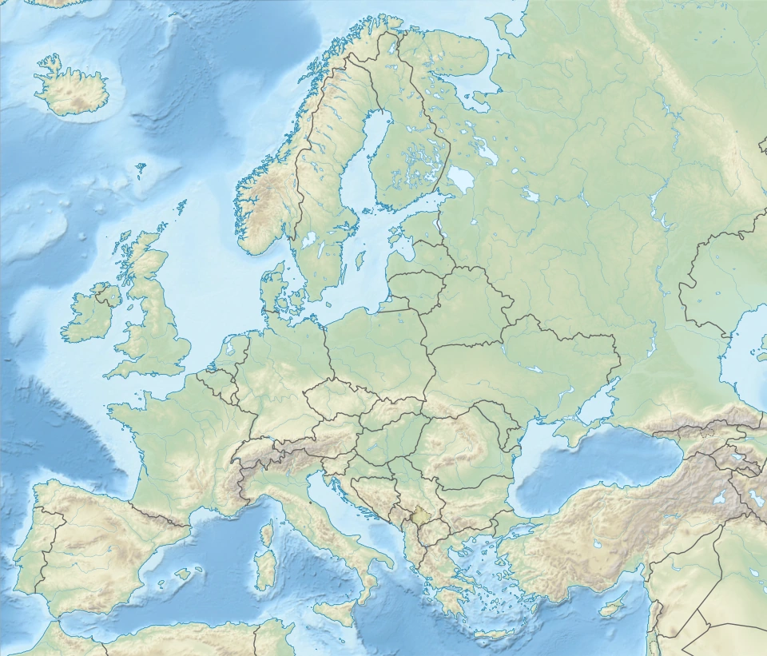 |

**认识国家／地区**：科索沃位于巴尔干半岛内陆，2008年宣布独立，国际承认状况不一致，塞尔维亚对其地位持不同立场。山地与盆地相间；本版单列补充，不计入195个联合国口径主条目。

**认识首都／城市**：普里什蒂纳位于科索沃东北部盆地，是当地行政机构与文化教育活动中心，也被科索沃方面列为首都。了解城市位置的同时，应保留对其政治地位的说明，避免把补充条目等同于主表。

> **记忆钩子**：科索沃东北盆地，普里什蒂纳。

**容易混淆**：首都称谓结合承认争议阅读，不属于本版195主条目。

资料：[国家／地区背景](https://en.wikipedia.org/wiki/Kosovo) · [首都／城市背景](https://en.wikipedia.org/wiki/Pristina)

地图：[File:Kosovo-CIA WFB Map.png；CIA；Public domain](https://commons.wikimedia.org/wiki/File:Kosovo-CIA_WFB_Map.png) · [File:Kosovo in Europe (relief) (de-facto) (-mini map).svg；TUBS；CC BY-SA 3.0](https://commons.wikimedia.org/wiki/File:Kosovo_in_Europe_(relief)_(de-facto)_(-mini_map).svg)

---

## 西撒哈拉 — 阿尤恩（地区主要城市）

Western Sahara · Laayoune · 非洲

| 国家／地区地图 | 扩展位置图 |
|:---:|:---:|
| 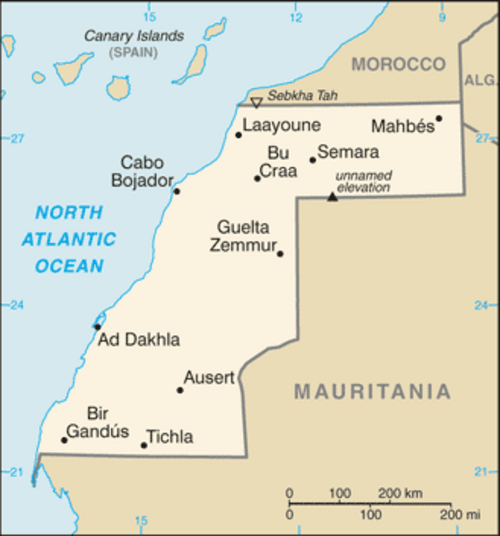 | 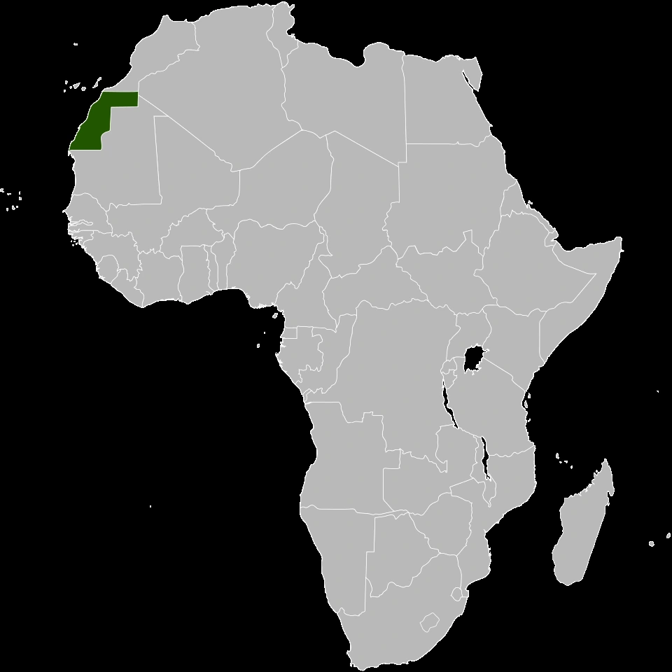 |

**认识国家／地区**：西撒哈拉位于非洲西北部大西洋岸，主要为干旱沙漠地区。联合国将其列入非自治领土，摩洛哥与波利萨里奥阵线等对其地位和管辖有不同立场，最终地位尚未解决。

**认识首都／城市**：阿尤恩是地区主要城市，位于北部萨基亚阿姆拉河附近，当前处于摩洛哥管理之下。不同政治主张涉及不同首都或行政驻地，本条仅将阿尤恩作为城市定位对象，不当作无争议国家首都。

> **记忆钩子**：西撒哈拉北部，主要城市阿尤恩。

**容易混淆**：本条是争议地区位置补充，不能用阿尤恩替代所有首都主张。

资料：[国家／地区背景](https://en.wikipedia.org/wiki/Western_Sahara) · [首都／城市背景](https://en.wikipedia.org/wiki/Laayoune) · [联合国：西撒哈拉非自治领土地位](https://www.un.org/dppa/decolonization/en/nsgt/western-sahara)

地图：[File:Western Sahara-CIA WFB Map.png；见原图来源页；Public domain](https://commons.wikimedia.org/wiki/File:Western_Sahara-CIA_WFB_Map.png) · [File:Locator map of Western Sahara in Africa.svg；Shosholoza；CC BY-SA 3.0](https://commons.wikimedia.org/wiki/File:Locator_map_of_Western_Sahara_in_Africa.svg)

---

## 库克群岛 — 阿瓦鲁阿

Cook Islands · Avarua · 大洋洲

| 国家／地区地图 | 扩展位置图 |
|:---:|:---:|
| 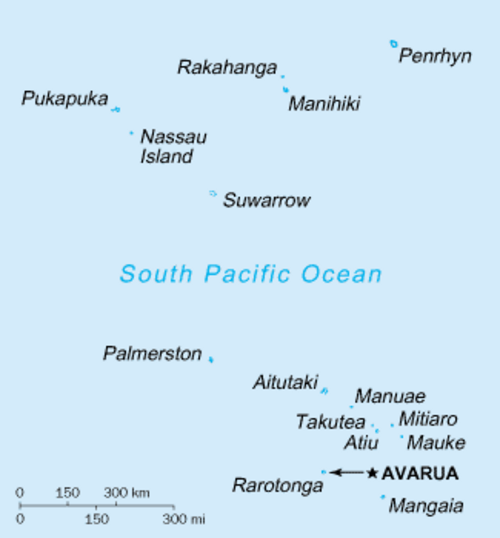 | 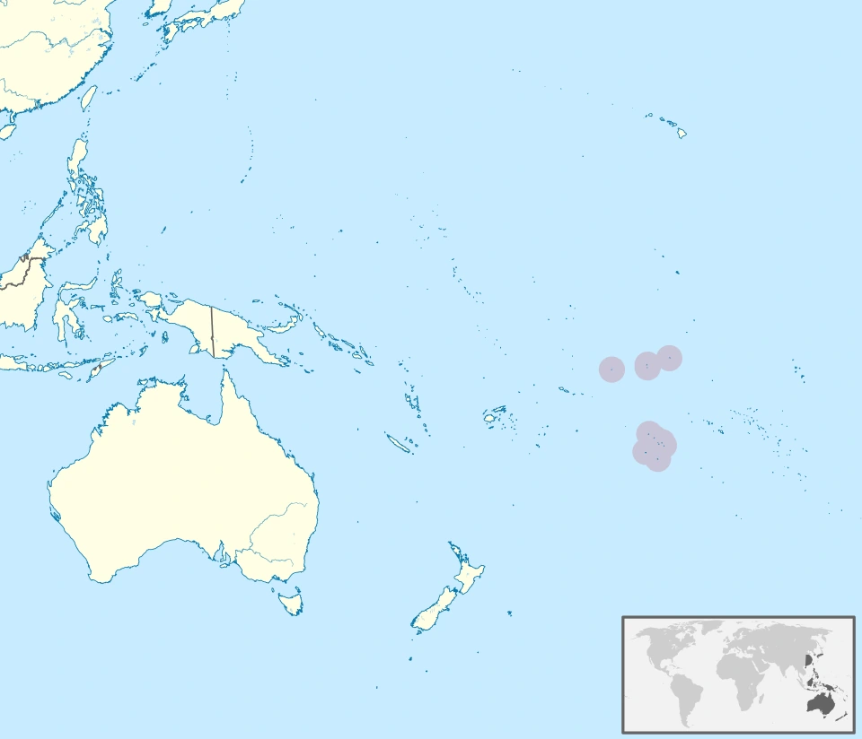 |

**认识国家／地区**：库克群岛位于南太平洋，分成相距较远的北、南两组岛屿，与新西兰自由联系。它具有自治与对外关系背景，但不是联合国会员国，本版单列补充以保持主表统计一致。

**认识首都／城市**：阿瓦鲁阿位于拉罗汤加岛北岸，是政府与主要商业活动中心。南部主岛山地与北部港口位置形成直观对照；城市名可拆成“阿瓦—鲁阿”，与拉罗汤加岛一起记忆。

> **记忆钩子**：库克群岛拉罗汤加岛，北岸阿瓦鲁阿。

**容易混淆**：与新西兰自由联系，统计口径与主表不同。

资料：[国家／地区背景](https://en.wikipedia.org/wiki/Cook_Islands) · [首都／城市背景](https://en.wikipedia.org/wiki/Avarua) · [库克群岛政府：自由联系地位](https://www.pmoffice.gov.ck/2026/04/01/cook-islands-and-new-zealand-sign-declaration-on-defence-and-security/)

地图：[File:Cook Islands-CIA WFB Map.png；见原图来源页；Public domain](https://commons.wikimedia.org/wiki/File:Cook_Islands-CIA_WFB_Map.png) · [File:Cook Islands in Oceania.svg；TUBS；CC BY-SA 3.0](https://commons.wikimedia.org/wiki/File:Cook_Islands_in_Oceania.svg)

---

## 纽埃 — 阿洛菲

Niue · Alofi · 大洋洲

| 国家／地区地图 | 扩展位置图 |
|:---:|:---:|
| 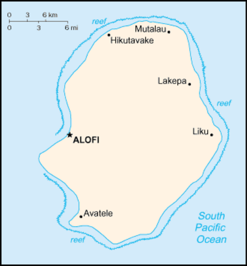 | 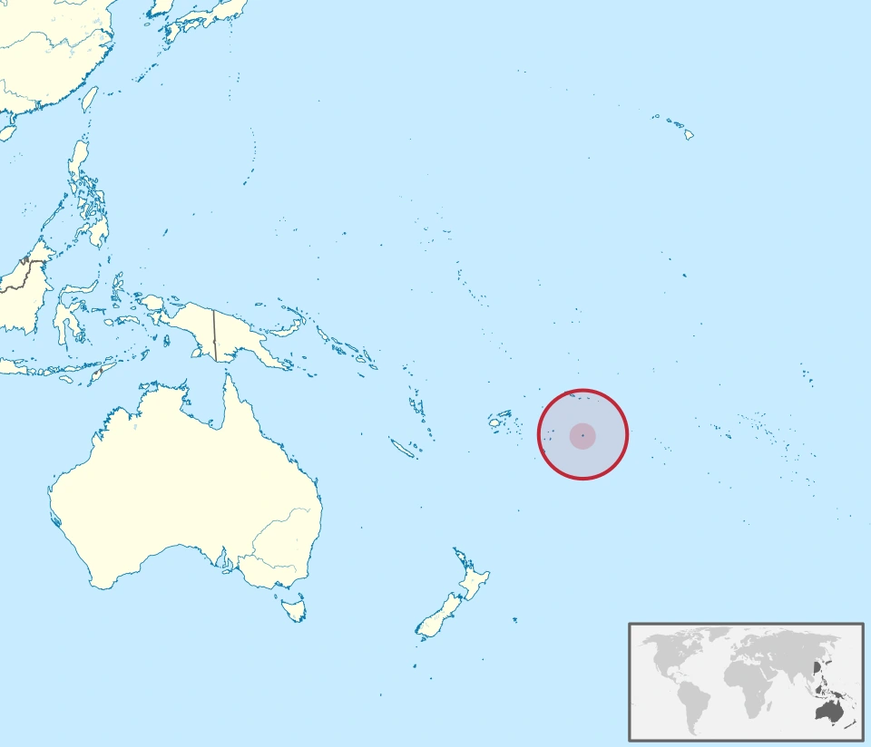 |

**认识国家／地区**：纽埃位于南太平洋、汤加以东方向，是以单座隆起珊瑚岛为主体的自治实体，与新西兰自由联系。周边远海与石灰岩海岸构成地理印象，单列于195主条目之外。

**认识首都／城市**：阿洛菲位于岛西岸，分为南北相邻区域，是政府与城市活动中心。它规模较小，港口条件与沿海道路影响聚落形态；记忆时用“纽埃单岛、西岸阿洛菲”即可固定位置。

> **记忆钩子**：纽埃单岛西岸，阿洛菲。

**容易混淆**：纽埃与库克群岛分别列补充，不能并成新西兰首都。

资料：[国家／地区背景](https://en.wikipedia.org/wiki/Niue) · [首都／城市背景](https://en.wikipedia.org/wiki/Alofi) · [新西兰外交部：纽埃](https://www.mfat.govt.nz/en/countries-and-regions/australia-and-pacific/niue)

地图：[File:Niue-CIA WFB Map.png；见原图来源页；Public domain](https://commons.wikimedia.org/wiki/File:Niue-CIA_WFB_Map.png) · [File:Niue in Oceania.svg；TUBS；CC BY-SA 3.0](https://commons.wikimedia.org/wiki/File:Niue_in_Oceania.svg)

---

